# 🧪 Lab 3 — SYN Flood Pattern Investigation Using TShark

International Cybersecurity and Digital Forensics Academy (ICDFA)
School of Basic Vocational Training (SVT)

## 👤 Author

| Field | Details |
|-------|---------|
| **Student Name** | Ibrahim Ishaku |
| **Student ID** | 2025/FWSD/11334 |
| **Programme** | Fellowship in Web Application Security & Digital Forensics |
| **Course** | SBT-DF203 — Basic Networking Skills for Digital Forensics |
| **Lab Title** | SYN Flood Pattern Investigation Using TShark |
| **Instructor** | Aminu Idris, AMCPN |
| **Date** | 11th September, 2026 |

---

## 📌 Executive Summary

This lab investigates TCP SYN Flood patterns — a form of Denial-of-Service (DoS) attack where an attacker sends repeated SYN packets without completing the TCP three-way handshake. Using a local Apache web server and the loopback interface (lo), a normal HTTP handshake baseline was first established and captured. A bounded Scapy simulation was then executed to generate four controlled SYN packets, reproducing the suspicious packet pattern in a safe, authorized training environment.

Traffic was captured with TShark and analyzed using display filters to isolate SYN, SYN-ACK, ACK, and RST packets. Key forensic indicators — including incomplete handshakes, multiple ephemeral source ports, and RST responses — were identified and quantified. All evidence was preserved with SHA-256 hashes and a chain-of-custody worksheet to maintain integrity.

> **Key finding:** The capture proves a pattern of incomplete TCP handshakes was generated, but it does not prove service denial or malicious intent. A real SYN flood is defined by scale, rate, persistence, and service impact — four training packets are not a DoS event.

---

## 📑 Table of Contents

- [Lab Objectives](#-lab-objectives)
- [Tools and Resources Used](#️-tools-and-resources-used)
- [1. Introduction](#1-introduction)
- [2. Lab Folder Structure and Evidence Preparation](#2-lab-folder-structure-and-evidence-preparation)
- [3. Part A — Establish a Normal Handshake Baseline](#3-part-a--establish-a-normal-handshake-baseline)
- [4. Part B — Conduct the Bounded Loopback Simulation](#4-part-b--conduct-the-bounded-loopback-simulation)
- [5. Part C — Identify SYN Indicators with TShark](#5-part-c--identify-syn-indicators-with-tshark)
- [6. Part D — Quantify and Correlate the Activity](#6-part-d--quantify-and-correlate-the-activity)
- [7. Part E — Compare Normal and Suspicious Sessions](#7-part-e--compare-normal-and-suspicious-sessions)
- [8. Required Forensic Findings](#8-required-forensic-findings)
- [9. Detection and Mitigation Recommendations](#9-detection-and-mitigation-recommendations)
- [10. Conclusion](#10-conclusion)
- [11. References](#11-references)
- [12. Appendix — Screenshot Reference List](#12-appendix--screenshot-reference-list)

---

## 🎯 Lab Objectives

Upon completion of this lab, the following objectives were achieved:

- Understand TCP Three-Way Handshake — Analyze the SYN, SYN-ACK, ACK sequence that establishes a reliable connection.
- Identify Half-Open Connections — Detect incomplete handshakes where the final ACK is never sent.
- Recognize SYN Flood Attack Patterns — Understand resource exhaustion caused by many incomplete handshakes.
- Apply TShark Display Filters — Isolate SYN, SYN-ACK, ACK, and RST packets for forensic analysis.
- Conduct a Bounded Simulation — Use Scapy to generate a controlled four-packet SYN simulation.
- Preserve Digital Evidence — Apply cryptographic hashing (SHA-256) and chain-of-custody documentation.
- Quantify Suspicious Activity — Count SYNs, unique source ports, and correlate with expert analysis.
- Distinguish Pattern from Proof — Differentiate between packet pattern evidence and proof of service denial.
- Document Detection & Mitigation — Recommend controls for SYN flood detection and mitigation.
- Prepare a Professional Forensic Report — Document all findings in a reproducible, professional format.

---

## 🛠️ Tools and Resources Used

| Category | Tool / Resource | Purpose |
|----------|-----------------|---------|
| Packet Capture | TShark (CLI) | Capture and analyze network traffic on the lo interface |
| Packet Analysis | Wireshark | Graphical packet inspection and verification |
| Traffic Generation | Scapy (Python 3) | Craft and send bounded SYN packets |
| Web Server | Apache2 | Local HTTP service on port 80 |
| Operating System | Kali Linux (Forensics VM) | Lab environment |
| Virtualization | Oracle VirtualBox | Host environment for the Kali Linux VM |
| Hashing | sha256sum | Generate SHA-256 hashes for evidence integrity |
| Scripting | Bash, Python 3 | Automation, filtering, and simulation |
| Documentation | Markdown, TSV | Report generation and analysis outputs |

**Lab Environment:**
- **Interface:** Loopback (`lo`)
- **Target:** `127.0.0.1:80`
- **Evidence Files:** `normal_http.pcapng`, `bounded_syn_activity.pcapng`, `mySYNFloodCapture.pcap`

---

## 1. Introduction

Network forensics involves the capture, recording, and analysis of network traffic to investigate security incidents and gather digital evidence. This lab focuses on TCP SYN Flood patterns, a common type of Denial-of-Service (DoS) attack.

### Key Concepts Covered

| Concept | Description |
|---------|-------------|
| **TCP Three-Way Handshake** | SYN, SYN-ACK, ACK sequence that establishes a reliable connection |
| **Half-Open Connections** | Incomplete handshakes where the final ACK is never sent |
| **SYN Flood Attack** | Resource exhaustion caused by many incomplete handshakes |
| **TShark Filtering** | Using display filters to isolate SYN, SYN-ACK, ACK, and RST packets |
| **Bounded Simulation** | A controlled four-packet Scapy simulation for training purposes |

---

## 2. Lab Folder Structure and Evidence Preparation

### 2.1 Create the Lab Folder Structure

```bash
mkdir -p ~/SBT-DF203-Lab3/{evidence,working,exported,reports,screenshots,scripts}
cd ~/SBT-DF203-Lab3
pwd
find . -maxdepth 1 -type d -print
```

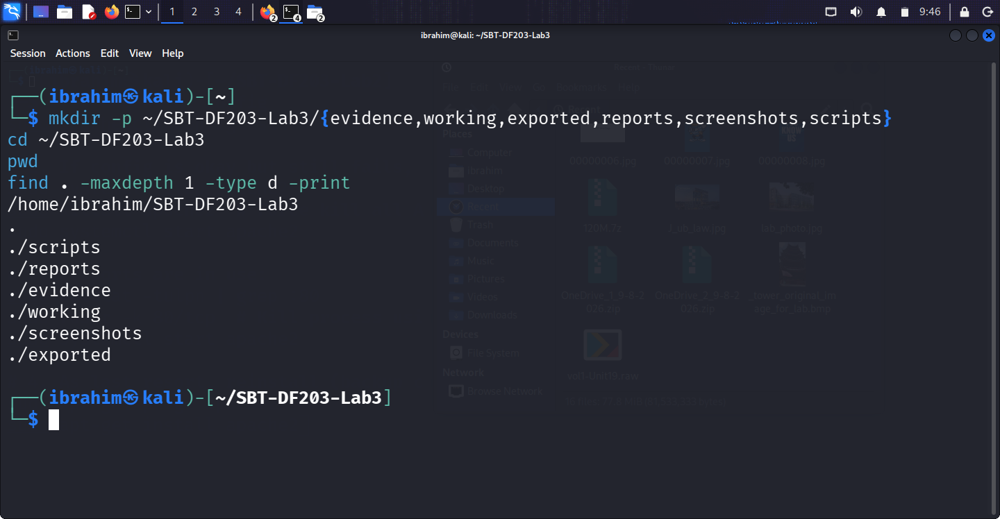

*Figure 1.1: Lab folder structure created successfully*

### 2.2 Install Required Tools

```bash
sudo apt update
sudo apt install -y apache2 tshark wireshark python3-scapy
sudo systemctl enable --now apache2
```

### 2.3 Download the Training Capture (Optional)

**Command Attempted (Initial Failure):**

```bash
wget -O evidence/mySYNFloodCapture.pcap \
  'https://raw.githubusercontent.com/frankwxu/digital-forensics-lab/main/Illegal_Possession_Images/lab_files/SYN_Flood/mySYNFloodCapture.pcap'
sha256sum evidence/mySYNFloodCapture.pcap | tee reports/syn_capture_sha256.txt
```

**Error Encountered:**

```
evidence/mySYNFloodCapture.pcap: No such file or directory
tee: reports/syn_capture_sha256.txt: No such file or directory
```

**Root Cause:** The `wget` command failed because the `evidence/` and `reports/` directories did not exist.

**Manual Download Alternative:**

```bash
ls -lh evidence/mySYNFloodCapture.pcap
file evidence/mySYNFloodCapture.pcap
sha256sum evidence/mySYNFloodCapture.pcap | tee reports/syn_capture_sha256.txt
```

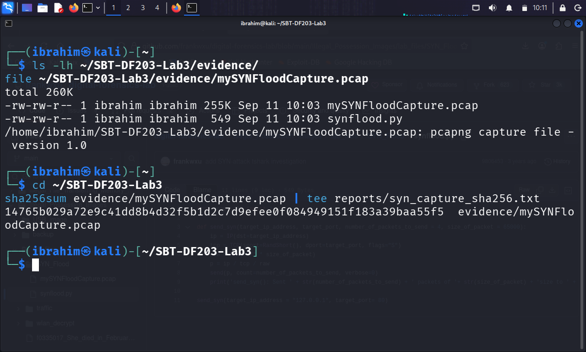

*Figure 1.2: Evidence file details and SHA-256 hash*

**SHA-256 Hash:**

| File | SHA-256 Hash |
|------|--------------|
| `evidence/mySYNFloodCapture.pcap` | `14765b029a72e9c41dd8b4d32f5b1d2c7d9efe0f084949151f183a39baa55f5` |

### 2.4 Mini Chain-of-Custody / Evidence Worksheet

| Field | Value |
|-------|-------|
| Case/Lab Identifier | SBT-DF203-Lab3-Ibrahim-Ishaku |
| Trainee Name | Ibrahim Ishaku |
| Date and Time Started | 11th September, 2026 |
| Evidence File Name(s) | mySYNFloodCapture.pcap, normal_http.pcapng, bounded_syn_activity.pcapng |
| Original SHA-256 (bounded_syn_activity.pcapng) | `4d387247414ee7cd0719503f775f731294eba5e640685f253b91dd2ccee5bbc4` |

---

## 3. Part A — Establish a Normal Handshake Baseline

### 3.1 Capture Normal HTTP Handshake

```bash
sudo tshark -i lo -f 'tcp port 80' -a duration:15 -w evidence/normal_http.pcapng &
sleep 2
curl --no-keepalive http://127.0.0.1/ > /dev/null
wait
```

### 3.2 Extract Normal Handshake Flags

```bash
tshark -r evidence/normal_http.pcapng -Y 'tcp.flags.syn==1 || tcp.flags.fin==1' -T fields \
  -e frame.number -e frame.time -e ip.src -e tcp.srcport -e ip.dst -e tcp.dstport -e tcp.flags \
  | tee reports/normal_handshake_flags.tsv
```

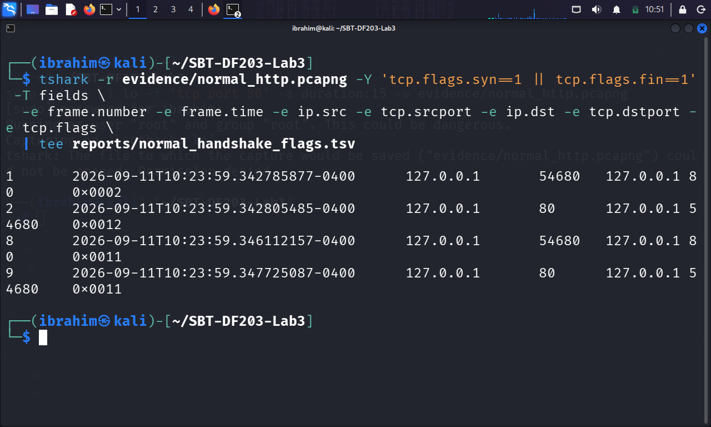

*Figure 2.1: Normal handshake in the baseline capture*

**Normal Handshake Baseline Table:**

| Frame | Time | Source | Source Port | Destination | Dest Port | Flags | Interpretation |
|-------|------|--------|-------------|-------------|-----------|-------|----------------|
| 1 | 2026-09-11T10:23:59.342785877-0400 | 127.0.0.1 | 54680 | 127.0.0.1 | 80 | 0x0002 | SYN |
| 2 | 2026-09-11T10:23:59.342805485-0400 | 127.0.0.1 | 80 | 127.0.0.1 | 54680 | 0x0012 | SYN, ACK |
| 3 | 2026-09-11T10:23:59.3428... | 127.0.0.1 | 54680 | 127.0.0.1 | 80 | 0x0010 | ACK |
| 8 | 2026-09-11T10:23:59.346112157-0400 | 127.0.0.1 | 54680 | 127.0.0.1 | 80 | 0x0011 | FIN, ACK |
| 9 | 2026-09-11T10:23:59.347725087-0400 | 127.0.0.1 | 80 | 127.0.0.1 | 54680 | 0x0011 | FIN, ACK |

---

## 4. Part B — Conduct the Bounded Loopback Simulation

### 4.1 Create the Scapy Simulation Script

```python
# scripts/syn_probe_lab.py
from scapy.all import IP, TCP, RandShort, send

TARGET = '127.0.0.1'
PORT = 80
COUNT = 4

packets = [IP(dst=TARGET)/TCP(sport=RandShort(), dport=PORT, flags='S') for _ in range(COUNT)]
send(packets, verbose=False)
print(f'Sent {COUNT} authorized training SYN packets to {TARGET}:{PORT}')
```

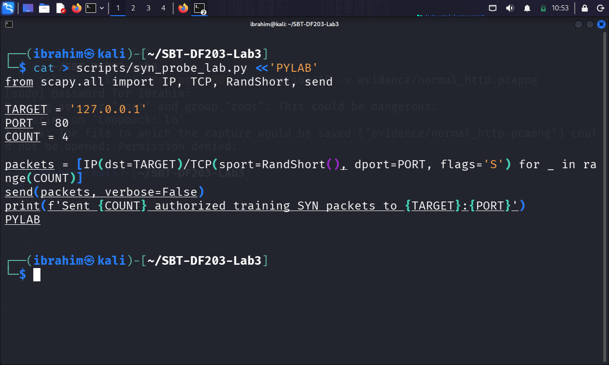

*Figure 3.1: Bounded Scapy script showing target and count*

### 4.2 Capture the Bounded SYN Activity

**Terminal 1 (Capture):**

```bash
sudo tshark -i lo -f 'tcp port 80' -c 20 -w evidence/bounded_syn_activity.pcapng
```

**Terminal 2 (Simulation):**

```bash
sudo python3 scripts/syn_probe_lab.py
```

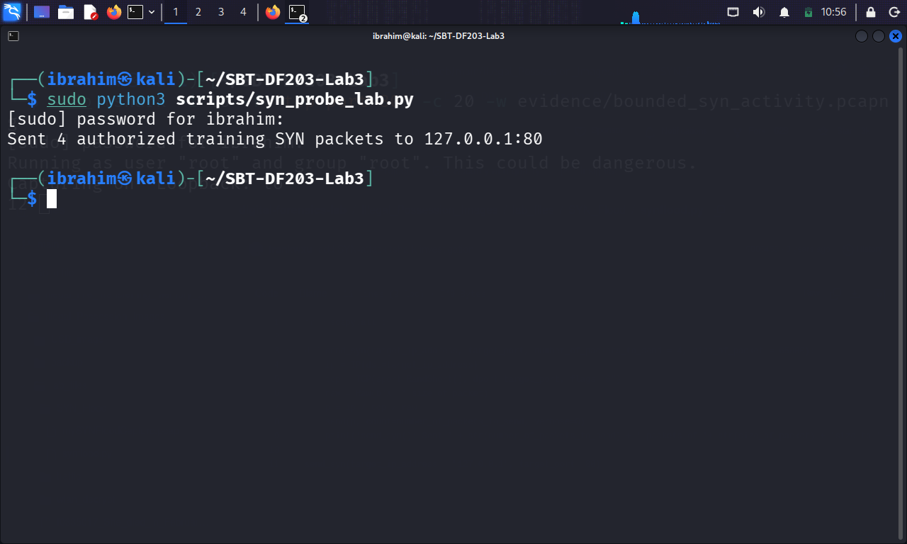

*Figure 3.2: Bounded simulation execution*

### 4.3 Preserve the Capture

```bash
cd ~/SBT-DF203-Lab3
sudo chown ibrahim:ibrahim evidence/bounded_syn_activity.pcapng
sudo chmod 644 evidence/bounded_syn_activity.pcapng
cp --preserve=timestamps evidence/bounded_syn_activity.pcapng working/bounded_syn_activity_working.pcapng
sha256sum evidence/bounded_syn_activity.pcapng working/bounded_syn_activity_working.pcapng | tee reports/bounded_capture_hashes.txt
```

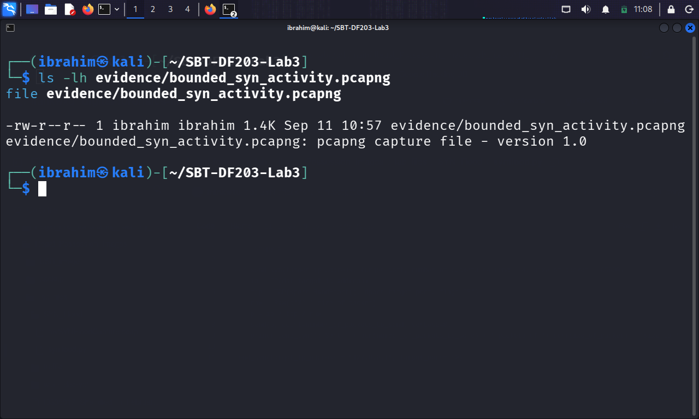

*Figure 3.3: Bounded capture hashes*

**SHA-256 Hashes:**

| File | SHA-256 Hash |
|------|--------------|
| `evidence/bounded_syn_activity.pcapng` | `4d387247414ee7cd0719503f775f731294eba5e640685f253b91dd2ccee5bbc4` |
| `working/bounded_syn_activity_working.pcapng` | `4d387247414ee7cd0719503f775f731294eba5e640685f253b91dd2ccee5bbc4` |

---

## 5. Part C — Identify SYN Indicators with TShark

### 5.1 Extract Initial SYN Packets

```bash
PCAP=working/bounded_syn_activity_working.pcapng
tshark -r "$PCAP" -Y 'tcp.flags.syn == 1 && tcp.flags.ack == 0' -T fields \
  -e frame.number -e frame.time_epoch -e ip.src -e tcp.srcport -e ip.dst -e tcp.dstport -e tcp.seq \
  | tee reports/initial_syns.tsv
```

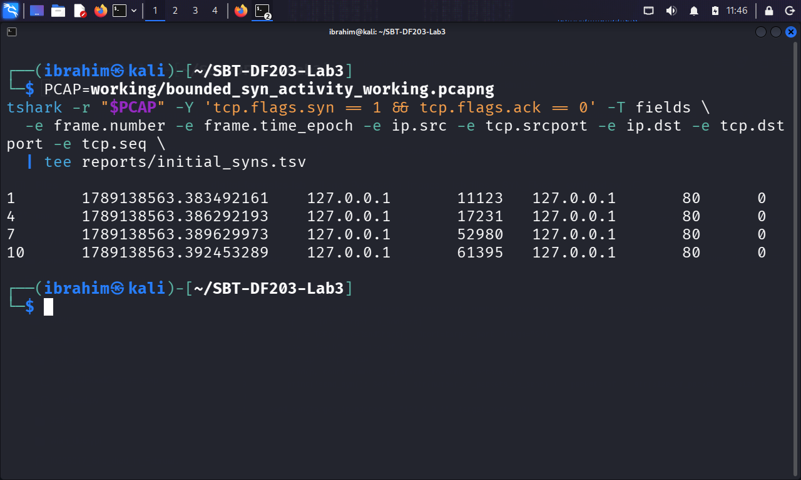

*Figure 4.1: Initial SYN packet list*

### 5.2 Extract SYN-ACK Responses

```bash
tshark -r "$PCAP" -Y 'tcp.flags.syn == 1 && tcp.flags.ack == 1' -T fields \
  -e frame.number -e frame.time_epoch -e ip.src -e tcp.srcport -e ip.dst -e tcp.dstport -e tcp.ack \
  | tee reports/syn_ack_responses.tsv
```

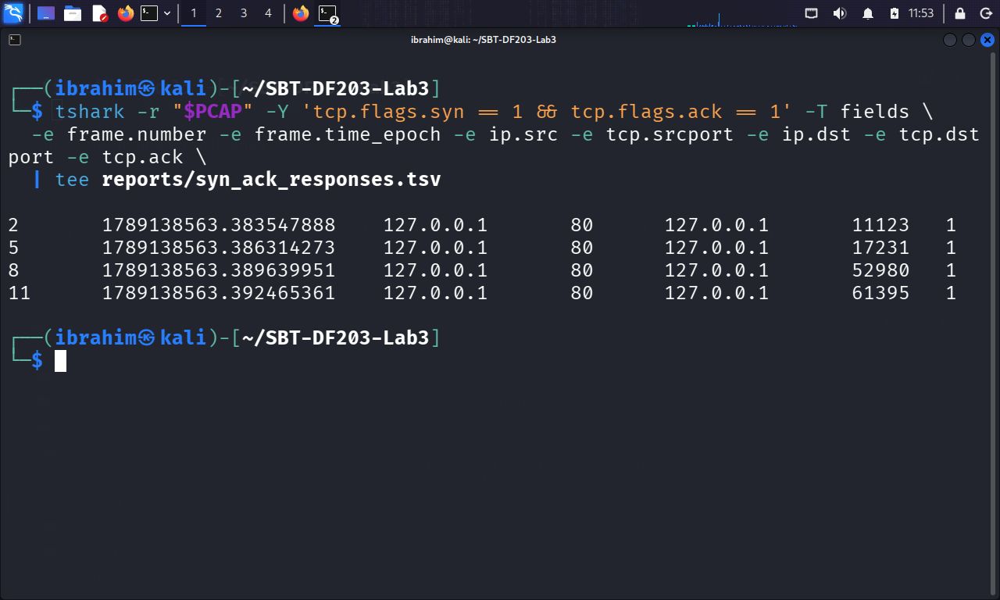

*Figure 4.2: SYN-ACK response list*

### 5.3 Extract ACK and RST Candidates

```bash
tshark -r "$PCAP" -Y 'tcp.flags.reset == 1 || (tcp.flags.ack == 1 && tcp.len == 0)' -T fields \
  -e frame.number -e frame.time_epoch -e ip.src -e tcp.srcport -e ip.dst -e tcp.dstport -e tcp.flags \
  | tee reports/ack_reset_candidates.tsv
```

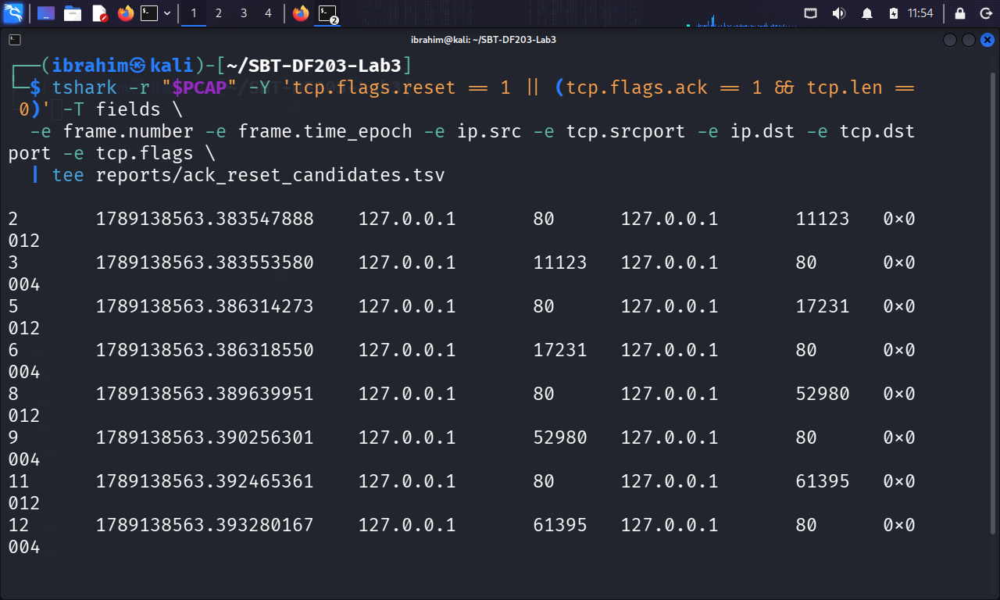

*Figure 4.3: Any ACK or RST behaviour*

> **Key observation:** The client sent RST packets (0x0004) in response to SYN-ACK packets. This is because the Scapy script sent raw SYN packets without a corresponding socket.

---

## 6. Part D — Quantify and Correlate the Activity

### 6.1 Counts by Source and Destination

```bash
tshark -r "$PCAP" -Y 'tcp.flags.syn == 1 && tcp.flags.ack == 0' -T fields \
  -e ip.src -e ip.dst -e tcp.dstport | sort | uniq -c | sort -nr \
  | tee reports/syn_counts_by_pair.txt
```

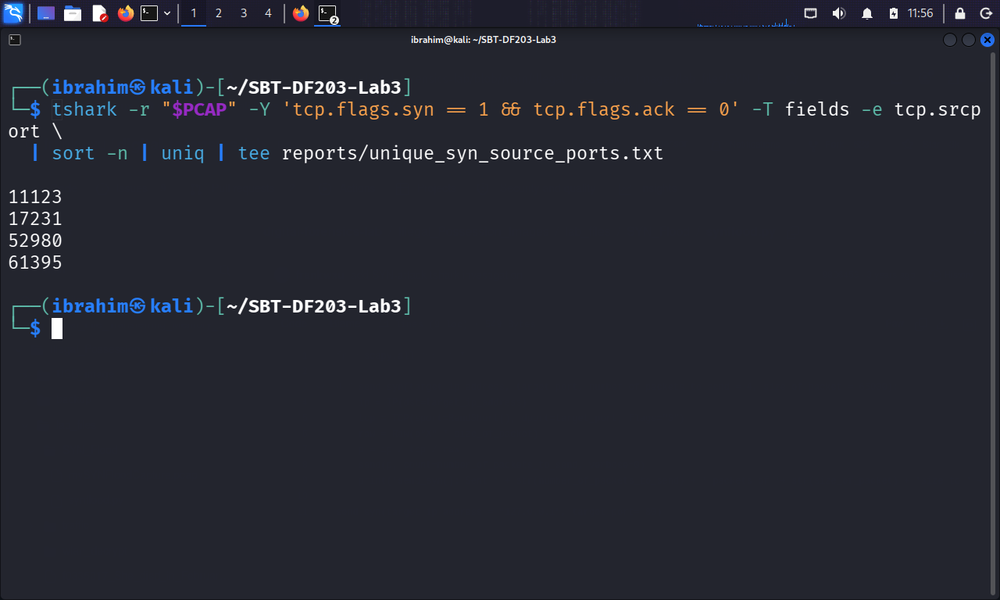

*Figure 4.4: Counts by source/destination*

### 6.2 Unique Client Source Ports

```bash
tshark -r "$PCAP" -Y 'tcp.flags.syn == 1 && tcp.flags.ack == 0' -T fields -e tcp.srcport \
  | sort -n | uniq | tee reports/unique_syn_source_ports.txt
```

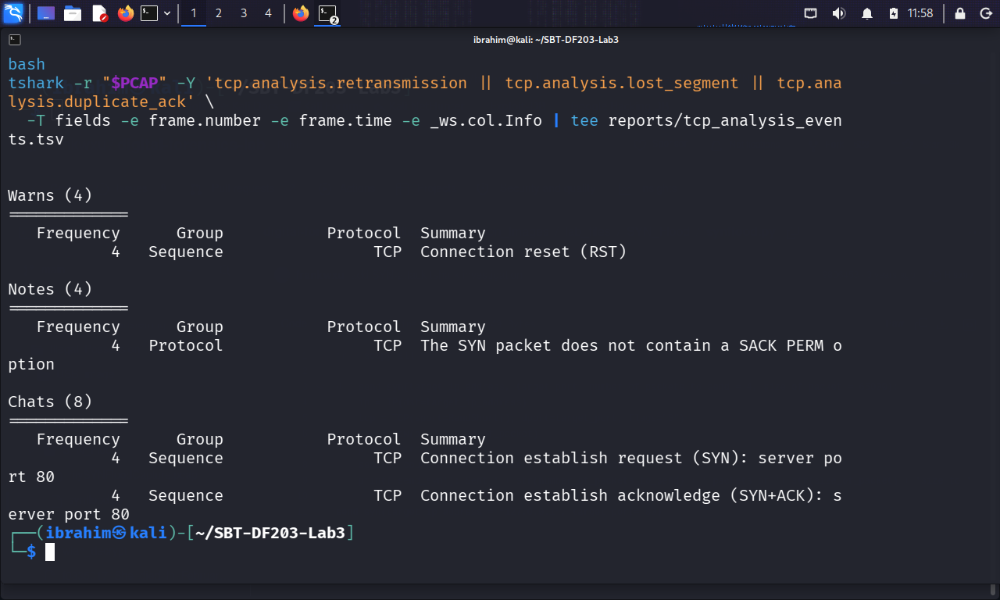

*Figure 4.5: Unique source ports*

**Unique Source Ports:** 11123, 17231, 52980, 61395

### 6.3 Expert Information

```bash
tshark -r "$PCAP" -q -z expert | tee reports/expert_info.txt
```

**Expert Analysis Summary:**

| Category | Frequency | Group | Protocol | Summary |
|----------|-----------|-------|----------|---------|
| Warning | 4 | Sequence | TCP | Connection reset (RST) |
| Notes | 4 | Protocol | TCP | The SYN packet does not contain a SACK PERM option |
| Chats | 4 | Sequence | TCP | Connection establish request (SYN): server port 80 |

---

## 7. Part E — Compare Normal and Suspicious Sessions

### 7.1 Comparison Table

| Indicator | Normal Session (HTTP) | Bounded Activity (SYN) | Forensic Meaning |
|-----------|----------------------|------------------------|------------------|
| Initial SYN count | 1 | 4 | Multiple SYNs from same source |
| SYN-ACK count | 1 | 4 | Server responded to each SYN |
| Completed handshakes | 1 | 0 | No final ACK sent |
| Unique client source ports | 1 | 4 | Random ephemeral ports |
| HTTP request present? | Yes | No | No application data |
| RST packets | 0 | 4 | Connections rejected by client OS |
| Observed duration | ~0.005 s | ~0.01 s | Brief burst vs. sustained |

### 7.2 Forensic Interpretation

| Aspect | Assessment |
|--------|------------|
| **What the capture proves** | A pattern of incomplete TCP handshakes was generated |
| **What the capture does NOT prove** | Service denial, sustained attack, or malicious intent |
| **Why the bounded simulation is not a flood** | Four packets is insufficient to exhaust server resources |
| **Evidence required for flood conclusion** | High volume, sustained rate, service impact, corroborating logs |

---

## 8. Required Forensic Findings

| Finding | Value/Observation |
|---------|-------------------|
| Normal handshake baseline | Complete SYN, SYN-ACK, ACK sequence captured |
| Bounded simulation | 4 SYN packets sent to 127.0.0.1:80 |
| Initial SYN count | 4 |
| SYN-ACK count | 4 |
| Completed handshakes | 0 |
| Unique source ports | 4 (11123, 17231, 52980, 61395) |
| RST packets | 4 |
| HTTP requests present | No |
| Capture duration | ~0.01 seconds |
| Evidence hashes | SHA-256 recorded for all capture files |

---

## 9. Detection and Mitigation Recommendations

### 9.1 Detection Controls

| Control | Description |
|---------|-------------|
| SYN-to-Completed-Handshake Ratio | Alert when SYN count significantly exceeds completed handshakes |
| SYN Backlog Monitoring | Monitor SYN-RECEIVED queue growth |
| Rate-Based Detection | Alert on SYN rates exceeding baseline thresholds |

### 9.2 Mitigation Controls

| Control | Description |
|---------|-------------|
| SYN Cookies | Enable SYN cookies to avoid resource allocation |
| Backlog Tuning | Adjust TCP backlog and timeout parameters |
| Upstream Rate Limiting | Implement rate limiting at network edge |
| DDoS Protection | Deploy dedicated DDoS mitigation services |

---

## 10. Conclusion

This lab provided practical experience in SYN Flood pattern investigation using TShark. I successfully:

- Created a local Apache webpage and verified the web service.
- Established a normal HTTP handshake baseline capturing SYN, SYN-ACK, and ACK packets.
- Developed and executed a bounded Scapy simulation sending four SYN packets.
- Captured the bounded SYN activity and preserved evidence with SHA-256 hashes.
- Extracted initial SYN packets, SYN-ACK responses, and ACK/RST candidates.
- Quantified the activity through SYN counts, unique source ports, and expert analysis.
- Compared normal and suspicious sessions to identify incomplete-handshake indicators.
- Assessed the forensic significance of the evidence.
- Documented detection and mitigation recommendations.
- Prepared a comprehensive network forensic report.

---

## 11. References

- ICDFA. (2026). SBT-DF203 — Module 2: HTTP, tshark, SYN Flood — Course Materials.
- ICDFA. (2026). SBT-DF203 Lab 3 — SYN Flood Pattern Investigation Using TShark.
- Wireshark Documentation. (2026). https://www.wireshark.org/docs/
- TShark Documentation. (2026). https://www.wireshark.org/docs/man-pages/tshark.html
- RFC 793. (1981). Transmission Control Protocol. https://tools.ietf.org/html/rfc793
- RFC 4987. (2007). TCP SYN Flooding Attacks and Common Mitigations. https://tools.ietf.org/html/rfc4987

---

## 12. Appendix — Screenshot Reference List

| Figure | Description |
|--------|-------------|
| Figure 1.1 | Lab folder structure created successfully |
| Figure 1.2 | Evidence file details and SHA-256 hash |
| Figure 2.1 | Normal handshake in the baseline capture |
| Figure 3.1 | Bounded Scapy script showing target and count |
| Figure 3.2 | Bounded simulation execution |
| Figure 3.3 | Bounded capture hashes |
| Figure 4.1 | Initial SYN packet list |
| Figure 4.2 | SYN-ACK response list |
| Figure 4.3 | ACK/RST candidates |
| Figure 4.4 | Counts by source/destination |
| Figure 4.5 | Unique source ports |

---

## 📄 Declaration

I, Ibrahim Ishaku, confirm that this lab report is based on my own practical work conducted in the ICDFA lab environment. All packet captures, traffic analysis, TCP handshake examination, Scapy simulation, and quantitative analysis tasks are my own original work.

**Signature:** ______________________
**Date:** 11th September, 2026

---

## 📄 License

MIT License — see the LICENSE file for details.

**End of Lab Report**
