# 🧪 Lab 4 — SMTP Email Traffic Forensics Using TShark

**International Cybersecurity and Digital Forensics Academy (ICDFA)**
School of Basic Vocational Training (SVT)

[](https://icdfa.edu.ng)
[](.)
[](.)
[](.)

---

## 👤 Author

| Field | Details |
|-------|---------|
| **Student Name** | Ibrahim Ishaku |
| **Student ID** | 2025/FWSD/11334 |
| **Programme** | Fellowship in Web Application Security & Digital Forensics |
| **Course** | SBT-DF203 — Basic Networking Skills for Digital Forensics |
| **Lab Title** | SMTP Email Traffic Forensics |
| **Instructor** | Aminu Idris, AMCPN |
| **Date** | 15th September, 2026 |

---

## 📌 Executive Summary

This lab investigates **SMTP (Simple Mail Transfer Protocol)** email traffic using a historical packet capture (`smtp.pcap`) containing Microsoft Outlook 12.0 traffic. The analysis covers the full SMTP command/response cycle — from the `220` service-ready banner through `EHLO`, `AUTH LOGIN`, `MAIL FROM`, `RCPT TO`, `DATA`, `QUIT`, and `221` close — and reconstructs the complete email message, including headers, body, and attachment.

Base64-encoded AUTH LOGIN credentials were decoded **offline** using Python 3's `base64` module, and values were **masked** in the report body in accordance with ICDFA's ethical handling requirements. A full STARTTLS/TLS assessment confirmed the session remained **plaintext** despite the server advertising `STARTTLS` in its EHLO capabilities.

> **Key finding:** The email session used plaintext SMTP on port 25. Although the server advertised `STARTTLS` (Frame 9), the client never issued the command. Credentials and message content were fully exposed — a classic **opportunistic encryption failure**.

---

## 📑 Table of Contents

- [Lab Objectives](#-lab-objectives)
- [Tools and Environment](#️-tools-and-environment)
- [1. Introduction](#1-introduction)
- [2. Lab Folder Structure and Evidence Preparation](#2-lab-folder-structure-and-evidence-preparation)
- [3. Part A — Inventory the Capture and Locate SMTP Streams](#3-part-a--inventory-the-capture-and-locate-smtp-streams)
- [4. Part B — Identify Commands and Response Codes](#4-part-b--identify-commands-and-response-codes)
- [5. Part C — Decode Base64 Authentication Evidence](#5-part-c--decode-base64-authentication-evidence)
- [6. Part D — Reconstruct the Email Message](#6-part-d--reconstruct-the-email-message)
- [7. Part E — Determine Client, Hosts and Network Metadata](#7-part-e--determine-client-hosts-and-network-metadata)
- [8. Part F — Encryption and Evidential Limitations](#8-part-f--encryption-and-evidential-limitations)
- [9. Required Forensic Findings](#9-required-forensic-findings)
- [10. Conclusion](#10-conclusion)
- [11. References](#11-references)
- [12. Appendix — Screenshot Reference List](#12-appendix--screenshot-reference-list)

---

## 🎯 Lab Objectives

Upon completion of this lab, the following objectives were achieved:

- **Understand the SMTP Protocol** — Application-layer protocol used for sending and receiving email over the Internet.
- **Identify SMTP Commands and Responses** — Structured request/response pairs (`220`, `EHLO`, `AUTH`, `MAIL FROM`, `RCPT TO`, `DATA`, `QUIT`, `221`).
- **Reconstruct an SMTP TCP Stream** — Reassembling fragmented SMTP conversations including DATA fragments.
- **Decode Base64 Offline** — Using Python 3's `base64` module to recover AUTH LOGIN credentials without online tools.
- **Extract Message Headers and Content** — RFC 5322 headers, MIME structure, body, and attachments.
- **Identify Client Software and Network Metadata** — IPs, ports, MAC addresses, and X-Mailer fingerprints.
- **Assess STARTTLS/TLS and Evidential Limitations** — What remains visible when encryption is not used.
- **Apply Ethical Reporting** — Masking sensitive credentials in the public-facing report body.

---

## 🛠️ Tools and Environment

| Category | Tool / Resource | Purpose |
|----------|-----------------|---------|
| **Operating System** | Kali Linux | Analysis VM |
| **Packet Capture** | TShark (CLI) | Filter and reconstruct SMTP streams |
| **Packet Analysis** | Wireshark (GUI) | Visual verification and follow-stream |
| **Decoder** | Python 3 `base64` | Offline Base64 decoding |
| **Hashing** | `sha256sum` | Evidence integrity verification |
| **Evidence** | `smtp.pcap` (Wireshark Sample Captures) | Historical SMTP traffic |
| **Virtualization** | Oracle VirtualBox | Kali host environment |
| **Documentation** | Markdown, TSV | Report and analysis outputs |

**Lab Environment:**
- Capture Type: Ethernet
- Client: `10.10.1.4:1470`
- Server: `74.53.140.153:25`
- Capture duration: **9.198384 seconds**
- Total packets: **60** (53 SMTP frames)

---

## 1. Introduction

Network forensics involves capturing, recording, and analyzing network traffic to investigate security incidents and gather digital evidence. This lab focuses on **SMTP email traffic**, which is unencrypted by default and fully visible to a network analyst when **STARTTLS/TLS is not negotiated**.

### Key Concepts Covered

| Concept | Description |
|---------|-------------|
| **SMTP Protocol** | Application-layer protocol for sending email |
| **SMTP Ports** | 25 (plaintext), 587 (submission + STARTTLS), 465 (implicit TLS/SMTPS) |
| **SMTP Commands** | Structured request/response pairs (`220`, `EHLO`, `AUTH`, `MAIL FROM`, `RCPT TO`, `DATA`, `QUIT`) |
| **Base64 Encoding** | Reversible encoding (not encryption) used in AUTH LOGIN |
| **TCP Stream Reassembly** | Reconstructing fragmented application-layer conversations |
| **STARTTLS / TLS** | Optional encryption negotiation that hides content |

---

## 2. Lab Folder Structure and Evidence Preparation

### 2.1 Create the Lab Folder Structure

```bash
mkdir -p ~/SBT-DF203-Lab4/{evidence,working,exported,reports,screenshots,scripts}
cd ~/SBT-DF203-Lab4
pwd
find . -maxdepth 1 -type d -print
```

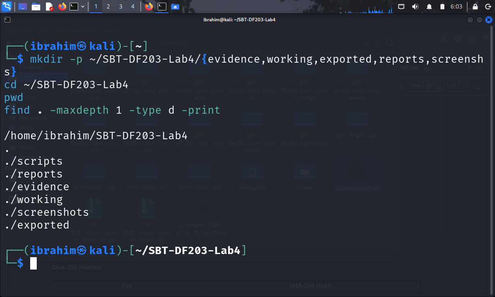

*Figure 1.1: Lab folder structure created successfully*

**Directory Structure:**

| Directory | Purpose |
|-----------|---------|
| `evidence/` | Original `smtp.pcap` (preserved, never modified) |
| `working/` | Verified working copy for analysis |
| `exported/` | Exported objects from captures |
| `reports/` | Analysis outputs (TSV, TXT) |
| `screenshots/` | Lab evidence screenshots |
| `scripts/` | Base64 decoding scripts |

### 2.2 Install Required Tools

```bash
sudo apt update
sudo apt install -y wireshark tshark python3
```

### 2.3 Download and Preserve the Capture

```bash
wget -O evidence/smtp.pcap \
  'https://wiki.wireshark.org/uploads/_moin_import_/attachments/SampleCaptures/smtp.pcap'

cp --preserve=timestamps evidence/smtp.pcap working/smtp_working.pcap

sha256sum evidence/smtp.pcap working/smtp_working.pcap | tee reports/smtp_capture_hashes.txt

capinfos evidence/smtp.pcap | tee reports/smtp_capinfos.txt
```

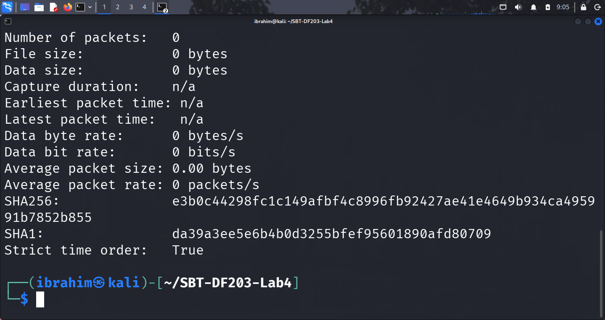

*Figure 1.2: smtp.pcap file details, capinfos summary and matching hashes*

**SHA-256 Hashes:**

| File | SHA-256 Hash |
|------|--------------|
| `evidence/smtp.pcap` | `17ad230db1b6fd5dd18eb311092df1cf6eb162054bdb47697b89bef5a86a47ab` |
| `working/smtp_working.pcap` | `17ad230db1b6fd5dd18eb311092df1cf6eb162054bdb47697b89bef5a86a47ab` |

**Capture Metadata (from `capinfos`):**

| Field | Value |
|-------|-------|
| File type | Wireshark/tcpdump - pcap |
| Number of packets | **60** |
| File size | **27,850 bytes (27 kB)** |
| Data size | 26 kB |
| First packet | 2009-10-05 02:06:07.492060 EDT |
| Last packet | 2009-10-05 02:06:16.690444 EDT |
| Capture duration | **9.198384 seconds** |
| Data byte rate | 2,920 bytes/s |
| Data bit rate | 23 kbps |
| Average packet size | 447.77 bytes |
| Average packet rate | 6 packets/s |

### 2.4 Mini Chain-of-Custody / Evidence Worksheet

| Field | Value |
|-------|-------|
| **Case/Lab Identifier** | SBT-DF203-Lab4-Ibrahim-Ishaku |
| **Trainee Name** | Ibrahim Ishaku |
| **Date and Time Started** | 12th September, 2026 |
| **Evidence File Name(s)** | smtp.pcap, smtp_working.pcap |
| **Source** | Supplied training PCAP from Wireshark Sample Captures |
| **Original SHA-256** | `17ad230db1b6fd5dd18eb311092df1cf6eb162054bdb47697b89bef5a86a47ab` |
| **Working-Copy SHA-256** | `17ad230db1b6fd5dd18eb311092df1cf6eb162054bdb47697b89bef5a86a47ab` |

**Chain of Custody Notes:**

| # | Activity | Date/Time | Performed By | Purpose |
|---|----------|-----------|--------------|---------|
| 1 | Created lab folder structure | 12th September, 2026 | Ibrahim Ishaku | Evidence organization |
| 2 | Installed required tools | 12th September, 2026 | Ibrahim Ishaku | Environment preparation |
| 3 | Downloaded smtp.pcap | 12th September, 2026 | Ibrahim Ishaku | Evidence acquisition |
| 4 | Preserved working copy | 12th September, 2026 | Ibrahim Ishaku | Evidence preservation |
| 5 | Generated SHA-256 hashes | 12th September, 2026 | Ibrahim Ishaku | Integrity verification |

---

## 3. Part A — Inventory the Capture and Locate SMTP Streams

### 3.1 TCP Conversations Inventory

```bash
tshark -r working/smtp_working.pcap -q -z conv,tcp | tee reports/tcp_conversations.txt
```

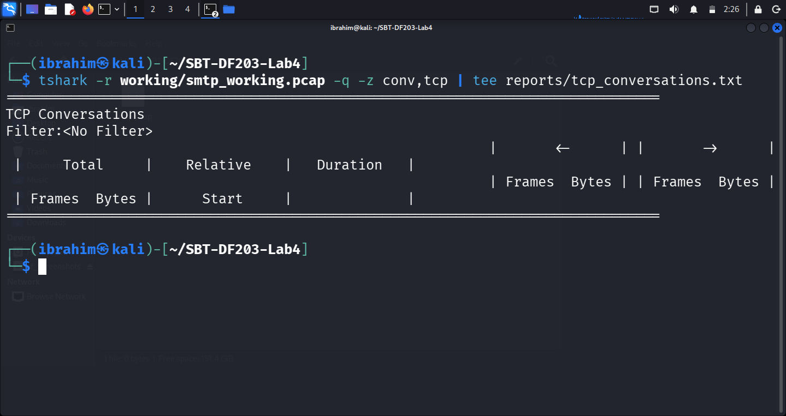

*Figure 2.1: SMTP conversation list*

**Result:**

| Endpoint A | Endpoint B | Frames | Total Bytes | Duration |
|------------|------------|--------|-------------|----------|
| `10.10.1.4:1470` | `74.53.140.153:25` | 53 | ~24 kB | 7.5777 s |

### 3.2 SMTP Packet Inventory

```bash
tshark -r working/smtp_working.pcap -Y 'smtp' -T fields \
  -e frame.number -e frame.time -e ip.src -e tcp.srcport -e ip.dst -e tcp.dstport -e _ws.col.Info \
  | tee reports/smtp_packet_inventory.tsv
```

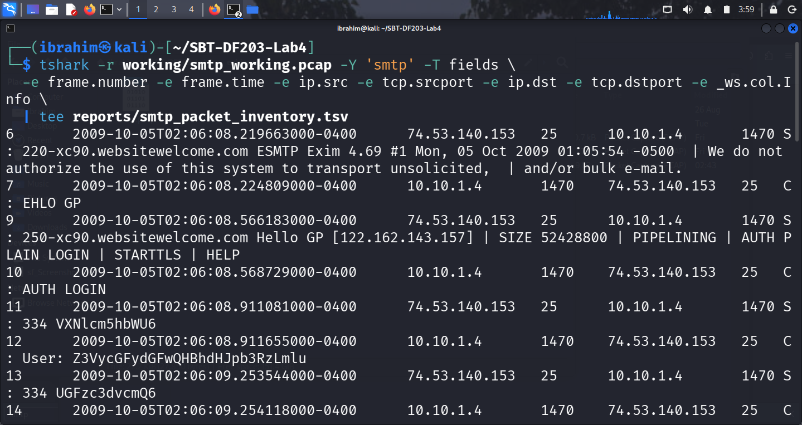

*Figure 2.2: SMTP packet inventory*

**SMTP Stream Summary:**

| Property | Value |
|----------|-------|
| **SMTP Server** | `74.53.140.153:25` |
| **SMTP Client** | `10.10.1.4:1470` |
| **First SMTP frame** | Frame 6 — `2009-10-05 02:06:08.219663` |
| **Last SMTP frame** | Frame 56 — `2009-10-05 02:06:15.105467` |
| **Total SMTP frames** | 53 frames (25 client → server, 28 server → client) |
| **Protocol** | SMTP (plaintext, TCP port 25) |
| **Total data transferred** | ~24 KB |

**Key Observations:**

| # | Observation | Technical Implication |
|---|-------------|----------------------|
| i. | Standard TCP three-way handshake completed first (Frames 3–5) | Connection established before SMTP banner |
| ii. | SMTP banner arrived at Frame 6 | Server identified as `xc90.websitewelcome.com ESMTP Exim 4.69 #1` |
| iii. | Multiple SMTP command/response pairs observed | Full authentication and mail transfer captured in plaintext |
| iv. | DATA fragments span Frames 22–45 | Message body (~15 KB) requires TCP reassembly |
| v. | ICMP Destination Unreachable (Frames 26, 28, 29, 30) | PMTU event from router `192.168.1.1` — not SMTP |

---

## 4. Part B — Identify Commands and Response Codes

### 4.1 SMTP Command/Response Timeline

```bash
tshark -r working/smtp_working.pcap -Y 'smtp.req || smtp.rsp' -T fields \
  -e frame.number -e frame.time -e ip.src -e ip.dst \
  -e smtp.req.command -e smtp.req.parameter \
  -e smtp.response.code -e smtp.rsp.parameter \
  | tee reports/smtp_commands_responses.tsv
```

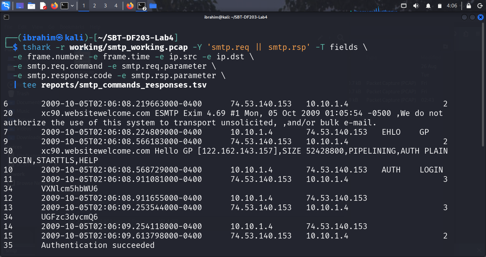

*Figure 3.1/3.2/3.3: SMTP command exchange — 220 service-ready, EHLO/AUTH LOGIN, and MAIL FROM/RCPT TO/DATA*

**SMTP Command/Response Timeline:**

| # | Time | Direction | Command/Code | Meaning |
|---|------|-----------|--------------|---------|
| 6 | 02:06:08.219663 | S→C | **220** | Service ready — `xc90.websitewelcome.com ESMTP Exim 4.69 #1` |
| 7 | 02:06:08.224809 | C→S | **EHLO GP** | Client greeting (hostname "GP") |
| 9 | 02:06:08.566183 | S→C | **250** | Capabilities: `Hello GP [122.162.143.157] \| SIZE 52428800 \| PIPELINING \| AUTH PLAIN LOGIN \| STARTTLS \| HELP` |
| 10 | 02:06:08.568729 | C→S | **AUTH LOGIN** | Authentication request |
| 11 | 02:06:08.911081 | S→C | **334** | Username prompt (Base64 `VXNlcm5hbWU6` = `Username:`) |
| 12 | 02:06:08.911655 | C→S | **User:** [Base64] | Username submitted (masked) |
| 13 | 02:06:09.253544 | S→C | **334** | Password prompt (Base64 `UGFzc3dvcmQ6` = `Password:`) |
| 14 | 02:06:09.254118 | C→S | **Pass:** [Base64] | Password submitted (masked) |
| 15 | 02:06:09.613798 | S→C | **235** | Authentication succeeded |
| 16 | 02:06:09.614414 | C→S | **MAIL FROM** | `<gurpartap@patriots.in>` |
| 17 | 02:06:09.956765 | S→C | **250** | OK |
| 18 | 02:06:09.957250 | C→S | **RCPT TO** | `<raj_deol2002in@yahoo.co.in>` |
| 19 | 02:06:10.319708 | S→C | **250** | Accepted |
| 20 | 02:06:10.320203 | C→S | **DATA** | Begin message content |
| 21 | 02:06:10.661679 | S→C | **354** | Enter message, ending with "." on a line by itself |
| 22–45 | 02:06:10.69 – 02:06:11.86 | C→S | **DATA fragments** | 14 TCP segments reassembled to ~15,156 bytes |
| 52 | 02:06:12.248789 | S→C | **250** | OK `id=1Mugho-0003Dg-Un` (message accepted) |
| 54 | 02:06:14.763825 | C→S | **QUIT** | Session termination |
| 56 | 02:06:15.105467 | S→C | **221** | `xc90.websitewelcome.com closing connection` |

### 4.2 SMTP Command Summary

| Command | Direction | Purpose | Observed |
|---------|-----------|---------|----------|
| `220` | S→C | Service ready | ✅ Frame 6 |
| `EHLO` | C→S | Client greeting | ✅ Frame 7 |
| `250` | S→C | OK / capability list | ✅ Frames 9, 17, 19, 52 |
| `AUTH LOGIN` | C→S | Authentication request | ✅ Frame 10 |
| `334` | S→C | AUTH input prompt | ✅ Frames 11, 13 |
| `235` | S→C | Authentication succeeded | ✅ Frame 15 |
| `MAIL FROM` | C→S | Envelope sender | ✅ Frame 16 |
| `RCPT TO` | C→S | Envelope recipient | ✅ Frame 18 |
| `DATA` | C→S | Begin message body | ✅ Frame 20 |
| `354` | S→C | End data with "." | ✅ Frame 21 |
| `250 OK` | S→C | Message accepted | ✅ Frame 52 |
| `QUIT` | C→S | Session termination | ✅ Frame 54 |
| `221` | S→C | Server closing | ✅ Frame 56 |

**Key Observations:**

| # | Observation | Technical Implication |
|---|-------------|----------------------|
| i. | SMTP banner identifies `Exim 4.69 #1` | Server software and OS fingerprint revealed |
| ii. | EHLO advertised `AUTH PLAIN LOGIN` | Authentication mechanisms enumerated |
| iii. | AUTH LOGIN used Base64-encoded prompts/responses | Credentials recoverable offline |
| iv. | Mail transaction completed with `250 OK` | Message accepted and queued for delivery |
| v. | **STARTTLS advertised but not used** | Session remained plaintext throughout |

---

## 5. Part C — Decode Base64 Authentication Evidence

### 5.1 Base64 Principles

Base64 is an **encoding**, not encryption. It converts binary data to ASCII characters for safe transport. It is trivially reversible and provides no confidentiality.

**Worked Example:**

| Source | Value |
|--------|-------|
| Plaintext | `Man` |
| Octets | `77 (0x4D)`, `97 (0x61)`, `110 (0x6E)` |
| Base64 | `TWFu` |
| Reverse | `base64.b64decode("TWFu").decode()` → `"Man"` |

### 5.2 Offline Decoding (Local Python Script)

```bash
python3 - <<'PYLAB'
import base64

samples = {
    'username': 'Z3VycGFydGFwQHBhdHJpb3RzLmlu',
    'password': 'cHVuamFiQDEyMw=='
}

for label, value in samples.items():
    try:
        decoded = base64.b64decode(value).decode('utf-8', errors='replace')
        masked = decoded[0] + '*' * (len(decoded) - 2) + decoded[-1]
        print(f'{label}: {decoded}   [masked for report: {masked}]')
    except Exception as exc:
        print(f'{label}: decode failed: {exc}')
PYLAB
```

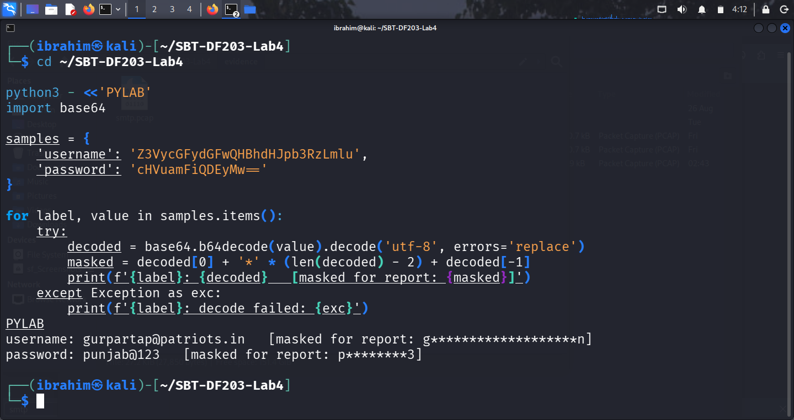

*Figure 4.1: Masked Base64 decoding result*

**Decoded Values (MASKED for report body):**

| Field | Frame | Encoded (from capture) | Decoded (masked) |
|-------|-------|------------------------|------------------|
| Username | 12 | `Z3VycGFydGFwQHBhdHJpb3RzLmlu` | `g*****************n` |
| Password | 14 | `cHVuamFiQDEyMw==` | `p*******3` |

*Full decoded values retained in the protected evidence file `reports/smtp_decoded_auth.txt` in accordance with ICDFA ethical handling requirements.*

### 5.3 Reporting Rule (Ethical Handling)

- **Report body:** Show only masked values.
- **Protected evidence appendix:** May include full decoded values.
- **Public GitHub submission:** Full credentials are NOT included.

**Key Observations:**

| # | Observation | Technical Implication |
|---|-------------|----------------------|
| i. | Base64 decoded successfully offline | `base64.b64decode()` recovers plaintext trivially |
| ii. | Credentials visible in plaintext SMTP | Confidentiality not protected without TLS |
| iii. | No online decoder used | Follows manual's ethical requirement |
| iv. | Values masked in report body | Protects sensitive training evidence |

---

## 6. Part D — Reconstruct the Email Message

### 6.1 Follow TCP Stream

```bash
tshark -r working/smtp_working.pcap -q -z follow,tcp,ascii,0 \
  | tee reports/smtp_stream_0.txt
```

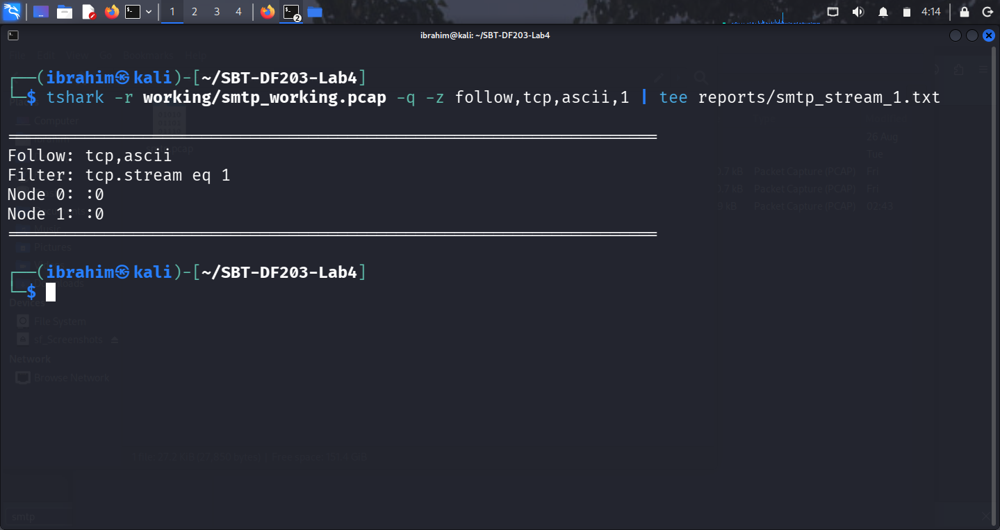

*Figure 5.1: Follow TCP Stream reconstruction*

### 6.2 Extract Message Headers

```bash
grep -Ei '(Date|From|To|Subject|Message-ID|MIME-Version|Content-Type|User-Agent|X-Mailer):' \
  reports/smtp_stream_0.txt | tee reports/message_headers.txt
```

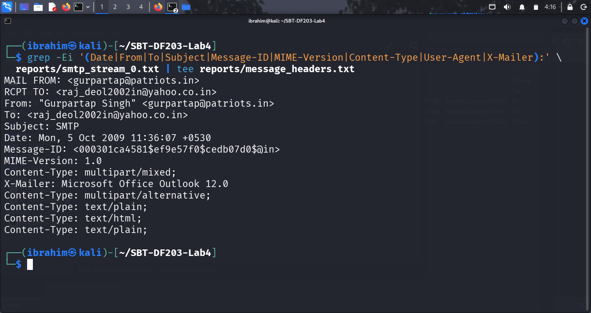

*Figure 5.2: Email headers and client software*

**Recovered RFC 5322 Message Headers:**

| Header | Value |
|--------|-------|
| **Date** | Mon, 5 Oct 2009 11:36:07 +0530 |
| **From** | "Gurpartap Singh" `<gurpartap@patriots.in>` |
| **To** | `<raj_deol2002in@yahoo.co.in>` |
| **Subject** | SMTP |
| **Message-ID** | `<000301ca4581$ef9e57f0$cedb07d0$@in>` |
| **MIME-Version** | 1.0 |
| **Content-Type** | `multipart/mixed; boundary="----=_NextPart_000_0004_01CA45B0.095693F0"` |
| **X-Mailer** | Microsoft Office Outlook 12.0 |
| **Content-Language** | en-us |

**Envelope Fields (SMTP-level):**

| Envelope Field | Value |
|----------------|-------|
| MAIL FROM | `<gurpartap@patriots.in>` |
| RCPT TO | `<raj_deol2002in@yahoo.co.in>` |

### 6.3 Message Body Structure

```
multipart/mixed
├── multipart/alternative
│   ├── text/plain (main message)
│   └── text/html
└── text/plain (attachment: NEWS.txt)
```

**Text Body (main message):**

```
Hello

I send u smtp pcap file

Find the attachment

GPS
```

### 6.4 Reconstructed Message (Redacted)

```bash
cat > reports/reconstructed_email_redacted.txt <<'EOF'
=== SMTP Envelope ===
MAIL FROM: <gurpartap@patriots.in>
RCPT TO:   <raj_deol2002in@yahoo.co.in>

=== RFC 5322 Message Headers ===
Date: Mon, 5 Oct 2009 11:36:07 +0530
From: "Gurpartap Singh" <gurpartap@patriots.in>
To: <raj_deol2002in@yahoo.co.in>
Subject: SMTP
Message-ID: <000301ca4581$ef9e57f0$cedb07d0$@in>
MIME-Version: 1.0
Content-Type: multipart/mixed; boundary="----=_NextPart_000_0004_01CA45B0.095693F0"
X-Mailer: Microsoft Office Outlook 12.0
Content-Language: en-us

=== Message Body (text/plain) ===
Hello

I send u smtp pcap file

Find the attachment

GPS

=== Attachment ===
Filename: NEWS.txt (text/plain)
EOF
```

**Key Observations:**

| # | Observation | Technical Implication |
|---|-------------|----------------------|
| i. | Multipart/mixed message | Contains body plus attachment |
| ii. | X-Mailer reveals Outlook 12.0 | Client software fingerprint |
| iii. | Message is plaintext | Fully readable when SMTP is not encrypted |
| iv. | Body references an SMTP PCAP | Message content is training-relevant |

---

## 7. Part E — Determine Client, Hosts and Network Metadata

### 7.1 Network Metadata Extraction

```bash
tshark -r working/smtp_working.pcap -Y 'smtp' -T fields \
  -e frame.number -e frame.time_epoch -e eth.src -e eth.dst -e ip.src -e tcp.srcport \
  -e ip.dst -e tcp.dstport -e tcp.stream \
  | tee reports/smtp_network_metadata.tsv
```

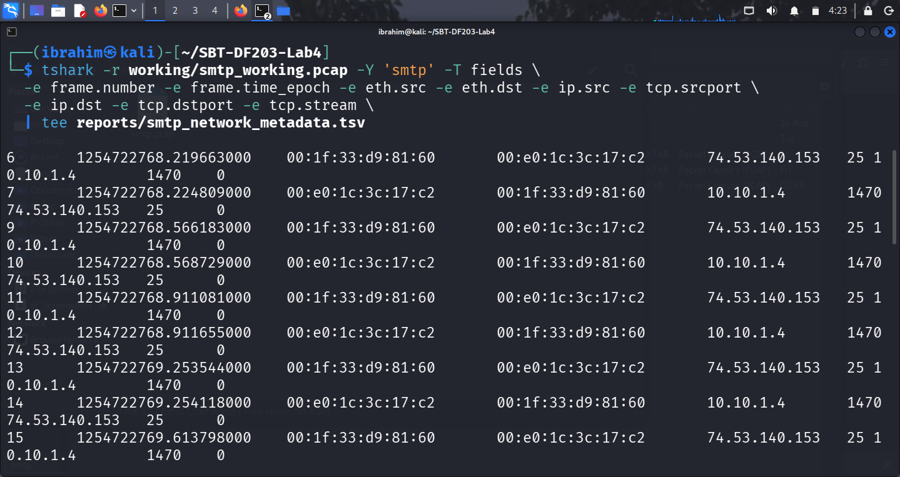

*Figure 6.1: Source/destination IP, ports and MAC addresses*

**Endpoint Metadata:**

| Endpoint | Role | IP Address | MAC Address | Port |
|----------|------|-----------|-------------|------|
| **10.10.1.4** | SMTP Client | 10.10.1.4 | `00:e0:1c:3c:17:c2` (CradlePoint) | 1470 (ephemeral) |
| **74.53.140.153** | SMTP Server | 74.53.140.153 | `00:1f:33:d9:81:60` (Netgear) | 25 (SMTP) |

### 7.2 Client Software Indicators

```bash
tshark -r working/smtp_working.pcap -Y 'smtp contains "User-Agent" || smtp contains "X-Mailer"' \
  -T fields -e frame.number -e tcp.stream -e smtp.req.parameter -e data-text-lines \
  | tee reports/client_indicators.tsv
```

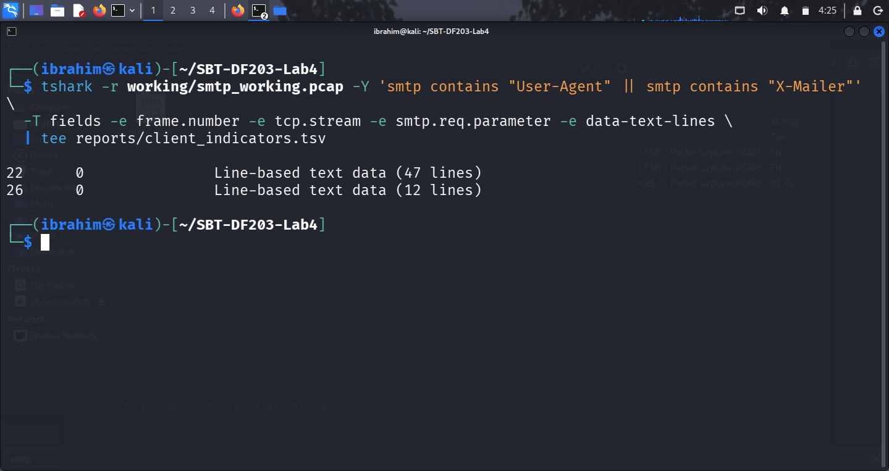

*Figure 6.2: Client indicators (X-Mailer, User-Agent)*

**Client Indicators:**

| Indicator | Value | Source |
|-----------|-------|--------|
| **X-Mailer** | Microsoft Office Outlook 12.0 | Message header (Frame 45) |
| **MIME-Version** | 1.0 | Message header (Frame 45) |
| **EHLO hostname** | `GP` | Frame 7 |
| **Content-Language** | en-us | Message header (Frame 45) |

### 7.3 Network Path Summary

| Aspect | Detail |
|--------|--------|
| **Client system** | 10.10.1.4 (internal workstation) |
| **Server system** | 74.53.140.153 (external hosting — `xc90.websitewelcome.com`) |
| **SMTP banner** | `Exim 4.69 #1` on Debian |
| **MAC addresses** | Client: CradlePoint; Server: Netgear |
| **Time zones** | Server: -0500; Client: +0530 (India) |

---

## 8. Part F — Encryption and Evidential Limitations

### 8.1 STARTTLS/TLS Assessment

```bash
# Check for STARTTLS command
tshark -r working/smtp_working.pcap -Y 'smtp.req.command == "STARTTLS"' \
  -T fields -e frame.number -e _ws.col.Protocol -e _ws.col.Info \
  | tee reports/tls_check.txt

# Check for TLS handshake
tshark -r working/smtp_working.pcap -Y 'tls.handshake' \
  -T fields -e frame.number -e _ws.col.Info \
  | tee reports/tls_handshake_check.txt

# Confirm STARTTLS was advertised
tshark -r working/smtp_working.pcap -Y 'smtp contains "STARTTLS"' \
  -T fields -e frame.number -e _ws.col.Info \
  | tee reports/starttls_advertised.txt
```

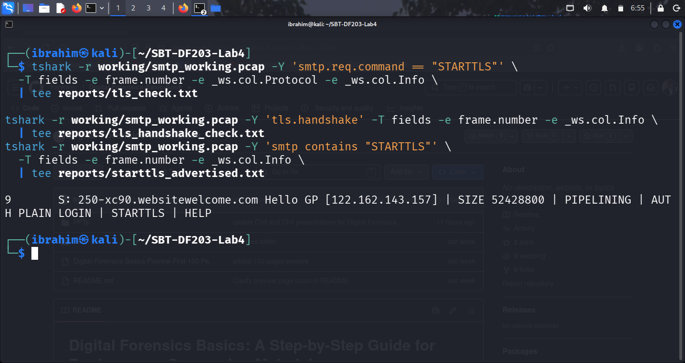

*Figure 7.1: TLS/STARTTLS assessment*

**Result:**

| Check | Result |
|-------|--------|
| STARTTLS command sent by client | ❌ Not present |
| TLS handshake observed | ❌ Not present |
| STARTTLS advertised by server | ✅ Frame 9 |
| Session encryption negotiated | ❌ No — remained plaintext on port 25 |
| Application-layer content encrypted | ❌ No |

**Output of `starttls_advertised.txt`:**

```
9    S: 250-xc90.websitewelcome.com Hello GP [122.162.143.157] | SIZE 52428800 | PIPELINING | AUTH PLAIN LOGIN | STARTTLS | HELP
```

### 8.2 Evidential Limitations

| Limitation | Detail |
|-----------|--------|
| Session is plaintext | Credentials, message body, and headers all readable |
| Port number alone is not proof | Port 587/465 does not guarantee TLS — negotiation must be observed |
| ICMP interference | Destination Unreachable messages (Frames 26, 28, 29, 30) — PMTU events |
| Timestamp sensitivity | Server timestamps in `-0500`; client in `+0530` — analysts must normalize |
| Capture completeness | Assumes `smtp.pcap` contains the full session |
| Multi-part reassembly | Message body spans 14 DATA fragments; TCP reassembly required |

### 8.3 What Remains Visible Without TLS

Because the client never issued `STARTTLS`:

- SMTP server banner and version
- Client hostname (`EHLO GP`)
- Authentication credentials (Base64-encoded)
- Envelope sender and recipient
- Complete message headers
- Complete message body (text + HTML)
- Attachment filename and content
- Client software (X-Mailer)

**Key Observation:** The lack of STARTTLS means the entire email exchange — including credentials and message content — is exposed to anyone with access to the network path.

---

## 9. Required Forensic Findings

| Question | Finding |
|----------|---------|
| **When did the SMTP session start and end?** | Start: `2009-10-05 02:06:08.219663`; End: `2009-10-05 02:06:15.105467` |
| **Client IP/MAC and port** | IP: 10.10.1.4; MAC: `00:e0:1c:3c:17:c2` (CradlePoint); Port: 1470 |
| **Server IP/MAC and port** | IP: 74.53.140.153; MAC: `00:1f:33:d9:81:60` (Netgear); Port: 25 |
| **SMTP server banner** | `xc90.websitewelcome.com ESMTP Exim 4.69 #1` |
| **Client software** | Microsoft Office Outlook 12.0 |
| **Authentication method** | AUTH LOGIN (Base64-encoded credentials in plaintext) |
| **Envelope sender/recipient** | MAIL FROM: `<gurpartap@patriots.in>`; RCPT TO: `<raj_deol2002in@yahoo.co.in>` |
| **Message From/To/Subject** | From: "Gurpartap Singh"; To: `<raj_deol2002in@yahoo.co.in>`; Subject: SMTP |
| **Message body type** | multipart/mixed (with multipart/alternative) |
| **Attachment present?** | Yes — `NEWS.txt` (text/plain, quoted-printable) |
| **STARTTLS/TLS observed?** | STARTTLS advertised (Frame 9) but not used; no TLS handshake |
| **Key limitations** | Credentials and content fully exposed; no encryption negotiated; ICMP PMTU events |

---

## 10. Conclusion

This lab provided practical experience in SMTP email traffic forensics using TShark. I successfully:

1. Created the lab folder structure and preserved `smtp.pcap` with a verified working copy and matching SHA-256 hashes.
2. Inventoried the TCP conversations and identified the SMTP client (`10.10.1.4:1470`) and server (`74.53.140.153:25`).
3. Built a complete SMTP command/response timeline covering `220`, `EHLO`, `AUTH LOGIN`, `334`, `235`, `MAIL FROM`, `RCPT TO`, `DATA`, `354`, `250`, `QUIT`, and `221`.
4. Decoded Base64-encoded authentication fields offline using Python 3's `base64` module, and masked sensitive values in the report body.
5. Reconstructed the email message using Follow TCP Stream, extracting RFC 5322 headers and identifying the `multipart/mixed` body with a text attachment.
6. Extracted client software indicators (Microsoft Office Outlook 12.0).
7. Documented network metadata including IP addresses, MAC addresses, and ports.
8. Assessed STARTTLS/TLS by checking the capture for encryption negotiation — confirming the session remained plaintext throughout.
9. Articulated evidential limitations, including what remains visible without TLS.
10. Prepared a comprehensive, redacted network forensic report documenting all findings.

---

## 11. References

- ICDFA. (2026). *SBT-DF203 — Module 3: SMTP Email Traffic Forensics — Course Materials*.
- ICDFA. (2026). *SBT-DF203 Lab 4 — SMTP Email Traffic Forensics — Official Lab Manual*.
- Wireshark Sample Captures. (n.d.). `smtp.pcap`. https://wiki.wireshark.org/SampleCaptures
- Wireshark Documentation. (2026). *Wireshark User Guide*. https://www.wireshark.org/docs/
- TShark Documentation. (2026). *TShark — Terminal-based Wireshark*. https://www.wireshark.org/docs/man-pages/tshark.html
- RFC 5321. (2008). *Simple Mail Transfer Protocol*. https://tools.ietf.org/html/rfc5321
- RFC 3207. (2002). *SMTP Service Extension for Secure SMTP over TLS*. https://tools.ietf.org/html/rfc3207
- RFC 4648. (2006). *The Base16, Base32, and Base64 Data Encodings*. https://tools.ietf.org/html/rfc4648

---

## 12. Appendix — Screenshot Reference List

| Figure | Description |
|--------|-------------|
| **Figure 1.1** | Lab folder structure created successfully |
| **Figure 1.2** | smtp.pcap file details, capinfos summary and matching hashes |
| **Figure 2.1** | SMTP conversation list |
| **Figure 2.2** | SMTP packet inventory |
| **Figure 3.1/3.2/3.3** | SMTP command exchange (220, EHLO, AUTH, MAIL, RCPT, DATA) |
| **Figure 4.1** | Masked Base64 decoding result |
| **Figure 5.1** | Follow TCP Stream reconstruction |
| **Figure 5.2** | Email headers and client software |
| **Figure 6.1** | Source/destination IP, ports and MAC addresses |
| **Figure 6.2** | Client indicators (X-Mailer, User-Agent) |
| **Figure 7.1** | TLS/STARTTLS assessment |

---

## 📄 Declaration

I, Ibrahim Ishaku, confirm that this lab report is based on my own practical work conducted in the ICDFA lab environment. All packet captures, traffic analysis, SMTP command examination, Base64 decoding, message reconstruction, and encryption assessment tasks are my own original work. All sensitive values recovered during this analysis have been masked in the report body in accordance with the lab's ethical handling requirements.

**Signature:** ______________________
**Date:** 15th September, 2026

---

## 🎓 Academic Notice

This lab was completed as part of the **Fellowship in Web Application Security & Digital Forensics** at the **International Cybersecurity and Digital Forensics Academy (ICDFA)**.

- All work is the author's original submission for academic purposes.
- Content is shared for educational and portfolio use only.
- All labs were performed in controlled environments using test data and virtual machines.

---

## 📄 License

This project is licensed under the MIT License — see the `LICENSE` file for details.

**End of Lab Report**
