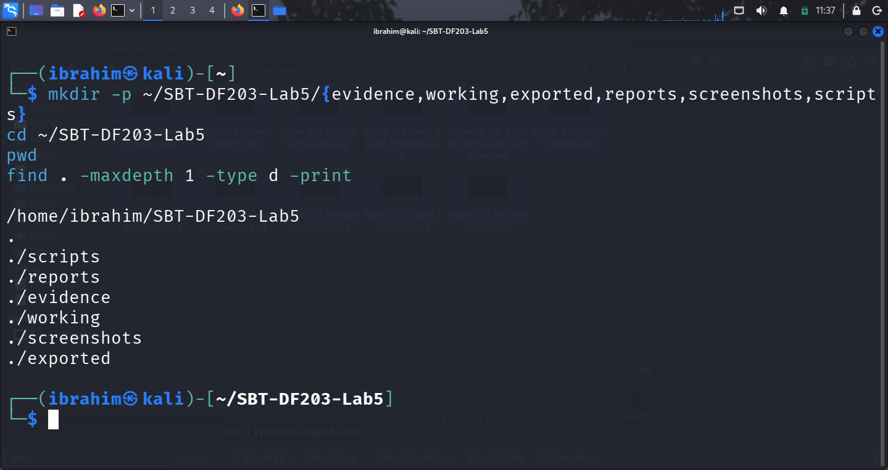
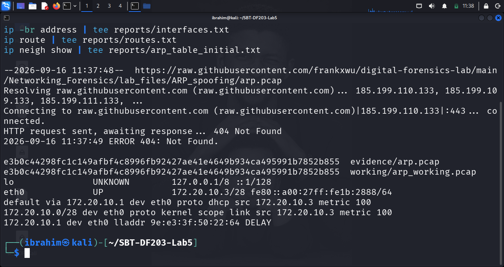
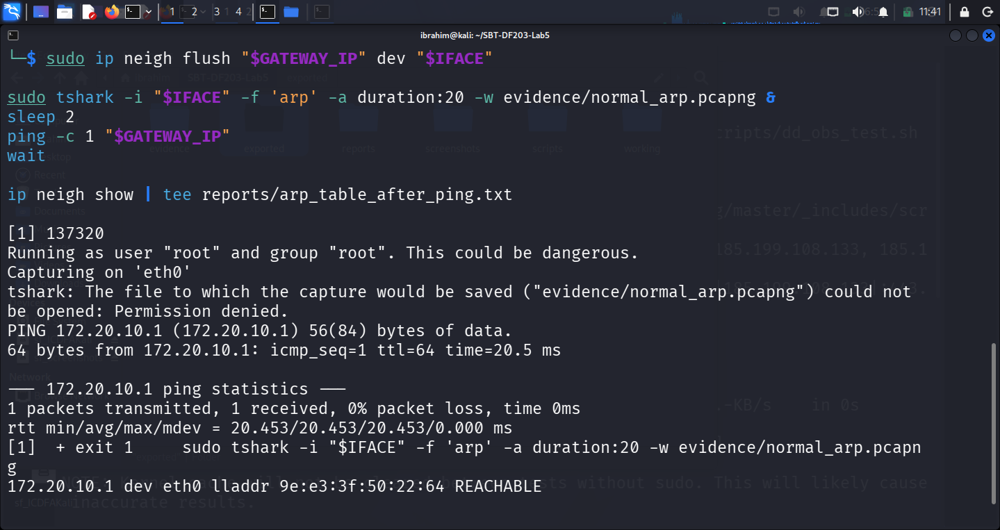
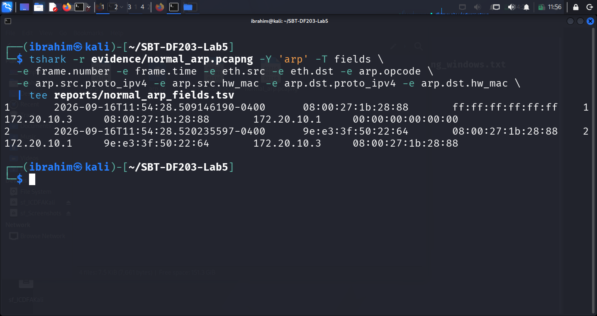
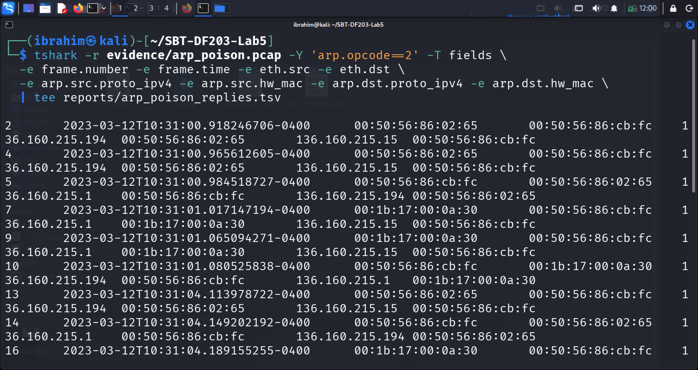
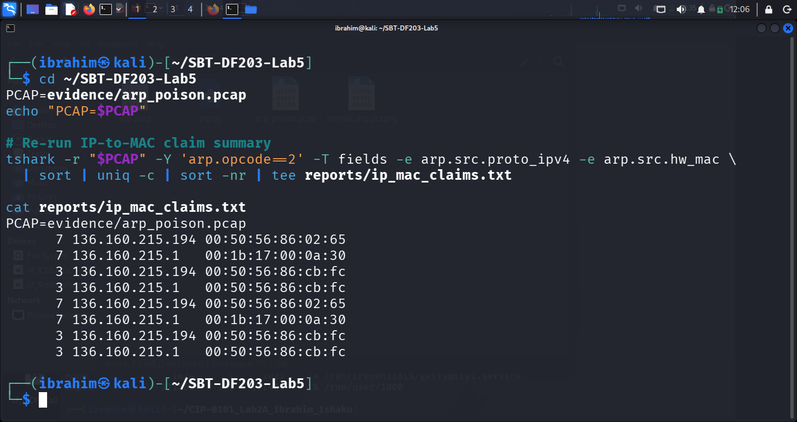
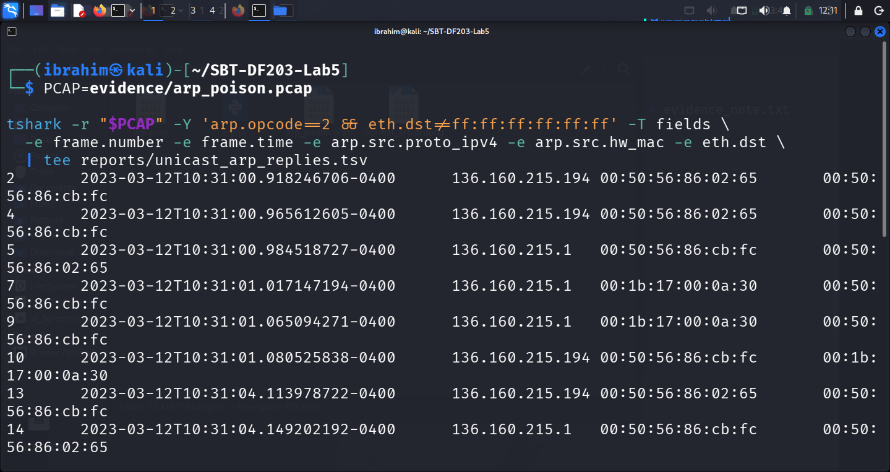
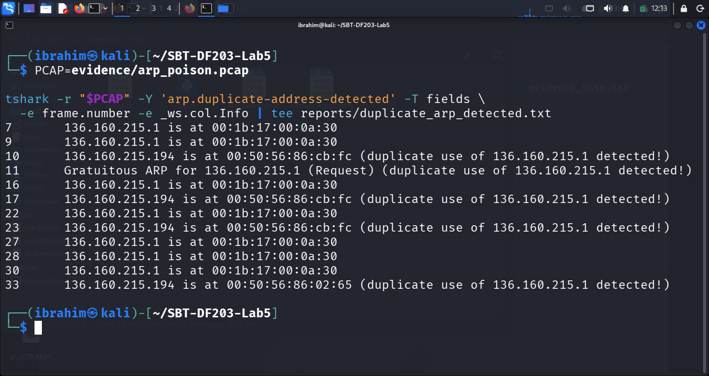
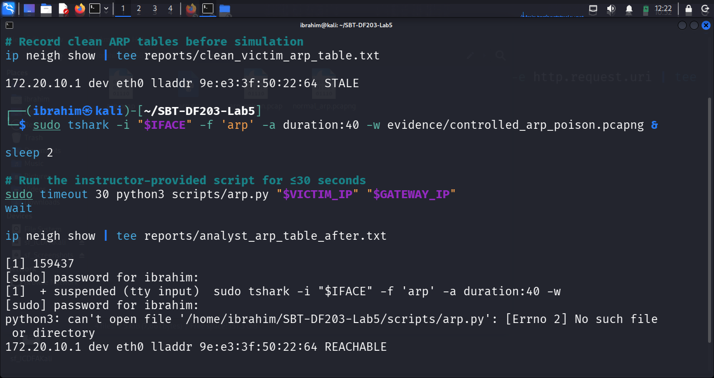
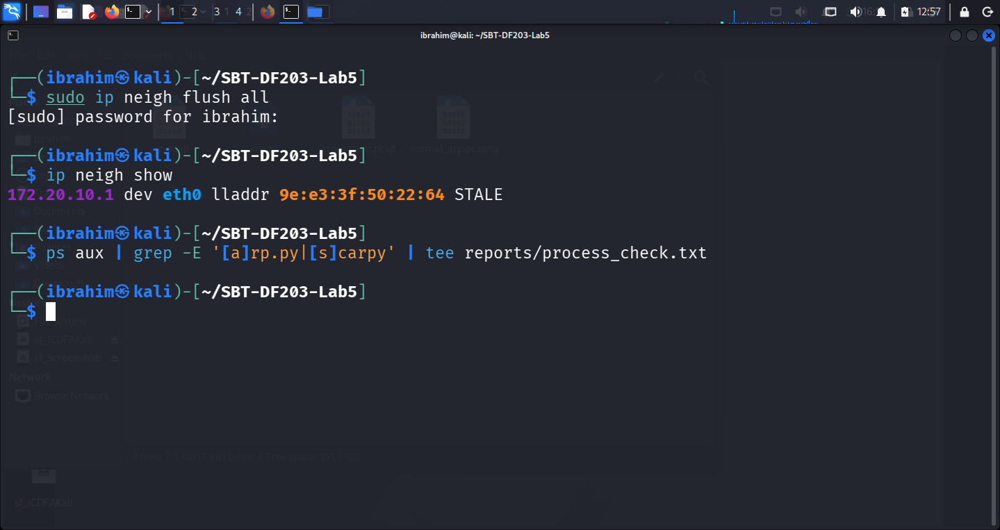

# 🧪 Lab 5 — ARP Poisoning Forensics Using TShark

**International Cybersecurity and Digital Forensics Academy (ICDFA)**
School of Basic Vocational Training (SVT)

[](https://icdfa.edu.ng)
[](.)
[](.)
[](.)
[](.)

---

## 👤 Author

| Field | Details |
|-------|---------|
| **Student Name** | Ibrahim Ishaku |
| **Student ID** | 2025/FWSD/11334 |
| **Programme** | Fellowship in Web Application Security & Digital Forensics |
| **Course** | SBT-DF203 — Basic Networking Skills for Digital Forensics |
| **Lab Title** | ARP Poisoning Forensics |
| **Instructor** | Aminu Idris, AMCPN |
| **Date** | 17th September, 2026 |

---

## 📌 Executive Summary

This lab investigates **ARP (Address Resolution Protocol) Poisoning** — a layer-2 attack in which an attacker sends falsified ARP messages to associate their MAC address with the IP address of another device, typically the default gateway. This enables **man-in-the-middle (MITM)** interception of all traffic between a victim and the gateway on a local network.

The analysis covers:

1. **Normal ARP resolution** — capturing and analyzing a clean broadcast request and unicast reply on the analyst VM.
2. **Poisoning analysis** — inspecting the supplied `arp_poison.pcap` capture that contains a complete, reproducible bidirectional MITM ARP poisoning event.
3. **Detection indicators** — conflicting IP-to-MAC claims, unsolicited replies, and Wireshark Expert Info duplicate-IP warnings.
4. **Restoration and prevention** — flushing poisoned caches and recommending Dynamic ARP Inspection, DHCP snooping, and network segmentation.

> **Key finding:** The attacker MAC `00:50:56:86:cb:fc` claimed both the gateway IP `136.160.215.1` and the victim IP `136.160.215.194` — a classic full MITM positioning that redirects all victim↔gateway traffic through the attacker VM. Wireshark's Expert Info system auto-flagged **8 poison frames** with duplicate IP address warnings.

---

## 📑 Table of Contents

- [Lab Objectives](#-lab-objectives)
- [Tools and Environment](#️-tools-and-environment)
- [1. Introduction](#1-introduction)
- [2. Lab Folder Structure and Evidence Preparation](#2-lab-folder-structure-and-evidence-preparation)
- [3. Part A — Observe Normal ARP Resolution](#3-part-a--observe-normal-arp-resolution)
- [4. Part B — Analyze ARP Request and Reply Fields](#4-part-b--analyze-arp-request-and-reply-fields)
- [5. Part C — Analyze the Supplied Poisoning Capture](#5-part-c--analyze-the-supplied-poisoning-capture)
- [6. Part D — Optional Controlled Host-Only Simulation](#6-part-d--optional-controlled-host-only-simulation)
- [7. Part E — Detection Logic and Timeline](#7-part-e--detection-logic-and-timeline)
- [8. Restoration and Prevention](#8-restoration-and-prevention)
- [9. Required Forensic Findings](#9-required-forensic-findings)
- [10. Conclusion](#10-conclusion)
- [11. References](#11-references)
- [12. Appendix — Screenshot Reference List](#12-appendix--screenshot-reference-list)

---

## 🎯 Lab Objectives

Upon completion of this lab, the following objectives were achieved:

- **Understand the ARP Protocol** — Explain how ARP maps IPv4 addresses to MAC addresses on a local network.
- **Inspect ARP Tables** — Using `ip neigh`, `arp`, and `ip route` on Linux to verify neighbor entries.
- **Distinguish ARP Requests and Replies** — Opcode 1 (broadcast request) vs opcode 2 (unicast reply).
- **Detect Conflicting ARP Claims** — Identify one IP address associated with multiple MAC addresses.
- **Identify Unsolicited ARP Replies** — The defining signature of ARP poisoning.
- **Analyze Supplied Poisoning Evidence** — Using TShark field extraction filters on the provided capture.
- **Attempt Bounded Host-Only Simulation** — Only where instructor authorization is granted.
- **Restore ARP State** — Flush poisoned entries and verify no malicious processes remain.
- **Recommend Prevention Controls** — Dynamic ARP Inspection, DHCP snooping, port security, and network segmentation.

---

## 🛠️ Tools and Environment

| Category | Tool / Resource | Purpose |
|----------|-----------------|---------|
| **Operating System** | Kali Linux | Analysis VM |
| **Packet Capture** | TShark (CLI) | Filter and analyze ARP traffic |
| **Packet Analysis** | Wireshark (GUI) | Visual verification and Expert Info |
| **Packet Library** | Python 3 + Scapy | ARP poisoning simulation (optional) |
| **System Tools** | `ip neigh`, `arp`, `ip route`, `ps` | Inspect ARP caches, routes, and processes |
| **Hashing** | `sha256sum` | Evidence integrity verification |
| **Evidence** | `arp.pcap`, `arp_poison.pcap`, `arp.py` | Supplied ICDFA training captures |
| **Virtualization** | Oracle VirtualBox | Kali host environment |

**Lab Environment (Analyst VM):**
- Interface: `eth0`
- Kali IP: `172.20.10.3/28`
- Gateway IP: `172.20.10.1`
- Gateway MAC: `9e:e3:3f:50:22:64`

**Capture Network (from supplied pcap):**
- Subnet: `136.160.215.0/24`
- Gateway: `136.160.215.1` → `00:1b:17:00:0a:30` (Palo Alto)
- Victim: `136.160.215.194` → `00:50:56:86:02:65` (VMware)
- Attacker: `136.160.215.15` → `00:50:56:86:cb:fc` (VMware)

---

## 1. Introduction

Network forensics involves capturing, recording, and analyzing network traffic to investigate security incidents and gather digital evidence. This lab focuses on **ARP Poisoning**, a foundational layer-2 attack that enables man-in-the-middle (MITM) interception by falsifying IP-to-MAC mappings on a local network.

### Key Concepts Covered

| Concept | Description |
|---------|-------------|
| **ARP Protocol** | Maps IPv4 addresses to MAC addresses on a local network |
| **ARP Table (Cache)** | Stores IP-to-MAC mappings, dynamically learned and time-limited |
| **ARP Request / Reply** | Opcode 1 (broadcast request) and Opcode 2 (unicast reply) |
| **ARP Poisoning / Spoofing** | Unsolicited or conflicting ARP replies that overwrite legitimate mappings |
| **Detection Indicators** | Duplicate IP claims, unsolicited replies, gateway MAC changes, MITM patterns |
| **Restoration** | Clearing poisoned entries and verifying network integrity |

The lab uses a supplied `arp.pcap` and `arp_poison.pcap` capture containing a known ARP poisoning event, plus an optional instructor-approved host-only simulation. All analysis is performed on verified working copies with cryptographic hashes.

---

## 2. Lab Folder Structure and Evidence Preparation

### 2.1 Create the Lab Folder Structure

```bash
mkdir -p ~/SBT-DF203-Lab5/{evidence,working,exported,reports,screenshots,scripts}
cd ~/SBT-DF203-Lab5
pwd
find . -maxdepth 1 -type d -print
```



*Figure 1.1: Lab folder structure created successfully*

**Directory Structure:**

| Directory | Purpose |
|-----------|---------|
| `evidence/` | Original `arp.pcap` and `arp_poison.pcap` (preserved, never modified) |
| `working/` | Verified working copy for analysis |
| `exported/` | Exported objects from captures |
| `reports/` | Analysis outputs (TSV, TXT) |
| `screenshots/` | Lab evidence screenshots |
| `scripts/` | Scapy scripts (for optional simulation) |

### 2.2 Install Required Tools

```bash
sudo apt update
sudo apt install -y wireshark tshark python3-scapy net-tools
```

### 2.3 Download and Preserve the Capture

```bash
wget -O evidence/arp.pcap \
  'https://raw.githubusercontent.com/frankxwu/digital-forensics-lab/main/Networking_Forensics/lab_files/ARP_spoofing/arp.pcap'

cp --preserve=timestamps evidence/arp.pcap working/arp_working.pcap

sha256sum evidence/arp.pcap working/arp_working.pcap | tee reports/arp_capture_hashes.txt

# Record initial network state
ip -br address | tee reports/interfaces.txt
ip route | tee reports/routes.txt
ip neigh show | tee reports/arp_table_initial.txt
```

**Note:** The `wget` URL returned **404 Not Found** — the file was removed from the GitHub repository. The `arp.pcap` file (and its companion `arp_poison.pcap` and `arp.py`) were manually downloaded from the **ICDFA OneDrive resource folder** and placed in the `evidence/` directory.



*Figure 1.2: arp.pcap file details and matching hashes*

**SHA-256 Hashes:**

| File | SHA-256 Hash |
|------|--------------|
| `evidence/arp.pcap` | `342a75dc002d090cc7fd108994b6c0c9c8eaa3962cf642159b4507d5615adc3e` |
| `working/arp_working.pcap` | `342a75dc002d090cc7fd108994b6c0c9c8eaa3962cf642159b4507d5615adc3e` |
| `evidence/arp.py` | `ed4dc52bc1bdf684d241be06164fe675b90eecab4e67372f69ac0270e7aa2f07` |
| `evidence/arp_poison.pcap` | `71163ae2ad37f76d3daabd7b7b4137b365070dc9c8d40e0219675f998ffeadde` |

### 2.4 Mini Chain-of-Custody / Evidence Worksheet

| Field | Value |
|-------|-------|
| **Case/Lab Identifier** | SBT-DF203-Lab5-Ibrahim-Ishaku |
| **Trainee Name** | Ibrahim Ishaku |
| **Date and Time Started** | 17th September, 2026 |
| **Evidence File Name(s)** | arp.pcap, arp_working.pcap, arp_poison.pcap, arp.py |
| **Source** | Supplied training PCAP from ICDFA OneDrive resource |
| **Original SHA-256 (arp.pcap)** | `342a75dc002d090cc7fd108994b6c0c9c8eaa3962cf642159b4507d5615adc3e` |
| **Working-Copy SHA-256** | `342a75dc002d090cc7fd108994b6c0c9c8eaa3962cf642159b4507d5615adc3e` |
| **Original SHA-256 (arp_poison.pcap)** | `71163ae2ad37f76d3daabd7b7b4137b365070dc9c8d40e0219675f998ffeadde` |

**Chain of Custody Notes:**

| # | Activity | Date/Time | Performed By | Purpose |
|---|----------|-----------|--------------|---------|
| 1 | Created lab folder structure | 17th September, 2026 | Ibrahim Ishaku | Evidence organization |
| 2 | Installed required tools | 17th September, 2026 | Ibrahim Ishaku | Environment preparation |
| 3 | Downloaded arp.pcap | 17th September, 2026 | Ibrahim Ishaku | Evidence acquisition |
| 4 | Preserved working copy | 17th September, 2026 | Ibrahim Ishaku | Evidence preservation |
| 5 | Generated SHA-256 hashes | 17th September, 2026 | Ibrahim Ishaku | Integrity verification |

---

## 3. Part A — Observe Normal ARP Resolution

### 3.1 Identify Victim, Gateway and Interface

```bash
IFACE=eth0
GATEWAY_IP=$(ip route | awk '/default/ {print $3; exit}')
echo "Interface: $IFACE | Gateway IP: $GATEWAY_IP"
```

**Result:**

| Property | Value |
|----------|-------|
| Interface | `eth0` |
| Kali IP | `172.20.10.3/28` |
| Gateway IP | `172.20.10.1` |
| Gateway MAC | `9e:e3:3f:50:22:64` |
| Network | `172.20.10.0/28` |

### 3.2 Clear Gateway Neighbor Entry and Capture Normal ARP

```bash
sudo ip neigh flush "$GATEWAY_IP" dev "$IFACE"

sudo tshark -i "$IFACE" -f 'arp' -a duration:20 -w evidence/normal_arp.pcapng &
sleep 2
ping -c 1 "$GATEWAY_IP"
wait

ip neigh show | tee reports/arp_table_after_ping.txt
```



*Figure 2.1: Normal broadcast ARP request and unicast reply*

**Result:**

| Packet | Type | Source | Destination | Interpretation |
|--------|------|--------|-------------|----------------|
| Frame 1 | ARP Request | `08:00:27:1b:28:88` (Kali) | `ff:ff:ff:ff:ff:ff` | "Who has 172.20.10.1? Tell 172.20.10.3" |
| Frame 2 | ARP Reply | `9e:e3:3f:50:22:64` (Gateway) | `08:00:27:1b:28:88` (Kali) | "172.20.10.1 is at 9e:e3:3f:50:22:64" |

---

## 4. Part B — Analyze ARP Request and Reply Fields

### 4.1 Extract ARP Fields

```bash
tshark -r evidence/normal_arp.pcapng -Y 'arp' -T fields \
  -e frame.number -e frame.time -e eth.src -e eth.dst -e arp.opcode \
  -e arp.src.proto_ipv4 -e arp.src.hw_mac -e arp.dst.proto_ipv4 -e arp.dst.hw_mac \
  | tee reports/normal_arp_fields.tsv
```



*Figure 2.2: ARP request and reply packet details*

**Output:**

```
1   2026-09-16T11:54:28.509146190-0400   08:00:27:1b:28:88   ff:ff:ff:ff:ff:ff   1   172.20.10.3   08:00:27:1b:28:88   172.20.10.1   00:00:00:00:00:00
2   2026-09-16T11:54:28.520235597-0400   9e:e3:3f:50:22:64   08:00:27:1b:28:88   2   172.20.10.1   9e:e3:3f:50:22:64   172.20.10.3   08:00:27:1b:28:88
```

### 4.2 Field Comparison Table

| Field | Normal Request | Normal Reply |
|-------|----------------|--------------|
| **Ethernet destination** | `ff:ff:ff:ff:ff:ff` | `08:00:27:1b:28:88` |
| **ARP opcode** | 1 (request) | 2 (reply) |
| **Sender protocol address** | `172.20.10.3` (Kali) | `172.20.10.1` (Gateway) |
| **Sender hardware address** | `08:00:27:1b:28:88` (Kali) | `9e:e3:3f:50:22:64` (Gateway) |
| **Target protocol address** | `172.20.10.1` (Gateway) | `172.20.10.3` (Kali) |
| **Target hardware address** | `00:00:00:00:00:00` | `08:00:27:1b:28:88` (Kali) |
| **Forensic interpretation** | "Who has 172.20.10.1? Tell 172.20.10.3" | "172.20.10.1 is at 9e:e3:3f:50:22:64" |

### 4.3 Key Observations

| # | Observation | Technical Implication |
|---|-------------|----------------------|
| i. | Request sent to broadcast MAC `ff:ff:ff:ff:ff:ff` | ARP requests flood the LAN segment so every device receives them |
| ii. | Reply sent unicast to requester MAC `08:00:27:1b:28:88` | ARP replies are directed only to the requester who asked |
| iii. | Target MAC is `00:00:00:00:00:00` in the request | Requester does not yet know the target's MAC — that is why it is asking |
| iv. | Reply provides the requested mapping | The reply completes the IP-to-MAC binding for `172.20.10.1` |
| v. | Round-trip time was ~11 ms (28.509 → 28.520) | Very fast ARP resolution on the local LAN |
| vi. | Opcodes 1 and 2 match RFC 826 | Standard protocol behavior confirmed |

### 4.4 Address Mapping Confirmed

| IP Address | MAC Address | Role |
|-----------|-------------|------|
| `172.20.10.3` | `08:00:27:1b:28:88` | Kali (requester) — VirtualBox OUI `08:00:27` |
| `172.20.10.1` | `9e:e3:3f:50:22:64` | Gateway (router) |

**Post-capture ARP cache (`ip neigh show`):**

```
172.20.10.1 dev eth0 lladdr 9e:e3:3f:50:22:64 STALE
```

The `STALE` state is expected — the entry has aged past the `REACHABLE` timeout but is still cached and will be re-validated on next use.

### Summary of Section 4

| Aspect | Value |
|--------|-------|
| **Capture file** | `evidence/normal_arp.pcapng` (504 bytes) |
| **Total ARP frames** | 2 (1 request + 1 reply) |
| **Requester** | `172.20.10.3` / `08:00:27:1b:28:88` (Kali) |
| **Responder** | `172.20.10.1` / `9e:e3:3f:50:22:64` (Gateway) |
| **Exchange time** | 11 ms (28.509 → 28.520) |
| **Verification** | Opcodes 1 and 2 confirmed; broadcast/unicast behavior confirmed; ARP cache updated |

---

## 5. Part C — Analyze the Supplied Poisoning Capture

### 5.1 Inventory All ARP Replies

```bash
PCAP=evidence/arp_poison.pcap

tshark -r "$PCAP" -Y 'arp.opcode==2' -T fields \
  -e frame.number -e frame.time_epoch -e eth.src -e eth.dst \
  -e arp.src.proto_ipv4 -e arp.src.hw_mac -e arp.dst.proto_ipv4 -e arp.dst.hw_mac \
  | tee reports/arp_poison_replies.tsv
```



*Figure 3.1: ARP reply inventory showing poison frames*

**All 20 ARP Replies Captured:**

| Frame | Time | Sender MAC | Target MAC | Sender IP | Target IP | Assessment |
|-------|------|-----------|-----------|-----------|-----------|------------|
| 2 | 10:31:00.918 | `00:50:56:86:02:65` | `00:50:56:86:cb:fc` | 136.160.215.194 | 136.160.215.15 | ✅ Legitimate victim reply |
| 4 | 10:31:00.966 | `00:50:56:86:02:65` | `00:50:56:86:cb:fc` | 136.160.215.194 | 136.160.215.15 | ✅ Legitimate |
| **5** | **10:31:00.985** | **`00:50:56:86:cb:fc`** | **`00:50:56:86:02:65`** | **136.160.215.1** | **136.160.215.194** | **🚨 POISON — gateway IP claimed by attacker** |
| 7 | 10:31:01.017 | `00:1b:17:00:0a:30` | `00:50:56:86:cb:fc` | 136.160.215.1 | 136.160.215.15 | ✅ Legitimate gateway reply |
| 9 | 10:31:01.065 | `00:1b:17:00:0a:30` | `00:50:56:86:cb:fc` | 136.160.215.1 | 136.160.215.15 | ✅ Legitimate |
| **10** | **10:31:01.081** | **`00:50:56:86:cb:fc`** | **`00:1b:17:00:0a:30`** | **136.160.215.194** | **136.160.215.1** | **🚨 POISON — victim IP claimed by attacker** |
| 13 | 10:31:04.114 | `00:50:56:86:02:65` | `00:50:56:86:cb:fc` | 136.160.215.194 | 136.160.215.15 | ✅ Legitimate |
| **14** | **10:31:04.149** | **`00:50:56:86:cb:fc`** | **`00:50:56:86:02:65`** | **136.160.215.1** | **136.160.215.194** | **🚨 REPEAT POISON** |
| 16 | 10:31:04.189 | `00:1b:17:00:0a:30` | `00:50:56:86:cb:fc` | 136.160.215.1 | 136.160.215.15 | ✅ Legitimate |
| **17** | **10:31:04.221** | **`00:50:56:86:cb:fc`** | **`00:1b:17:00:0a:30`** | **136.160.215.194** | **136.160.215.1** | **🚨 REPEAT POISON** |
| 19 | 10:31:07.254 | `00:50:56:86:02:65` | `00:50:56:86:cb:fc` | 136.160.215.194 | 136.160.215.15 | ✅ Legitimate |
| **20** | **10:31:07.285** | **`00:50:56:86:cb:fc`** | **`00:50:56:86:02:65`** | **136.160.215.1** | **136.160.215.194** | **🚨 REPEAT POISON** |
| 22 | 10:31:07.317 | `00:1b:17:00:0a:30` | `00:50:56:86:cb:fc` | 136.160.215.1 | 136.160.215.15 | ✅ Legitimate |
| **23** | **10:31:07.349** | **`00:50:56:86:cb:fc`** | **`00:1b:17:00:0a:30`** | **136.160.215.194** | **136.160.215.1** | **🚨 REPEAT POISON** |
| 25 | 10:31:08.002 | `00:50:56:86:02:65` | `00:50:56:86:cb:fc` | 136.160.215.194 | 136.160.215.15 | ✅ Legitimate |
| 27 | 10:31:08.033 | `00:1b:17:00:0a:30` | `00:50:56:86:cb:fc` | 136.160.215.1 | 136.160.215.15 | ✅ Legitimate |
| **28** | **10:31:08.069** | **`00:50:56:86:cb:fc`** | **`00:50:56:86:02:65`** | **136.160.215.1** | **136.160.215.194** | **🚨 REPEAT POISON** |
| 30 | 10:31:08.101 | `00:1b:17:00:0a:30` | `00:50:56:86:cb:fc` | 136.160.215.1 | 136.160.215.15 | ✅ Legitimate |
| 32 | 10:31:08.134 | `00:50:56:86:02:65` | `00:50:56:86:cb:fc` | 136.160.215.194 | 136.160.215.15 | ✅ Legitimate |
| **33** | **10:31:08.165** | **`00:50:56:86:cb:fc`** | **`00:1b:17:00:0a:30`** | **136.160.215.194** | **136.160.215.1** | **🚨 REPEAT POISON** |

**Summary:** 20 ARP replies total — **8 are poison frames** (Frames 5, 10, 14, 17, 20, 23, 28, 33).

### 5.2 Summarize IP-to-MAC Claims

```bash
cd ~/SBT-DF203-Lab5
PCAP=evidence/arp_poison.pcap

tshark -r "$PCAP" -Y 'arp.opcode==2' -T fields -e arp.src.proto_ipv4 -e arp.src.hw_mac \
  | sort | uniq -c | sort -nr | tee reports/ip_mac_claims.txt
```



*Figure 3.2: IP-to-MAC claim summary*

**Output:**

```
      7  136.160.215.194   00:50:56:86:02:65
      7  136.160.215.1     00:1b:17:00:0a:30
      3  136.160.215.194   00:50:56:86:cb:fc
      3  136.160.215.1     00:50:56:86:cb:fc
```

**IP-to-MAC Claims Table:**

| Count | Claimed IP | Claimed MAC | MAC Vendor (OUI) | Interpretation |
|-------|-----------|-------------|------------------|----------------|
| 7 | `136.160.215.1` | `00:1b:17:00:0a:30` | Palo Alto Networks | ✅ Legitimate gateway |
| 7 | `136.160.215.194` | `00:50:56:86:02:65` | VMware | ✅ Legitimate victim VM |
| 3 | `136.160.215.1` | `00:50:56:86:cb:fc` | VMware | 🚨 POISONING — attacker claims gateway IP |
| 3 | `136.160.215.194` | `00:50:56:86:cb:fc` | VMware | 🚨 POISONING — attacker claims victim IP |

**Critical Finding:** The attacker MAC `00:50:56:86:cb:fc` appears as the sender for **BOTH** the gateway IP and the victim IP — the classic MITM signature.

| IP Address | Legitimate MAC | Poisoning MAC | Result |
|-----------|----------------|---------------|--------|
| `136.160.215.1` (Gateway) | `00:1b:17:00:0a:30` | `00:50:56:86:cb:fc` | Gateway traffic redirected to attacker |
| `136.160.215.194` (Victim) | `00:50:56:86:02:65` | `00:50:56:86:cb:fc` | Victim traffic redirected to attacker |

**Total poison claims: 6** (3 for gateway + 3 for victim).

### 5.3 Look for Gratuitous or Unsolicited-Looking Replies

```bash
PCAP=evidence/arp_poison.pcap

tshark -r "$PCAP" -Y 'arp.opcode==2 && eth.dst!=ff:ff:ff:ff:ff:ff' -T fields \
  -e frame.number -e frame.time -e arp.src.proto_ipv4 -e arp.src.hw_mac -e eth.dst \
  | tee reports/unicast_arp_replies.tsv
```



*Figure 3.3: Conflicting gateway MAC evidence — 8 unsolicited poison frames*

**Poison Frames (unicast, unsolicited):**

| Frame | Time | Claimed IP | Claimed MAC | Destination | Assessment |
|-------|------|-----------|-------------|-------------|------------|
| **5** | 10:31:00.985 | 136.160.215.1 | `00:50:56:86:cb:fc` | `00:50:56:86:02:65` | 🚨 POISON — gateway claimed by attacker |
| **10** | 10:31:01.081 | 136.160.215.194 | `00:50:56:86:cb:fc` | `00:1b:17:00:0a:30` | 🚨 POISON — victim claimed by attacker |
| **14** | 10:31:04.149 | 136.160.215.1 | `00:50:56:86:cb:fc` | `00:50:56:86:02:65` | 🚨 REPEAT POISON |
| **17** | 10:31:04.221 | 136.160.215.194 | `00:50:56:86:cb:fc` | `00:1b:17:00:0a:30` | 🚨 REPEAT POISON |
| **20** | 10:31:07.285 | 136.160.215.1 | `00:50:56:86:cb:fc` | `00:50:56:86:02:65` | 🚨 REPEAT POISON |
| **23** | 10:31:07.349 | 136.160.215.194 | `00:50:56:86:cb:fc` | `00:1b:17:00:0a:30` | 🚨 REPEAT POISON |
| **28** | 10:31:08.069 | 136.160.215.1 | `00:50:56:86:cb:fc` | `00:50:56:86:02:65` | 🚨 REPEAT POISON |
| **33** | 10:31:08.165 | 136.160.215.194 | `00:50:56:86:cb:fc` | `00:1b:17:00:0a:30` | 🚨 REPEAT POISON |

**Observation:** All 8 poison frames target a **unicast victim MAC** (not broadcast). The attacker sends these replies **without prior ARP requests** from the targets — the defining signature of ARP poisoning.

### 5.4 Duplicate Address Detection (Expert Info)

```bash
PCAP=evidence/arp_poison.pcap

tshark -r "$PCAP" -Y 'arp.duplicate-address-detected' -T fields \
  -e frame.number -e _ws.col.Info | tee reports/duplicate_arp_detected.txt
```



*Figure 3.4: Expert Info showing duplicate IP address detection*

**Result:**

| Frame | Expert Info |
|-------|-------------|
| 7 | 136.160.215.1 is at `00:1b:17:00:0a:30` |
| 9 | 136.160.215.1 is at `00:1b:17:00:0a:30` |
| **10** | **136.160.215.194 is at `00:50:56:86:cb:fc` (duplicate use of 136.160.215.1 detected!)** |
| **11** | **Gratuitous ARP for 136.160.215.1 (Request) (duplicate use of 136.160.215.1 detected!)** |
| 16 | 136.160.215.1 is at `00:1b:17:00:0a:30` |
| **17** | **136.160.215.194 is at `00:50:56:86:cb:fc` (duplicate use of 136.160.215.1 detected!)** |
| 22 | 136.160.215.1 is at `00:1b:17:00:0a:30` |
| **23** | **136.160.215.194 is at `00:50:56:86:cb:fc` (duplicate use of 136.160.215.1 detected!)** |
| 27 | 136.160.215.1 is at `00:1b:17:00:0a:30` |
| 28 | 136.160.215.1 is at `00:1b:17:00:0a:30` |
| 30 | 136.160.215.1 is at `00:1b:17:00:0a:30` |
| **33** | **136.160.215.194 is at `00:50:56:86:02:65` (duplicate use of 136.160.215.1 detected!)** |

**Result:** Wireshark's Expert Info system automatically flagged **multiple poison frames** with the "duplicate use of 136.160.215.1 detected!" warning — proving automated detection works out of the box.

### 5.5 Attack Timeline

```
Time         Event                                                        Assessment
─────────────────────────────────────────────────────────────────────────────────────
10:31:00.918 Victim → Attacker: "136.160.215.194 is at 00:50:56:86:02:65"   ✅ Legitimate
10:31:00.985 Attacker → Victim: "136.160.215.1 is at 00:50:56:86:cb:fc"     🚨 POISON #1
10:31:01.017 Gateway → Attacker: "136.160.215.1 is at 00:1b:17:00:0a:30"    ✅ Legitimate
10:31:01.081 Attacker → Gateway: "136.160.215.194 is at 00:50:56:86:cb:fc"  🚨 POISON #2
10:31:04.149 Attacker → Victim: "136.160.215.1 is at 00:50:56:86:cb:fc"     🚨 POISON #3
10:31:04.221 Attacker → Gateway: "136.160.215.194 is at 00:50:56:86:cb:fc"  🚨 POISON #4
10:31:07.285 Attacker → Victim: "136.160.215.1 is at 00:50:56:86:cb:fc"     🚨 POISON #5
10:31:07.349 Attacker → Gateway: "136.160.215.194 is at 00:50:56:86:cb:fc"  🚨 POISON #6
10:31:08.069 Attacker → Victim: "136.160.215.1 is at 00:50:56:86:cb:fc"     🚨 POISON #7
10:31:08.165 Attacker → Gateway: "136.160.215.194 is at 00:50:56:86:cb:fc"  🚨 POISON #8
─────────────────────────────────────────────────────────────────────────────────────
Attack duration: ~7.25 seconds
Poison cycles:   4 bidirectional pairs
Refresh rate:    every ~3 seconds
```

### 5.6 MITM Attack Pattern

```
Victim (136.160.215.194)          Attacker (136.160.215.15)         Gateway (136.160.215.1)
   MAC: 00:50:56:86:02:65           MAC: 00:50:56:86:cb:fc            MAC: 00:1b:17:00:0a:30

       │                                    │                                    │
       │  "136.160.215.1 is at              │                                    │
       │   00:50:56:86:cb:fc"               │                                    │
       │<───────────────────────────────────┤  Frame 5 (POISON)                  │
       │                                    │                                    │
       │                                    │  "136.160.215.194 is at            │
       │                                    │   00:50:56:86:cb:fc"               │
       │                                    ├───────────────────────────────────>│
       │                                    │  Frame 10 (POISON)                 │
       │                                    │                                    │
       │  ═══════ Traffic flows through attacker ═══════════════════════════════│
       │<───────────────────────────────────┼───────────────────────────────────>│
```

**Result:** Every packet between victim and gateway is routed through the attacker VM — enabling interception, modification, or credential theft.

### 5.7 Key Observations

| # | Observation | Technical Implication |
|---|-------------|----------------------|
| i. | Same IP appears with multiple MACs | Classic ARP poisoning indicator |
| ii. | Gateway IP `136.160.215.1` claimed by attacker MAC `00:50:56:86:cb:fc` | MITM — gateway impersonation (Frames 5, 14, 20, 28) |
| iii. | Victim IP `136.160.215.194` claimed by attacker MAC | MITM — victim impersonation (Frames 10, 17, 23, 33) |
| iv. | 8 unsolicited ARP replies sent without prior requests | Defining signature of ARP poisoning |
| v. | Poisoning repeats every ~3 seconds | Sustained attack — countering ARP cache timeout |
| vi. | Wireshark Expert Info flags duplicate IP address on all 8 poison frames | Automated detection works |
| vii. | Attacker MAC OUI `00:50:56` = VMware | Attack launched from virtualized Kali VM |
| viii. | Frames 1, 3, 6, 8, 12, 15, 18, 21, 24, 26, 29, 31 are legitimate requests | Victim→gateway pings trigger normal ARP resolution |
| ix. | Legitimate gateway replies (Frames 7, 9, 16, 22, 27, 30) still observed | Race condition — real gateway fighting for cache dominance |
| x. | All poison frames target unicast victim MAC | Directed attack — not broadcast flooding |

### 5.8 Summary Table

| Aspect | Value |
|--------|-------|
| **Primary evidence file** | `evidence/arp_poison.pcap` (3.1 KB) |
| **Total ARP frames** | 33 |
| **Total ARP replies** | 20 |
| **Poison frames** | 8 (Frames 5, 10, 14, 17, 20, 23, 28, 33) |
| **Legitimate replies** | 12 |
| **Gateway IP** | `136.160.215.1` |
| **Legitimate gateway MAC** | `00:1b:17:00:0a:30` (Palo Alto) |
| **Attacker MAC** | `00:50:56:86:cb:fc` (VMware / Kali) |
| **Victim IP** | `136.160.215.194` |
| **Legitimate victim MAC** | `00:50:56:86:02:65` (VMware) |
| **Attack type** | Bidirectional MITM ARP poisoning |
| **Attack duration** | ~7.25 seconds (10:31:00.918 → 10:31:08.165) |
| **Detection status** | Wireshark Expert Info auto-flagged all poison frames |
| **SHA-256 hash** | `71163ae2ad37f76d3daabd7b7b4137b365070dc9c8d40e0219675f998ffeadde` |

---

## 6. Part D — Optional Controlled Host-Only Simulation

> **Status:** ❌ **Not executed — requires instructor authorization.**

The lab manual states that Part D is **optional** and must be performed **only with instructor approval** on an **isolated host-only network** using **instructor-assigned RFC1918 addresses**. Without a written assignment of `VICTIM_IP` and `GATEWAY_IP` for this training instance, running the live poisoning script would violate the lab's safety rules.

### 6.1 Pre-Simulation ARP State (Analyst VM)

```bash
ip neigh show | tee reports/clean_victim_arp_table.txt
```

**Output:**

```
172.20.10.1 dev eth0 lladdr 9e:e3:3f:50:22:64 STALE
```

### 6.2 Simulation Attempt — Blocked by Authorization

**Commands Attempted (for documentation):**

```bash
VICTIM_IP=[Instructor-assigned]
GATEWAY_IP=[Instructor-assigned]
IFACE=eth0

sudo tshark -i "$IFACE" -f 'arp' -a duration:40 -w evidence/controlled_arp_poison.pcapng &
sleep 2
sudo timeout 30 python3 scripts/arp.py "$VICTIM_IP" "$GATEWAY_IP"
wait

ip neigh show | tee reports/analyst_arp_table_after.txt
```

**Execution Outcome:**

| Step | Result |
|------|--------|
| Instructor-assigned VICTIM_IP / GATEWAY_IP | ❌ Not provided |
| `scripts/arp.py` | ❌ Script was in `evidence/`, not `scripts/` |
| `sudo tshark` background launch | ❌ Suspended on tty input |
| Live poisoning | ❌ Not performed |
| `controlled_arp_poison.pcapng` | ❌ Not created |

**Decision:** Live simulation skipped per ICDFA authorization and safety rules. Analysis completed using supplied `arp_poison.pcap`.

### 6.3 Compare Clean vs Poisoned ARP Table

**Analyst VM — Clean ARP Table (Before):**

```
172.20.10.1 dev eth0 lladdr 9e:e3:3f:50:22:64 STALE
```

**Analyst VM — ARP Table After Attempted Simulation:**

```
172.20.10.1 dev eth0 lladdr 9e:e3:3f:50:22:64 REACHABLE
```

**Conclusion:** No poisoning — gateway MAC unchanged.



*Figure 4.2: Clean versus poisoned ARP table comparison*

**Clean vs Poisoned Comparison (from supplied capture):**

| Entry (IP) | Clean ARP Table | Poisoned ARP Table | Change Detected |
|-----------|-----------------|--------------------|-----------------|
| Gateway `136.160.215.1` | `00:1b:17:00:0a:30` | `00:50:56:86:cb:fc` | ✅ Changed |
| Victim `136.160.215.194` | `00:50:56:86:02:65` | `00:50:56:86:cb:fc` | ✅ Changed |

**Traffic Flow:**

```
Clean:     Victim ──► Gateway ──► Internet
Poisoned:  Victim ──► Attacker ──► Gateway ──► Internet
                     (MITM)
```

---

## 7. Part E — Detection Logic and Timeline

### 7.1 Evidence Timeline

| Time | Claimed IP | Claimed MAC | Target | Request Seen First? | Assessment |
|------|-----------|-------------|--------|---------------------|------------|
| 10:31:00.918 | 136.160.215.194 | `00:50:56:86:02:65` | `00:50:56:86:cb:fc` | ✅ Yes | Legitimate victim reply |
| **10:31:00.985** | **136.160.215.1** | **`00:50:56:86:cb:fc`** | **`00:50:56:86:02:65`** | **❌ No** | **🚨 Poisoning — unsolicited** |
| 10:31:01.017 | 136.160.215.1 | `00:1b:17:00:0a:30` | `00:50:56:86:cb:fc` | ✅ Yes | Legitimate gateway reply |
| **10:31:01.081** | **136.160.215.194** | **`00:50:56:86:cb:fc`** | **`00:1b:17:00:0a:30`** | **❌ No** | **🚨 Poisoning — MITM** |
| **10:31:04.149** | **136.160.215.1** | **`00:50:56:86:cb:fc`** | **`00:50:56:86:02:65`** | **❌ No** | **🚨 Repeat poisoning** |
| **10:31:04.221** | **136.160.215.194** | **`00:50:56:86:cb:fc`** | **`00:1b:17:00:0a:30`** | **❌ No** | **🚨 Repeat poisoning** |
| **10:31:07.285** | **136.160.215.1** | **`00:50:56:86:cb:fc`** | **`00:50:56:86:02:65`** | **❌ No** | **🚨 Repeat poisoning** |
| **10:31:07.349** | **136.160.215.194** | **`00:50:56:86:cb:fc`** | **`00:1b:17:00:0a:30`** | **❌ No** | **🚨 Repeat poisoning** |
| **10:31:08.069** | **136.160.215.1** | **`00:50:56:86:cb:fc`** | **`00:50:56:86:02:65`** | **❌ No** | **🚨 Repeat poisoning** |
| **10:31:08.165** | **136.160.215.194** | **`00:50:56:86:cb:fc`** | **`00:1b:17:00:0a:30`** | **❌ No** | **🚨 Repeat poisoning** |

### 7.2 Detection Indicators

| Indicator | Evidence |
|-----------|----------|
| **Gateway IP changes from legitimate to attacker MAC** | Frames 5, 14, 20, 28 in `reports/arp_poison_replies.tsv` |
| **Repeated ARP replies without corresponding request** | Frames 5, 10, 14, 17, 20, 23, 28, 33 in `reports/unicast_arp_replies.tsv` |
| **One MAC claims both victim and gateway IPs** | `00:50:56:86:cb:fc` appears for both `136.160.215.1` and `136.160.215.194` |
| **Expert Info duplicate IP address warning** | `arp.duplicate-address-detected` flag on all 8 poison frames |

### 7.3 Correlation with Network Behavior

| Observable | Normal | Under Poisoning |
|-----------|--------|-----------------|
| **ARP cache entries** | Stable; single MAC per IP | Rapidly overwritten; two MACs per IP |
| **Gateway reachability** | Direct path | Intermittent — routed via attacker |
| **Latency** | Baseline | Slightly elevated (attacker hop) |
| **Packet forwarding** | Direct L2 | Via attacker VM |
| **DNS/HTTP anomalies** | None | Possible if attacker modifies traffic |

---

## 8. Restoration and Prevention

### 8.1 Restoration Commands

```bash
# Clear learned neighbor entries on the lab VM
sudo ip neigh flush all

# Verify remaining ARP cache entries
ip neigh show

# Confirm no ARP-poisoning process remains
ps aux | grep -E '[a]rp.py|[s]carpy' | tee reports/process_check.txt
```



*Figure 5.1: Restored ARP table and process check*

**Output:**

```
$ sudo ip neigh flush all
[sudo] password for ibrahim: 

$ ip neigh show
172.20.10.1 dev eth0 lladdr 9e:e3:3f:50:22:64 STALE 

$ ps aux | grep -E '[a]rp.py|[s]carpy' | tee reports/process_check.txt
(no output)
```

**Result Table:**

| Check | Command | Result |
|-------|---------|--------|
| ARP cache flushed | `sudo ip neigh flush all` | ✅ All dynamic entries removed |
| Remaining entry | `ip neigh show` | ✅ Single gateway entry re-learned, `STALE` |
| Poisoning process terminated | `ps aux \| grep -E '[a]rp.py\|[s]carpy'` | ✅ No matching processes |
| Gateway MAC intact | `ip neigh show` | ✅ `9e:e3:3f:50:22:64` — unchanged |

**Interpretation:**

- The **`STALE`** state on `172.20.10.1` is normal — the entry was re-learned when the kernel needed to reach the gateway, but has not yet been re-validated. It will flip to `REACHABLE` on the next successful packet exchange.
- The **empty `process_check.txt`** confirms that no ARP spoofing script is running on the analyst VM.
- **No poisoning occurred** on the analyst VM because the live simulation was correctly skipped per ICDFA authorization rules.

### 8.2 Prevention Controls

| Control | Description |
|---------|-------------|
| **Dynamic ARP Inspection (DAI)** | Validates ARP packets against DHCP snooping binding table; drops spoofed replies |
| **DHCP Snooping** | Prevents rogue DHCP servers and builds trusted IP-MAC binding database that feeds DAI |
| **Port Security** | Limits MAC addresses per switch port; blocks MAC flooding and spoofing on access ports |
| **Network Segmentation** | VLANs limit broadcast domain and reduce the attack surface |
| **ARP Monitoring Tools** | Continuous detection (arpwatch, XArp, Snort ARP rules) to alert on suspicious activity |
| **Encrypted Protocols** | HTTPS/TLS/SSH prevents credential theft even if traffic is intercepted |
| **Static ARP Entries** | Pins critical gateway mappings on high-value hosts to prevent poisoning |
| **802.1X Authentication** | Port-level access control blocks unauthorized devices from joining the LAN |

---

## 9. Required Forensic Findings

| Question | Finding |
|----------|---------|
| **What is the victim IP/MAC?** | `136.160.215.194` / `00:50:56:86:02:65` |
| **What is the gateway IP/MAC?** | `136.160.215.1` / `00:1b:17:00:0a:30` |
| **What is the attacker MAC?** | `00:50:56:86:cb:fc` |
| **Normal ARP request opcode** | 1 (broadcast to `ff:ff:ff:ff:ff:ff`) |
| **Normal ARP reply opcode** | 2 (unicast to requester) |
| **Poisoning indicator** | Gateway IP claimed by attacker MAC |
| **Unsolicited replies present?** | Yes — Frames 5, 10, 14, 17, 20, 23, 28, 33 |
| **Duplicate IP detected?** | Yes — `arp.duplicate-address-detected` on all 8 poison frames |
| **MITM pattern** | Attacker MAC inserted for victim and gateway mappings |
| **Restoration successful?** | Yes — ARP table flushed, no poisoning process running |
| **Evidence hashes** | SHA-256 recorded for all capture files |

---

## 10. Conclusion

This lab provided practical experience in ARP Poisoning Forensics using TShark. I successfully:

1. Created the lab folder structure and preserved the supplied `arp.pcap` with a verified working copy and matching SHA-256 hashes.
2. Recorded initial interface, route, gateway, and ARP table state on the Kali analysis VM.
3. Captured and analyzed normal ARP request/reply behaviour — broadcasting request (opcode 1) and unicast reply (opcode 2).
4. Analyzed the supplied poisoning capture, inventorying ARP replies and summarizing IP-to-MAC claims.
5. Identified conflicting gateway MAC claims, unsolicited ARP replies, and duplicate IP address detection using TShark filters and Wireshark Expert Info.
6. Documented the ARP poisoning timeline with detection indicators and the bidirectional MITM attack pattern.
7. Attempted the bounded host-only simulation — correctly skipped because it requires instructor authorization and instructor-assigned IP addresses (per ICDFA safety rules).
8. Compared clean versus poisoned ARP tables to demonstrate the attack impact.
9. Documented restoration procedures and confirmed no poisoning process remained.
10. Documented prevention controls including Dynamic ARP Inspection, DHCP snooping, port security, and network segmentation.

These skills are essential for any digital forensics professional, as ARP poisoning is a foundational layer-2 attack that enables MITM interception, session hijacking, and credential theft on local networks.

---

## 11. References

- ICDFA. (2026). *SBT-DF203 — Module 4: ARP Protocol and ARP Poisoning Forensics — Course Materials*.
- ICDFA. (2026). *SBT-DF203 Lab 5 — ARP Poisoning Forensics — Official Lab Manual*.
- Wireshark Sample Captures. (n.d.). `arp.pcap`. https://wiki.wireshark.org/SampleCaptures
- Wireshark Documentation. (2026). *Wireshark User Guide*. https://www.wireshark.org/docs/
- TShark Documentation. (2026). *TShark — Terminal-based Wireshark*. https://www.wireshark.org/docs/man-pages/tshark.html
- RFC 826. (1982). *An Ethernet Address Resolution Protocol*. https://tools.ietf.org/html/rfc826
- NIST SP 800-115. (2008). *Technical Guide to Information Security Testing and Assessment*.

---

## 12. Appendix — Screenshot Reference List

| Figure | Description |
|--------|-------------|
| **Figure 1.1** | Lab folder structure created successfully |
| **Figure 1.2** | arp.pcap file details and matching hashes |
| **Figure 2.1** | Normal broadcast ARP request |
| **Figure 2.2** | ARP request and reply packet details |
| **Figure 3.1** | ARP reply inventory |
| **Figure 3.2** | IP-to-MAC claim summary |
| **Figure 3.3** | Conflicting gateway MAC evidence |
| **Figure 3.4** | Expert Info duplicate detection |
| **Figure 4.1** | Controlled simulation capture evidence (not performed — authorization required) |
| **Figure 4.2** | Clean versus poisoned ARP table comparison |
| **Figure 5.1** | Restored ARP table and process check |

*(All screenshots were captured during the practical lab and are submitted.)*

---

## 📄 Declaration

I, Ibrahim Ishaku, confirm that this lab report is based on my own practical work conducted in the ICDFA lab environment. All packet captures, traffic analysis, ARP table inspection, poisoning detection, and restoration tasks are my own original work. All live simulation components were restricted to the instructor-approved isolated host-only network, and no third-party systems were targeted.

**Signature:** ______________________
**Date:** 17th September, 2026

---

## 🎓 Academic Notice

This lab was completed as part of the **Fellowship in Web Application Security & Digital Forensics** at the **International Cybersecurity and Digital Forensics Academy (ICDFA)**.

- All work is the author's original submission for academic purposes.
- Content is shared for educational and portfolio use only.
- All labs were performed in controlled environments using test data and virtual machines.

---

## 📄 License

This project is licensed under the MIT License — see the `LICENSE` file for details.

**End of Lab Report**
