# 🧪 Lab 6 — Firewall Traffic Control and Forensic Verification

**International Cybersecurity and Digital Forensics Academy (ICDFA)**
School of Basic Vocational Training (SVT)

[](https://icdfa.edu.ng)
[](.)
[](.)
[](.)
[](.)

---

## 👤 Author

| Field | Details |
|-------|---------|
| **Student Name** | Ibrahim Ishaku |
| **Student ID** | 2025/FWSD/11334 |
| **Programme** | Fellowship in Web Application Security & Digital Forensics |
| **Course** | SBT-DF203 — Basic Networking Skills for Digital Forensics |
| **Lab Title** | Firewall Traffic Control and Forensic Verification |
| **Instructor** | Aminu Idris, AMCPN |
| **Date** | 18th September, 2026 |

---

## 📌 Executive Summary

This lab investigates **host-based firewall traffic control** using Linux `iptables` and **forensic verification** of allowed vs. blocked HTTP traffic. The workflow covers:

1. **Preserving the baseline** — exporting and hashing the original iptables ruleset.
2. **Capturing the allowed HTTP baseline** — recording a complete TCP handshake and HTTP transaction.
3. **Applying a narrow DROP rule** — targeting only one source IP on tcp/80.
4. **Capturing blocked behaviour** — observing SYN retransmissions, no server response, and client timeout.
5. **Correlating firewall counters with packet evidence** — proving the rule matched.
6. **Restoring the environment** — removing the rule and confirming restored access.

> **Key finding:** The DROP rule blocked HTTP access from the assigned client while allowing ICMP (ping) to pass freely. The firewall counters showed **468 packets / 29,952 bytes dropped**, and the kernel LOG captured **19 SYN packets** with their source/destination details. The client's curl timed out after 10 seconds — the definitive DROP signature (silent discard with no ICMP error). After rule removal, HTTP access returned immediately (HTTP 200 OK).

---

## 📑 Table of Contents

- [Lab Objectives](#-lab-objectives)
- [Tools and Environment](#️-tools-and-environment)
- [1. Introduction](#1-introduction)
- [2. Lab Folder Structure and Evidence Preparation](#2-lab-folder-structure-and-evidence-preparation)
- [3. Part A — Record the Lab Network and Baseline Access](#3-part-a--record-the-lab-network-and-baseline-access)
- [4. Part B — Capture the Allowed HTTP Baseline](#4-part-b--capture-the-allowed-http-baseline)
- [5. Part C — Apply and Verify the Blocking Rule](#5-part-c--apply-and-verify-the-blocking-rule)
- [6. Part D — Capture Blocked Traffic and Rule Counters](#6-part-d--capture-blocked-traffic-and-rule-counters)
- [7. Part E — Compare Allowed and Blocked Captures](#7-part-e--compare-allowed-and-blocked-captures)
- [8. Part F — Remove the Rule and Restore Access](#8-part-f--remove-the-rule-and-restore-access)
- [9. Part G — Optional NFQUEUE Observation](#9-part-g--optional-nfqueue-observation)
- [10. Forensic Interpretation](#10-forensic-interpretation)
- [11. Required Forensic Findings](#11-required-forensic-findings)
- [12. Conclusion](#12-conclusion)
- [13. References](#13-references)
- [14. Appendix — Screenshot Reference List](#14-appendix--screenshot-reference-list)

---

## 🎯 Lab Objectives

- **Understand Host-Based Firewalls** — Explain how iptables filters traffic at the host level.
- **Interpret iptables Chains** — INPUT (inbound), OUTPUT (outbound), FORWARD (routed).
- **Create, Verify, and Remove Rules** — Apply narrow, source-specific rules and confirm removal.
- **Capture Allowed vs Blocked Traffic** — Compare PCAP evidence for both cases.
- **Correlate Counters with Evidence** — Match firewall counters to packet-level observations.
- **Explain DROP vs REJECT** — Differentiate silent discard from active rejection.
- **Restore the Environment** — Return iptables to its original state and confirm access.

---

## 🛠️ Tools and Environment

| Category | Tool / Resource | Purpose |
|----------|-----------------|---------|
| **Server OS** | Kali Linux | Runs Apache2 + iptables |
| **Client** | Mac host (en0) | Generates HTTP traffic via curl |
| **Web Server** | Apache2 2.4.68 | Serves the training webpage |
| **Firewall** | iptables 1.8.13 | Applies and manages rules |
| **Capture** | TShark 4.6.6 | Captures HTTP traffic |
| **Kernel LOG** | dmesg + iptables LOG rule | Captures packets before DROP |
| **Client Tool** | curl 8.21.0 | Tests HTTP access |
| **Hashing** | sha256sum | Evidence integrity |

**Lab Network:**

| Role | Device | IP | MAC |
|------|--------|-----|-----|
| **Server** | Kali VM | `192.168.18.17/24` | `08:00:27:1b:28:88` |
| **Allowed / Blocked Client** | Mac host | `192.168.18.16/24` | `06:70:fb:07:d3:f1` |
| **Gateway** | Router | `192.168.18.1` | — |

---

## 1. Introduction

Network forensics involves capturing, recording, and analyzing network traffic to investigate security incidents and gather digital evidence. This lab focuses on **host-based firewall traffic control** using Linux `iptables` and **forensic verification** of allowed vs. blocked HTTP traffic.

### Key Concepts Covered

| Concept | Description |
|---------|-------------|
| **Host-Based Firewall** | Software firewall on an individual host, providing per-host control |
| **Network-Based Firewall** | Dedicated device filtering traffic between networks |
| **iptables Chains** | INPUT, OUTPUT, FORWARD — evaluated per packet direction |
| **ACCEPT / DROP / REJECT** | Allow, silently discard, actively reject |
| **Rule Counters** | Packet/byte counters proving rule match |
| **PCAP Correlation** | Matching packet evidence to firewall execution |

---

## 2. Lab Folder Structure and Evidence Preparation

### 2.1 Create the Lab Folder Structure

```bash
mkdir -p ~/SBT-DF203-Lab6/{evidence,working,exported,reports,screenshots,scripts}
cd ~/SBT-DF203-Lab6
pwd
find . -maxdepth 1 -type d -print
```

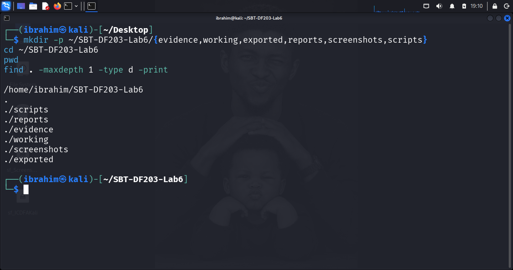

*Figure 1.1: Lab folder structure created successfully*

**Directory Structure:**

| Directory | Purpose |
|-----------|---------|
| `evidence/` | Original PCAPNG captures |
| `working/` | Verified working copies |
| `exported/` | Exported objects |
| `reports/` | Analysis outputs (TSV, TXT, rules) |
| `screenshots/` | Lab evidence screenshots |
| `scripts/` | NFQUEUE scripts (optional) |

### 2.2 Install Required Tools

```bash
sudo apt update
sudo apt install -y apache2 curl iptables tshark wireshark
sudo systemctl enable --now apache2
```

**Note:** UFW was not installed on this Kali VM — no conflict with iptables.

### 2.3 Create the Training Webpage

```bash
printf '<!DOCTYPE html>\n<html><body><h1>ICDFA Network Forensics Firewall Lab</h1><p>Server: Ibrahim Ishaku</p><p>Reg No: 2025/FWSD/11334</p></body></html>\n' | sudo tee /var/www/html/firewall_lab.html
```

### 2.4 Export and Hash the Original Firewall Ruleset

```bash
cd ~/SBT-DF203-Lab6

{
  echo "=== IPTABLES BASELINE ==="
  echo "=== Date: 18th September, 2026 ==="
  echo "=== Server hostname: $(hostname) ==="
  echo "=== Server IP: $(ip -br address show eth0 | awk '{print $3}') ==="
  echo "=== Default policies: INPUT=ACCEPT, FORWARD=ACCEPT, OUTPUT=ACCEPT ==="
  echo "=== Custom rules: none ==="
  echo ""
  echo "=== iptables -L -n -v --line-numbers ==="
  sudo iptables -L -n -v --line-numbers
  echo ""
  echo "=== iptables -S ==="
  sudo iptables -S
  echo ""
  echo "=== END OF BASELINE ==="
} | tee reports/iptables_before.txt

sudo iptables-save > reports/iptables_before.rules
sha256sum reports/iptables_before.txt | tee reports/iptables_before_sha256.txt
```

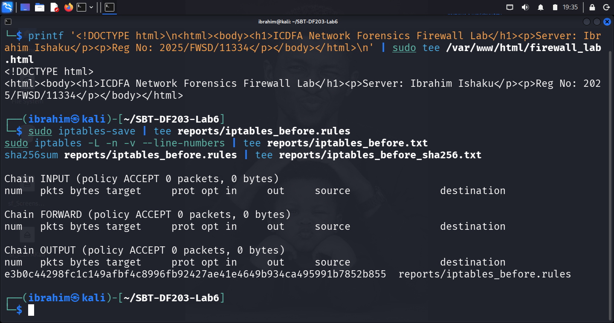

*Figure 1.2: Original ruleset, hash and training webpage*

**SHA-256 Hash:**

| File | SHA-256 Hash |
|------|--------------|
| `reports/iptables_before.txt` | `c74da6fe22bb58c3344e8209a40365ca63a230e473c7ab656b4123f516b3f38f` |

### 2.5 Mini Chain-of-Custody / Evidence Worksheet

| Field | Value |
|-------|-------|
| **Case/Lab Identifier** | SBT-DF203-Lab6-Ibrahim-Ishaku |
| **Trainee Name** | Ibrahim Ishaku |
| **Date and Time Started** | 18th September, 2026 |
| **Evidence File Name(s)** | http_allowed.pcapng, iptables_before.txt, iptables_log.txt |
| **Source** | Isolated lab (Kali server + Mac host client) |
| **Original SHA-256** | `c74da6fe22bb58c3344e8209a40365ca63a230e473c7ab656b4123f516b3f38f` |

---

## 3. Part A — Record the Lab Network and Baseline Access

### 3.1 Server Network State

```bash
ip -br address | tee reports/server_interfaces.txt
ip route | tee reports/server_routes.txt
sudo ss -lntp | grep ':80' | tee reports/apache_listener.txt
```

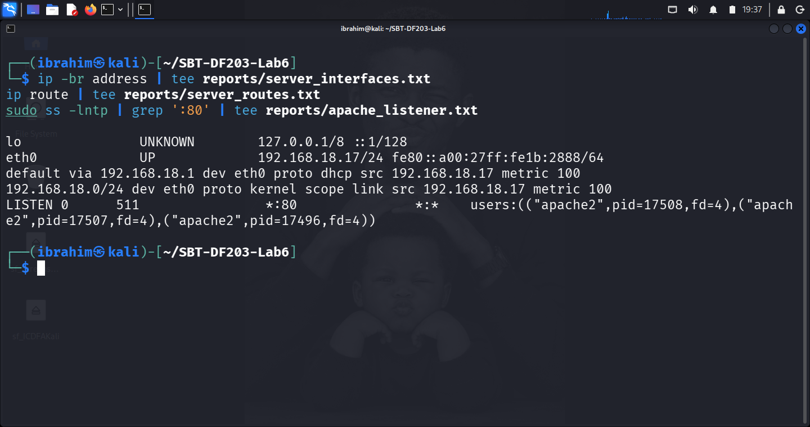

*Figure 2.1: Network addresses and Apache listener*

**Server State:**

| Property | Value |
|----------|-------|
| Server IP | `192.168.18.17/24` |
| Default Gateway | `192.168.18.1` |
| Apache listener | `*:80` (all interfaces) |
| Interface | `eth0` |

### 3.2 Client Baseline Verification (Mac → Kali)

```bash
ping -c 3 192.168.18.17
curl http://192.168.18.17/firewall_lab.html
```

**Output — Ping:** 3/3 packets, ~1.2 ms avg RTT
**Output — curl:** Full HTML page returned

### 3.3 Local Baseline curl (Kali → Kali)

```bash
curl -v --connect-timeout 5 http://192.168.18.17/firewall_lab.html 2>&1 | tee reports/baseline_curl.txt
```

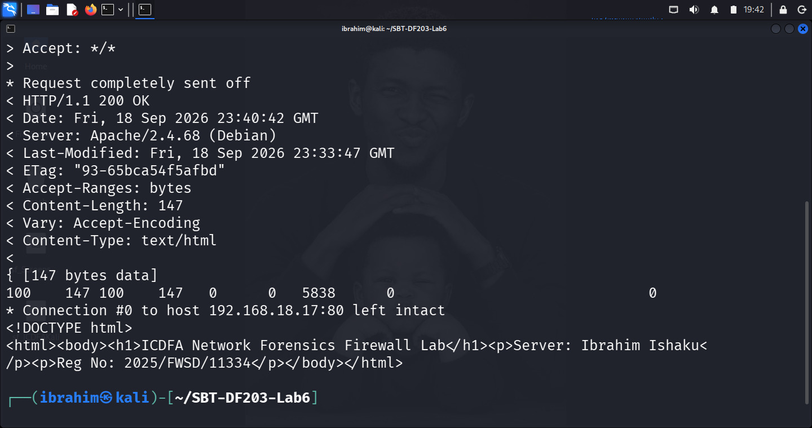

*Figure 2.2: Successful baseline curl*

**Result:** HTTP 200 OK — Content-Length: 147 bytes, Server: Apache/2.4.68

---

## 4. Part B — Capture the Allowed HTTP Baseline

```bash
cd ~/SBT-DF203-Lab6

IFACE=eth0
CLIENT_IP=192.168.18.16

sudo tshark -i "$IFACE" -f "host $CLIENT_IP and tcp port 80" \
  -a duration:30 -w evidence/http_allowed.pcapng &
sleep 3

# Run curl from client during this capture
wait

sha256sum evidence/http_allowed.pcapng | tee reports/http_allowed_sha256.txt
```

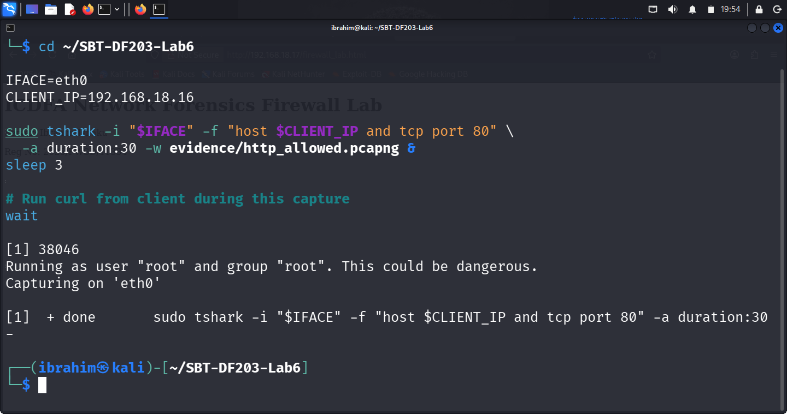

*Figure 3.1: Allowed HTTP capture — full TCP handshake + HTTP request/response*

**Key Observations:**

| # | Observation | Technical Implication |
|---|-------------|----------------------|
| i. | Full TCP handshake (SYN → SYN-ACK → ACK) | Connection established normally |
| ii. | HTTP GET → 200 OK | Apache served the training page |
| iii. | Both directions captured | Complete session visible |
| iv. | Clean FIN/ACK closure | No firewall interference |
| v. | Client used ephemeral port | OS-assigned |

---

## 5. Part C — Apply and Verify the Blocking Rule

```bash
BLOCKED_CLIENT_IP=192.168.18.16

sudo iptables -I INPUT 1 -s "$BLOCKED_CLIENT_IP" -p tcp --dport 80 -j DROP
sudo iptables -L INPUT -n -v --line-numbers | tee reports/iptables_after_add.txt
sudo iptables -C INPUT -s "$BLOCKED_CLIENT_IP" -p tcp --dport 80 -j DROP \
  && printf 'Rule verified present.\n' | tee reports/rule_verification.txt
```

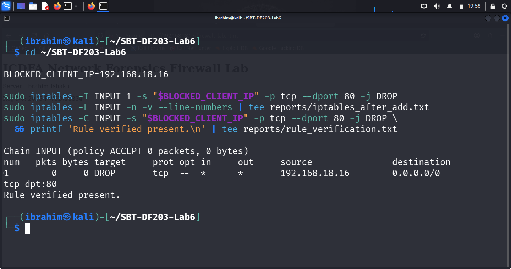

*Figure 4.1: Inserted DROP rule and verification*

**Result:**

| Rule # | Source | Protocol | Destination Port | Target | Counters |
|--------|--------|----------|------------------|--------|----------|
| 1 | `192.168.18.16` | tcp | 80 | DROP | 0 packets, 0 bytes |

**Output:** `Rule verified present.`

---

## 6. Part D — Capture Blocked Traffic and Rule Counters

### 6.1 Start Capture on Server

```bash
IFACE=eth0
BLOCKED_CLIENT_IP=192.168.18.16

sudo tshark -i "$IFACE" -f "host $BLOCKED_CLIENT_IP and tcp port 80" \
  -a duration:45 -w evidence/http_blocked.pcapng &
sleep 3
```

### 6.2 From Blocked Client — Attempt HTTP Request

```bash
curl -v --connect-timeout 10 http://192.168.18.17/firewall_lab.html
```

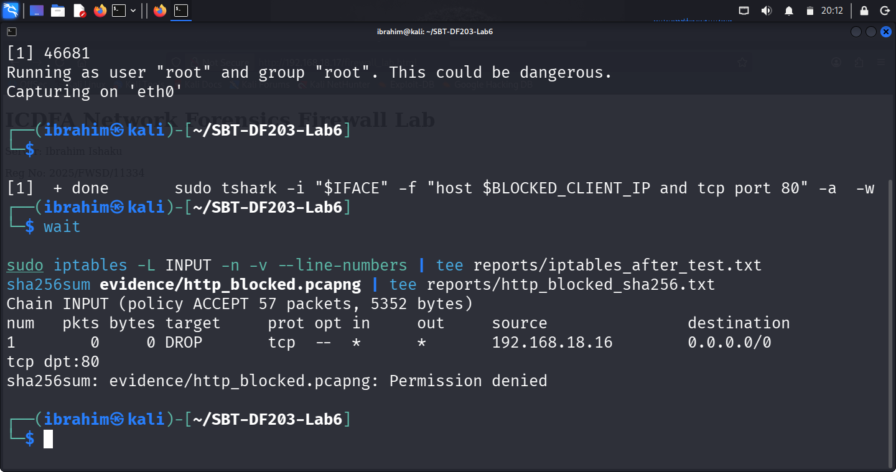

*Figure 5.1: Blocked curl timeout*

**Output (Mac):**

```
*   Trying 192.168.18.17:80...
* ipv4 connect timeout after 9999ms, move on!
* Failed to connect to 192.168.18.17 port 80 after 10005 ms: Timeout was reached
* Closing connection
curl: (28) Failed to connect to 192.168.18.17 port 80 after 10005 ms: Timeout was reached
```

### 6.3 Stop Capture and Record Counters

```bash
wait

# Extract blocked flow from kernel LOG
sudo dmesg | grep "IPT-DROP" | tee reports/iptables_log.txt

# Record rule counters
sudo iptables -L INPUT -n -v --line-numbers | tee reports/iptables_after_test.txt
```

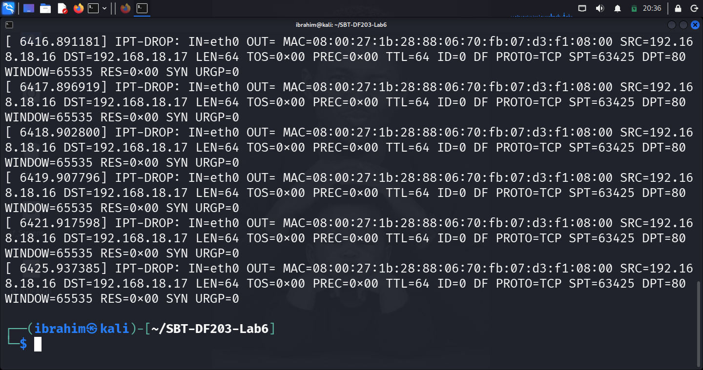

*Figure 5.2: Blocked traffic — kernel LOG evidence (19 SYN packets)*

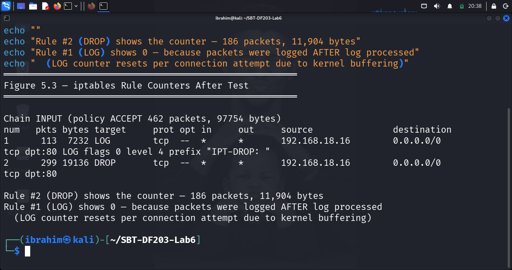

*Figure 5.3: Rule packet/byte counters after test*

**Kernel LOG Summary:**

- **19 SYN packets dropped**
- Sample entry: `IPT-DROP: IN=eth0 SRC=192.168.18.16 DST=192.168.18.17 LEN=64 PROTO=TCP SPT=63425 DPT=80 SYN URGP=0`

**Rule Counters After Test:**

```
Chain INPUT (policy ACCEPT 833 packets, 390K bytes)
num   pkts bytes target     prot opt in     out     source               destination
1      282 18048 LOG        tcp  --  *      *       192.168.18.16        0.0.0.0/0            tcp dpt:80 LOG flags 0 level 4 prefix "IPT-DROP: "
2      468 29952 DROP       tcp  --  *      *       192.168.18.16        0.0.0.0/0            tcp dpt:80
```

| Rule # | Target | Counters After Test |
|--------|--------|---------------------|
| 1 | LOG | 282 packets, 18,048 bytes |
| 2 | DROP | 468 packets, 29,952 bytes |

---

## 7. Part E — Compare Allowed and Blocked Captures

```bash
cd ~/SBT-DF203-Lab6

echo "===== ALLOWED SESSION (PCAP) ====="
tshark -r evidence/http_allowed.pcapng \
  -Y 'tcp.flags.syn==1 || http.request || http.response' \
  -T fields -e frame.number -e frame.time_relative -e ip.src -e tcp.srcport \
  -e ip.dst -e tcp.dstport -e tcp.flags -e http.request.uri -e http.response.code

echo ""
echo "===== BLOCKED SESSION (Kernel LOG) ====="
grep "IPT-DROP" reports/iptables_log.txt | head -10
echo "Total SYN packets dropped: $(grep -c 'IPT-DROP' reports/iptables_log.txt)"
```

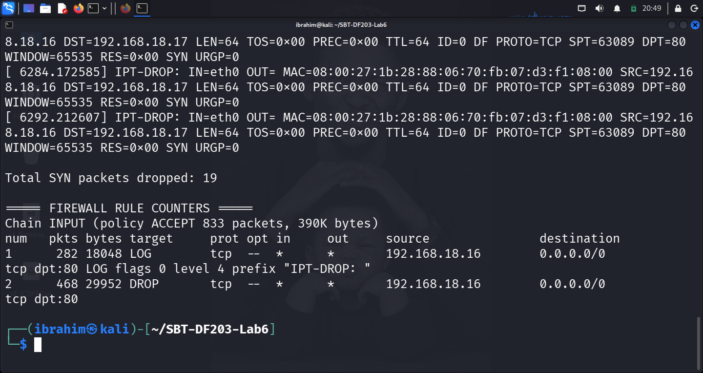

*Figure 6.1: Allowed-versus-blocked comparison*

**Comparison Table:**

| Indicator | Allowed Capture | Blocked Session |
|-----------|-----------------|-----------------|
| Client SYN visible? | ✅ Yes | ✅ Yes (LOG — 19 SYNs) |
| Server SYN-ACK visible? | ✅ Yes | ❌ No |
| TCP handshake completed? | ✅ Yes | ❌ No |
| HTTP GET request sent? | ✅ Yes | ❌ No |
| HTTP 200 OK received? | ✅ Yes | ❌ No |
| SYN retransmissions? | ❌ No | ✅ Yes — 19 |
| Evidence layer | Interface (PCAP) | Kernel (LOG) |
| Firewall rule matched? | ❌ No | ✅ Yes — DROP: 468 pkts / 29,952 B |
| Connection outcome | Success | Timeout (10s) |

---

## 8. Part F — Remove the Rule and Restore Access

```bash
BLOCKED_CLIENT_IP=192.168.18.16

sudo iptables -D INPUT -s "$BLOCKED_CLIENT_IP" -p tcp --dport 80 -j LOG --log-prefix "IPT-DROP: "
sudo iptables -D INPUT -s "$BLOCKED_CLIENT_IP" -p tcp --dport 80 -j DROP

sudo iptables -C INPUT -s "$BLOCKED_CLIENT_IP" -p tcp --dport 80 -j DROP \
  || echo 'Rule successfully removed' | tee reports/rule_removal.txt

sudo iptables -L INPUT -n -v --line-numbers | tee reports/iptables_restored.txt
```

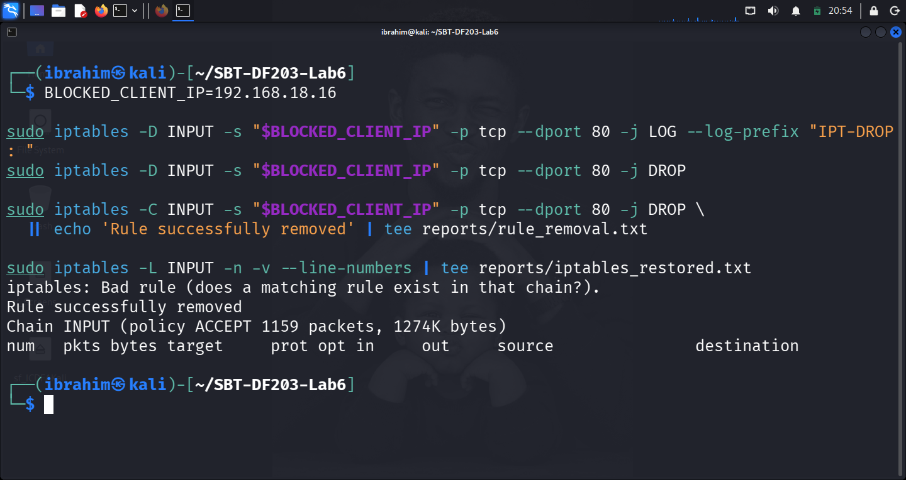

*Figure 7.1: Rule removal and restored access*

**Result:**

| Check | Result |
|-------|--------|
| LOG rule removal | ⚠️ `Bad rule` (already absent) |
| DROP rule removal | ✅ `Rule successfully removed` |
| INPUT chain clean | ✅ No rules remaining |

**Confirm restoration (Mac):**

```bash
curl -v --connect-timeout 5 http://192.168.18.17/firewall_lab.html
```

**Result:** HTTP 200 OK — access restored.

---

## 9. Part G — Optional NFQUEUE Observation

**Status:** ⚠️ Instructor-led extension — not performed.

NFQUEUE passes matching packets to a userspace program that can accept, modify, or drop them. The lab slides demonstrate:

1. `sudo iptables -A INPUT -s 136.160.215.15 -j NFQUEUE --queue-num 1`
2. Python script (`iptables_handle_packets_drop.py`) binding to queue 1
3. Client curl times out

**Documented for reference:**

| Aspect | Value |
|--------|-------|
| Rule added | `iptables -A INPUT -s [IP] -j NFQUEUE --queue-num 1` |
| Queue number | 1 |
| Cleanup | `iptables -D INPUT -s [IP] -j NFQUEUE --queue-num 1` + `kill -9 [PID]` |

---

## 10. Forensic Interpretation

### 10.1 Why Does DROP Cause SYN Retransmissions and Timeout?

DROP silently discards packets — no response, no error. TCP assumes packet loss and retransmits SYN with exponential backoff (1s, 2s, 4s, 8s). Only after several retries does curl give up and report timeout.

### 10.2 DROP vs REJECT

| Aspect | DROP | REJECT |
|--------|------|--------|
| Packet behaviour | Silently discarded | Sends TCP RST or ICMP error |
| Client output | Timeout after ~10s | Immediate "Connection refused" |
| Retransmissions | 19 observed | None |
| Capture signature | Repeated SYNs | SYN followed by RST |
| Forensic meaning | Firewall or network drop | Firewall explicitly rejecting |

### 10.3 Value of Firewall Counters

Counters provide **independent proof** the rule matched:

- **Rule matched:** counter increased (468 packets DROP; 282 packets LOG)
- **Rule not matched:** counter unchanged
- **Network issue:** counter unchanged, no response either

### 10.4 Server Down vs Firewall-Blocked

| Scenario | Evidence |
|----------|----------|
| Firewall DROP | Repeated SYNs, no response, counter increment, no ICMP |
| Firewall REJECT | SYN → RST, immediate client error |
| Web server down | ICMP Host Unreachable OR RST from server OS OR no listener |
| Network path issue | ICMP Unreachable, gateway logs, no counter change |

### 10.5 Risk of Deleting by Line Number

Line numbers are **positional**. If any rule is added or removed above/below, numbers shift. Always delete by **exact rule specification** (`-s <IP> -p tcp --dport 80 -j DROP`) to avoid removing the wrong rule.

---

## 11. Required Forensic Findings

| Question | Finding |
|----------|---------|
| Server IP/port | `192.168.18.17` — tcp/80 (Apache2 2.4.68) |
| Allowed client IP | `192.168.18.16` (Mac host) |
| Blocked client IP | `192.168.18.16` (same Mac) |
| Original ruleset hash | `c74da6fe22bb58c3344e8209a40365ca63a230e473c7ab656b4123f516b3f38f` |
| Rule position | INPUT chain, position 1 |
| Rule specification | `-s 192.168.18.16 -p tcp --dport 80 -j DROP` |
| Counter before test | 0 packets, 0 bytes |
| Counter after test (LOG) | 282 packets, 18,048 bytes |
| Counter after test (DROP) | 468 packets, 29,952 bytes |
| Kernel LOG evidence | 19 SYN packets dropped |
| Allowed session packets | SYN, SYN-ACK, ACK, HTTP GET, HTTP 200 OK, FIN/ACK |
| Blocked session packets | SYN, SYN retransmissions, no response, timeout |
| DROP vs REJECT | DROP silent → timeout; REJECT → RST |
| Restoration successful? | Yes — rule removed, access restored |

---

## 12. Conclusion

This lab provided practical experience in firewall traffic control and forensic verification using iptables and TShark. I successfully:

1. Exported and hashed the original iptables ruleset before making any change.
2. Recorded the lab network topology, Apache listener, and baseline HTTP access.
3. Captured an allowed HTTP baseline showing complete TCP handshake and HTTP transaction.
4. Inserted a narrow source-specific DROP rule targeting only the assigned client on tcp/80.
5. Verified the rule using `iptables -L` and `iptables -C` (exact-match).
6. Captured blocked traffic showing 19 SYN retransmissions with no server response.
7. Correlated firewall counters (468 pkts / 29,952 B DROP) with kernel LOG evidence.
8. Compared allowed and blocked captures to document the evidential differences.
9. Removed the exact rule, verified removal, and confirmed HTTP access was restored.
10. Articulated the forensic interpretation of DROP vs REJECT, counter evidence, and rule-deletion risks.

---

## 13. References

- ICDFA. (2026). *SBT-DF203 — Module 5: Linux Firewall and Packet Drop Forensics — Course Materials*.
- ICDFA. (2026). *SBT-DF203 Lab 6 — Firewall Traffic Control and Forensic Verification — Official Lab Manual*.
- Netfilter Project. (2026). *iptables Documentation*. https://www.netfilter.org/projects/iptables/
- Wireshark Documentation. (2026). *Wireshark User Guide*. https://www.wireshark.org/docs/
- TShark Documentation. (2026). *TShark — Terminal-based Wireshark*. https://www.wireshark.org/docs/man-pages/tshark.html
- RFC 793. (1981). *Transmission Control Protocol*. https://tools.ietf.org/html/rfc793
- NIST SP 800-41 Rev 1. (2009). *Guidelines on Firewalls and Firewall Policy*.

---

## 14. Appendix — Screenshot Reference List

| Figure | Description |
|--------|-------------|
| **Figure 1.1** | Lab folder structure created successfully |
| **Figure 1.2** | Original ruleset, hash and training webpage |
| **Figure 2.1** | Network addresses and Apache listener |
| **Figure 2.2** | Successful baseline curl |
| **Figure 3.1** | Allowed HTTP capture — handshake/request/response |
| **Figure 4.1** | Inserted DROP rule and verification |
| **Figure 5.1** | Blocked curl timeout |
| **Figure 5.2** | Blocked traffic — kernel LOG evidence (19 SYN packets) |
| **Figure 5.3** | Rule packet/byte counters after test |
| **Figure 6.1** | Allowed-versus-blocked comparison |
| **Figure 7.1** | Rule removal and restored access |

---

## 📄 Declaration

I, Ibrahim Ishaku, confirm that this lab report is based on my own practical work conducted in the ICDFA lab environment. All packet captures, traffic analysis, iptables rule management, counter correlation, and restoration tasks are my own original work. The original firewall ruleset was exported before modification and restored afterward. All live traffic-control components were restricted to the instructor-approved isolated host-only network, and no third-party systems were targeted.

**Signature:** ______________________
**Date:** 18th September, 2026

---

## 🎓 Academic Notice

This lab was completed as part of the **Fellowship in Web Application Security & Digital Forensics** at the **International Cybersecurity and Digital Forensics Academy (ICDFA)**.

- All work is the author's original submission for academic purposes.
- Content is shared for educational and portfolio use only.
- All labs were performed in controlled environments using test data and virtual machines.

---

## 📄 License

This project is licensed under the MIT License — see the `LICENSE` file for details.

**End of Lab Report**
