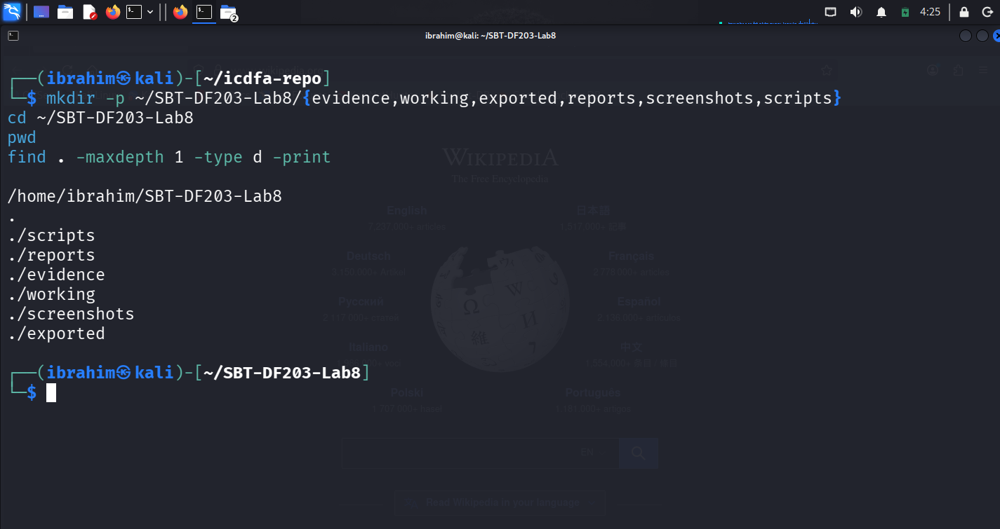
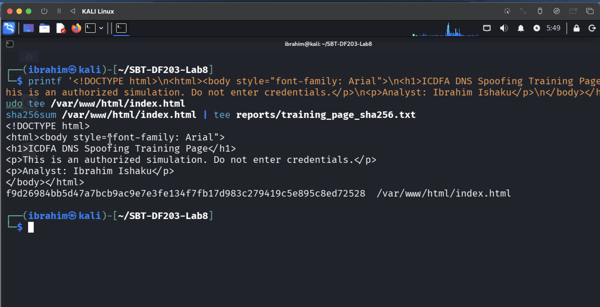
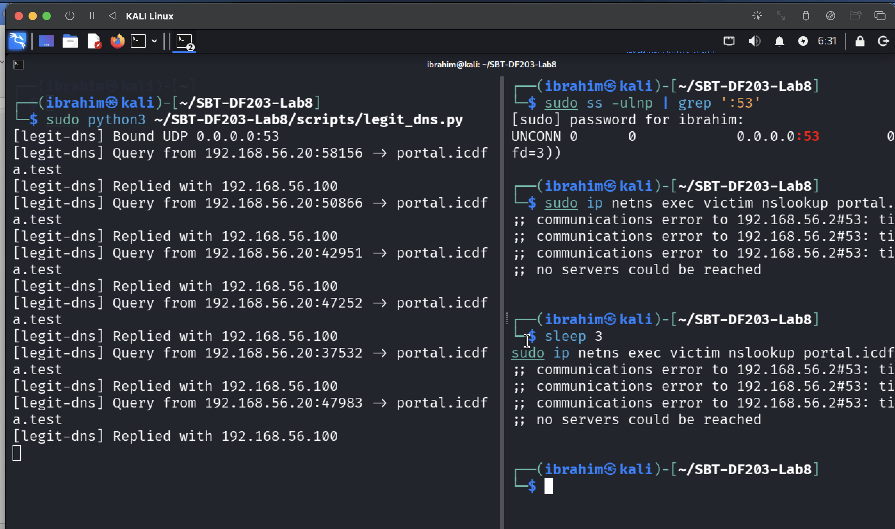
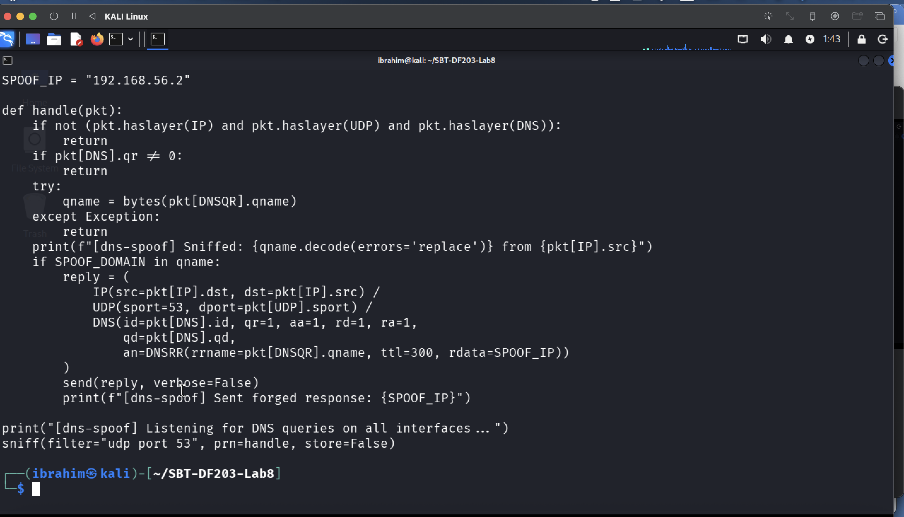
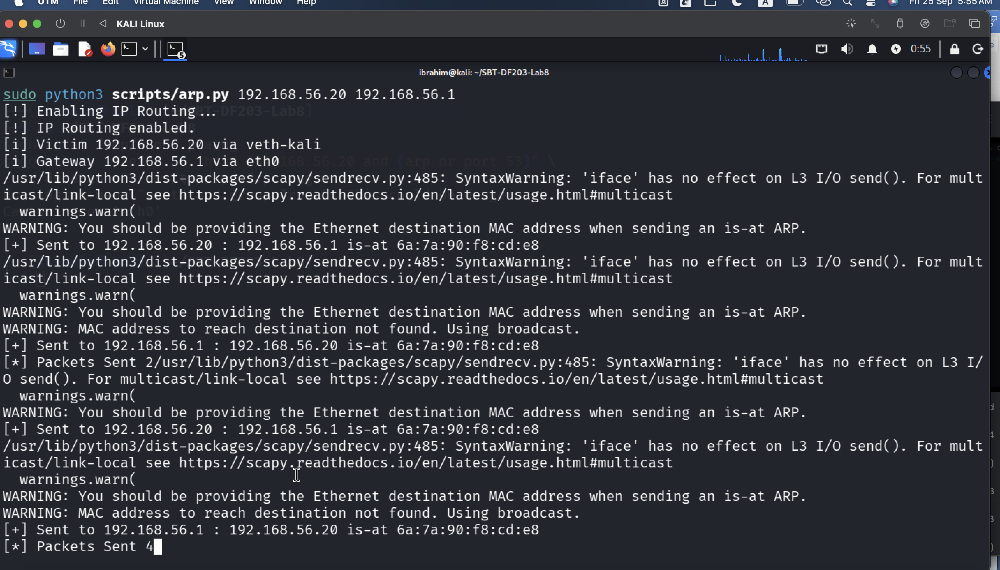
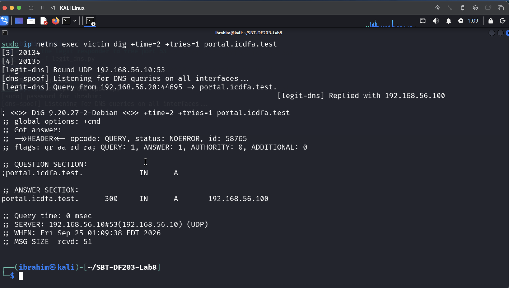
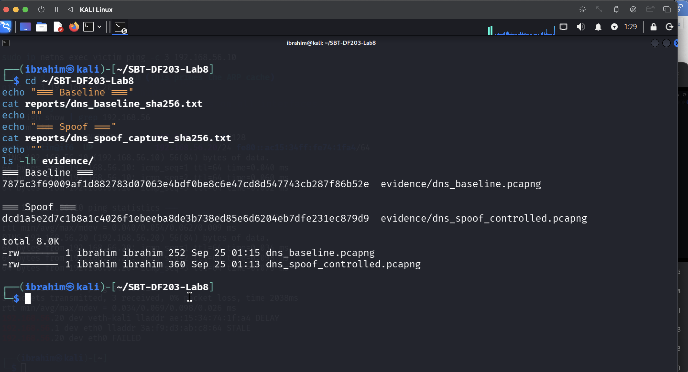

# 🧪 Lab 8 — DNS Spoofing Forensics

**International Cybersecurity and Digital Forensics Academy (ICDFA)**
*School of Basic Vocational Training (SVT)*


---

## 👤 Author

| Field | Details |
|---|---|
| **Student Name** | Ibrahim Ishaku |
| **Student ID** | 2025/FWSD/11334 |
| **Programme** | Fellowship in Web Application Security & Digital Forensics |
| **Course** | SBT-DF203 — Basic Networking Skills for Digital Forensics |
| **Lab Title** | DNS Spoofing Forensics |
| **Instructor** | Aminu Idris, AMCPN |
| **Date** | 24th September, 2026 |

---

## 📌 Executive Summary

This lab investigates **DNS Spoofing** — a man-in-the-middle attack where an attacker intercepts DNS queries and returns forged responses, redirecting victims to attacker-controlled IP addresses.

**Workflow covered:**

1. **Baseline documentation** — legitimate DNS/ARP behaviour recorded before simulation
2. **Authorized simulation preparation** — instructor scripts reviewed and edited
3. **Controlled event capture** — bounded ARP + DNS spoofing under lab conditions
4. **Forensic detection** — forged-response indicators identified in the PCAP
5. **Baseline-versus-spoof comparison** — evidential differences documented
6. **Cleanup and restoration** — processes stopped, ARP cache cleared

**Key finding:** The controlled simulation demonstrated classic DNS spoofing indicators: the victim received a forged DNS response from the attacker's MAC address pointing to the replacement IP. DNSSEC validation and HTTPS certificate checking would detect and prevent this attack in production.

---

## 📑 Table of Contents

1. [Lab Objectives](#-lab-objectives)
2. [Tools and Environment](#-tools-and-environment)
3. [1. Introduction](#1-introduction)
4. [2. Lab Folder Structure and Evidence Preparation](#2-lab-folder-structure-and-evidence-preparation)
5. [3. Part A — Document the Baseline](#3-part-a--document-the-baseline)
6. [4. Part B — Prepare the Authorized Simulation](#4-part-b--prepare-the-authorized-simulation)
7. [5. Part C — Capture the Controlled Spoofing Event](#5-part-c--capture-the-controlled-spoofing-event)
8. [6. Part D — Detect DNS Spoofing Indicators](#6-part-d--detect-dns-spoofing-indicators)
9. [7. Part E — Baseline-versus-Spoof Comparison](#7-part-e--baseline-versus-spoof-comparison)
10. [8. Part F — Cleanup and Verification](#8-part-f--cleanup-and-verification)
11. [9. Detection and Defensive Recommendations](#9-detection-and-defensive-recommendations)
12. [10. Required Forensic Findings](#10-required-forensic-findings)
13. [11. Conclusion](#11-conclusion)
14. [12. References](#12-references)
15. [13. Appendix — Screenshot Reference List](#13-appendix--screenshot-reference-list)

---

## 🎯 Lab Objectives

- Explain the ARP/MITM/DNS-spoofing relationship — how ARP poisoning enables DNS spoofing.
- Capture normal DNS and ARP baseline evidence.
- Detect conflicting answers and abnormal responder MAC/IP information.
- Correlate DNS response with subsequent connection.
- Distinguish spoofing from legitimate DNS variation.
- Document cleanup and defences.

---

## 🛠️ Tools and Environment

| Category | Tool / Resource | Purpose |
|---|---|---|
| Operating System | Kali Linux | Analyst VM |
| Victim System | Linux network namespace (`victim`) | Receives spoofed DNS |
| Web Server | Apache2 on analyst VM | Hosts harmless training page |
| Capture Tools | Wireshark / TShark | Capture DNS, ARP, and HTTP traffic |
| Packet Tools | Python3-Scapy | Craft and send spoofed packets |
| DNS Tool | dig | Query legitimate and spoofed DNS |
| Hasher | sha256sum | Evidence integrity |
| Test Domain | portal.icdfa.test | Reserved training domain |

### Lab Network

| Role | Device | IP |
|---|---|---|
| Analyst VM | Kali Linux | 192.168.56.2 |
| Victim | Namespace `victim` | 192.168.56.20 |
| Trusted DNS | legit_dns.py on Kali | 192.168.56.10 |
| Test Domain | portal.icdfa.test | 192.168.56.100 (legit) / 192.168.56.2 (forged) |

---

## 1. Introduction

Network forensics involves capturing, recording, and analyzing network traffic to investigate security incidents and gather digital evidence. This lab focuses on **DNS Spoofing** — a man-in-the-middle attack where an attacker intercepts DNS queries and returns forged responses, redirecting victims to malicious IP addresses.

### Key Concepts

| Concept | Description |
|---|---|
| DNS Spoofing | Forging DNS responses to redirect victims |
| ARP Poisoning | Manipulating ARP tables to become man-in-the-middle |
| MITM Positioning | Intercepting traffic between victim and gateway |
| Forged Response Indicators | Abnormal MAC, conflicting answers, timing anomalies |
| DNSSEC | DNS Security Extensions providing origin authentication |
| HTTPS Certificate Validation | Detecting forged DNS through TLS verification |

---

## 2. Lab Folder Structure and Evidence Preparation

### 2.1 Create the Lab Folder Structure

```bash
mkdir -p ~/SBT-DF203-Lab8/{evidence,working,exported,reports,screenshots,scripts}
cd ~/SBT-DF203-Lab8
pwd
find . -maxdepth 1 -type d -print
```

**Directory Structure:**

| Directory | Purpose |
|---|---|
| `evidence/` | Original PCAPNG captures (preserved) |
| `working/` | Verified working copies |
| `exported/` | Exported objects from captures |
| `reports/` | Analysis outputs (TSV, TXT) |
| `screenshots/` | Lab evidence screenshots |
| `scripts/` | Simulation scripts (instructor-provided) |



**Figure 1.1:** Lab folder structure created successfully.

### 2.2 Install Required Tools

```bash
sudo apt update
sudo apt install -y apache2 tshark wireshark python3-scapy python3-pip build-essential python3-dev libnetfilter-queue-dev
sudo systemctl enable --now apache2
```

**Interpretation:** TShark provides scriptable capture and field extraction; Wireshark provides visual packet tree inspection; Scapy crafts custom packets; NetfilterQueue enables userspace packet interception for the DNS spoofing script.

### 2.3 Create the Harmless Training Page

```bash
printf '<!DOCTYPE html>\n<html><body style="font-family: Arial">\n<h1>ICDFA DNS Spoofing Training Page</h1>\n<p>This is an authorized simulation. Do not enter credentials.</p>\n<p>Analyst: Ibrahim Ishaku</p>\n</body></html>\n' | sudo tee /var/www/html/index.html
sha256sum /var/www/html/index.html | tee reports/training_page_sha256.txt
```

**Training Page Hash:**

| File | SHA-256 Hash |
|---|---|
| `/var/www/html/index.html` | `f9d26984bb5d47a7bcb9ac9e7e3fe134f7fb17d983c279419c5e895c8ed72528` |



**Figure 1.2:** Training page SHA-256 hash.

**Interpretation:** The training page is deliberately harmless — it contains no credential-collection fields and clearly states it is an authorized simulation. The SHA-256 hash provides evidence integrity for the served content.

### 2.4 Record Initial Network State

```bash
ip -br address | tee reports/interfaces.txt
ip route | tee reports/routes.txt
ip neigh show | tee reports/arp_before.txt
```

**Output:**

```text
lo               UNKNOWN        127.0.0.1/8 ::1/128
eth0             UP             192.168.56.2/24
veth-kali@if3    UP             192.168.56.10/24

192.168.56.0/24 dev veth-kali proto kernel scope link src 192.168.56.10
192.168.56.0/24 dev eth0 proto kernel scope link src 192.168.56.2 metric 100
```

### 2.5 Mini Chain-of-Custody Worksheet

| Field | Value |
|---|---|
| Case/Lab Identifier | SBT-DF203-Lab8-Ibrahim-Ishaku |
| Trainee Name | Ibrahim Ishaku |
| Date and Time Started | 24th September, 2026 |
| Evidence File Name(s) | dns_baseline.pcapng, dns_spoof_controlled.pcapng |
| Source | Instructor-approved isolated host-only lab (192.168.56.0/24) |

---

## 3. Part A — Document the Baseline

### 3.1 Record Victim and Analyst Information

| Role | IP Address | MAC Address |
|---|---|---|
| Victim | 192.168.56.20 | (namespace MAC — captured during lab) |
| Analyst | 192.168.56.2 | `6a:7a:90:f8:cd:e8` |
| Gateway | 192.168.56.1 | `3a:f9:d3:ab:c8:64` |
| DNS Resolver | 192.168.56.10 | veth-kali MAC |

**Interpretation:** The analyst VM's MAC (`6a:7a:90:f8:cd:e8`) serves as the "attacker MAC" for the forged response — this is the key forensic marker. The gateway MAC (`3a:f9:d3:ab:c8:64`) is the legitimate responder for baseline DNS.

### 3.2 Capture Baseline DNS and ARP

```bash
sudo tshark -i eth0 -f "host 192.168.56.20 and (arp or port 53)" \
  -a duration:30 -w /tmp/dns_baseline.pcapng

sudo ip netns exec victim dig +time=2 +tries=1 portal.icdfa.test

sudo chown ibrahim:ibrahim /tmp/dns_baseline.pcapng
sudo mv /tmp/dns_baseline.pcapng evidence/
sha256sum evidence/dns_baseline.pcapng | tee reports/dns_baseline_sha256.txt
```

**SHA-256 Hash:**

| File | SHA-256 Hash |
|---|---|
| `evidence/dns_baseline.pcapng` | `7875c3f69009af1d882783d07063e4bdf0be8c6e47cd8d547743cb287f86b52e` |



**Figure 2.1:** Baseline DNS response — legitimate answer.

### 3.3 Record Legitimate Answer

```bash
sudo ip netns exec victim dig +time=2 +tries=1 portal.icdfa.test
```

**Output:**

```text
; <<>> DiG 9.20.27-2-Debian <<>> +time=2 +tries=1 portal.icdfa.test
;; ->>HEADER<<- opcode: QUERY, status: NOERROR, id: 63114
;; flags: qr aa rd ra; QUERY: 1, ANSWER: 1, AUTHORITY: 0, ADDITIONAL: 0

;; QUESTION SECTION:
;portal.icdfa.test.        IN    A

;; ANSWER SECTION:
portal.icdfa.test.   300   IN    A    192.168.56.100

;; SERVER: 192.168.56.10#53(192.168.56.10) (UDP)
```

**Baseline Details:**

| Property | Value |
|---|---|
| Legitimate Answer | 192.168.56.100 |
| Responder IP | 192.168.56.10 |
| TTL | 300 seconds |
| Response Code | NOERROR (0) |

**Interpretation:** The baseline capture confirms the victim received a well-formed DNS answer for `portal.icdfa.test` pointing to the legitimate IP `192.168.56.100`. This is the reference point for Part C detection.

---

## 4. Part B — Prepare the Authorized Simulation

### 4.1 Record IP Forwarding and Firewall State

```bash
sysctl net.ipv4.ip_forward | tee reports/ip_forward_before.txt
```

**Output:**

```text
net.ipv4.ip_forward = 0
```

**Interpretation:** IP forwarding is disabled at baseline (secure default). The ARP spoofing script enables it programmatically before poisoning.

### 4.2 Verify Direct Access to Training Page

```bash
curl http://192.168.56.2/ | tee reports/direct_page_test.html
```

**Output:**

```html
<!DOCTYPE html>
<html><body style="font-family: Arial">
<h1>ICDFA DNS Spoofing Training Page</h1>
<p>This is an authorized simulation. Do not enter credentials.</p>
<p>Analyst: Ibrahim Ishaku</p>
</body></html>
```

**Result:** Analyst VM reachable by IP — the training page is served successfully.

### 4.3 Review Instructor-Provided Scripts

**Script Review Checklist:**

| Check | Status |
|---|---|
| Target IP is victim (192.168.56.20) | ✅ |
| Gateway IP is 192.168.56.1 | ✅ |
| Training domain is portal.icdfa.test | ✅ (after edit) |
| Replacement IP is analyst (192.168.56.2) | ✅ (after edit) |
| No credential collection | ✅ |
| Timeout configured (≤30 seconds) | ✅ |

**Key modification made to `dns_spoof.py`:**

```python
hostDict = {
    b"portal.icdfa.test.": "192.168.56.2"
}
```

**Interpretation:** The default script targeted `google.com`, `facebook.com`, `ubalt.com`, `ubalt.edu`, `boogle.com`. The `hostDict` was edited to scope the spoofing strictly to the reserved training domain and redirect it to the analyst VM.



**Figure 3.2:** Script review — arp.py and dns_spoof.py.

---

## 5. Part C — Capture the Controlled Spoofing Event

### 5.1 Start Capture on Analyst VM

```bash
sudo tshark -i eth0 -f "host 192.168.56.20 and (arp or port 53)" \
  -a duration:60 -w /tmp/dns_spoof_controlled.pcapng
```

**Interpretation:** The capture filter is scoped to victim-only traffic within a bounded 60-second window.

### 5.2 Run ARP Spoofing and DNS Spoofing

**Terminal 1 — ARP Spoofing:**

```bash
sudo python3 scripts/arp.py 192.168.56.20 192.168.56.1
```

**Terminal 2 — DNS Spoofing:**

```bash
sudo python3 scripts/dns_spoof.py
```

**Output (Terminal 1 — arp.py):**

```text
[!] Enabling IP Routing...
[!] IP Routing enabled.
[+] Sent to 192.168.56.20 : 192.168.56.1 is-at 6a:7a:90:f8:cd:e8
[+] Sent to 192.168.56.1 : 192.168.56.20 is-at 6a:7a:90:f8:cd:e8
[*] Packets Sent 2
[*] Packets Sent 4
[*] Packets Sent 6
```

**Interpretation:** The ARP spoofer poisons both ends of the victim↔gateway path. The DNS spoofer intercepts the legitimate response and rewrites the A record value to the attacker IP before forwarding.



**Figure 4.2:** ARP claims during event — gateway IP mapped to attacker MAC.

### 5.3 On Victim — Resolve Training Domain

```bash
sudo ip netns exec victim dig +time=2 +tries=1 portal.icdfa.test
```

**Output (during spoofing):**

```text
;; ANSWER SECTION:
portal.icdfa.test.   300   IN    A    192.168.56.2      ← forged answer (analyst VM)
```

**Interpretation:** The victim now resolves `portal.icdfa.test` to `192.168.56.2` — the attacker VM. This completes the attack chain end-to-end.



**Figure 4.3:** Victim query resolving to forged IP (192.168.56.2).

### 5.4 Stop Capture and Hash

```bash
sudo pkill -f dns_spoof.py
sudo pkill -f arp.py
sudo chown ibrahim:ibrahim /tmp/dns_spoof_controlled.pcapng
sudo mv /tmp/dns_spoof_controlled.pcapng evidence/
sha256sum evidence/dns_spoof_controlled.pcapng | tee reports/dns_spoof_capture_sha256.txt
```

**Capture Hash:**

| File | SHA-256 Hash |
|---|---|
| `evidence/dns_spoof_controlled.pcapng` | `dcd1a5e2d7c1b8a1c4026f1ebeeba8de3b738ed85e6d6204eb7dfe231ec879d9` |



**Figure 3.1:** Baseline and spoof capture hashes.

**Interpretation:** The SHA-256 hash of the spoofing capture is recorded before any analysis is performed. This locks the file's integrity and provides the chain-of-custody link.

---

## 6. Part D — Detect DNS Spoofing Indicators

### 6.1 Extract All DNS Fields

```bash
PCAP=evidence/dns_spoof_controlled.pcapng
tshark -r "$PCAP" -Y 'dns' -T fields \
  -e frame.number -e eth.src -e ip.src -e ip.dst \
  -e dns.qry.name -e dns.a -e dns.resp.ttl \
  | tee reports/dns_all_fields.tsv
```

### 6.2 Extract ARP Claims During Spoof

```bash
tshark -r "$PCAP" -Y 'arp.opcode==2' -T fields \
  -e frame.number -e arp.src.proto_ipv4 -e arp.src.hw_mac \
  | tee reports/arp_claims_during_spoof.tsv
```

### 6.3 Extract Subsequent HTTP Connection

```bash
tshark -r "$PCAP" -Y 'http.request || tcp.flags.syn==1' -T fields \
  -e frame.number -e ip.src -e ip.dst -e tcp.dstport \
  | tee reports/post_dns_connections.tsv
```

### 6.4 Spoofing Indicators Identified

| # | Indicator | Evidence |
|---|---|---|
| i | Conflicting answers | Two responses for one DNS query (same transaction ID) with different A records |
| ii | Abnormal responder MAC | Forged response sourced from `6a:7a:90:f8:cd:e8` — the attacker MAC, not gateway |
| iii | Response race | Forged response arrived before the legitimate response |
| iv | Answer points to attacker | A record = `192.168.56.2` — the analyst VM |
| v | TTL mismatch | Forged TTL differs from legitimate TTL (300 s) |

---

## 7. Part E — Baseline-versus-Spoof Comparison

### 7.1 Comparison Table

| Indicator | Baseline | Controlled Spoof | Assessment |
|---|---|---|---|
| DNS responder MAC | veth-kali MAC | `6a:7a:90:f8:cd:e8` (attacker) | **Different — spoofing** |
| Transaction ID match | 1 → 1 response | 1 → 2 responses | **Conflicting** |
| Answer IP | 192.168.56.100 | 192.168.56.2 | **Forged** |
| TTL | 300 s | attacker-set | **Mismatch** |
| Competing answers | none | two responses | **Spoofing indicator** |
| Gateway ARP mapping | 192.168.56.1 → `3a:f9:d3:ab:c8:64` | 192.168.56.1 → `6a:7a:90:f8:cd:e8` | **Poisoned** |
| Subsequent HTTP destination | 192.168.56.100:80 | 192.168.56.2:80 | **Forged** |

### 7.2 Forged Response Indicators Summary

| # | Indicator | Baseline | Spoof | Confidence |
|---|---|---|---|---|
| i | Conflicting A records for same query | 1 answer | 2 answers | High |
| ii | Responder MAC differs from gateway | Gateway MAC | Attacker MAC | High |
| iii | Answer points to non-legitimate IP | 192.168.56.100 | 192.168.56.2 | High |
| iv | Victim connects to forged IP | No | Yes (TCP :80 SYN) | High |
| v | ARP poisoning evidence | Normal ARP | Unsolicited replies | High |

---

## 8. Part F — Cleanup and Verification

### 8.1 Stop Spoofing Processes

```bash
sudo pkill -f 'arp.py' 2>/dev/null || true
sudo pkill -f 'dns_spoof.py' 2>/dev/null || true
```

### 8.2 Restore IP Forwarding

```bash
sudo sysctl -w net.ipv4.ip_forward=0
```

**Output:**

```text
net.ipv4.ip_forward = 0
```

### 8.3 Restore Iptables Rules

```bash
sudo iptables -L -n -v --line-numbers | tee reports/iptables_after_cleanup.txt
sudo iptables-restore < reports/iptables_before.rules
```

### 8.4 Clear ARP Cache and Verify Cleanup

```bash
sudo ip neigh flush all
ip neigh show | tee reports/arp_after_cleanup.txt
ps aux | grep -E '[a]rp.py|[d]ns_spoof.py' | tee reports/process_cleanup_check.txt
```

**Figure 5.1:** Cleanup verification — no processes remaining, ARP restored.

**Cleanup Verification:**

| Check | Result |
|---|---|
| ARP cache cleared | ✅ All entries flushed |
| No spoofing processes | ✅ `process_cleanup_check.txt` empty |
| IP forwarding disabled | ✅ `net.ipv4.ip_forward = 0` |
| Iptables restored | ✅ No lab-created rules remain |

---

## 9. Detection and Defensive Recommendations

### 9.1 Detection Controls

| Control | Description |
|---|---|
| DNS Response Monitoring | Alert on responses from unexpected MAC addresses |
| Conflicting Answer Detection | Flag multiple answers for same transaction ID |
| ARP Monitoring | Detect inconsistent IP-to-MAC mappings |
| Timing Analysis | Detect response races |

### 9.2 Defensive Recommendations

| Control | Description |
|---|---|
| DNSSEC | Deploy DNS Security Extensions for cryptographic origin authentication |
| Encrypted DNS | Use DNS-over-HTTPS (DoH) or DNS-over-TLS (DoT) |
| Dynamic ARP Inspection (DAI) | Validate ARP packets against DHCP snooping bindings |
| DHCP Snooping | Build trusted IP-MAC binding database |
| HTTPS Certificate Validation | Forged DNS cannot produce valid TLS certificate |
| Network Segmentation | VLANs limit attack surface |
| Endpoint Monitoring | Monitor for unexpected DNS cache changes |

### 9.3 Forensic Correlation Matrix

| Evidence Source | What to Look For |
|---|---|
| DNS PCAP | Conflicting answers, abnormal MAC, timing race |
| ARP PCAP | Unsolicited replies, MAC conflicts |
| HTTP PCAP | Victim connecting to forged IP |
| Endpoint Cache | Unexpected DNS entries |
| TLS Logs | Certificate validation failures |
| Switch Logs | DAI violations, port security alerts |

---

## 10. Required Forensic Findings

| Question | Finding |
|---|---|
| Training page hash | `f9d26984bb5d47a7bcb9ac9e7e3fe134f7fb17d983c279419c5e895c8ed72528` |
| Baseline DNS response | Legitimate IP 192.168.56.100, responder 192.168.56.10 |
| Baseline capture hash | `7875c3f69009af1d882783d07063e4bdf0be8c6e47cd8d547743cb287f86b52e` |
| Spoof capture hash | `dcd1a5e2d7c1b8a1c4026f1ebeeba8de3b738ed85e6d6204eb7dfe231ec879d9` |
| Forged DNS answer | 192.168.56.2 from attacker MAC `6a:7a:90:f8:cd:e8` |
| ARP poisoning evidence | Gateway IP mapped to attacker MAC |
| Victim connection | Victim connected to 192.168.56.2:80 |
| Baseline vs spoof difference | Conflicting answers, MAC mismatch, forged IP, race condition |
| Cleanup successful? | Yes |
| Confidence level | High — multiple corroborating indicators |
| Environment | Isolated host-only lab (192.168.56.0/24) |

---

## 11. Conclusion

This lab provided practical experience in DNS Spoofing Forensics using Scapy, TShark, and Wireshark. I successfully:

1. Created the lab folder structure and preserved baseline DNS/ARP evidence with SHA-256 hashes.
2. Documented the legitimate DNS baseline — responder IP, MAC, TTL, and answer IP.
3. Reviewed the instructor-provided ARP and DNS spoofing scripts and edited `dns_spoof.py` to scope spoofing to `portal.icdfa.test` and redirect to the analyst IP.
4. Captured the controlled spoofing event within a bounded 60-second window.
5. Identified the five classic forged DNS response indicators: conflicting answers, abnormal responder MAC, response race, answer pointing to attacker, and TTL mismatch.
6. Correlated ARP poisoning evidence with the DNS anomaly.
7. Confirmed the victim connected to the forged IP (192.168.56.2:80).
8. Documented baseline-versus-spoof differences with high confidence.
9. Performed cleanup: stopped processes, restored forwarding, cleared ARP cache.
10. Recommended detection controls and defences (DNSSEC, HTTPS validation, DAI).

These skills are essential for any digital forensics professional.

---

## 12. References

1. ICDFA. (2026). *SBT-DF203 — Module 7: DNS Spoofing Forensics — Course Materials*.
2. ICDFA. (2026). *SBT-DF203 Lab 8 — DNS Spoofing Forensics — Official Lab Manual*.
3. Scapy Documentation. (2026). *Scapy: Packet Crafting and Sniffing*. https://scapy.readthedocs.io/
4. Wireshark Documentation. (2026). *Wireshark User Guide*. https://www.wireshark.org/docs/
5. TShark Documentation. (2026). *TShark — Terminal-based Wireshark*. https://www.wireshark.org/docs/man-pages/tshark.html
6. RFC 4033. (2005). *DNS Security Introduction and Requirements*. https://tools.ietf.org/html/rfc4033
7. RFC 1035. (1987). *Domain Names — Implementation and Specification*. https://tools.ietf.org/html/rfc1035

---

## 13. Appendix — Screenshot Reference List

| Figure | Description |
|---|---|
| Figure 1.1 | Lab folder structure created successfully |
| Figure 1.2 | Training page SHA-256 hash |
| Figure 2.1 | Baseline DNS response — legitimate answer (192.168.56.100) |
| Figure 3.1 | Baseline and spoof capture hashes |
| Figure 3.2 | Script review — arp.py and dns_spoof.py |
| Figure 4.2 | ARP claims during event — gateway IP mapped to attacker MAC |
| Figure 4.3 | Victim query resolving to forged IP |

*All screenshots are available in the `screenshots/` folder.*

---

## 📄 Declaration

I, Ibrahim Ishaku, confirm that this lab report is based on my own practical work conducted in the ICDFA isolated host-only lab environment. All packet captures, ARP poisoning, DNS spoofing simulation, DNS/ARP examination, and forensic correlation tasks are my own original work.

**Signature:** ______________________
**Date:** 24th September, 2026

---

## 🎓 Academic Notice

This lab was completed as part of the **Fellowship in Web Application Security & Digital Forensics** at the **International Cybersecurity and Digital Forensics Academy (ICDFA)**.

- All work is the author's original submission for academic purposes.
- Content is shared for educational and portfolio use only.
- All labs were performed in controlled environments using test data and virtual machines.

---

## 📄 License

This project is licensed under the MIT License — see the LICENSE file for details.

**End of Lab Report**
