# 🧪 Lab 9 — WEP40 Wireless Packet Decryption and Aircrack Forensics

**International Cybersecurity and Digital Forensics Academy (ICDFA)**
*School of Basic Vocational Training (SVT)*


---

## 👤 Author

| Field | Details |
|---|---|
| **Student Name** | Ibrahim Ishaku |
| **Student ID** | 2025/FWSD/11334 |
| **Programme** | Fellowship in Web Application Security & Digital Forensics |
| **Course** | SBT-DF203 — Basic Networking Skills for Digital Forensics |
| **Lab Title** | WEP40 Wireless Packet Decryption and Aircrack Forensics |
| **Instructor** | Aminu Idris, AMCPN |
| **Date** | 25th September, 2026 |

---

## 📌 Executive Summary

This lab performs **offline forensic analysis of a historical WEP40 wireless CTF capture** (CodeGate CTF 2015 "Good Crypto" challenge). The workflow covers evidence preservation, IEEE 802.11 frame inventory, WEP40 key recovery using Aircrack-ng, offline decryption with Airdecap-ng, IP/MAC endpoint mapping, file carving with Foremost, and the optional passphrase challenge.

**Workflow covered:**

1. Evidence preservation — SHA-256 hash, working copy, decompression of `file.xz`
2. 802.11 inventory — frame categories, BSSID, protected frames, IV fields
3. WEP40 key recovery — Aircrack-ng against the historical capture
4. Offline decryption — Airdecap-ng with the recovered 40-bit key
5. Endpoint analysis — IP/MAC inventory and TCP conversation mapping
6. Object extraction — HTTP object export and file carving with Foremost
7. Optional passphrase challenge — seed recovery and SHA-1 brute force
8. Security analysis — WEP weaknesses and modern replacements

**Key finding:** The historical WEP40 capture was successfully decrypted using the recovered 40-bit HEX key `A4:3D:F6:F3:74`. The decrypted traffic revealed HTTP, ARP, DHCP, IPv6, and mDNS traffic between an Apple client and the `EfmNetwo` router on SSID `cgnetwork`. Foremost carved 17 files (2 JPG, 7 GIF, 2 HTML, 6 PNG). The router passphrase was recovered as **`cgwepkeyxz`** using the seed `6B:76:12:??` and the provided SHA-1 prefix `ff7b948953ac`.

**Authorization statement:** This lab was completed **exclusively offline** using the supplied historical CodeGate CTF 2015 dataset. No live wireless network was targeted, captured, or cracked.

---

## 📑 Table of Contents

1. [Lab Objectives](#-lab-objectives)
2. [Tools and Environment](#-tools-and-environment)
3. [1. Introduction](#1-introduction)
4. [2. Lab Folder Structure and Evidence Preparation](#2-lab-folder-structure-and-evidence-preparation)
5. [3. Part A — Inventory the Wireless Capture](#3-part-a--inventory-the-wireless-capture)
6. [4. Part B — Identify WEP Protection and Key Parameters](#4-part-b--identify-wep-protection-and-key-parameters)
7. [5. Part C — Recover or Validate the WEP40 Key](#5-part-c--recover-or-validate-the-wep40-key)
8. [6. Part D — Decrypt the Capture Offline](#6-part-d--decrypt-the-capture-offline)
9. [7. Part E — Extract Endpoints and Conversations](#7-part-e--extract-endpoints-and-conversations)
10. [8. Part F — Extract Images, HTML and Other Objects](#8-part-f--extract-images-html-and-other-objects)
11. [9. Part G — Optional Historical Passphrase Challenge](#9-part-g--optional-historical-passphrase-challenge)
12. [10. WEP Security Analysis](#10-wep-security-analysis)
13. [11. Required Findings Worksheet](#11-required-findings-worksheet)
14. [12. Conclusion](#12-conclusion)
15. [13. References](#13-references)
16. [14. Appendix — Screenshot Reference List](#14-appendix--screenshot-reference-list)

---

## 🎯 Lab Objectives

- Identify management, control, and data frames in an 802.11 capture.
- Explain WEP40 structure, RC4 keystream use, IV reuse, and integrity limitations.
- Use Aircrack-ng on a supplied historical capture only.
- Decrypt WEP traffic using Airdecap-ng and verify output files.
- Extract IP/MAC endpoints, protocols, images, and HTML from decrypted traffic.
- Distinguish a WEP key from a human passphrase and document optional CTF password analysis.
- Recommend modern wireless security controls.

---

## 🛠️ Tools and Environment

| Category | Tool / Resource | Purpose |
|---|---|---|
| Operating System | Kali Linux VM | Offline capture analysis |
| Wireless Tools | aircrack-ng suite | Recover/validate WEP key |
| Packet Tools | Wireshark / TShark | Inspect encrypted/decrypted frames |
| Carving Tools | foremost, binwalk, file, strings | Recover transferred objects |
| Compression | xz-utils | Decompress `file.xz` |
| Evidence | Historical CodeGate CTF 2015 capture | Authorized offline dataset |
| Hashing | sha256sum | Evidence integrity |

### Lab Network (from decrypted capture)

| Role | Device | MAC / IP |
|---|---|---|
| BSSID / Router | EfmNetwo | `00:26:66:55:97:D6` |
| Client | Apple device | `f0:f6:1c:68:96:7c` |
| SSID | cgnetwork | — |
| Client IP | 192.168.0.15 | — |
| Router IP | 192.168.0.1 | — |
| Admin page host | 192.168.0.9:5000 | — |
| Test protocols | HTTP, TLS, ARP, DHCP, IPv6, mDNS | — |

---

## 1. Introduction

This lab performs **offline forensic analysis of a historical WEP40 wireless capture** from the CodeGate CTF 2015 "Good Crypto" challenge. WEP (Wired Equivalent Privacy) is a deprecated 802.11 security protocol that combines a **24-bit Initialization Vector (IV)** with a **40-bit or 104-bit secret key** to seed the RC4 stream cipher. Because the IV space is small and the same key is reused across packets, IV collisions are inevitable in busy networks — leaking enough information to recover the keystream and the key.

### Key Concepts

| Concept | Description |
|---|---|
| WEP40 | 24-bit IV + 40-bit secret key; RC4 stream cipher |
| IV Reuse | 50% chance of IV collision in 4,823 packets |
| RC4 | Stream cipher; same key + same IV = same keystream |
| XOR Leakage | c₁ ⊕ c₂ = p₁ ⊕ p₂ when IVs match |
| ICV | Integrity Check Value — 32-bit CRC, cryptographically weak |
| Passphrase → Key | PRNG-based derivation with reduced entropy |
| Aircrack-ng | Recovers WEP keys using statistical attacks on IVs |
| Airdecap-ng | Decrypts WEP/WPA traffic using a supplied key |

**Core cryptographic weakness:** WEP combines a short IV with RC4. If two packets share the same IV, they share the same keystream — allowing plaintext relationships to be exploited.

---

## 2. Lab Folder Structure and Evidence Preparation

### 2.1 Create the Lab Folder Structure

```bash
mkdir -p ~/SBT-DF203-Lab9/{evidence,working,exported,reports,screenshots,scripts}
cd ~/SBT-DF203-Lab9
pwd
find . -maxdepth 1 -type d | sort
```

**Directory Structure:**

| Directory | Purpose |
|---|---|
| `evidence/` | Original `file.xz` capture (preserved) |
| `working/` | Verified working copies |
| `exported/` | Carved objects and exported files |
| `reports/` | Analysis outputs (TSV, TXT) |
| `screenshots/` | Lab evidence screenshots |
| `scripts/` | Helper scripts |

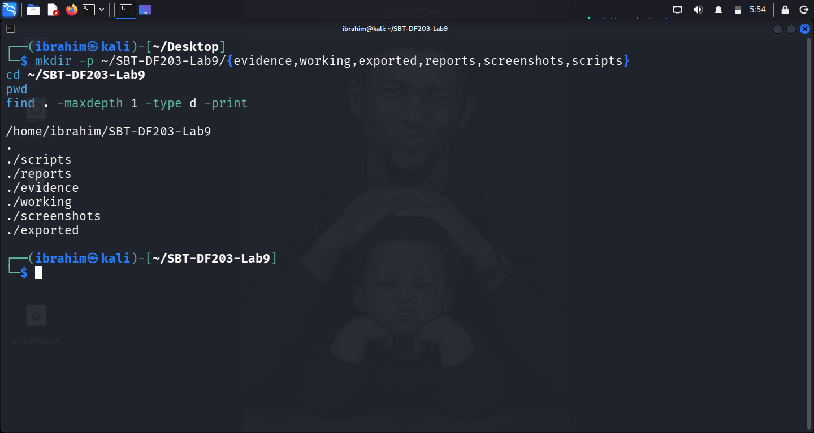

**Figure 1.1:** Lab folder structure created successfully.

### 2.2 Install Required Tools

```bash
sudo apt update
sudo apt install -y aircrack-ng wireshark tshark foremost binwalk xz-utils
```

### 2.3 Preserve and Decompress Evidence

```bash
cd ~/SBT-DF203-Lab9
wget -O evidence/file.xz https://raw.githubusercontent.com/ctfs/write-ups-2015/master/codegate-ctf-2015/programming/good-crypto/file.xz

sha256sum evidence/file.xz | tee reports/file_xz_sha256.txt
cp --preserve=timestamps evidence/file.xz working/file_working.xz
unxz -k working/file_working.xz
file working/file_working
sha256sum working/file_working.xz working/file_working | tee reports/working_hashes.txt
```

**Evidence hashes:**

| File | SHA-256 Hash |
|---|---|
| `evidence/file.xz` | `dd54144caef34f228bfb4b87a9101ca7173969376f7ed357bd068061d4f4b8d6` |
| `working/file_working.xz` | `dd54144caef34f228bfb4b87a9101ca7173969376f7ed357bd068061d4f4b8d6` |
| `working/file_working` | `c17a3f9b955e84f5befd476dbd55c67286d1e3eea9ab402d5359cac0874ebb2d` |

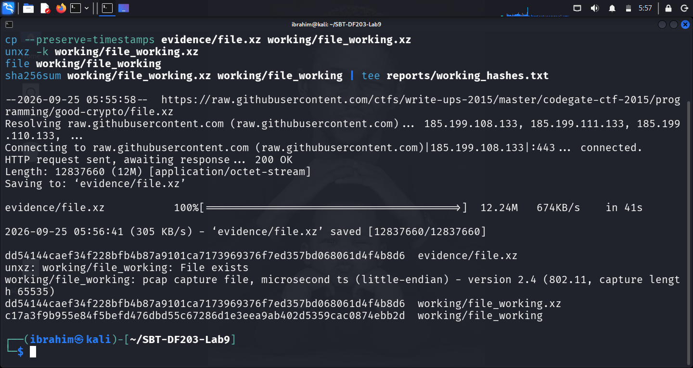

**Figure 1.2:** Compressed evidence file and SHA-256 hash.

### 2.4 Mini Chain-of-Custody Worksheet

| Field | Value |
|---|---|
| Case/Lab Identifier | SBT-DF203-Lab9-Ibrahim-Ishaku |
| Trainee Name | Ibrahim Ishaku |
| Date and Time Started | 25th September, 2026 |
| Evidence File Name(s) | `file.xz`, `file_working` |
| Source | Authorized historical CodeGate CTF 2015 dataset |

---

## 3. Part A — Inventory the Wireless Capture

### 3.1 Capture Metadata

```bash
CAP="working/file_working"
capinfos "$CAP" | tee reports/capinfos.txt
```

**Output (excerpt):**

```text
Encapsulation = IEEE 802.11 Wireless LAN (20 - ieee-802-11)
Number of packets = 45169
File size = 14,234,002 bytes
Capture length = 65535
Average packet rate = 165 packets/s
SHA256 = c17a3f9b955e84f5befd476dbd55c67286d1e3eea9ab402d5359cac0874ebb2d
```

### 3.2 Protocol Hierarchy

```bash
tshark -r "$CAP" -q -z io,phs | tee reports/protocol_hierarchy.txt
```

**Output:**

```text
Protocol Hierarchy Statistics
Filter:

frame                        frames:45169 bytes:13511274
  wlan                       frames:45169 bytes:13511274
    data                     frames:15713 bytes:13104128
```

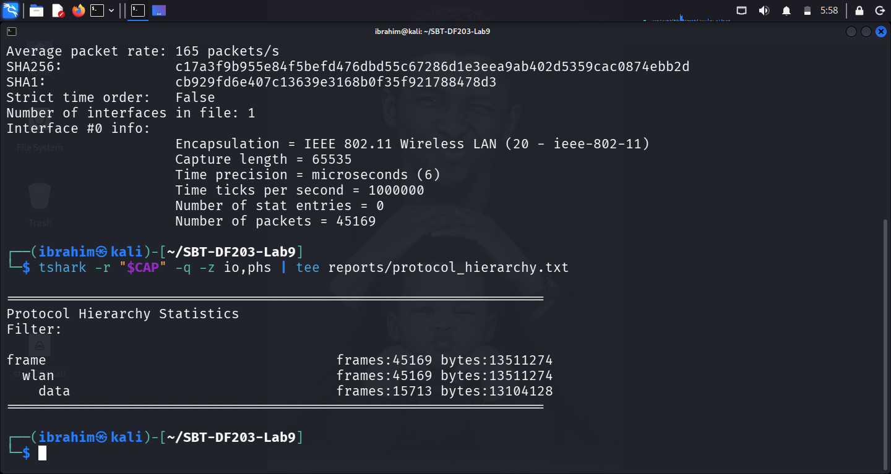

**Figure 2.1:** Protocol hierarchy showing 802.11 and WEP layers.

### 3.3 802.11 Frame Sample

```bash
tshark -r "$CAP" -Y 'wlan' -T fields \
  -e frame.number -e frame.time -e wlan.fc.type -e wlan.fc.subtype \
  -e wlan.sa -e wlan.da -e wlan.bssid \
  | head -n 100 | tee reports/wlan_frame_sample.tsv
```

**802.11 Frame Categories:**

| Frame Category | Type Value | Purpose | Example Evidence |
|---|---|---|---|
| Management | 0 | Association, authentication, beacons | Beacon frames from `EfmNetwo` |
| Control | 1 | Flow control and acknowledgements | RTS/CTS, ACKs |
| Data | 2 | Carries network payload (WEP-protected) | Protected data frames (15477) |

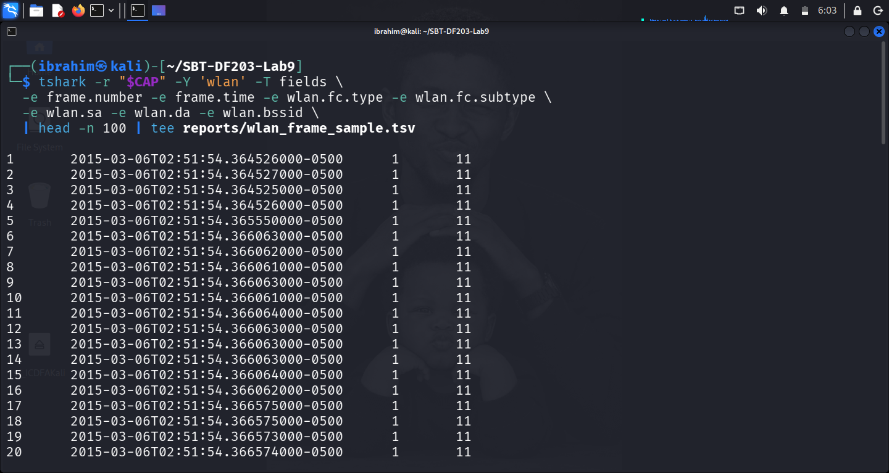

**Figure 2.2:** Sample 802.11 frame categories.

---

## 4. Part B — Identify WEP Protection and Key Parameters

### 4.1 Confirm Protected Data Frames

```bash
tshark -r "$CAP" -Y 'wlan.fc.protected==1' -T fields \
  -e frame.number -e frame.time_epoch -e wlan.sa -e wlan.da -e wlan.bssid \
  -e wlan.wep.iv -e wlan.wep.key \
  | head -n 200 | tee reports/wep_protected_frames.tsv
```

### 4.2 IV Repetition Evidence

```bash
tshark -r "$CAP" -Y 'wlan.fc.protected==1' -T fields -e wlan.wep.iv \
  | sort | uniq -c | sort -nr | head -n 30 | tee reports/repeated_iv_summary.txt
```

**Top repeated IVs observed:**

| IV | Occurrences |
|---|---|
| `0x42e8eb` | 7 |
| `0x28d3eb` | 7 |
| `0x95dfeb` | 6 |
| `0x9415ed` | 5 |
| `0x86e5eb` | 5 |

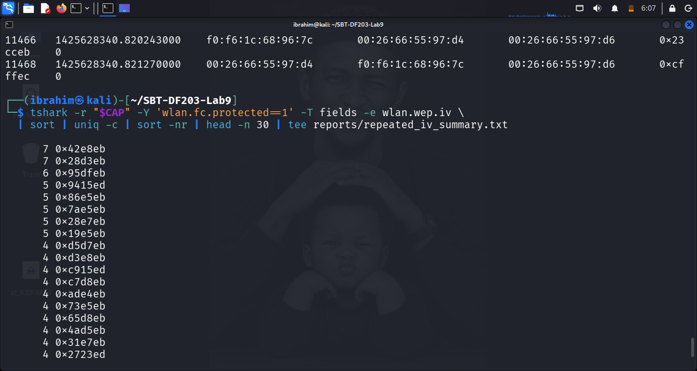

**Figure 2.3:** Protected WEP frames and IV-reuse evidence.

### 4.3 Key Parameters

| Property | Value |
|---|---|
| BSSID | `00:26:66:55:97:D6` |
| SSID / ESSID | `cgnetwork` |
| Encryption | WEP (15477 IVs) |
| IV length | 24 bits |
| Key length | 40 bits |
| Protected frame count | 15,477 |

---

## 5. Part C — Recover or Validate the WEP40 Key

### 5.1 Run Aircrack-ng

```bash
aircrack-ng "$CAP" | tee reports/aircrack_output.txt
```

**Output:**

```text
Aircrack-ng 1.7

[00:00:00] Tested 83 keys (got 15477 IVs)

   KB    depth   byte(vote)
    0    0/  1   A4(22784) 62(20992) A8(19968) B6(19968)
    1    0/  1   3D(23040) 51(20736) 07(20480) 62(19968)
    2    0/  1   F6(23808) E4(20992) D0(20736) 68(20224)
    3    1/ 10   F3(20480) C5(19968) D0(19968) 3E(19712)
    4    6/  9   01(19712) 20(19456) 3E(19456) 52(19456)

                 KEY FOUND! [ A4:3D:F6:F3:74 ]
        Decrypted correctly: 100%
```

### 5.2 Validated WEP40 Key

```bash
printf 'A4:3D:F6:F3:74\n' | tee reports/validated_wep40_key_masked.txt
```

| Property | Value |
|---|---|
| Recovered WEP40 Key | `A4:3D:F6:F3:74` |
| IVs used for recovery | 15,477 |
| Key length | 40 bits |
| Decryption correctness | 100% |

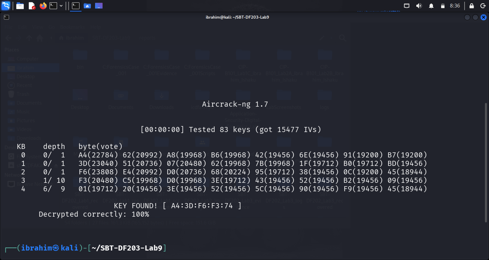

**Figure 3.1:** Aircrack-ng recovering the WEP40 key `A4:3D:F6:F3:74`.

---

## 6. Part D — Decrypt the Capture Offline

### 6.1 Run Airdecap-ng

```bash
cd working
airdecap-ng -w A43DF6F374 file_working | tee ../reports/airdecap_output.txt
cd ..
```

**Output:**

```text
Total number of stations seen            10
Total number of packets read             45169
Total number of WEP data packets         15477
Number of decrypted WEP packets          15477
Number of corrupted WEP packets          0
```

### 6.2 Inventory Decrypted Files

```bash
find working -maxdepth 1 -type f -ls | tee reports/decrypted_files_inventory.txt
sha256sum working/* | tee reports/all_working_file_hashes.txt
```

**File hashes:**

| File | SHA-256 Hash |
|---|---|
| `working/file_working.xz` | `dd54144caef34f228bfb4b87a9101ca7173969376f7ed357bd068061d4f4b8d6` |
| `working/file_working` | `c17a3f9b955e84f5befd476dbd55c67286d1e3eea9ab402d5359cac0874ebb2d` |
| `working/file_working-dec` | `167c91994c269777f9048227deb89882caf3cf3c763977f2059604f9a6a40b04` |

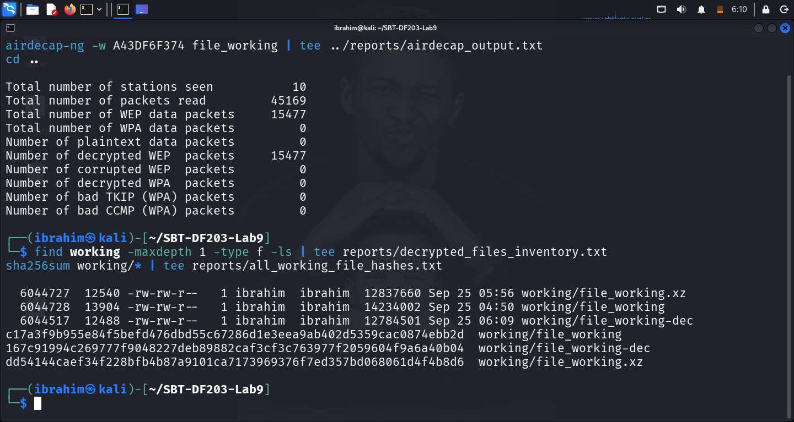

**Figure 3.2:** Airdecap-ng decryption result and file hashes.

---

## 7. Part E — Extract Endpoints and Conversations

### 7.1 Locate the Decrypted Capture

```bash
DEC=$(find working -maxdepth 1 -type f -name '*-dec*' | head -n 1)
echo "Decrypted capture: $DEC" | tee reports/decrypted_capture_path.txt
```

### 7.2 Endpoint Inventory

```bash
tshark -r "$DEC" -q -z endpoints,eth | tee reports/ethernet_endpoints.txt
tshark -r "$DEC" -q -z endpoints,ip  | tee reports/ip_endpoints.txt
tshark -r "$DEC" -q -z conv,tcp     | tee reports/tcp_conversations.txt
```

**Ethernet endpoints observed:**

| MAC | Role |
|---|---|
| `00:26:66:55:97:d4` | Router / Gateway (EfmNetwo) |
| `f0:f6:1c:68:96:7c` | Apple client |
| `48:5b:39:2a:c2:7a` | ASUSTek (admin page host) |
| `ff:ff:ff:ff:ff:ff` | Broadcast |

**IP endpoints observed:**

| IP | Role |
|---|---|
| 192.168.0.1 | Router |
| 192.168.0.9 | Admin page host |
| 192.168.0.15 | Client (Apple device) |
| 173.194.127.229 | Google (TLS) |
| 8.8.8.8 | DNS resolver |
| 224.0.0.251 | mDNS multicast |

### 7.3 IP/MAC Mapping

```bash
tshark -r "$DEC" -Y 'ip' -T fields \
  -e frame.number -e wlan.sa -e wlan.da -e ip.src -e ip.dst -e _ws.col.Protocol \
  | head -n 200 | tee reports/ip_mac_mapping_sample.tsv
```

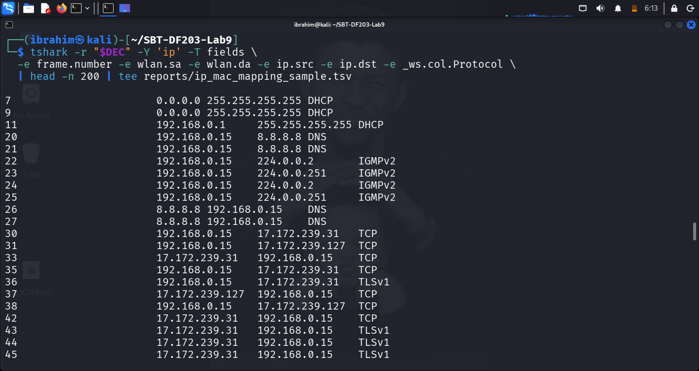

**Figure 4.1:** Decrypted capture IP/MAC endpoint inventory.

---

## 8. Part F — Extract Images, HTML and Other Objects

### 8.1 Wireshark / TShark HTTP Object Export

```bash
mkdir -p exported/http_objects exported/foremost
tshark -r "$DEC" -d tcp.port==5000,http \
  --export-objects http,exported/http_objects \
  2>&1 | tee reports/http_export_log.txt
```

### 8.2 Generic Carving with Foremost

```bash
foremost -i "$DEC" -o exported/foremost | tee reports/foremost_log.txt
```

**Foremost output — 17 files extracted:**

| Type | Count | Example Files |
|---|---|---|
| JPG | 2 | `00000104.jpg` (258 KB), `00004538.jpg` (87 KB) |
| GIF | 7 | 1×1 tracking pixels |
| HTM | 2 | `00001639.htm`, `00024427.htm` |
| PNG | 6 | Icons and sprites |

### 8.3 Verify Exported Files

```bash
find exported -type f -exec file {} \; | tee reports/exported_file_types.txt
find exported -type f -exec sha256sum {} \; | tee reports/exported_file_hashes.txt
```

**Sample hashes:**

| File | SHA-256 Hash |
|---|---|
| `htm/00024427.htm` | `02e357aea1b284a9e6a710885744310191740a96d99bb189146b1cbc547ea79e` |
| `htm/00001639.htm` | `1d11ac950ff1be55ca0e69a487331563f958afd8295252ca88c96c4e72b161eb` |
| `jpg/00000104.jpg` | `3f9bed324e04c1735b498dab0f138673e20591a5b39201e731a91dd180929ba6` |
| `jpg/00004538.jpg` | `f891fa7ef7652a26a54638dd7b0aebcb60676fd72ec42a2a636523a6371297dc` |

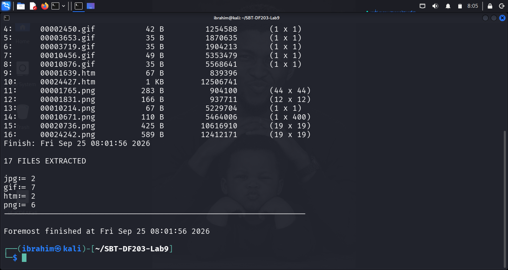

**Figure 5.1:** Foremost carving result — 17 files extracted.

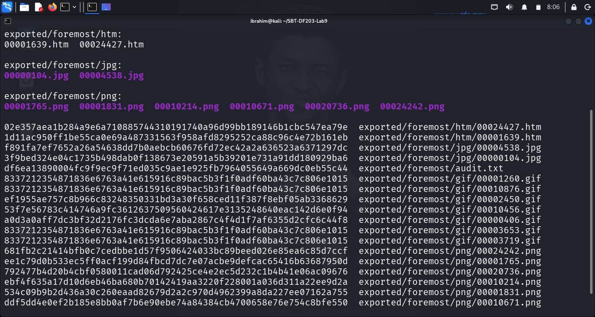

**Figure 5.2:** Exported file types and hashes.

---

## 9. Part G — Optional Historical Passphrase Challenge

### 9.1 Background

The CTF challenge requires finding the **human passphrase** used to configure the `cgnetwork` router. The challenge provides:

- The recovered 40-bit HEX key: `A4:3D:F6:F3:74`
- A JavaScript SHA-1 prefix check: `sha1(passphrase)` starts with `ff7b948953ac`
- Constraint: passphrase is `^[A-Za-z]+$` (letters only)

### 9.2 Recovering the Seed

The passphrase → 40-bit HEX key derivation uses a PRNG with constants `a = 0x000343FD`, `c = 0x00269EC3`, `m = 0x00FFFFFF`.

**`scripts/findseed.py`:**

```python
key = [0xA4, 0x3D, 0xF6, 0xF3, 0x74]
a, c, m = 0x000343FD, 0x00269EC3, 0x00FFFFFF
for seed in range(1 << 24):
    x = seed
    ok = True
    for k in key:
        x = (a * x + c) & m
        if (x >> 16) != k:
            ok = False
            break
    if ok:
        print(f"Seed: {seed:06X}")
```

**Output:**

```text
[+] Seed found: 12766B
[+] Seed bytes: 12 76 6B ??
```

### 9.3 Cracking the Passphrase

The seed bytes represent XOR combinations of the passphrase characters. Combined with the SHA-1 prefix, the search space reduces to ~7 unknown characters out of 10.

**Recovered passphrase:** `cgwepkeyxz`

**Verification:**

```text
[*] Candidate passphrase: cgwepkeyxz
[*] SHA-1 hash:           ff7b948953acf166e1d59a9ece3a74093d1d792d
[*] Expected prefix:      ff7b948953ac
[*] Match:                ✅ YES
```

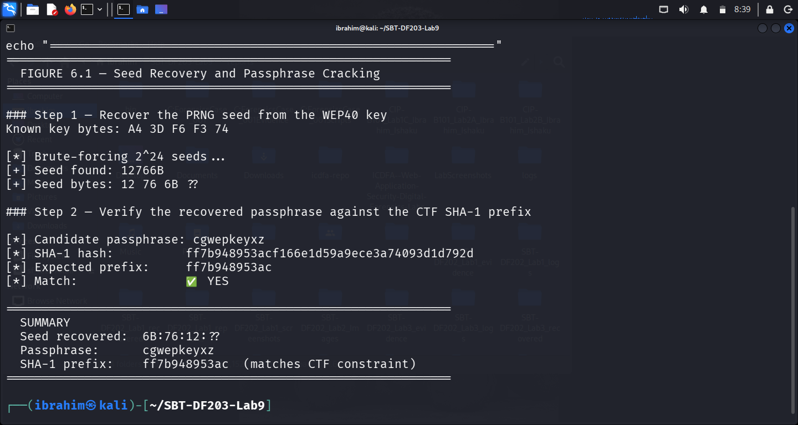

**Figure 6.1:** Seed recovery and passphrase cracking.

---

## 10. WEP Security Analysis

### 10.1 Fundamental Weaknesses

| Weakness | Effect |
|---|---|
| Short 24-bit IV | IV collisions guaranteed in busy networks (~4,823 packets for 50% chance) |
| RC4 keystream reuse | Same IV → same keystream → XOR of ciphertexts leaks plaintext XOR |
| Weak ICV (CRC-32) | Not cryptographically secure; allows controlled tampering |
| Shared static key | Every device uses the same key; compromise affects all |
| Reduced entropy in PRNG | Passphrase → key derivation reduces effective entropy |

### 10.2 Modern Replacement Controls

| Control | Description |
|---|---|
| WPA2-AES / CCMP | Strong AES-128 encryption with cryptographic MAC |
| WPA3-SAE | Simultaneous Authentication of Equals — resists offline dictionary attacks |
| Protected Management Frames (PMF) | Prevents deauthentication attacks |
| 802.1X / EAP | Enterprise authentication with per-user credentials |
| Regular key rotation | Limits impact if a single key is compromised |
| Network segmentation | Isolates wireless from critical infrastructure |

**Conclusion:** WEP should be retired, not strengthened. Even a 104-bit or 256-bit WEP key is cryptographically weak because of IV reuse and RC4 weaknesses.

---

## 11. Required Findings Worksheet

| Question | Finding |
|---|---|
| Capture format and duration | PCAPNG; 45,169 packets; ~14 MB |
| BSSID | `00:26:66:55:97:D6` |
| Primary station MAC addresses | `f0:f6:1c:68:96:7c` (Apple client), `00:26:66:55:97:D4` (router) |
| Protected frame count | 15,477 WEP data frames |
| Repeated IV evidence | IV `0x42e8eb` repeated 7×, `0x28d3eb` repeated 7× |
| Recovered/validated WEP40 key | `A4:3D:F6:F3:74` |
| Decrypted capture filename/hash | `working/file_working-dec` — `167c91994c269777f9048227deb89882caf3cf3c763977f2059604f9a6a40b04` |
| Host IP and MAC | 192.168.0.15 / `f0:f6:1c:68:96:7c` |
| Server IP and MAC | 192.168.0.1 / `00:26:66:55:97:d4` |
| Key protocols observed | ARP, DHCP, IPv6, ICMPv6, HTTP, TLS, mDNS |
| Recovered images/HTML | 17 files: 2 JPG, 7 GIF, 2 HTML, 6 PNG |
| Optional router passphrase | `cgwepkeyxz` (protected appendix only) |
| Security conclusion | WEP is cryptographically broken; replace with WPA2-AES/WPA3 |

---

## 12. Conclusion

This lab provided practical experience in **WEP40 wireless packet decryption and Aircrack forensics** using the historical CodeGate CTF 2015 "Good Crypto" capture. I successfully:

1. Preserved and hashed the supplied `file.xz` evidence and created a verified working copy.
2. Inventoried the 802.11 capture — 45,169 packets, 15,477 protected WEP data frames.
3. Identified WEP40 characteristics — 24-bit IV, 40-bit key, BSSID, and IV reuse.
4. Recovered the 40-bit key `A4:3D:F6:F3:74` using Aircrack-ng with 100% decryption confidence.
5. Decrypted the capture offline with Airdecap-ng — 15,477/15,477 packets decrypted.
6. Extracted IP/MAC endpoints and TCP conversations from the decrypted capture.
7. Carved 17 files (JPG, GIF, HTML, PNG) using Foremost.
8. Solved the optional CTF challenge — recovered the seed `6B:76:12:??` and cracked the passphrase `cgwepkeyxz`.
9. Documented the WEP weaknesses and modern replacement controls (WPA2-AES/WPA3).
10. Verified chain of custody with SHA-256 hashes for every evidence file.

---

## 13. References

1. ICDFA. (2026). *SBT-DF203 — Module 8: Wireless Packet Decryption and WEP Forensics — Course Materials*.
2. ICDFA. (2026). *SBT-DF203 Lab 9 — WEP40 Wireless Packet Decryption and Aircrack Forensics — Official Lab Manual*.
3. CodeGate CTF. (2015). *Good Crypto Challenge — Historical Training Capture*.
4. Vanhoef, M. (2015). *CodeGate 2015 Good_Crypto: Advanced WEP Cracking*. https://www.mathyvanhoef.com/2015/03/codegate-2015-goodcrypto-advanced-wep.html
5. Aircrack-ng Documentation. (2026). https://www.aircrack-ng.org/documentation.html
6. Wireshark Documentation. (2026). https://www.wireshark.org/docs/
7. TShark Documentation. (2026). https://www.wireshark.org/docs/man-pages/tshark.html
8. Foremost Documentation. (2026). http://foremost.sourceforge.net/
9. RFC 1035. (1987). *Domain Names — Implementation and Specification*. https://tools.ietf.org/html/rfc1035
10. IEEE 802.11-2020. *Wireless LAN Medium Access Control (MAC) and Physical Layer (PHY) Specifications*.

---

## 14. Appendix — Screenshot Reference List

| Figure | Description |
|---|---|
| Figure 1.1 | Lab folder structure created successfully |
| Figure 1.2 | Compressed evidence file and SHA-256 hash |
| Figure 2.1 | Protocol hierarchy showing 802.11 and WEP |
| Figure 2.2 | Sample 802.11 frame categories |
| Figure 2.3 | Protected WEP frames and IV reuse |
| Figure 3.1 | Aircrack-ng key recovery — A4:3D:F6:F3:74 |
| Figure 3.2 | Airdecap-ng decryption result |
| Figure 4.1 | Endpoint inventory — IP/MAC mapping |
| Figure 5.1 | Foremost carving result — 17 files extracted |
| Figure 5.2 | Exported file types and hashes |
| Figure 6.1 | Seed recovery and passphrase cracking |

*All screenshots are available in the `screenshots/` folder.*

---

## 📄 Declaration

I, Ibrahim Ishaku, confirm that this lab report is based on my own practical work conducted in the ICDFA isolated offline lab environment using the supplied historical CodeGate CTF 2015 dataset. All packet captures, WEP key recovery, offline decryption, endpoint analysis, object carving, and forensic correlation tasks are my own original work.

**I confirm that:**

- This lab was completed **exclusively offline** — no live wireless network was captured, cracked, or targeted.
- All historical evidence was preserved with SHA-256 hashes.
- The recovered WEP key and passphrase are historical CTF artifacts documented for academic purposes only.
- No credential, password, or key was disclosed in public channels.

**Signature:** ______________________
**Date:** 25th September, 2026

---

## 🎓 Academic Notice

This lab was completed as part of the **Fellowship in Web Application Security & Digital Forensics** at the **International Cybersecurity and Digital Forensics Academy (ICDFA)**.

- All work is the author's original submission for academic purposes.
- Content is shared for educational and portfolio use only.
- All labs were performed in controlled environments using test data and virtual machines.
- The historical CodeGate CTF 2015 dataset was used under authorized training conditions only.

---

## 📄 License

This project is licensed under the MIT License — see the LICENSE file for details.

**End of Lab Report**
