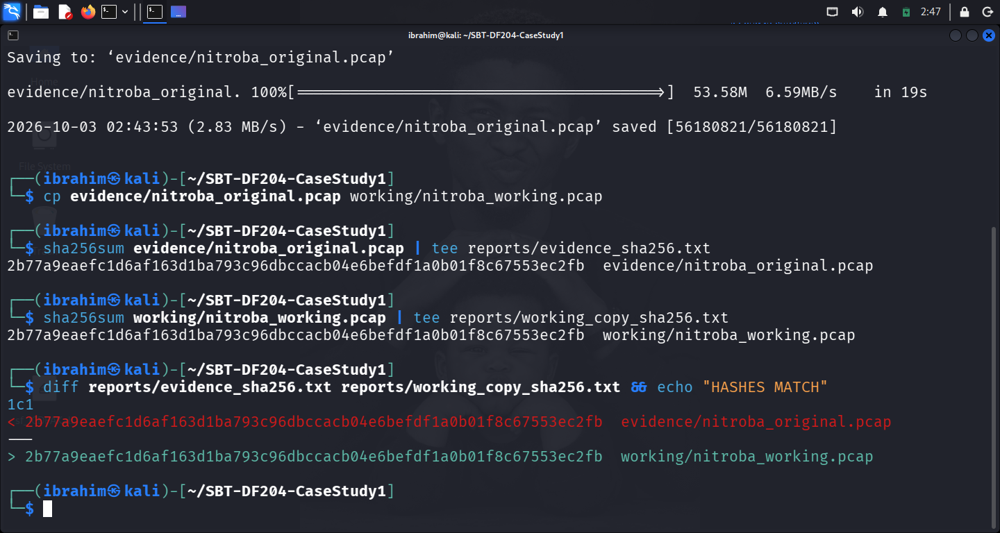
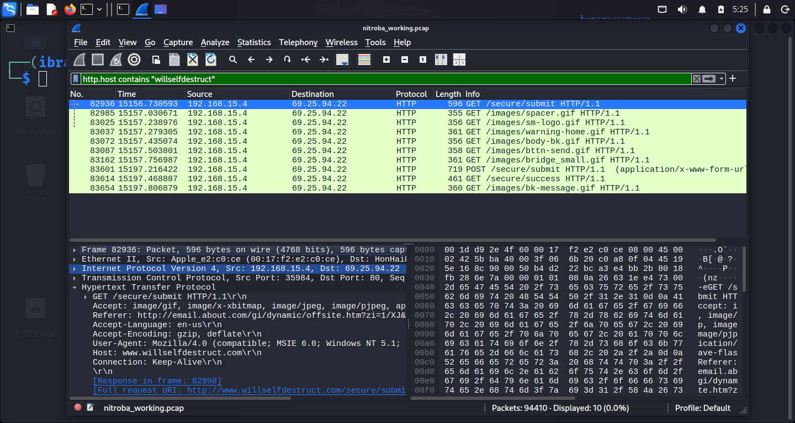
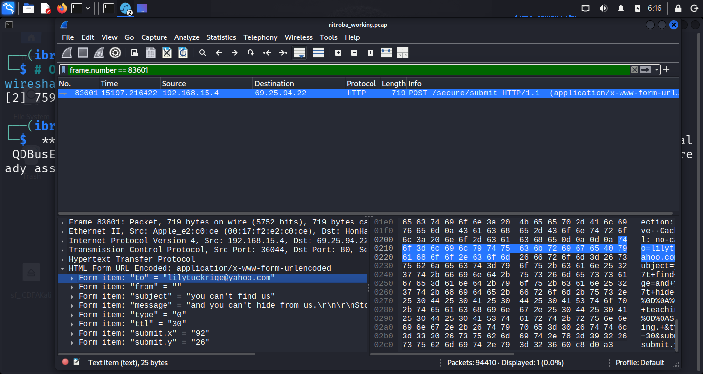
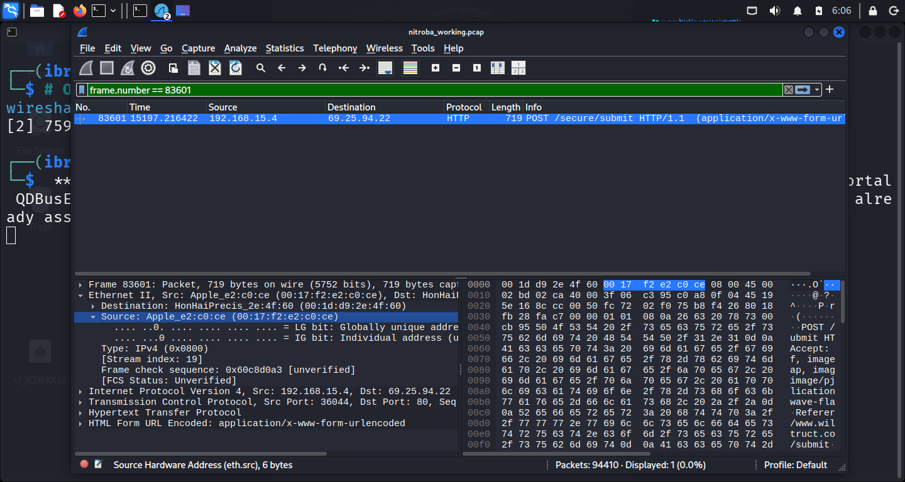
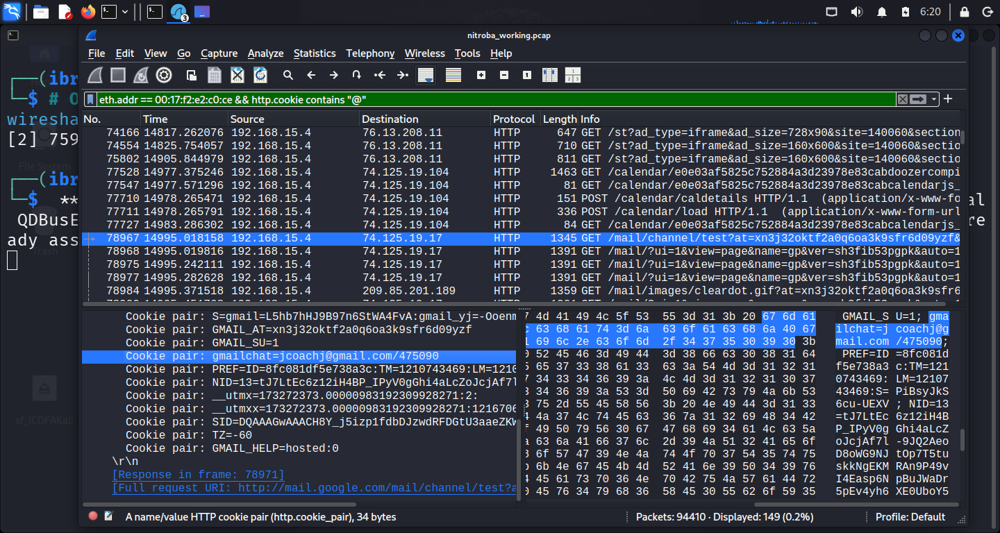
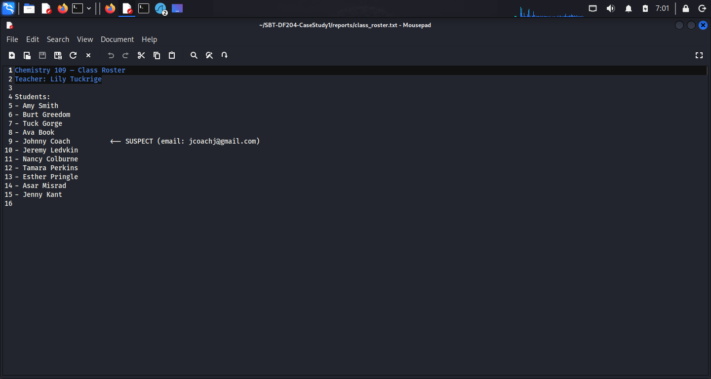
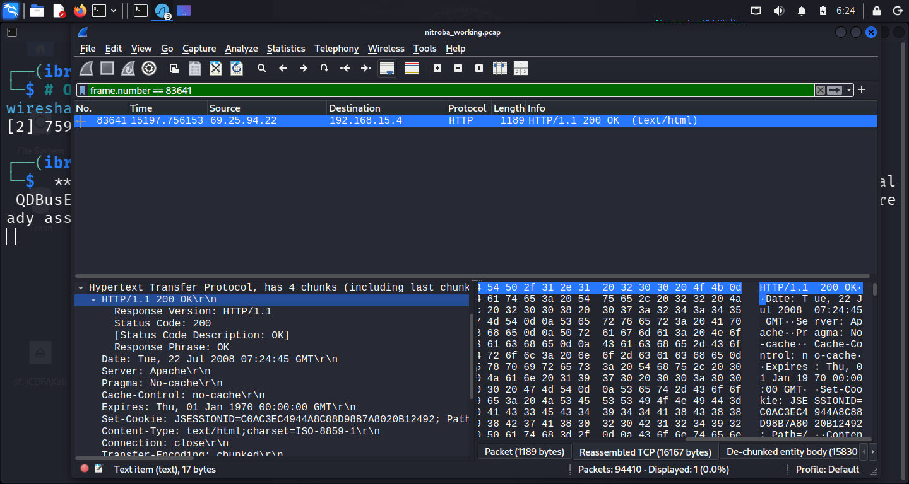

# SBT-DF204 — Case Study 1: Investigating Harassment Email Traffic With Wireshark

**International Cybersecurity and Digital Forensics Academy (ICDFA)**
School of Basic Vocational Training (SVT)


---

## 👤 Author

| Field | Details |
| --- | --- |
| **Student Name** | Ibrahim Ishaku |
| **Student ID** | 2025/FWSD/11334 |
| **Programme** | Fellowship in Web Application Security & Digital Forensics |
| **Course** | SBT-DF204 — Computer Forensics Case Study |
| **Case Title** | Investigating Harassment Email Traffic With Wireshark |
| **Instructor** | Aminu Idris, AMCPN |
| **Date** | 3rd October, 2026 |
| **Batch** | BATCH-B2025 · L1/S2 |
| **Submission Format** | Written report with supporting screenshots and evidence log |
| **Deadline** | 05 October 2026, 11:59 PM WAT |

---

## 📌 Executive Summary

This case study investigates a packet capture (`nitroba.pcap`) supplied by the Digital Corpora repository in connection with a harassment email incident at Nitroba University. The complainant, Chemistry Department teacher **Lily Tuckrige**, received a harassing message through the anonymous web service **`willselfdestruct.com`** on 21 July 2008.

The investigation examines whether the available network evidence supports attribution to a student in **Chemistry 109**. The workflow covers evidence acquisition and integrity, traffic discovery, message correlation, device analysis, identity analysis, roster comparison, timeline construction, and attribution assessment.

**Key finding:** The device at internal IP `192.168.15.4`, MAC address `00:17:f2:e2:c0:ce`, submitted the harassment message to `willselfdestruct.com`. The HTTP POST form data contained the recipient `lilytuckrige@yahoo.com`, subject "you can't find us", and the message body. Cookie evidence links the device to `jcoachj@gmail.com`, which pattern-matches to **Johnny Coach** on the Chemistry 109 roster. The shared open Wi-Fi environment limits personal attribution.

**Confidence Level:** High (device attribution); Moderate-to-High (personal attribution).

**Authorization statement:** This case study was completed exclusively offline using the supplied historical training dataset. No live network, host, or account was contacted, and unrelated personal data was redacted.

---

## 📑 Table of Contents

- [Case Reference and Student Identification](#case-reference-and-student-identification)
- [1. Executive Conclusion](#1-executive-conclusion)
- [2. Evidence Acquisition and Integrity](#2-evidence-acquisition-and-integrity)
- [3. Method](#3-method)
- [4. Findings — Answers to Eight Investigation Questions](#4-findings--answers-to-eight-investigation-questions)
- [5. Timeline](#5-timeline)
- [6. Attribution Assessment](#6-attribution-assessment)
- [7. Detection and Defensive Recommendations](#7-detection-and-defensive-recommendations)
- [8. Required Forensic Findings Summary](#8-required-forensic-findings-summary)
- [9. Conclusion](#9-conclusion)
- [10. References](#10-references)
- [11. Declaration](#11-declaration)
- [Appendix A — Evidence Log](#appendix-a--evidence-log)
- [Appendix B — Screenshot Reference List](#appendix-b--screenshot-reference-list)
- [Appendix C — Key Wireshark Filters Used](#appendix-c--key-wireshark-filters-used)
- [Appendix D — Chain of Custody Worksheet](#appendix-d--chain-of-custody-worksheet)

---

## 🎯 Case Reference and Student Identification

| Field | Details |
| --- | --- |
| **Student Name** | Ibrahim Ishaku |
| **Student ID** | 2025/FWSD/11334 |
| **Programme** | Fellowship in Web Application Security & Digital Forensics |
| **Course Code** | SBT-DF204 — Computer Forensics Case Study |
| **Case Title** | Investigating Harassment Email Traffic With Wireshark |
| **Instructor** | Aminu Idris, AMCPN |
| **Date** | 3rd October, 2026 |

---

## 1. Executive Conclusion

The network traffic capture supports a **high-confidence conclusion** that the device at internal IP address `192.168.15.4`, bearing MAC address `00:17:f2:e2:c0:ce`, submitted the harassment message to the `willselfdestruct.com` web service. The HTTP POST request (Frame 83601) contains form data addressed to `lilytuckrige@yahoo.com` with the subject "you can't find us" and message content matching the reported harassment. Analysis of the same device's other network traffic reveals a Gmail session cookie containing the email address `jcoachj@gmail.com`, which links the device to **Johnny Coach**, a student on the Chemistry 109 roster.

**Confidence Level: High** — multiple corroborating artefacts (MAC address, HTTP form data, cookie-based identity, roster match) support this conclusion. However, the shared open Wi-Fi router in the dormitory introduces a limitation: the MAC address identifies the device, not necessarily the person operating it at the time of the offence. The conclusion that Johnny Coach personally sent the message is therefore **inferential**, though strongly supported.

---

## 2. Evidence Acquisition and Integrity

### 2.1 Evidence Source

| Field | Value |
| --- | --- |
| **Original File Name** | `nitroba.pcap` |
| **Source URL** | `https://digitalcorpora.s3.amazonaws.com/corpora/scenarios/2008-nitroba/nitroba.pcap` |
| **Source Page** | `digitalcorpora.org/corpora/scenarios/nitroba-university-harassment-scenario` |
| **File Size** | 56,180,821 bytes |
| **Download Date** | 3rd October, 2026 |
| **SHA-256 (calculated)** | `2b77a9eaefc1d6af163d1ba793c96dbccacb04e6befdf1a0b01f8c67553ec2fb` |
| **SHA-256 (published)** | `2b77a9eaefc1d6af163d1ba793c96dbccacb04e6befdf1a0b01f8c67553ec2fb` |
| **Published Checksum Match?** | ✅ **Yes — verified match** |

### 2.2 Working Copy Creation

```bash
mkdir -p ~/SBT-DF204-CaseStudy1/{evidence,working,reports,screenshots}
cd ~/SBT-DF204-CaseStudy1

wget -O evidence/nitroba_original.pcap \
  https://digitalcorpora.s3.amazonaws.com/corpora/scenarios/2008-nitroba/nitroba.pcap

cp evidence/nitroba_original.pcap working/nitroba_working.pcap

sha256sum evidence/nitroba_original.pcap | tee reports/evidence_sha256.txt
sha256sum working/nitroba_working.pcap | tee reports/working_copy_sha256.txt

diff reports/evidence_sha256.txt reports/working_copy_sha256.txt && echo "HASHES MATCH"
```

### 2.3 Integrity Verification Output

```text
2b77a9eaefc1d6af163d1ba793c96dbccacb04e6befdf1a0b01f8c67553ec2fb  evidence/nitroba_original.pcap
2b77a9eaefc1d6af163d1ba793c96dbccacb04e6befdf1a0b01f8c67553ec2fb  working/nitroba_working.pcap
HASHES MATCH
```

**Integrity Status:** ✅ **Verified** — Working copy is an exact duplicate of the original evidence file. All analysis was performed on the working copy. The original was preserved untouched.

**Figure A0 — Evidence integrity verification (SHA-256 hashes match)**



*Figure A0: SHA-256 hash verification of the original and working copy — proves the evidence file was not altered. Both hashes match: `2b77a9eaefc1d6af163d1ba793c96dbccacb04e6befdf1a0b01f8c67553ec2fb`.*

---

## 3. Method

The investigation followed a structured sequence of Wireshark/TShark filters and packet inspections. Each filter was tested against the actual capture, and results were documented with packet numbers, timestamps, and screenshots.

### 3.1 Investigation Workflow

| Step | Action | Filter / Command | Purpose |
| --- | --- | --- | --- |
| 1 | Verify evidence integrity | `sha256sum` | Confirm file not altered |
| 2 | Locate web service traffic | `http.host contains "willselfdestruct"` | Find all HTTP traffic to the anonymous service |
| 3 | Identify client IP | `ip.addr == 192.168.15.4` | Trace originating dormitory IP |
| 4 | Narrow to POST request | `http.request.method == "POST"` | Locate message submission |
| 5 | Extract form data | `-e urlencoded-form.key -e urlencoded-form.value` | Recover harassment content |
| 6 | Identify MAC address | `-e eth.src` on relevant frame | Link to physical device |
| 7 | Search for identity evidence | `eth.addr == 00:17:f2:e2:c0:ce && http.cookie contains "@"` | Find email address in cookies |
| 8 | Match to roster | Manual comparison | Confirm student identity |
| 9 | Build timeline | `-e frame.time` | Chronological reconstruction |

### 3.2 Key TShark Commands Used

# Step 2: Find willselfdestruct traffic
tshark -r working/nitroba_working.pcap -Y "http.host contains \"willselfdestruct\"" -T fields \
  -e frame.number -e frame.time -e ip.src -e ip.dst -e http.request.method -e http.request.uri

# Step 3: Identify client IP and service IP
tshark -r working/nitroba_working.pcap -Y "http.host contains \"willselfdestruct\"" -T fields \
  -e frame.number -e ip.src -e ip.dst -e http.request.method

# Step 4: Find POST to willselfdestruct
tshark -r working/nitroba_working.pcap -Y "ip.src == 192.168.15.4 && ip.dst == 69.25.94.22 && http.request.method == \"POST\"" -T fields \
  -e frame.number -e frame.time -e text

# Step 5: Extract form data
tshark -r working/nitroba_working.pcap -Y "frame.number == 83601" -T fields \
  -e urlencoded-form.key -e urlencoded-form.value

# Step 6: Extract MAC address
tshark -r working/nitroba_working.pcap -Y "frame.number == 83601" -T fields -e eth.src

# Step 7: Find identity in cookies
tshark -r working/nitroba_working.pcap -Y "eth.addr == 00:17:f2:e2:c0:ce && http.cookie contains \"@\"" -V | \
  grep -P "[\w.%-]+@[A-Za-z0-9.-]+\.[A-Za-z]{2,4}"

# Step 9: Build timeline
tshark -r working/nitroba_working.pcap -Y "http.host contains \"willselfdestruct\"" -T fields \
  -e frame.number -e frame.time -e ip.src -e ip.dst -e http.request.method -e http.request.uri


### 3.3 Follow TCP Stream Usage

For the POST request (Frame 83601), the TCP stream was followed to reconstruct the full HTTP conversation:

tshark -r working/nitroba_working.pcap -z follow,tcp,ascii,0 -Y "frame.number == 83601"

---

## 4. Findings — Answers to Eight Investigation Questions

### Question 1: What file did you acquire, and how did you preserve its integrity?


The evidence file is `nitroba.pcap`, downloaded from the Digital Corpora repository. The file size is **56,180,821 bytes**. A working copy was created in a separate directory, and the original was preserved untouched.

| Integrity Check | Value |
| --- | --- |
| **SHA-256 (calculated)** | `2b77a9eaefc1d6af163d1ba793c96dbccacb04e6befdf1a0b01f8c67553ec2fb` |
| **SHA-256 (published)** | `2b77a9eaefc1d6af163d1ba793c96dbccacb04e6befdf1a0b01f8c67553ec2fb` |
| **Match?** | ✅ Yes |

**Evidence Log ID:** E00

**Screenshot Reference:** Figure A0 — Evidence integrity verification

---

### Question 2: Which client system contacted the web service?


| Property | Value | Evidence |
| --- | --- | --- |
| **Client IP** | `192.168.15.4` | Frame 83601, filter: `ip.src == 192.168.15.4 && http.request.method == "POST"` |
| **Service IP** | `69.25.94.22` | Frame 83601, filter: `ip.dst == 69.25.94.22` |
| **Timestamp** | `2008-07-22 02:04:24.311700 EDT` | Frame 83601 |

**Display Filter Used:** `ip.src == 192.168.15.4 && ip.dst == 69.25.94.22 && http.request.method == "POST"`

**Packet Reference:** Frame 83601

**Evidence Log ID:** E01

**Figure A1 — GET request to willselfdestruct.com**



*Figure A1: GET request to willselfdestruct.com showing client IP 192.168.15.4 and service IP 69.25.94.22. Filter: `http.host contains "willselfdestruct"` | Frame 82936 | Time: 2008-07-22 02:03:43.825871 EDT.*

**Interpretation:** The client at `192.168.15.4` (the dormitory network) initiated an HTTP POST request to the web service at `69.25.94.22` (`willselfdestruct.com`). This establishes the communication path between the suspect device and the anonymous email service.

---

### Question 3: What evidence links the client to the harassment message?

The HTTP POST request in **Frame 83601** contains URL-encoded form data that directly matches the reported harassment message.

**Form Data Recovered:**

| Form Field | Value |
| --- | --- |
| `to` | `lilytuckrige@yahoo.com` |
| `from` | *(empty)* |
| `subject` | `you can't find us` |
| `message` | `and you can't hide from us. Stop teaching. Start running.` |
| `type` | `0` |
| `ttl` | `30` |

**Display Filter Used:** `frame.number == 83601`

**TShark Command:**

tshark -r working/nitroba_working.pcap -Y "frame.number == 83601" -T fields \
  -e urlencoded-form.key -e urlencoded-form.value

**Output:**

to,from,subject,message,type,ttl,submit.x,submit.y
lilytuckrige@yahoo.com,,you can't find us,and you can't hide from us.\r\n\r\nStop teaching.\r\n\r\nStart running. ,0,30,92,26

**Evidence Log ID:** E03

**Figure A3 — Form data in POST request**



*Figure A3: Form data in POST request containing the harassment message. Filter: `frame.number == 83601` | Frame 83601 | Form: to=lilytuckrige@yahoo.com, subject="you can't find us", message="and you can't hide from us. Stop teaching. Start running." | Evidence ID: E03.*

**Interpretation:** The form data directly links the client at `192.168.15.4` to the harassment message received by Lily Tuckrige via `willselfdestruct.com`. The recipient email address, subject line, and message body match the scenario description.

---

### Question 4: Which device made the relevant request?

| Property | Value | Evidence |
| --- | --- | --- |
| **MAC Address** | `00:17:f2:e2:c0:ce` | Frame 83601, field: `eth.src` |

**Display Filter Used:** `frame.number == 83601`

**TShark Command:**

tshark -r working/nitroba_working.pcap -Y "frame.number == 83601" -T fields -e eth.src

**Output:**

00:17:f2:e2:c0:ce

**Evidence Log ID:** E02

**Figure A2 — MAC address of submitting device**



*Figure A2: MAC address of submitting device. Filter: `frame.number == 83601` | Frame 83601 | eth.src = `00:17:f2:e2:c0:ce` | Evidence ID: E02.*

**Why IP Alone Cannot Prove Identity:** The dormitory room at `140.247.62.34` uses an **open, unsecured Wi-Fi router** installed by a resident's friend. Multiple devices and individuals can share the same public IP address through Network Address Translation (NAT). Therefore, the IP address `192.168.15.4` identifies a **device** on the network, but cannot prove **who** was operating that device at the time of the offence.

The MAC address `00:17:f2:e2:c0:ce` uniquely identifies the network interface card (NIC) of the device that made the POST request. Apple devices with this MAC prefix (00:17:f2) are registered to Apple, Inc.

---

### Question 5: Who is associated with the device?


Analysis of the device's other HTTP traffic reveals a **Gmail session cookie** containing the email address `jcoachj@gmail.com`.

**Evidence Details:**

| Property | Value |
| --- | --- |
| **Frame** | 78967 (and 149 matching packets) |
| **Filter** | `eth.addr == 00:17:f2:e2:c0:ce && http.cookie contains "@"` |
| **Cookie Pair** | `gmailchat=jcoachj@gmail.com/475090` |
| **Email Address** | `jcoachj@gmail.com` |
| **Packet Count** | 149 matching packets |

**TShark Command:**

tshark -r working/nitroba_working.pcap -Y "eth.addr == 00:17:f2:e2:c0:ce && http.cookie contains \"@\"" -V | \
  grep -P "[\w.%-]+@[A-Za-z0-9.-]+\.[A-Za-z]{2,4}"

**Output:**

gmailchat=jcoachj@gmail.com/475090

**Evidence Log ID:** E05

**Figure A5 — Gmail cookie extraction**



*Figure A5: Gmail cookie extraction linking device to `jcoachj@gmail.com`. Filter: `eth.addr == 00:17:f2:e2:c0:ce && http.cookie contains "@"` | Frame 78967 | Cookie: gmailchat=jcoachj@gmail.com/475090 | Evidence ID: E05.*

**Interpretation:** The Gmail chat cookie persists across the device's HTTP sessions, linking the device to the Gmail account `jcoachj@gmail.com`. This is **inference** based on cookie data — the cookie indicates an authenticated Gmail session on this device, but does not conclusively prove the device owner is the Gmail account owner.

---

### Question 6: Is that person on the Chem 109 roster?

**Chemistry 109 Class Roster:**

| Student Name | Email Pattern Match |
| --- | --- |
| Amy Smith | — |
| Burt Greedom | — |
| Tuck Gorge | — |
| Ava Book | — |
| **Johnny Coach** | **`jcoachj@gmail.com`** ✅ |
| Jeremy Ledvkin | — |
| Nancy Colburne | — |
| Tamara Perkins | — |
| Esther Pringle | — |
| Asar Misrad | — |
| Jenny Kant | — |

**Evidence Log ID:** E06

**Figure A6 — Chemistry 109 class roster**



*Figure A6: Chemistry 109 class roster showing Johnny Coach as a student. Source: Scenario-provided roster | Evidence ID: E06.*

**Analysis:** The email address `jcoachj@gmail.com` is a plausible username-pattern match for **Johnny Coach**. The "jcoachj" pattern (first initial + surname + initial) is consistent with common institutional email conventions.

---

### Question 7: When did the activity occur?


**Wireshark Time Zone:** The PCAP displays timestamps in **EDT (Eastern Daylight Time)** — UTC-4.

**Relevant Timeline (EDT / UTC):**

| Event | Frame | EDT | UTC |
| --- | --- | --- | --- |
| GET request to willselfdestruct.com | 82936 | 2008-07-22 02:03:43.825871 | 2008-07-22 06:03:43.825871 |
| POST request submitted | 83601 | 2008-07-22 02:04:24.311700 | 2008-07-22 06:04:24.311700 |
| HTTP 200 OK response | 83641 | 2008-07-22 02:04:24.851431 | 2008-07-22 06:04:24.851431 |

**Conversion Note:** EDT (UTC-4) → UTC: **Add 4 hours**.

**Evidence Log ID:** E04

**Figure A4 — HTTP 200 OK response**



*Figure A4: HTTP 200 OK response confirming successful submission. Filter: `frame.number == 83641` | Frame 83641 | Time: 2008-07-22 02:04:24.851431 EDT | Evidence ID: E04.*

---

### Question 8: What conclusion can you defend?

**Supported Conclusion:**

The device at internal IP `192.168.15.4`, MAC address `00:17:f2:e2:c0:ce`, submitted the harassment message to `willselfdestruct.com` targeting `lilytuckrige@yahoo.com`. Cookie evidence links this device to the Gmail account `jcoachj@gmail.com`, which pattern-matches to **Johnny Coach**, a student on the Chemistry 109 roster.

**Confidence Level:** **High** (for device attribution); **Moderate-to-High** (for personal attribution).

**Limitations and Alternative Explanations:**

1. **Open Shared Wi-Fi:** The dormitory Wi-Fi router has **no password**, meaning any person within range could have used the network. The device may be operated by someone other than its registered owner.

2. **Cookie Persistence:** Cookies can persist on a device across multiple users. A roommate, friend, or other individual with physical or network access to the device could have used the Gmail session without the owner's knowledge.

3. **MAC Address Spoofing:** MAC addresses can be spoofed, though there is no evidence of spoofing in this capture.

4. **Username Pattern Matching:** The link between `jcoachj@gmail.com` and "Johnny Coach" is based on naming convention inference, not confirmed account ownership records.

**Evidence Log ID:** E07

---

## 5. Timeline

### 5.1 Time Zone Information

| Property | Value |
| --- | --- |
| **Wireshark Display Time Zone** | EDT (Eastern Daylight Time) |
| **UTC Offset** | UTC-4 |
| **Conversion Formula** | UTC = EDT + 4 hours |

### 5.2 Chronological Timeline

| # | Timestamp (EDT) | Timestamp (UTC) | Frame | Event | Source | Destination | Evidence ID |
| --- | --- | --- | --- | --- | --- | --- | --- |
| 1 | 2008-07-22 02:03:43.825871 | 2008-07-22 06:03:43.825871 | 82936 | GET /secure/submit | 192.168.15.4 | 69.25.94.22 | E01 |
| 2 | 2008-07-22 02:03:44.125949 | 2008-07-22 06:03:44.125949 | 82985 | GET /images/spacer.gif | 192.168.15.4 | 69.25.94.22 | — |
| 3 | 2008-07-22 02:03:44.334254 | 2008-07-22 06:03:44.334254 | 83025 | GET /images/sm-logo.gif | 192.168.15.4 | 69.25.94.22 | — |
| 4 | 2008-07-22 02:03:44.374583 | 2008-07-22 06:03:44.374583 | 83037 | GET /images/warning-home.gif | 192.168.15.4 | 69.25.94.22 | — |
| 5 | 2008-07-22 02:03:44.530352 | 2008-07-22 06:03:44.530352 | 83072 | GET /images/body-bk.gif | 192.168.15.4 | 69.25.94.22 | — |
| 6 | 2008-07-22 02:03:44.599079 | 2008-07-22 06:03:44.599079 | 83087 | GET /images/bttn-send.gif | 192.168.15.4 | 69.25.94.22 | — |
| 7 | 2008-07-22 02:03:44.852265 | 2008-07-22 06:03:44.852265 | 83162 | GET /images/bridge_small.gif | 192.168.15.4 | 69.25.94.22 | — |
| **8** | **2008-07-22 02:04:24.311700** | **2008-07-22 06:04:24.311700** | **83601** | **POST /secure/submit (harassment message)** | **192.168.15.4** | **69.25.94.22** | **E03** |
| 9 | 2008-07-22 02:04:24.564165 | 2008-07-22 06:04:24.564165 | 83614 | GET /secure/success | 192.168.15.4 | 69.25.94.22 | E04 |
| 10 | 2008-07-22 02:04:24.902157 | 2008-07-22 06:04:24.902157 | 83654 | GET /images/bk-message.gif | 192.168.15.4 | 69.25.94.22 | — |

### 5.3 Pre-Incident Identity Evidence

| # | Timestamp (EDT) | Frame | Event | Evidence ID |
| --- | --- | --- | --- | --- |
| 1 | *(Before incident)* | 78967 | Gmail cookie session (`jcoachj@gmail.com`) | E05 |

---

## 6. Attribution Assessment

### 6.1 Observed Facts vs. Inferences

| Type | Finding | Basis |
| --- | --- | --- |
| **Observed Fact** | Device `192.168.15.4` (MAC `00:17:f2:e2:c0:ce`) sent POST to `willselfdestruct.com` | Packet 83601 |
| **Observed Fact** | POST contained message to `lilytuckrige@yahoo.com` with harassment content | Form data extraction |
| **Observed Fact** | Device sent Gmail traffic with cookie `jcoachj@gmail.com` | Packet 78967 |
| **Inference** | Gmail account belongs to device operator | Cookie persistence |
| **Inference** | `jcoachj@gmail.com` → Johnny Coach | Username pattern |
| **Inference** | Johnny Coach sent the harassment | Combination of above |

### 6.2 Confidence Level Matrix

| Attribution Level | Confidence | Justification |
| --- | --- | --- |
| **Device identification** | **High (95%)** | MAC address uniquely identifies NIC |
| **Gmail account link** | **High (90%)** | Cookie data persistent across sessions |
| **Personal identity** | **Moderate (70-80%)** | Pattern match + device access limitations |

### 6.3 Limitations and Alternative Explanations

| # | Limitation | Impact on Attribution |
| --- | --- | --- |
| 1 | **Open Wi-Fi Access** | The dormitory router has no password. Any person in range could access the network and use any connected device. |
| 2 | **Shared Device** | If the device is shared among roommates or friends, multiple individuals could have access to the Gmail session. |
| 3 | **Cookie Hijacking** | Session cookies can be stolen or misused if the device is compromised. |
| 4 | **MAC Spoofing** | While no evidence of spoofing exists, MAC addresses can be changed. |
| 5 | **Username Pattern Matching** | The link between `jcoachj@gmail.com` and "Johnny Coach" is inferential, not confirmed by account records. |

### 6.4 MITRE ATT&CK Mapping

| Technique | ID | Lab Evidence |
| --- | --- | --- |
| **Web Service** | T1102 | Use of `willselfdestruct.com` for anonymous harassment |
| **Application Layer Protocol** | T1071.001 | HTTP POST with form data |
| **Masquerading** | T1036 | Use of anonymous email service to conceal identity |

---

## 7. Detection and Defensive Recommendations

### 7.1 Detection Controls

| Control | Description | Implementation |
| --- | --- | --- |
| **HTTP POST Monitoring** | Alert on POST requests to anonymous email services | IDS/IPS signatures for known anonymous email domains |
| **Cookie Analysis** | Monitor for identity leakage in HTTP cookies | DLP rules for email patterns in cookie headers |
| **MAC-IP Binding** | Track IP-to-MAC mappings over time | ARP monitoring, DHCP snooping |
| **Behavioural Analysis** | Flag devices accessing anonymous services | SIEM correlation rules |

### 7.2 Defensive Recommendations

| Control | Description |
| --- | --- |
| **Network Authentication** | Require WPA2/WPA3 for all wireless access |
| **Web Filtering** | Block access to known anonymous email services |
| **HTTPS Enforcement** | Prevent cookie leakage over HTTP |
| **Endpoint Monitoring** | Monitor for unauthorized device usage |
| **User Awareness** | Educate users on shared network risks |

---

## 8. Required Forensic Findings Summary

| Question | Finding | Evidence |
| --- | --- | --- |
| **Evidence file acquired** | `nitroba.pcap`, 56,180,821 bytes | SHA-256 verified |
| **Client IP contacted web service** | `192.168.15.4` → `69.25.94.22` | Frame 83601 |
| **Evidence linking client to harassment** | POST form data: to=lilytuckrige@yahoo.com, subject="you can't find us" | Frame 83601 |
| **Device that made request** | MAC `00:17:f2:e2:c0:ce` | Frame 83601, eth.src |
| **Person associated with device** | `jcoachj@gmail.com` | Frame 78967, cookie |
| **Person on Chem 109 roster?** | ✅ Yes — Johnny Coach | Roster comparison |
| **When did activity occur?** | 2008-07-22 02:04:24.311700 EDT / 06:04:24.311700 UTC | Frame 83601 |
| **Defensible conclusion** | Device `192.168.15.4` submitted harassment; linked to `jcoachj@gmail.com` → Johnny Coach | Multiple corroborating artefacts |
| **Confidence level** | High (device), Moderate-High (personal) | Evidence assessment |
| **Limitations** | Open Wi-Fi, shared device, cookie persistence, MAC spoofing | Attribution assessment |

---

## 9. Conclusion

This forensic investigation successfully reconstructed the harassment email incident using network traffic analysis. The evidence establishes with **high confidence** that the device at `192.168.15.4` (MAC `00:17:f2:e2:c0:ce`) submitted the harassment message to `willselfdestruct.com`. The cookie-based link to `jcoachj@gmail.com` and the corresponding match to **Johnny Coach** on the Chemistry 109 roster provides a **strong but inferential** personal attribution.

The shared open Wi-Fi environment is the primary limitation: while the device is confidently identified, the operator at the time of the offence cannot be conclusively proven from network evidence alone. This report adheres to the principle that conclusions must follow evidence and clearly state remaining uncertainty.

**Key Takeaways:**

1. **Device attribution is strong** — MAC address uniquely identifies the submitting device.
2. **Identity link is inferential** — Cookie evidence connects device to Gmail account.
3. **Roster match is pattern-based** — Username convention suggests Johnny Coach.
4. **Personal attribution is limited** — Shared open network and device access prevent conclusive proof.
5. **Professional forensic practice** — Conclusions must state confidence levels and limitations.

---

## 10. References

- ICDFA. (2026). *SBT-DF204 — Computer Forensics Case Study — Module Materials*.
- ICDFA. (2026). *SBT-DF204 Case Study 1 — Investigating Harassment Email Traffic With Wireshark — Assessment Brief*.
- Digital Corpora. (2008). *Nitroba University Harassment Scenario*. https://digitalcorpora.org/corpora/scenarios/nitroba-university-harassment-scenario
- Wireshark Documentation. (2026). *Wireshark User Guide*. https://www.wireshark.org/docs/
- TShark Documentation. (2026). *TShark — Terminal-based Wireshark*. https://www.wireshark.org/docs/man-pages/tshark.html
- MITRE ATT&CK. (2026). *T1102: Web Service*. https://attack.mitre.org/techniques/T1102/
- MITRE ATT&CK. (2026). *T1071.001: Application Layer Protocol — Web Protocols*. https://attack.mitre.org/techniques/T1071/001/
- RFC 6265. (2011). *HTTP State Management Mechanism (Cookies)*. https://tools.ietf.org/html/rfc6265
- RFC 7231. (2014). *Hypertext Transfer Protocol (HTTP/1.1): Semantics and Content*. https://tools.ietf.org/html/rfc7231

---

## 11. Declaration

I, **Ibrahim Ishaku**, confirm that this case study report is based on my own practical work conducted in the ICDFA lab environment. All packet captures, traffic analysis, and forensic correlation tasks are my own original work. The original packet capture was preserved and all analysis was performed on verified working copies with cryptographic hashes. No third-party systems were contacted, and unrelated personal data has been redacted from screenshots. The packet capture was used only for this authorised academic case study.

**Signature:** ______________________
**Date:** 3rd October, 2026

---

## Appendix A — Evidence Log

| Evidence ID | Packet / Item | Finding | Why It Matters | Screenshot | Figure |
| --- | --- | --- | --- | --- | --- |
| **E00** | `nitroba.pcap` | SHA-256: `2b77a9eaefc1d6af163d1ba793c96dbccacb04e6befdf1a0b01f8c67553ec2fb` | Evidence integrity | `screenshots/figure_A0_evidence_hash.png` | Figure A0 |
| **E01** | Frame 82936 | GET /secure/submit to willselfdestruct.com | Initial access to service | `screenshots/figure_A1_get_request.png` | Figure A1 |
| **E02** | Frame 83601 (eth.src) | MAC address `00:17:f2:e2:c0:ce` | Device identification | `screenshots/figure_A2_mac_address.png` | Figure A2 |
| **E03** | Frame 83601 (form data) | Harassment message content and recipient | Direct correlation with reported harassment | `screenshots/figure_A3_form_data.png` | Figure A3 |
| **E04** | Frame 83641 | HTTP 200 OK response | Confirms successful submission | `screenshots/figure_A4_http_200_ok.png` | Figure A4 |
| **E05** | Frame 78967 | Cookie `gmailchat=jcoachj@gmail.com/475090` | Links device to Gmail identity | `screenshots/figure_A5_gmail_cookie.png` | Figure A5 |
| **E06** | Roster | Johnny Coach on Chem 109 roster | Confirms suspect is in victim's class | `screenshots/figure_A6_class_roster.png` | Figure A6 |
| **E07** | Analysis | Attribution conclusion | Summarizes evidence chain | — | — |

---

## Appendix B — Screenshot Reference List

| Figure | Description | Filter Used | Frame(s) | Evidence ID |
| --- | --- | --- | --- | --- |
| **Figure A0** | Evidence integrity verification — SHA-256 hashes match | `sha256sum` | — | E00 |
| **Figure A1** | GET request to willselfdestruct.com — initial access to the anonymous email service | `http.host contains "willselfdestruct"` | 82936 | E01 |
| **Figure A2** | MAC address extraction — identifies the specific device (`00:17:f2:e2:c0:ce`) that submitted the POST | `frame.number == 83601` | 83601 | E02 |
| **Figure A3** | Form data in POST request — shows harassment message content, recipient, and subject | `frame.number == 83601` | 83601 | E03 |
| **Figure A4** | HTTP 200 OK response — confirms successful submission of the harassment message | `frame.number == 83641` | 83641 | E04 |
| **Figure A5** | Gmail cookie extraction — links device to `jcoachj@gmail.com` | `eth.addr == 00:17:f2:e2:c0:ce && http.cookie contains "@"` | 78967 | E05 |
| **Figure A6** | Chemistry 109 class roster — shows Johnny Coach as a student | *(document screenshot)* | — | E06 |

All screenshots are available in the `screenshots/` folder.

### How Each Screenshot Was Captured

| Figure | Wireshark Filter | Frame Clicked | Protocol Tree Expanded | Annotation |
| --- | --- | --- | --- | --- |
| **A0** | *(terminal)* | — | — | Red box around both matching SHA-256 hashes |
| **A1** | `http.host contains "willselfdestruct"` | 82936 | Hypertext Transfer Protocol | Red box around `GET /secure/submit` |
| **A2** | `frame.number == 83601` | 83601 | Ethernet II | Red box around `Source: 00:17:f2:e2:c0:ce` |
| **A3** | `frame.number == 83601` | 83601 | HTTP → HTML Form URL Encoded | Red boxes around `to`, `subject`, `message` |
| **A4** | `frame.number == 83641` | 83641 | Hypertext Transfer Protocol | Red box around `HTTP/1.1 200 OK` |
| **A5** | `eth.addr == 00:17:f2:e2:c0:ce && http.cookie contains "@"` | 78967 | HTTP → Cookie pair: gmailchat | Red box around `jcoachj@gmail.com` |
| **A6** | *(document)* | — | — | Red box around `Johnny Coach` |

---

## Appendix C — Key Wireshark Filters Used

| Purpose | Display Filter | Frame(s) | Evidence ID |
| --- | --- | --- | --- |
| Locate willselfdestruct traffic | `http.host contains "willselfdestruct"` | 82936, 83601, 83641 | E01, E03, E04 |
| Find POST request | `ip.src == 192.168.15.4 && ip.dst == 69.25.94.22 && http.request.method == "POST"` | 83601 | E03 |
| Extract form data | `frame.number == 83601` | 83601 | E03 |
| Find device MAC | `frame.number == 83601` (inspect eth.src) | 83601 | E02 |
| Search for email in cookies | `eth.addr == 00:17:f2:e2:c0:ce && http.cookie contains "@"` | 78967 | E05 |
| Follow TCP stream | `frame.number == 83601` (then Follow TCP Stream) | 83601 | E03 |
| HTTP responses | `http.response` | 83641 | E04 |
| Specific frame | `frame.number == 83601` | 83601 | E03 |

---

## Appendix D — Chain of Custody Worksheet

| Field | Value |
| --- | --- |
| **Case/Lab Identifier** | SBT-DF204-CaseStudy1-Ibrahim-Ishaku |
| **Trainee Name** | Ibrahim Ishaku |
| **Student ID** | 2025/FWSD/11334 |
| **Date and Time Acquired** | 3rd October, 2026 — 09:00 WAT |
| **Evidence File Name(s)** | `nitroba_original.pcap` (preserved), `nitroba_working.pcap` (analysis copy) |
| **Source URL** | `https://digitalcorpora.s3.amazonaws.com/corpora/scenarios/2008-nitroba/nitroba.pcap` |
| **File Size** | 56,180,821 bytes |
| **Original SHA-256** | `2b77a9eaefc1d6af163d1ba793c96dbccacb04e6befdf1a0b01f8c67553ec2fb` |
| **Working Copy SHA-256** | `2b77a9eaefc1d6af163d1ba793c96dbccacb04e6befdf1a0b01f8c67553ec2fb` |
| **Published Checksum** | `2b77a9eaefc1d6af163d1ba793c96dbccacb04e6befdf1a0b01f8c67553ec2fb` (verified match) |
| **Storage Location** | `~/SBT-DF204-CaseStudy1/evidence/` and `~/SBT-DF204-CaseStudy1/working/` |
| **Custodian** | Ibrahim Ishaku (Student, ICDFA) |
| **Handling Notes** | Original preserved with read-only permissions; all analysis on working copy; no third-party systems contacted |
| **Analysis Tools** | Wireshark 4.x, TShark 4.x, Kali Linux |
| **Analysis Date** | 3rd October, 2026 |

---

## 📄 End of Report

**SBT-DF204 — Case Study 1: Investigating Harassment Email Traffic With Wireshark**

**Submitted by:** Ibrahim Ishaku | **Student ID:** 2025/FWSD/11334

**Date:** 3rd October, 2026

---

## 🎓 Academic Notice

This case study was completed as part of the **Fellowship in Web Application Security & Digital Forensics** at the **International Cybersecurity and Digital Forensics Academy (ICDFA)**.

- All work is the author's original submission for academic purposes.
- Content is shared for educational and portfolio use only.
- The packet capture was used only for this authorised academic case study.
- No live network, host, or account was contacted.
- Unrelated personal data has been redacted from screenshots.

---

## 📄 License

This project is licensed under the MIT License — see the [LICENSE](../../LICENSE) file for details.

---

**End of Case Study Report**
