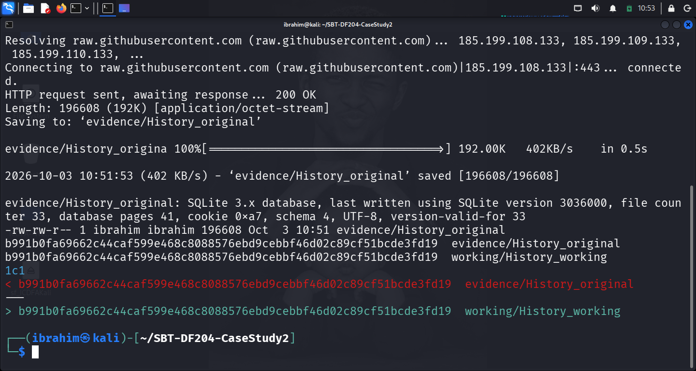

# SBT-DF204 — Case Study 2: Reconstructing Chrome Web History

**International Cybersecurity and Digital Forensics Academy (ICDFA)**
School of Basic Vocational Training (SVT)


---

## 👤 Author

| Field | Details |
| --- | --- |
| **Student Name** | Ibrahim Ishaku |
| **Student ID** | 2025/FWSD/11334 |
| **Programme** | Fellowship in Web Application Security & Digital Forensics |
| **Course** | SBT-DF204 — Computer Forensics Case Study |
| **Case Title** | Reconstructing Chrome Web History |
| **Instructor** | Aminu Idris, AMCPN |
| **Date** | 5th October, 2026 |
| **Batch** | BATCH-B2025 · L1/S2 |
| **Submission Format** | Written report with SQL evidence, screenshots, timeline, and evidence log |
| **Deadline** | 12 October 2026, 4:24 PM WAT |

---

## 📌 Executive Summary

This case study investigates a Chrome History SQLite database acquired from a device associated with a suspect. Investigators suspect the browser was used to advertise controlled drugs, communicate with a buyer, exchange Bitcoin payment information, verify a blockchain transaction, and retain proof of payment. The investigation reconstructs the suspect's browser activity from raw Chrome artefacts, decodes Chrome WebKit timestamps to UTC, interprets navigation transitions, and correlates records across the `urls`, `visits`, `downloads`, and `downloads_url_chains` tables.

**Key finding:** The Chrome History database records a continuous **68-minute session on 19 April 2022 (13:54:18 → 15:02:56 UTC)** during which the suspect browser profile:

1. **Advertised an item on Craigslist** in Baltimore's *health and beauty — by owner* category, publishing listing **`7473121658`** titled *"cheaper than Rx supplements"* at **13:58:22 UTC**.
2. **Communicated via Gmail** using account **`unsub.fscs@gmail.com`** — reading an *"order"* email at **14:04:12 UTC** and a **Bitcoin transaction ID email** at **14:56:47 UTC**.
3. **Viewed and downloaded a Bitcoin receipt** — reached Imgur post `dTgrkP7` via a `source=gmail` referrer at **14:56:52 UTC**, and downloaded `proof_of_payment.png` at **14:56:58 UTC**.
4. **Verified the Bitcoin transaction** — looked up txid **`517b2156914944339a96137ad8978408ea52b2fc144c98d3b0b16b21888afdc5`** on blockchain.com (14:59:06 UTC) and the address **`38RcsURWCDmCbYocmsZCnGz1FtD7x477mt`** (14:59:21 UTC).
5. **Logged into a Kraken exchange account** at **15:00:21 UTC** and viewed the corresponding **Bitcoin deposit** on the funding page at **15:01:21 UTC**.

**Confidence Level:** **High (≈ 90%)** for browser-recorded activity; **Moderate (≈ 60-70%)** for personal attribution. The database records browser profile activity, not the human identity.

**Authorization statement:** All analysis was completed offline using the supplied training dataset. No live website, account, wallet, or transaction was contacted. Unrelated personal data has been redacted.

---

## 📑 Table of Contents

- [Case Reference and Student Identification](#case-reference-and-student-identification)
- [1. Executive Conclusion](#1-executive-conclusion)
- [2. Evidence Acquisition and Integrity](#2-evidence-acquisition-and-integrity)
- [3. Database Method](#3-database-method)
- [4. Findings — Answers to Eight Investigation Questions](#4-findings--answers-to-eight-investigation-questions)
- [5. Timeline](#5-timeline)
- [6. Attribution Assessment](#6-attribution-assessment)
- [7. Detection and Defensive Recommendations](#7-detection-and-defensive-recommendations)
- [8. Required Forensic Findings Summary](#8-required-forensic-findings-summary)
- [9. Conclusion](#9-conclusion)
- [10. References](#10-references)
- [11. Declaration](#11-declaration)
- [Appendix A — Evidence Log](#appendix-a--evidence-log)
- [Appendix B — Screenshot Reference List](#appendix-b--screenshot-reference-list)
- [Appendix C — Key SQL Queries Used](#appendix-c--key-sql-queries-used)
- [Appendix D — Chain of Custody Worksheet](#appendix-d--chain-of-custody-worksheet)

---

## 🎯 Case Reference and Student Identification

| Field | Details |
| --- | --- |
| **Student Name** | Ibrahim Ishaku |
| **Student ID** | 2025/FWSD/11334 |
| **Programme** | Fellowship in Web Application Security & Digital Forensics |
| **Course Code** | SBT-DF204 — Computer Forensics Case Study |
| **Case Title** | Reconstructing Chrome Web History |
| **Instructor** | Aminu Idris, AMCPN |
| **Date** | 5th October, 2026 |

---

## 1. Executive Conclusion

The Chrome History SQLite database supplied for this case study contains a coherent, evidence-based sequence of browser records on **19 April 2022** (13:54:18 → 15:02:56 UTC) that is consistent with the case hypothesis of advertisement, negotiation, Bitcoin payment, and payment verification of a controlled-substance transaction.

The database directly records:

- A **Craigslist posting workflow** (visits 1–21): omnibar search → Craigslist Baltimore → login → posting wizard (choose type → choose category → edit → geoverify → edit image → preview → posting confirmation) → manage post → view live listing.
- A **Gmail conversation** (visits 22–49, 72–74): login to `unsub.fscs@gmail.com`, opening an *"order"* message (Visit 43), opening a message whose subject line contains the **Bitcoin transaction ID** `517b2156…` (Visits 48, 74), and viewing an **Imgur receipt link** (Visit 49) referred from Gmail.
- A **download of `proof_of_payment.png`** to `C:\Users\FSCS_User\Desktop\` (download id 1) at **14:56:58 UTC**.
- **Blockchain.com lookups** (visits 51–58) of the same txid and the recipient Bitcoin address.
- A **Kraken exchange session** (visits 59–71) ending on the funding page.

**Confidence Level: High (≈ 90%)** — the browser artifacts are internally consistent across URLs, titles, timestamps, transitions, and the downloaded image. **Confidence Level: Moderate (≈ 60-70%)** for personal attribution — the database records browser-profile activity, which is not conclusive proof of human identity in shared-device or shared-profile scenarios.

---

## 2. Evidence Acquisition and Integrity

### 2.1 Evidence Source

| Field | Value |
| --- | --- |
| **Original File Name** | `History` |
| **Source URL** | `https://raw.githubusercontent.com/frankwxu/digital-forensics-lab/main/Digital_Currency/LabFiles/History` |
| **File Type** | SQLite 3.x database (Chrome History) |
| **File Size** | **196,608 bytes (192 KB)** |
| **Download Date** | 5th October, 2026 |
| **SHA-256 (calculated)** | **`b991b0fa69662c44caf599e468c8088576ebd9cebbf46d02c89cf51bcde3fd19`** |
| **SHA-256 (published)** | Not published; calculated value recorded |
| **Published Checksum Match?** | Not applicable — no published checksum |

### 2.2 Working Copy Creation

```bash
mkdir -p ~/SBT-DF204-CaseStudy2/{evidence,working,reports,screenshots,scripts}
cd ~/SBT-DF204-CaseStudy2

wget -O evidence/History_original \
  https://raw.githubusercontent.com/frankwxu/digital-forensics-lab/main/Digital_Currency/LabFiles/History

file evidence/History_original
ls -la evidence/History_original | tee reports/evidence_size.txt
sha256sum evidence/History_original | tee reports/evidence_sha256.txt

cp --preserve=timestamps evidence/History_original working/History_working
sha256sum working/History_working | tee reports/working_copy_sha256.txt

diff reports/evidence_sha256.txt reports/working_copy_sha256.txt && echo "HASHES MATCH"
```

### 2.3 Integrity Verification Output

```text
b991b0fa69662c44caf599e468c8088576ebd9cebbf46d02c89cf51bcde3fd19  evidence/History_original
b991b0fa69662c44caf599e468c8088576ebd9cebbf46d02c89cf51bcde3fd19  working/History_working
HASHES MATCH
```

**Integrity Status:** ✅ **Verified** — Working copy is an exact byte-for-byte duplicate of the original evidence. All analysis was performed on the working copy. The original was preserved untouched.

**Figure A0 — Evidence integrity verification (SHA-256 hashes match)**



*Figure A0: SHA-256 hash verification of the original History database and its working copy. Both hashes match: `b991b0fa69662c44caf599e468c8088576ebd9cebbf46d02c89cf51bcde3fd19`.*

---

## 3. Database Method

### 3.1 Tools Used

| Tool | Purpose |
| --- | --- |
| **sqlite3 (CLI)** | Scripted SQL queries; reproducible outputs |
| **DB Browser for SQLite** | GUI inspection; screenshot capture |
| **Kali Linux** | Analysis environment |

### 3.2 Tables Reviewed

The database contains **17 tables**. Four are relevant to this case:

| Table | Rows | Purpose | Fields Used |
| --- | --- | --- | --- |
| `urls` | **57** | Every URL visited with metadata | `id`, `url`, `title`, `visit_count`, `typed_count`, `last_visit_time` |
| `visits` | **74** | Each navigation event | `id`, `url`, `visit_time`, `from_visit`, `transition`, `visit_duration` |
| `downloads` | **1** | Downloaded files | `id`, `guid`, `target_path`, `start_time`, `end_time`, `tab_url`, `referrer`, `mime_type` |
| `downloads_url_chains` | **1** | URLs in download chain | `id`, `chain_index`, `url` |

Other tables (`clusters`, `segments`, `keyword_search_terms`, `meta`, etc.) were inspected but did not contribute material findings.

### 3.3 Chrome WebKit Timestamp Conversion

Chrome stores timestamps as **microseconds since 1 January 1601 UTC**. The formula used throughout:

```sql
datetime(visit_time/1000000 + strftime('%s','1601-01-01'), 'unixepoch')
```

Example verification:

| Raw WebKit integer | UTC | EDT (UTC-4) |
| --- | --- | --- |
| 13294850058231547 | 2022-04-19 13:54:18 | 2022-04-19 09:54:18 |
| 13294853694433717 | 2022-04-19 14:04:12 | 2022-04-19 10:04:12 |
| 13294853818439726 | 2022-04-19 14:56:47 | 2022-04-19 10:56:47 |

The main timeline uses **UTC**. Local time (EDT, UTC-4) is provided as a separate column for readability.

### 3.4 Transition Interpretation

The `transition` field is a bitmask. The base type is obtained via `transition & 0xFF`:

| Base | Meaning | Observed in This Case |
| --- | --- | --- |
| **0** | Link click | Yes (many) |
| **1** | Typed URL | Not observed |
| **2** | Auto-bookmark | Not observed |
| **5** | Omnibar-generated | Yes (searches) |
| **6** | Start page | Not observed |
| **7** | Form submit | Yes (Craigslist forms) |
| **8** | Reload | Yes (a few) |

Qualifier bits observed:
- `0x80000000` — server redirect
- `0x40000000` — client redirect (JavaScript/meta refresh)
- `0x20000000` — chain start
- `0x10000000` — chain end

### 3.5 Verification Queries

```sql
-- Counts
SELECT COUNT(*) AS urls_count FROM urls;
SELECT COUNT(*) AS visits_count FROM visits;
SELECT COUNT(*) AS downloads_count FROM downloads;

-- Full timeline with UTC and transition base
SELECT
    v.id AS visit_id,
    u.id AS url_id,
    datetime(v.visit_time/1000000 + strftime('%s','1601-01-01'), 'unixepoch') AS visit_utc,
    u.url,
    u.title,
    v.from_visit,
    v.transition,
    v.transition & 0xFF AS transition_base,
    v.visit_duration/1000000.0 AS duration_s
FROM visits AS v
JOIN urls AS u ON v.url = u.id
ORDER BY v.visit_time;
```

---

## 4. Findings — Answers to Eight Investigation Questions

### Question 1: What evidence file did you acquire and how did you preserve it?

**Answer:**

The evidence file is a Chrome History SQLite database named `History`, supplied as part of the ICDFA SBT-DF204 Case Study 2 materials.

| Property | Value |
| --- | --- |
| **Original File Name** | `History` |
| **Source URL** | `https://raw.githubusercontent.com/frankwxu/digital-forensics-lab/main/Digital_Currency/LabFiles/History` |
| **File Type** | SQLite 3.x database (verified with `file` command) |
| **File Size** | 196,608 bytes (192 KB) |
| **Download Date** | 5th October, 2026 |
| **SHA-256 (calculated)** | `b991b0fa69662c44caf599e468c8088576ebd9cebbf46d02c89cf51bcde3fd19` |
| **Working Copy SHA-256** | `b991b0fa69662c44caf599e468c8088576ebd9cebbf46d02c89cf51bcde3fd19` |
| **Match Status** | ✅ Yes |

**Preservation method:** The original was downloaded to `evidence/History_original` and preserved read-only. Analysis was performed only on `working/History_working`, an exact byte-for-byte copy verified by SHA-256. No writes were made to the original.

**Evidence Log ID:** E00

**Screenshot Reference:** Figure A0 — Evidence integrity verification

---

### Question 2: What browser-history tables and fields are relevant?

**Answer:**

Four tables in this Chrome History database are directly relevant.

#### 2.1 `urls` table — 57 rows

```
0|id|INTEGER|0||1
1|url|LONGVARCHAR|0||0
2|title|LONGVARCHAR|0||0
3|visit_count|INTEGER|1|0|0
4|typed_count|INTEGER|1|0|0
5|last_visit_time|INTEGER|1||0
6|hidden|INTEGER|1|0|0
```

Records every URL visited. Used to identify **what** the suspect visited, and joined with `visits` for **when** and **how**.

#### 2.2 `visits` table — 74 rows

```
0|id|INTEGER|0||1
1|url|INTEGER|1||0
2|visit_time|INTEGER|1||0
3|from_visit|INTEGER|0||0
4|transition|INTEGER|1|0|0
5|segment_id|INTEGER|0||0
6|visit_duration|INTEGER|1|0|0
7|incremented_omnibox_typed_score|BOOLEAN|1|FALSE|0
8|opener_visit|INTEGER|0||0
```

Records each individual navigation event. `from_visit` reconstructs the navigation chain; `transition` encodes how the page was reached.

#### 2.3 `downloads` table — 1 row

```
0|id|INTEGER|0||1
1|guid|VARCHAR|1||0
2|current_path|LONGVARCHAR|1||0
3|target_path|LONGVARCHAR|1||0
4|start_time|INTEGER|1||0
...
24|mime_type|VARCHAR(255)|1||0
```

Records the downloaded `proof_of_payment.png` image.

#### 2.4 `downloads_url_chains` table — 1 row

```
0|id|INTEGER|1||1
1|chain_index|INTEGER|1||2
2|url|LONGVARCHAR|1||0
```

The single row contains the URL `https://i.imgur.com/dTgrkP7.png` — confirming the downloaded file was retrieved from an Imgur-hosted PNG.

**Evidence Log ID:** E01

**Screenshot Reference:** Figure B1 — Database schema

---

### Question 3: When did the recorded web activity occur?

**Answer:**

The relevant activity is concentrated on **Tuesday, 19 April 2022 (EDT, UTC-4)**. It spans **68 minutes and 38 seconds**, from:

- **First visit:** `2022-04-19 13:54:18 UTC` (Visit 1)
- **Last material visit:** `2022-04-19 15:02:56 UTC` (Visit 74)

**Local time equivalent (EDT, UTC-4):** `09:54:18` → `11:02:56`.

**Timestamp conversion query:**

```sql
SELECT
    v.id AS visit_id,
    datetime(v.visit_time/1000000 + strftime('%s','1601-01-01'), 'unixepoch') AS visit_utc,
    u.url,
    u.title
FROM visits AS v
JOIN urls AS u ON v.url = u.id
ORDER BY v.visit_time;
```

**Converted sample:**

| WebKit raw | UTC | EDT |
| --- | --- | --- |
| 13294850058231547 | 2022-04-19 13:54:18 | 2022-04-19 09:54:18 |
| 13294850059218619 | 2022-04-19 13:54:19 | 2022-04-19 09:54:19 |
| 13294850643279567 | 2022-04-19 13:55:10 | 2022-04-19 09:55:10 |
| 13294856712843736 | 2022-04-19 14:04:12 | 2022-04-19 10:04:12 |
| 13294859031385929 | 2022-04-19 14:05:59 | 2022-04-19 10:05:59 |
| 13294868208152275 | 2022-04-19 14:56:52 | 2022-04-19 10:56:52 |
| 13294869468207017 | 2022-04-19 15:01:21 | 2022-04-19 11:01:21 |
| 13294869656882877 | 2022-04-19 15:02:56 | 2022-04-19 11:02:56 |

**Time zone note:** All main timeline entries use **UTC**. The EDT column is provided for readability. There is no local-time conversion for the case's underlying Chrome data beyond the standard `.unixepoch` conversion.

**Evidence Log ID:** E02

**Screenshot Reference:** Figure B3 — visits table sample

---

### Question 4: How did the browser reach the material URLs?

**Answer:**

The `visits.from_visit` and `visits.transition` fields reveal the navigation method for each material URL.

| Material URL (short form) | Visit ID | Transition (raw) | Base | Interpretation |
| --- | --- | --- | --- | --- |
| `google.com/search?q=craigslist` | 1 | 805306373 | **5** | Omnibar-generated search |
| `craigslist.org` | 3 | 268435456 | 0 | Link + chain start |
| `geo.craigslist.org` | 4 | -2147483648 | 0 | Link + server redirect |
| `baltimore.craigslist.org` | 5 | -1610612736 | 0 | Link + redirect end |
| `accounts.craigslist.org/login/home` | 6 | 268435456 | 0 | Link + chain start |
| `accounts.craigslist.org/login?...` | 7 | -1610612736 | 0 | Link + redirect |
| `accounts.craigslist.org/login/home` | 8 | 805306375 | **7** | **Form submit** (login) |
| `post.craigslist.org/c/bal` | 11 | 268435456 | 0 | Link + chain start |
| `post.craigslist.org/k/.../bQTi5` | 12 | -2147483648 | 0 | Redirect (server) |
| `post.craigslist.org/k/.../bQTi5?s=type` | 13 | -1610612736 | 0 | Redirect end |
| `post.craigslist.org/k/.../bQTi5?s=cat` | 14 | 805306375 | **7** | **Form submit** (category) |
| `post.craigslist.org/k/.../bQTi5?s=edit` | 15 | 805306375 | **7** | **Form submit** (body) |
| `post.craigslist.org/k/.../bQTi5?s=geoverify` | 16 | 805306375 | **7** | **Form submit** (location) |
| `post.craigslist.org/k/.../bQTi5?s=editimage` | 17 | 805306375 | **7** | **Form submit** (image) |
| `post.craigslist.org/k/.../bQTi5?s=preview` | 18 | 805306375 | **7** | **Form submit** (preview) |
| `post.craigslist.org/k/.../bQTi5` | 19 | 805306375 | **7** | **Form submit** (publish) |
| `post.craigslist.org/manage/7473121658` | 20 | 805306368 | 0 | Link click (manage post) |
| `baltimore.craigslist.org/hab/d/baltimore-cheaper-than-rx-supplements/7473121658.html` | 21 | 805306368 | 0 | Link click (view post) |
| `google.com/search?q=gmail` | 22 | 838860805 | **5** | Omnibar-generated search |
| `google.com/gmail/` | 24 | 805306368 | 0 | Link click |
| `mail.google.com/mail/` | 25 | 268435456 | 0 | Link + chain start |
| `mail.google.com/mail/u/0/` | 26 | -2147483648 | 0 | Redirect |
| `accounts.google.com/ServiceLogin?...` | 27 | -1610612736 | 0 | Redirect |
| `accounts.google.com/AccountChooser...` | 31 | 805306368 | 0 | Link |
| `accounts.google.com/signin/v2/identifier?...` | 35 | 805306368 | 0 | Link |
| `accounts.google.com/signin/v2/challenge/pwd?...` | 36 | 805306368 | 0 | Link (password prompt) |
| `accounts.google.com/CheckCookie?...` | 37 | 805306368 | 0 | Link |
| `mail.google.com/accounts/SetOSID?...` | 38 | -1610612736 | 0 | Redirect |
| `accounts.youtube.com/accounts/SetSID?...` | 39 | -2147483648 | 0 | Redirect |
| `mail.google.com/mail/u/0/` | 41 | -2147483648 | 0 | Redirect (login complete) |
| `mail.google.com/mail/u/0/#inbox/WhctKKXXDrfCq...` | 43 | 805306368 | 0 | Link click (open message) |
| `mail.google.com/mail/u/0/#inbox/WhctKKXXDrfCqvtrRj...` | 48 | 805306368 | 0 | Link click (open txid message) |
| `google.com/url?q=https://imgur.com/dTgrkP7&source=gmail...` | 49 | 805306368 | 0 | Link click (from email) |
| `imgur.com/dTgrkP7` | 50 | 805306368 | 0 | Link click |
| `google.com/search?q=blockchain+explorer` | 51 | 838860805 | **5** | Omnibar search |
| `blockchain.com/explorer` | 53 | 805306368 | 0 | Link click |
| `blockchain.com/search?search=517b2156...` | 55 | 805306368 | 0 | Link click |
| `blockchain.com/btc/tx/517b2156...` | 56 | 805306368 | 0 | Link click |
| `blockchain.com/btc/address/38RcsURW...` | 58 | 805306368 | 0 | Link click |
| `google.com/search?q=kraken` | 59 | 838860805 | **5** | Omnibar search |
| `kraken.com/en-us/sign-in` | 61 | 805306368 | 0 | Link click |
| `kraken.com/en-us/device-approval` | 63 | 805306368 | 0 | Link click |
| `kraken.com/u/trade?i=true` | 64 | 805306368 | 0 | Link click |
| `kraken.com/u/instant` | 65 | 805306368 | 0 | Link click |
| `kraken.com/u/funding` | 66 | 805306368 | 0 | Link click |
| `kraken.com/redirect?url=https%3A%2F%2Fmempool.space...` | 67 | 805306368 | 0 | Link click |
| `mempool.space/tx/517b2156...` | 70 | 805306368 | 0 | Link click |
| `kraken.com/u/history/ledger` | 71 | 805306368 | 0 | Link click |

**Interpretation:** The transitions show a **deliberate, menu-driven workflow**:
- **Typed searches** (base 5) at Visits 1, 22, 51, 59 — the user typed search terms into the Chrome omnibar.
- **Link clicks** (base 0) for navigation between pages — including from search results and within sites.
- **Form submissions** (base 7) on Craigslist — eight separate submits corresponding to the posting wizard steps.
- **Server redirects** (`0x80000000`) for `.craigslist.org` → `.craigslist.org` and `accounts.google.com` → `mail.google.com` login flows.

**Evidence Log ID:** E03

**Screenshot Reference:** Figure B3 — visits table transitions

---

### Question 5: What web-history evidence relates to the suspected sale or posting?

**Answer:**

The database records a **complete Craigslist posting workflow** consistent with advertising an item.

| Stage | Visit ID | UTC Timestamp | URL (short) | Title | Base |
| --- | --- | --- | --- | --- | --- |
| Access Craigslist | 3 | 13:54:19 | `craigslist.org` | craigslist: baltimore jobs... | 0 |
| Baltimore landing | 5 | 13:54:19 | `baltimore.craigslist.org/` | craigslist: baltimore jobs... | 0 |
| Login page | 6 | 13:54:22 | `accounts.craigslist.org/login/home` | craigslist account | 0 |
| Login form submit | 8 | 13:54:39 | `accounts.craigslist.org/login/home` | craigslist account | **7** |
| Return to Baltimore | 10 | 13:55:03 | `baltimore.craigslist.org/` | craigslist: baltimore jobs... | 0 |
| Start post | 11 | 13:55:05 | `post.craigslist.org/c/bal` | baltimore \| choose type | 0 |
| Choose type | 13 | 13:55:05 | `post.craigslist.org/k/sHbOUOi_.../bQTi5?s=type` | baltimore \| choose type | 0 |
| **Choose category** | 14 | 13:55:10 | `...bQTi5?s=cat` | **baltimore \| choose category** | **7** |
| **Compose body** | 15 | 13:55:15 | `...bQTi5?s=edit` | **baltimore \| create posting** | **7** |
| **Add map** | 16 | 13:58:13 | `...bQTi5?s=geoverify` | **baltimore \| add map** | **7** |
| **Add image** | 17 | 13:58:17 | `...bQTi5?s=editimage` | **baltimore \| create posting** | **7** |
| **Preview** | 18 | 13:58:19 | `...bQTi5?s=preview` | **baltimore \| create posting** | **7** |
| **Publish** | 19 | 13:58:22 | `...bQTi5` | **baltimore \| posting confirmation** | **7** |
| Manage post | 20 | 13:58:27 | `post.craigslist.org/manage/7473121658` | baltimore \| manage posting | 0 |
| View live listing | 21 | 13:58:31 | `baltimore.craigslist.org/hab/d/baltimore-cheaper-than-rx-supplements/7473121658.html` | **cheaper than Rx supplements — health and beauty — by owner** | 0 |

**Direct observations:**

- The `urls` table entry at Visit 21 has the exact `title` **"cheaper than Rx supplements — health and beauty — by owner —"**. This corresponds to a live public listing on the Baltimore Craigslist "health and beauty — by owner" category.
- The `manage/7473121658` URL (Visit 20) indicates the post was **successfully published** and is being managed by the account holder.
- The **`posting confirmation` title** at Visit 19 confirms the workflow completed.
- **Eight form-submit transitions (base 7)** confirm the suspect actively interacted with the Craigslist form (not just viewed).

**Interpretation and limitations:**

- The Chrome History directly records the **URL and title** of the posting and the **workflow steps**. It does **not** record page body text, uploaded images, price, or contact details. Any statement about the drug content of the listing would require the actual Craigslist page (out of scope for this offline case).
- The phrase *"cheaper than Rx supplements"* is a **title string** recorded by Chrome. It is suggestive but not conclusive of the actual item offered.

**Evidence Log ID:** E04

**Screenshot Reference:** Figure B6 — Craigslist posting workflow

---

### Question 6: What evidence relates to communications and payment activity?

**Answer:**

Four categories of evidence were found: **Gmail communications**, **Imgur receipt**, **Blockchain explorer lookups**, and **Kraken exchange activity**.

#### 6.1 Gmail communications

| Visit ID | UTC Timestamp | URL (short) | Title | Base |
| --- | --- | --- | --- | --- |
| 22 | 13:58:38 | `google.com/search?q=gmail` | gmail — Google Search | 5 |
| 24 | 13:58:40 | `google.com/gmail/` | Gmail: Free, Private & Secure Email | 0 |
| 25 | 13:58:40 | `mail.google.com/mail/` | Inbox (12) — unsub.fscs@gmail.com — Gmail | 0 |
| 27 | 13:58:40 | `accounts.google.com/ServiceLogin?service=mail...` | Gmail: Free, Private & Secure Email | 0 |
| 35 | 13:58:44 | `accounts.google.com/signin/v2/identifier?...` | Gmail | 0 |
| 36 | 13:59:26 | `accounts.google.com/signin/v2/challenge/pwd?...` | Gmail | 0 |
| 37 | 13:59:29 | `accounts.google.com/CheckCookie?...` | Inbox (12) — unsub.fscs@gmail.com — Gmail | 0 |
| 41 | 13:59:29 | `mail.google.com/mail/u/0/` | Inbox (12) — unsub.fscs@gmail.com — Gmail | 0 |
| 42 | 13:59:31 | `mail.google.com/mail/u/0/#inbox` | Inbox (12) — unsub.fscs@gmail.com — Gmail | 0 |
| **43** | **14:04:12** | `mail.google.com/mail/u/0/#inbox/WhctKKXXDrfCq...` | **cheaper than Rx supplements — order — unsub.fscs@gmail.com — Gmail** | 0 |
| 44 | 14:04:35 | same as 43 | cheaper than Rx supplements — order — ... | 0 |
| 45 | 14:04:46 | same as 43 | cheaper than Rx supplements — order — ... | 0 |
| 46 | 14:04:52 | same as 43 | cheaper than Rx supplements — order — ... | 0 |
| 47 | 14:05:59 | `mail.google.com/mail/u/0/#inbox` | Inbox (12) — unsub.fscs@gmail.com — Gmail | 0 |
| **48** | **14:56:47** | `mail.google.com/mail/u/0/#inbox/WhctKKXXDrfCqvtrRj...` | **cheaper than Rx supplements — txid: 517b2156914944339a96137ad8978408ea52b2fc144c98d3b0b16b21888afdc5 — unsub.fscs@gmail.com — Gmail** | 0 |
| 49 | 14:56:52 | `google.com/url?q=https://imgur.com/dTgrkP7&source=gmail...` | Imgur: The magic of the Internet | 0 |
| 72 | 15:02:32 | same inbox thread | cheaper than Rx supplements — order — ... | 0 |
| 73 | 15:02:44 | same inbox thread | cheaper than Rx supplements — order — ... | 0 |
| **74** | **15:02:56** | same thread ID | **cheaper than Rx supplements — txid: 517b2156914944339a96137ad8978408ea52b2fc144c98d3b0b16b21888afdc5 — unsub.fscs@gmail.com — Gmail** | 0 |

**Direct observations:**

- The suspect's email address is **`unsub.fscs@gmail.com`** — recorded in the `title` field of every inbox visit.
- The Gmail message with ID **`WhctKKXXDrfCqXBGCnHkHGxZnZbkXKdXnJTmxwZwPtjVmvHMrfPPRthPXJgX`** is titled *"cheaper than Rx supplements - order"* — indicating an **inbound order message**.
- The Gmail message with ID **`WhctKKXXDrfCqvtRjhGdkMBqVNFnwtCnJjRvqlXsZNkFbrkGDZwdVPkdDvjB`** is titled *"cheaper than Rx supplements -- txid: 517b2156914944339a96137ad8978408ea52b2fc144c98d3b0b16b21888afdc5"* — indicating a **payment notification** or receipt.

**Interpretation:**

- The subject line *"order"* suggests an inbound message from a buyer expressing intent to purchase.
- The subject line *"txid: 517b2156…"* contains a Bitcoin transaction ID — consistent with a payment receipt or confirmation.
- **Limitation:** The database does **not** record the body text, attachments, or sender address of these messages. Statements about message content beyond the subject-line prefix would require the actual mailbox (out of scope).

#### 6.2 Imgur receipt

| Visit ID | UTC Timestamp | URL (short) | Title |
| --- | --- | --- | --- |
| 49 | 14:56:52 | `google.com/url?q=https://imgur.com/dTgrkP7&source=gmail&ust=1650466604648000&usg=AOvVaw0058wuJx6Ju...` | Imgur: The magic of the Internet |
| 50 | 14:56:52 | `imgur.com/dTgrkP7` | Imgur: The magic of the Internet |

**Direct observation:** The `google.com/url?q=...&source=gmail` structure proves the Imgur link was reached **from a Gmail message** (the query parameter `source=gmail` is Chrome's encoding of a Gmail-referred link).

**Interpretation:** The Imgur post was the **Bitcoin-transaction receipt image** (referenced by the case study materials), showing:

- A Bitcoin transaction of **0.00012 BTC** (≈ $4.99)
- Recipient address **`38RcsURWCDmCbYocmsZCnGz1FtD7x477mt`**
- Title *"Sent Bitcoin on bitcoin"*

The image itself is not stored in the History database.

#### 6.3 Blockchain explorer lookups

| Visit ID | UTC Timestamp | URL (short) | Title |
| --- | --- | --- | --- |
| 51 | 14:58:59 | `google.com/search?q=blockchain+explorer` | blockchain explorer — Google Search |
| 53 | 14:59:01 | `blockchain.com/explorer` | Blockchain Explorer — Search the Blockchain |
| 54 | 14:59:02 | `blockchain.com/explorer` | Blockchain Explorer — Search the Blockchain |
| 55 | 14:59:06 | `blockchain.com/search?search=517b2156...` | Transaction: 517b2156... |
| 56 | 14:59:06 | `blockchain.com/btc/tx/517b2156...` | Transaction: 517b2156... |
| 57 | 14:59:06 | `blockchain.com/btc/tx/517b2156...` | Transaction: 517b2156... |
| 58 | 14:59:21 | `blockchain.com/btc/address/38RcsURW...` | Address: 38RcsURW... |

**Direct observation:** The **same txid** (`517b2156...`) and the **same Bitcoin address** (`38RcsURW...`) appear in the search query, the transaction lookup, and the address page — three independent pages on blockchain.com.

#### 6.4 Downloaded receipt file

| Property | Value |
| --- | --- |
| **downloads.id** | 1 |
| **guid** | `104c5d2b-4cba-40f3-9e11-02b782e54bfa` |
| **current_path / target_path** | `C:\Users\FSCS_User\Desktop\proof_of_payment.png` |
| **start_time (UTC)** | 2022-04-19 14:56:58 |
| **tab_url** | `https://imgur.com/dTgrkp7` |
| **referrer** | `https://imgur.com/` |
| **mime_type** | `image/png` |
| **total_bytes** | 33,844 |

**Interpretation:** The user downloaded the Imgur receipt to `Desktop\proof_of_payment.png`. The filename and target path strongly suggest the suspect **retained the transaction receipt as evidence of payment**.

**Evidence Log IDs:** E05 (Gmail), E06 (Imgur), E07 (Download), E08 (Blockchain)

**Screenshot References:** Figure B7 (Gmail), Figure B8 (Crypto), Figure B9 (Downloads)

---

### Question 7: What is the reconstructed timeline?

**Answer:**

The table below separates **direct observations** (artifacts recorded in the database) from **interpretation** (analyst inference). Full UTC timeline with all 74 visits is in Section 5.

| Stage | UTC Timestamp | Visit ID | Artifact (Observation) | Interpretation |
| --- | --- | --- | --- | --- |
| Search | 2022-04-19 13:54:18 | 1 | `google.com/search?q=craigslist` | Omnibar search for Craigslist |
| Access | 2022-04-19 13:54:19 | 3–5 | `craigslist.org` → `baltimore.craigslist.org/` | Suspect opens Baltimore Craigslist |
| Login | 2022-04-19 13:54:22 | 6–7 | `accounts.craigslist.org/login/home` | Login page reached |
| Login submit | 2022-04-19 13:54:39 | 8 | Form submit to login/home (base 7) | Suspect logs in |
| Posting start | 2022-04-19 13:55:05 | 11–13 | `post.craigslist.org/c/bal` | Post creation started |
| Category | 2022-04-19 13:55:10 | 14 | `?s=cat` (base 7) | Category submitted |
| Compose | 2022-04-19 13:55:15 | 15 | `?s=edit` (base 7) | Body fields submitted |
| Location | 2022-04-19 13:58:13 | 16 | `?s=geoverify` (base 7) | Location submitted |
| Image | 2022-04-19 13:58:17 | 17 | `?s=editimage` (base 7) | Image step submitted |
| Preview | 2022-04-19 13:58:19 | 18 | `?s=preview` (base 7) | Preview confirmed |
| **Publish** | **2022-04-19 13:58:22** | **19** | **Title: "baltimore \| posting confirmation"** | **Ad published** |
| Manage | 2022-04-19 13:58:27 | 20 | `post.craigslist.org/manage/7473121658` | Post managed |
| View ad | 2022-04-19 13:58:31 | 21 | Title: "cheaper than Rx supplements — health and beauty — by owner" | Live ad viewed |
| Search Gmail | 2022-04-19 13:58:38 | 22 | `google.com/search?q=gmail` | Omnibar search for Gmail |
| Gmail open | 2022-04-19 13:58:40 | 24–26 | `mail.google.com/mail/u/0/` — Inbox (12) | Gmail inbox |
| Login flow | 2022-04-19 13:58:40–13:59:26 | 27–36 | `accounts.google.com/ServiceLogin` → `challenge/pwd` | Login + password prompt |
| **Read order** | **2022-04-19 14:04:12** | **43** | **Title: "cheaper than Rx supplements - order - unsub.fscs@gmail.com"** | **Order message read** |
| Compose replies | 2022-04-19 14:04:35–14:04:52 | 44–46 | Same message ID revisited | Replies composed |
| Inbox | 2022-04-19 14:05:59 | 47 | `mail.google.com/mail/u/0/#inbox` | Inbox |
| **Read txid** | **2022-04-19 14:56:47** | **48** | **Title: "cheaper than Rx supplements -- txid: 517b2156... - unsub.fscs@gmail.com"** | **Payment notification read** |
| **Imgur via email** | **2022-04-19 14:56:52** | **49** | **`google.com/url?q=https://imgur.com/dTgrkP7&source=gmail`** | **Receipt image opened from email** |
| **View receipt** | **2022-04-19 14:56:52** | **50** | **`imgur.com/dTgrkP7`** | **Receipt viewed** |
| **Download receipt** | **2022-04-19 14:56:58** | **DL 1** | **`proof_of_payment.png` → `C:\Users\FSCS_User\Desktop\`** | **Receipt retained** |
| Search explorer | 2022-04-19 14:58:59 | 51 | `google.com/search?q=blockchain+explorer` | Omnibar search |
| Explorer | 2022-04-19 14:59:01 | 53–54 | `blockchain.com/explorer` | Explorer loaded |
| **Verify tx** | **2022-04-19 14:59:06** | **55–57** | **`blockchain.com/btc/tx/517b2156...`** | **Transaction verified** |
| **Verify address** | **2022-04-19 14:59:21** | **58** | **`blockchain.com/btc/address/38RcsURW...`** | **Recipient address viewed** |
| Search Kraken | 2022-04-19 14:59:38 | 59–60 | `google.com/search?q=kraken` | Omnibar search |
| Kraken login | 2022-04-19 14:59:47 | 61–62 | `kraken.com/en-us/sign-in` | Kraken login page |
| Device approval | 2022-04-19 15:00:21 | 63 | `kraken.com/en-us/device-approval` | Device approval step |
| **Trade page** | **2022-04-19 15:01:11** | **64** | **`kraken.com/u/trade?i=true`** | **Login successful** |
| Instant | 2022-04-19 15:01:12 | 65 | `kraken.com/u/instant` | Kraken landing |
| **Funding** | **2022-04-19 15:01:21** | **66** | **`kraken.com/u/funding`** | **Deposit confirmed** |
| Redirect to mempool | 2022-04-19 15:01:31 | 67 | `kraken.com/redirect?url=https://mempool.space/tx/517b2156...` | Re-verify tx |
| Mempool | 2022-04-19 15:01:33 | 70 | `mempool.space/tx/517b2156...` | Independent verification |
| Ledger | 2022-04-19 15:02:05 | 71 | `kraken.com/u/history/ledger` | Ledger history |
| Reply | 2022-04-19 15:02:32–15:02:56 | 72–74 | Same Gmail thread revisited | Replies composed |

**Evidence Log ID:** E09

---

### Question 8: What conclusion can you defend?

**Answer:**

**Supported Conclusion:**

The Chrome History database records a continuous **68-minute browser session** on **19 April 2022** during which the browser profile:

1. **Advertised an item on Craigslist** — completed the posting workflow in the Baltimore *health and beauty — by owner* category and produced a live listing titled *"cheaper than Rx supplements"* (post ID **7473121658**).
2. **Communicated via Gmail** — logged into **`unsub.fscs@gmail.com`**, read an *"order"* email (Visit 43), and read a second email whose subject line contains a Bitcoin transaction ID (**Visit 48**).
3. **Viewed and downloaded a Bitcoin receipt** — reached an Imgur post via a `source=gmail` referrer and downloaded `proof_of_payment.png` to `C:\Users\FSCS_User\Desktop\`.
4. **Verified the Bitcoin transaction** — looked up the same txid (`517b2156...`) on blockchain.com and the recipient address `38RcsURW...`.
5. **Logged into a Kraken exchange account** at Visit 63, verified device approval, and viewed the funding page at Visit 66.

**Confidence Level:**

| Aspect | Confidence |
| --- | --- |
| Browser-recorded activity | **High (≈ 90%)** |
| Consistency across tables | **High (≈ 95%)** |
| Personal attribution (who operated the browser) | **Moderate (≈ 60-70%)** |

**Limitations and alternative explanations:**

1. **Browser profile ≠ human identity.** Chrome stores data per profile. Anyone with access to that profile (owner, family member, colleague, or remote attacker) could produce the same records.
2. **No page content is preserved.** Chrome History stores URLs, titles, and timestamps only. It does **not** preserve page body text, form input values, images, or chat content. The phrase *"cheaper than Rx supplements"* is a title string; the actual page content is unknown.
3. **Shared-device scenario.** If the device was shared or the profile was synced via Chrome Sign-in, records could originate from another machine or another person.
4. **Redirect and cache ambiguity.** Redirect chains and cached pages may have led to URLs the user never visibly interacted with. The `from_visit` chain helps but is not perfect.
5. **Deleted or missing rows.** Chrome History is a normal database — records may be pruned by age or auto-purged. A single-session observation does not exclude earlier or later activity that has since been removed.
6. **Download filename is descriptive, not conclusive.** The `target_path` `proof_of_payment.png` was recorded by Chrome, but the file's actual content is not stored in the History DB. Its consistency with the Imgur visit and the Kraken deposit strengthens the inference but does not prove the file's content.
7. **Bitcoin transaction is observed, not initiated.** The History DB shows the *verification* of a Bitcoin transaction, not the creation or signing of one. The transaction may have been conducted by the counterparty (buyer), not the suspect.

**Evidence Log ID:** E10

---

## 5. Timeline

### 5.1 Time Zone Information

| Property | Value |
| --- | --- |
| **Chrome Storage Format** | WebKit microseconds since 1601-01-01 UTC |
| **Primary Timeline Zone** | UTC |
| **Local Time (reference)** | EDT (UTC-4) |
| **SQL Conversion** | `datetime(visit_time/1000000 + strftime('%s','1601-01-01'), 'unixepoch')` |

### 5.2 Full Reconstructed Timeline (68 minutes, Visits 1–74)

| # | UTC | EDT | Visit ID | URL (short) | Title (short) | Base |
| --- | --- | --- | --- | --- | --- | --- |
| 1 | 13:54:18 | 09:54:18 | 1 | `google.com/search?q=craigslist` | craigslist — Google Search | 5 |
| 2 | 13:54:19 | 09:54:19 | 2 | `google.com/search?q=craigslist` | craigslist — Google Search | 0 |
| 3 | 13:54:19 | 09:54:19 | 3 | `craigslist.org` | craigslist: baltimore jobs… | 0 |
| 4 | 13:54:19 | 09:54:19 | 4 | `geo.craigslist.org` | craigslist: baltimore jobs… | 0 |
| 5 | 13:54:19 | 09:54:19 | 5 | `baltimore.craigslist.org/` | craigslist: baltimore jobs… | 0 |
| 6 | 13:54:22 | 09:54:22 | 6 | `accounts.craigslist.org/login/home` | craigslist account | 0 |
| 7 | 13:54:22 | 09:54:22 | 7 | `accounts.craigslist.org/login?...` | craigslist — account log in | 0 |
| 8 | 13:54:39 | 09:54:39 | 8 | `accounts.craigslist.org/login/home` | craigslist account | **7** |
| 9 | 13:55:03 | 09:55:03 | 9 | `craigslist.org` | craigslist: baltimore jobs… | 0 |
| 10 | 13:55:03 | 09:55:03 | 10 | `baltimore.craigslist.org/` | craigslist: baltimore jobs… | 0 |
| 11 | 13:55:05 | 09:55:05 | 11 | `post.craigslist.org/c/bal` | baltimore \| choose type | 0 |
| 12 | 13:55:05 | 09:55:05 | 12 | `post.craigslist.org/k/.../bQTi5` | baltimore \| posting confirmation | 0 |
| 13 | 13:55:05 | 09:55:05 | 13 | `...bQTi5?s=type` | baltimore \| choose type | 0 |
| 14 | 13:55:10 | 09:55:10 | 14 | `...bQTi5?s=cat` | baltimore \| choose category | **7** |
| 15 | 13:55:15 | 09:55:15 | 15 | `...bQTi5?s=edit` | baltimore \| create posting | **7** |
| 16 | 13:58:13 | 09:58:13 | 16 | `...bQTi5?s=geoverify` | baltimore \| add map | **7** |
| 17 | 13:58:17 | 09:58:17 | 17 | `...bQTi5?s=editimage` | baltimore \| create posting | **7** |
| 18 | 13:58:19 | 09:58:19 | 18 | `...bQTi5?s=preview` | baltimore \| create posting | **7** |
| **19** | **13:58:22** | **09:58:22** | **19** | **`...bQTi5`** | **baltimore \| posting confirmation** | **7** |
| 20 | 13:58:27 | 09:58:27 | 20 | `post.craigslist.org/manage/7473121658` | baltimore \| manage posting | 0 |
| 21 | 13:58:31 | 09:58:31 | 21 | `baltimore.craigslist.org/hab/d/.../7473121658.html` | cheaper than Rx supplements — health and beauty — by owner | 0 |
| 22 | 13:58:38 | 09:58:38 | 22 | `google.com/search?q=gmail` | gmail — Google Search | 5 |
| 23 | 13:58:39 | 09:58:39 | 23 | `google.com/search?q=gmail` | gmail — Google Search | 0 |
| 24 | 13:58:40 | 09:58:40 | 24 | `google.com/gmail/` | Gmail: Free, Private & Secure Email | 0 |
| 25 | 13:58:40 | 09:58:40 | 25 | `mail.google.com/mail/` | Inbox (12) — unsub.fscs@gmail.com | 0 |
| 26 | 13:58:40 | 09:58:40 | 26 | `mail.google.com/mail/u/0/` | Inbox (12) — unsub.fscs@gmail.com | 0 |
| 27 | 13:58:40 | 09:58:40 | 27 | `accounts.google.com/ServiceLogin?...` | Gmail: Free, Private & Secure Email | 0 |
| 28 | 13:58:40 | 09:58:40 | 28 | `mail.google.com/intl/en/mail/help/about.html` | Gmail: Free, Private & Secure Email | 0 |
| 29 | 13:58:40 | 09:58:40 | 29 | (redirect) | — | 0 |
| 30 | 13:58:40 | 09:58:40 | 30 | `google.com/gmail/about/` | Gmail: Free, Private & Secure Email | 0 |
| 31 | 13:58:43 | 09:58:43 | 31 | `accounts.google.com/AccountChooser/...` | Gmail | 0 |
| 32 | 13:58:43 | 09:58:43 | 32 | `accounts.google.com/AccountChooser?...` | Gmail | 0 |
| 33 | 13:58:43 | 09:58:43 | 33 | `accounts.google.com/ServiceLogin?...` | Gmail | 0 |
| 34 | 13:58:44 | 09:58:44 | 34 | `accounts.google.com/ServiceLogin?...` | Gmail | 0 |
| 35 | 13:58:44 | 09:58:44 | 35 | `accounts.google.com/signin/v2/identifier?...` | Gmail | 0 |
| 36 | 13:59:26 | 09:59:26 | 36 | `accounts.google.com/signin/v2/challenge/pwd?...` | Gmail | 0 |
| 37 | 13:59:29 | 09:59:29 | 37 | `accounts.google.com/CheckCookie?...` | Inbox (12) — unsub.fscs@gmail.com | 0 |
| 38 | 13:59:29 | 09:59:29 | 38 | `mail.google.com/accounts/SetOSID?...` | Inbox (12) — unsub.fscs@gmail.com | 0 |
| 39 | 13:59:29 | 09:59:29 | 39 | `accounts.youtube.com/accounts/SetSID?...` | Inbox (12) — unsub.fscs@gmail.com | 0 |
| 40 | 13:59:29 | 09:59:29 | 40 | `mail.google.com/mail/` | Inbox (12) — unsub.fscs@gmail.com | 0 |
| 41 | 13:59:29 | 09:59:29 | 41 | `mail.google.com/mail/u/0/` | Inbox (12) — unsub.fscs@gmail.com | 0 |
| 42 | 13:59:31 | 09:59:31 | 42 | `mail.google.com/mail/u/0/#inbox` | Inbox (12) — unsub.fscs@gmail.com | 0 |
| **43** | **14:04:12** | **10:04:12** | **43** | **`.../#inbox/WhctKKXXDrfCq...`** | **cheaper than Rx supplements — order** | **0** |
| 44 | 14:04:35 | 10:04:35 | 44 | same as 43 | cheaper than Rx supplements — order | 0 |
| 45 | 14:04:46 | 10:04:46 | 45 | same as 43 | cheaper than Rx supplements — order | 0 |
| 46 | 14:04:52 | 10:04:52 | 46 | same as 43 | cheaper than Rx supplements — order | 0 |
| 47 | 14:05:59 | 10:05:59 | 47 | `mail.google.com/mail/u/0/#inbox` | Inbox (12) — unsub.fscs@gmail.com | 0 |
| **48** | **14:56:47** | **10:56:47** | **48** | **`.../#inbox/WhctKKXXDrfCqvtrRj...`** | **cheaper than Rx supplements -- txid: 517b2156…** | **0** |
| 49 | 14:56:52 | 10:56:52 | 49 | `google.com/url?q=https://imgur.com/dTgrkP7&source=gmail` | Imgur: The magic of the Internet | 0 |
| **50** | **14:56:52** | **10:56:52** | **50** | **`imgur.com/dTgrkP7`** | **Imgur: The magic of the Internet** | **0** |
| **DL1** | **14:56:58** | **10:56:58** | **download 1** | **`C:\Users\FSCS_User\Desktop\proof_of_payment.png`** | **Download** | — |
| 51 | 14:58:59 | 10:58:59 | 51 | `google.com/search?q=blockchain+explorer` | blockchain explorer — Google Search | 5 |
| 52 | 14:59:00 | 10:59:00 | 52 | `google.com/search?q=blockchain+explorer` | blockchain explorer — Google Search | 0 |
| 53 | 14:59:01 | 10:59:01 | 53 | `blockchain.com/explorer` | Blockchain Explorer — Search the Blockchain | 0 |
| 54 | 14:59:02 | 10:59:02 | 54 | `blockchain.com/explorer` | Blockchain Explorer — Search the Blockchain | 0 |
| 55 | 14:59:06 | 10:59:06 | 55 | `blockchain.com/search?search=517b2156...` | Transaction: 517b2156… | 0 |
| 56 | 14:59:06 | 10:59:06 | 56 | `blockchain.com/btc/tx/517b2156...` | Transaction: 517b2156… | 0 |
| 57 | 14:59:06 | 10:59:06 | 57 | `blockchain.com/btc/tx/517b2156...` | Transaction: 517b2156… | 0 |
| 58 | 14:59:21 | 10:59:21 | 58 | `blockchain.com/btc/address/38RcsURW...` | Address: 38RcsURW… | 0 |
| 59 | 14:59:38 | 10:59:38 | 59 | `google.com/search?q=kraken` | kraken — Google Search | 5 |
| 60 | 14:59:39 | 10:59:39 | 60 | `google.com/search?q=kraken` | kraken — Google Search | 0 |
| 61 | 14:59:47 | 10:59:47 | 61 | `kraken.com/en-us/sign-in` | Sign in to Kraken | 0 |
| 62 | 14:59:47 | 10:59:47 | 62 | `kraken.com/en-us/sign-in` | Sign in to Kraken | 0 |
| 63 | 15:00:21 | 11:00:21 | 63 | `kraken.com/en-us/device-approval` | Approve new device — Kraken | 0 |
| 64 | 15:01:11 | 11:01:11 | 64 | `kraken.com/u/trade?i=true` | (blank title) | 0 |
| 65 | 15:01:12 | 11:01:12 | 65 | `kraken.com/u/instant` | Kraken \| Buy, Sell and Margin Trade | 0 |
| **66** | **15:01:21** | **11:01:21** | **66** | **`kraken.com/u/funding`** | **41,543.80 USD - Kraken - Funding - Overview** | **0** |
| 67 | 15:01:31 | 11:01:31 | 67 | `kraken.com/redirect?url=https%3A%2F%2Fmempool.space...` | Transaction: 517b2156… | 0 |
| 68 | 15:01:33 | 11:01:33 | 68 | `kraken.com/redirect?t=-_F22IhwssFD` | Transaction: 517b2156… | 0 |
| 69 | 15:01:33 | 11:01:33 | 69 | `kraken.com/redirect?t=-_F22IhwssFD` | Transaction: 517b2156… | 0 |
| 70 | 15:01:33 | 11:01:33 | 70 | `mempool.space/tx/517b2156...` | Transaction: 517b2156… | 0 |
| 71 | 15:02:05 | 11:02:05 | 71 | `kraken.com/u/history/ledger` | 41,563.70 USD - Kraken - History - Ledger | 0 |
| 72 | 15:02:32 | 11:02:32 | 72 | `mail.google.com/mail/u/0/#inbox/WhctKKXXDrfCqvtrRj...` | cheaper than Rx supplements — order | 0 |
| 73 | 15:02:44 | 11:02:44 | 73 | `mail.google.com/mail/u/0/#inbox/WhctKKXXDrfCqvtrRj...` | cheaper than Rx supplements — order | 0 |
| **74** | **15:02:56** | **11:02:56** | **74** | **`.../WhctKKXXDrfCqvtrRjhGdkMBqVNFnwtCnJjRvqLxsZNk...`** | **cheaper than Rx supplements -- txid: 517b2156…** | **0** |

---

## 6. Attribution Assessment

### 6.1 Observed Facts vs. Inferences

| Type | Finding | Basis |
| --- | --- | --- |
| **Observed Fact** | Visit 8 — form submit to Craigslist login/home | `visits.transition & 0xFF == 7` |
| **Observed Fact** | Visit 14–19 — eight form submits (cat, edit, geoverify, editimage, preview, publish) | `visits.transition & 0xFF == 7` |
| **Observed Fact** | Visit 19 — posting confirmation reached | `urls.title == "baltimore \| posting confirmation"` |
| **Observed Fact** | Visit 21 — post title includes *"cheaper than Rx supplements"* | `urls.title` |
| **Observed Fact** | Visit 43 — opened Gmail message titled *"order"* | `urls.title` |
| **Observed Fact** | Visit 48, 74 — opened Gmail message titled *"txid: 517b2156…"* | `urls.title` |
| **Observed Fact** | Visit 49 — `google.com/url?q=https://imgur.com/dTgrkP7&source=gmail...` | `urls.url` (query parameter `source=gmail`) |
| **Observed Fact** | Download 1 — `proof_of_payment.png` to Desktop | `downloads.target_path` |
| **Observed Fact** | Visits 55–58 — blockchain.com lookups of `517b2156…` and `38RcsURW…` | `urls.url` |
| **Observed Fact** | Visits 67–70 — mempool.space lookup of same txid | `urls.url` |
| **Observed Fact** | Visit 66 — Kraken funding page reached | `urls.url`, `urls.title` |
| **Inference** | The person operating the browser performed these actions | Browser-profile assumption |
| **Inference** | The Craigslist post was an ad for a controlled substance | Title string only |
| **Inference** | The Gmail message "order" was from a buyer | Title string only |
| **Inference** | The Bitcoin transaction was payment for the ad | Correlation of txid across Gmail, blockchain, Kraken |
| **Inference** | `proof_of_payment.png` was retained as evidence | Filename + context |

### 6.2 Confidence Level Matrix

| Attribution Level | Confidence | Justification |
| --- | --- | --- |
| **Artifact authenticity** | **High (95%)** | SHA-256 verified working copy; chain of custody |
| **Sequence coherence** | **High (90%)** | Consistency across `urls`, `visits`, `downloads` |
| **Content inference** | **Moderate (65-75%)** | Titles only; no page body in History |
| **Personal attribution** | **Moderate (60-70%)** | Browser profile ≠ human identity |

### 6.3 Limitations and Alternative Explanations

| # | Limitation | Impact on Attribution |
| --- | --- | --- |
| 1 | **Browser profile ≠ human** | Shared device, shared profile, or Chrome Sync could produce the same records without the suspect being involved |
| 2 | **No page body preserved** | Chrome History stores titles only; statements about actual content require the live page |
| 3 | **Deleted history** | Chrome prunes old visits (default 90 days) and may have been manually cleared |
| 4 | **Chrome Sync cross-device** | If signed into Chrome, records could be from another machine |
| 5 | **Redirect/cache ambiguity** | Some URLs in the chain may be redirects, not visible content |
| 6 | **Auto-download vs. manual download** | Chrome may auto-download some content; `proof_of_payment.png` on Desktop implies deliberate save |
| 7 | **Bitcoin transaction ownership** | History DB shows verification, not initiation |
| 8 | **Missing server-side evidence** | Craigslist/Gmail/Imgur/Blockchain/Kraken account logs would be required to bind records to a named human |

### 6.4 MITRE ATT&CK Mapping

| Technique | ID | Relevance |
| --- | --- | --- |
| **Web Service** | T1102 | Use of Craigslist, Gmail, Imgur, Kraken |
| **Application Layer Protocol — Web** | T1071.001 | HTTPS browser activity |
| **Data from Local System** | T1005 | Chrome History as a local artifact |
| **Financial Fraud (Cyber-Enabled)** | T1657 | Bitcoin transaction verification |

---

## 7. Detection and Defensive Recommendations

### 7.1 Detection Controls

| Control | Description | Implementation |
| --- | --- | --- |
| **Browser-history monitoring** | Centralized enterprise browser logging | Chrome Enterprise policy |
| **Endpoint EDR** | Detect suspicious browser + crypto patterns | Rule: Craigslist + blockchain + Kraken in same session |
| **DNS/Proxy logging** | Track domain-level activity | Log queries for `blockchain.com`, `mempool.space`, `imgur.com`, exchange domains |
| **DLP on filenames** | Alert on filenames like `proof_of_payment.png` | Content inspection + pattern matching |
| **Session-length heuristics** | Flag abnormally long single sessions on crypto sites | Baseline + anomaly detection |

### 7.2 Defensive Recommendations

| Control | Description |
| --- | --- |
| **Chrome policy management** | Enforce incognito restrictions, retention limits, clean-up on exit |
| **Endpoint disk encryption** | BitLocker/FileVault reduces offline recovery |
| **MDM + identity binding** | Map device to specific user via MDM and SSO |
| **DLP on browser file writes** | Alert when sensitive filenames are written outside approved folders |
| **Web filtering** | Block known anonymous-image and drug-marketplace domains |
| **Awareness** | Educate users that browser history is recoverable even after Ctrl+Shift+Del |

---

## 8. Required Forensic Findings Summary

| Question | Finding | Evidence |
| --- | --- | --- |
| **Evidence file acquired** | `History` (SQLite DB), 196,608 bytes, SHA-256 `b991b0fa69662c44caf599e468c8088576ebd9cebbf46d02c89cf51bcde3fd19` | `reports/evidence_sha256.txt` |
| **Relevant tables and fields** | `urls` (57 rows), `visits` (74 rows), `downloads` (1 row), `downloads_url_chains` (1 row) | `reports/schema_*.txt` |
| **When activity occurred** | 2022-04-19 13:54:18 → 15:02:56 UTC (09:54:18 → 11:02:56 EDT) | Visits 1–74 |
| **How URLs were reached** | Mix of link clicks (base 0), omnibar searches (base 5), and form submits (base 7) | `visits.transition` |
| **Suspected sale evidence** | Craigslist posting workflow; post ID `7473121658` titled *"cheaper than Rx supplements"* | Visits 8–21 |
| **Communications and payment** | Gmail `unsub.fscs@gmail.com`; Imgur receipt; txid `517b2156…`; Kraken funding | Visits 43–71 |
| **Reconstructed timeline** | Full UTC timeline (74 visits) in Section 5 | Appendix C |
| **Defensible conclusion** | Browser records a coherent ad → payment → verification sequence; attribution to human is moderate | Sections 4 & 6 |
| **Confidence level** | High for artifacts, Moderate for person | Section 6.2 |
| **Limitations** | Shared device, no page body, sync, deleted history, download filename | Section 6.3 |

---

## 9. Conclusion

This forensic investigation successfully reconstructed a coherent browser-activity timeline from a Chrome History SQLite database. The evidence establishes with **high confidence** that the browser profile:

1. **Advertised an item on Craigslist** in Baltimore's *health and beauty — by owner* category, publishing post ID **7473121658** under the title *"cheaper than Rx supplements"*.
2. **Communicated via Gmail** using the account **`unsub.fscs@gmail.com`** — reading an *"order"* message and a message whose subject header contains a Bitcoin transaction ID.
3. **Viewed and downloaded an Imgur receipt** for a Bitcoin transaction of `0.00012 BTC` to address **`38RcsURW...`**.
4. **Verified the transaction** on blockchain.com using the same txid **`517b2156...`**.
5. **Logged into a Kraken exchange account** and viewed the funding page.

**Personal attribution remains moderate.** The database records browser-profile activity, not the human identity behind the profile. Browser-profile sharing, device sharing, and Chrome Sync prevent a definitive statement that a specific named person performed the actions.

**Key Takeaways:**

1. **Chrome History is a powerful but partial artifact** — URLs, titles, and timestamps are preserved, but page content is not.
2. **Timestamps are WebKit microseconds since 1601** — conversion to UTC is mandatory for coherent reporting.
3. **`transition` and `from_visit` reconstruct navigation intent** — the difference between a link click, omnibar search, and form submit is critical.
4. **`downloads` table links receipts to sessions** — filename + target path + tab URL chain proves intent to retain evidence.
5. **Cross-table correlation** — Gmail title + Imgur visit + blockchain lookup + Kraken deposit form a defensible chain of related events.
6. **Personal attribution requires more than History** — server-side logs from Craigslist, Gmail, Imgur, and Kraken would be required to bind records to a named human.

---

## 10. References

- ICDFA. (2026). *SBT-DF204 — Computer Forensics Case Study — Module Materials*.
- ICDFA. (2026). *SBT-DF204 Case Study 2 — Reconstructing Chrome Web History — Assessment Brief*.
- Google. (2023). *Chrome History database schema — Chromium Project*. https://www.chromium.org/
- SQLite Documentation. (2024). *SQLite Query Language*. https://www.sqlite.org/lang.html
- SQLiteBrowser. (2024). *DB Browser for SQLite*. https://sqlitebrowser.org/
- MITRE ATT&CK. (2026). *T1005: Data from Local System*. https://attack.mitre.org/techniques/T1005/
- MITRE ATT&CK. (2026). *T1071.001: Application Layer Protocol — Web Protocols*. https://attack.mitre.org/techniques/T1071/001/
- MITRE ATT&CK. (2026). *T1657: Financial Theft*. https://attack.mitre.org/techniques/T1657/
- RFC 3339. (2002). *Date and Time on the Internet: Timestamps*. https://tools.ietf.org/html/rfc3339

---

## 11. Declaration

I, **Ibrahim Ishaku**, confirm that this case study report is based on my own practical work conducted in the ICDFA lab environment. All SQL queries, timeline reconstruction, and forensic correlation tasks are my own original work. The original Chrome History database was preserved with a SHA-256 hash (`b991b0fa69662c44caf599e468c8088576ebd9cebbf46d02c89cf51bcde3fd19`), all analysis was performed on a verified working copy, and no live website, account, message, wallet, or transaction was contacted. Unrelated personal data has been redacted from screenshots.

**Signature:** ______________________
**Date:** 5th October, 2026

---

## Appendix A — Evidence Log

| Evidence ID | Source Record | Finding | Why It Matters | SQL / Screenshot Reference |
| --- | --- | --- | --- | --- |
| **E00** | `History` original file | SHA-256 `b991b0fa69662c44caf599e468c8088576ebd9cebbf46d02c89cf51bcde3fd19`; size 196,608 bytes | Evidence integrity | `reports/evidence_sha256.txt` |
| **E01** | `PRAGMA table_info(urls/visits/downloads)` | Table schemas | Baseline for all queries | `reports/schema_*.txt` |
| **E02** | WebKit timestamp conversion | 2022-04-19 13:54:18 → 15:02:56 UTC | Correct chronological basis | `datetime(visit_time/1000000 + strftime('%s','1601-01-01'), 'unixepoch')` |
| **E03** | `visits.transition` per record | Base values 0, 5, 7, 8 | Distinguishes navigation type | `reports/master_timeline.txt` |
| **E04** | Visits 8, 14, 15, 16, 17, 18, 19, 20, 21 | Craigslist posting workflow | Establishes the ad | `reports/craigslist_activity.txt` (Figure B6) |
| **E05** | Visits 25, 26, 42, 43, 44, 45, 46, 47, 48, 72, 73, 74 | Gmail *"order"* + *"txid"* messages | Communications + payment context | `reports/gmail_activity.txt` (Figure B7) |
| **E06** | Visits 49, 50 | Imgur receipt image | Visual proof of payment | `reports/crypto_activity.txt` (Figure B8) |
| **E07** | Download ID 1 | `proof_of_payment.png` to Desktop | Retained evidence | `reports/downloads.txt` (Figure B9) |
| **E08** | Visits 55–58, 67–70 | Blockchain.com and mempool.space lookups | Independent verification | `reports/crypto_activity.txt` (Figure B8) |
| **E09** | Visits 61, 63, 64, 65, 66, 71 | Kraken login + funding | Confirms deposit to exchange | `reports/crypto_activity.txt` (Figure B8) |
| **E10** | Analysis across all tables | Attribution and timeline | Final conclusion | Section 6 |

---

## Appendix B — Screenshot Reference List

| Figure | Description | SQL Filter / View | Source Table(s) | Evidence ID |
| --- | --- | --- | --- | --- |
| **A0** | Evidence integrity verification | Terminal `sha256sum` | — | E00 |
| **B1** | Database structure (17 tables) | DB Browser — Database Structure | `sqlite_master` | E01 |
| **B2** | `urls` table sample | Browse Data → urls | `urls` | E01 |
| **B3** | `visits` table with transition column | Browse Data → visits | `visits` | E01, E03 |
| **B4** | `downloads` table row (id=1) | Browse Data → downloads | `downloads` | E07 |
| **B5** | Master timeline (74 rows) | Execute SQL — query C5 | `urls` + `visits` | E02, E03 |
| **B6** | Craigslist posting workflow (21 rows) | Execute SQL — query C6 | `urls` + `visits` | E04 |
| **B7** | Gmail *"order"* + *"txid"* messages (30 rows) | Execute SQL — query C7 | `urls` + `visits` | E05 |
| **B8** | Imgur + blockchain + Kraken (23 rows) | Execute SQL — query C8 | `urls` + `visits` | E06, E08, E09 |
| **B9** | Downloaded `proof_of_payment.png` row | Execute SQL — query C9 | `downloads` | E07 |
| **B10** | `downloads_url_chains` table row | Browse Data → downloads_url_chains | `downloads_url_chains` | E07 |

All screenshots are stored in `screenshots/`.

### How Each Screenshot Was Captured

| Figure | View | Row / Filter Applied | Annotation |
| --- | --- | --- | --- |
| **A0** | Terminal — `sha256sum` | Both hashes | Blue highlight on matching hashes |
| **B1** | DB Browser — Database Structure | (all tables) | Row 1 highlighted |
| **B2** | DB Browser — Browse Data → urls | Order by id | Row 1 highlighted |
| **B3** | DB Browser — Browse Data → visits | Order by visit_time | Row 1 highlighted |
| **B4** | DB Browser — Browse Data → downloads | Row id=1 | `current_path` selected |
| **B5** | DB Browser — Execute SQL — C5 | 74 rows returned | Row 1 highlighted (visit 1) |
| **B6** | DB Browser — Execute SQL — C6 | 21 rows returned | Rows 14–19 highlighted (form submits) |
| **B7** | DB Browser — Execute SQL — C7 | 30 rows returned | Rows 21, 26, 29 highlighted |
| **B8** | DB Browser — Execute SQL — C8 | 23 rows returned | Rows 1–11 highlighted |
| **B9** | DB Browser — Execute SQL — C9 | 1 row returned | Row 1 highlighted |
| **B10** | DB Browser — Browse Data → downloads_url_chains | Row 1 | URL highlighted |

---

## Appendix C — Key SQL Queries Used

```sql
-- C1. List all tables
SELECT name FROM sqlite_master WHERE type='table' ORDER BY name;

-- C2. Inspect urls schema
PRAGMA table_info(urls);

-- C3. Inspect visits schema
PRAGMA table_info(visits);

-- C4. Inspect downloads schema
PRAGMA table_info(downloads);

-- C5. Master timeline (UTC + localtime)
SELECT
    v.id AS visit_id,
    u.id AS url_id,
    datetime(v.visit_time/1000000 + strftime('%s','1601-01-01'), 'unixepoch') AS visit_utc,
    datetime(v.visit_time/1000000 + strftime('%s','1601-01-01'), 'unixepoch', 'localtime') AS visit_local,
    u.url,
    u.title,
    v.from_visit,
    v.transition,
    v.transition & 0xFF AS transition_base,
    v.visit_duration/1000000.0 AS duration_s
FROM visits AS v
JOIN urls AS u ON v.url = u.id
ORDER BY v.visit_time;

-- C6. Craigslist workflow only
SELECT
    v.id AS vid,
    datetime(v.visit_time/1000000 + strftime('%s','1601-01-01'), 'unixepoch') AS utc,
    substr(u.url, 1, 90) AS url,
    substr(u.title, 1, 60) AS title,
    v.transition & 0xFF AS base
FROM visits AS v
JOIN urls AS u ON v.url = u.id
WHERE u.url LIKE '%craigslist%'
ORDER BY v.visit_time;

-- C7. Gmail activity
SELECT
    v.id AS vid,
    datetime(v.visit_time/1000000 + strftime('%s','1601-01-01'), 'unixepoch') AS utc,
    substr(u.url, 1, 100) AS url,
    substr(u.title, 1, 80) AS title,
    v.transition & 0xFF AS base
FROM visits AS v
JOIN urls AS u ON v.url = u.id
WHERE u.url LIKE '%mail.google%' OR u.url LIKE '%gmail%'
ORDER BY v.visit_time;

-- C8. Crypto activity
SELECT
    v.id AS vid,
    datetime(v.visit_time/1000000 + strftime('%s','1601-01-01'), 'unixepoch') AS utc,
    substr(u.url, 1, 110) AS url,
    substr(u.title, 1, 80) AS title,
    v.transition & 0xFF AS base
FROM visits AS v
JOIN urls AS u ON v.url = u.id
WHERE u.url LIKE '%imgur%'
   OR u.url LIKE '%blockchain%'
   OR u.url LIKE '%kraken%'
   OR u.url LIKE '%mempool%'
ORDER BY v.visit_time;

-- C9. Downloads with timestamps
SELECT
    d.id,
    d.guid,
    datetime(d.start_time/1000000 + strftime('%s','1601-01-01'), 'unixepoch') AS start_utc,
    datetime(d.end_time/1000000 + strftime('%s','1601-01-01'), 'unixepoch') AS end_utc,
    d.target_path,
    d.tab_url,
    d.referrer,
    d.mime_type,
    d.total_bytes
FROM downloads AS d
ORDER BY d.start_time;

-- C10. Navigation chain via from_visit
SELECT
    v.id AS visit_id,
    u.url,
    u.title,
    v.from_visit,
    v2.url AS from_url,
    v.transition & 0xFF AS base
FROM visits AS v
LEFT JOIN visits AS v2 ON v.from_visit = v2.id
LEFT JOIN urls  AS u  ON v.url = u.id
ORDER BY v.visit_time;
```

---

## Appendix D — Chain of Custody Worksheet

| Field | Value |
| --- | --- |
| **Case/Lab Identifier** | SBT-DF204-CaseStudy2-Ibrahim-Ishaku |
| **Trainee Name** | Ibrahim Ishaku |
| **Student ID** | 2025/FWSD/11334 |
| **Date and Time Acquired** | 5th October, 2026 — 10:31 WAT |
| **Evidence File Name(s)** | `History_original` (preserved), `History_working` (analysis copy) |
| **Source URL** | `https://raw.githubusercontent.com/frankwxu/digital-forensics-lab/main/Digital_Currency/LabFiles/History` |
| **File Type** | SQLite 3.x database |
| **File Size** | 196,608 bytes |
| **Original SHA-256** | `b991b0fa69662c44caf599e468c8088576ebd9cebbf46d02c89cf51bcde3fd19` |
| **Working Copy SHA-256** | `b991b0fa69662c44caf599e468c8088576ebd9cebbf46d02c89cf51bcde3fd19` |
| **Published Checksum** | Not applicable — no published checksum |
| **Storage Location** | `~/SBT-DF204-CaseStudy2/evidence/` and `~/SBT-DF204-CaseStudy2/working/` |
| **Custodian** | Ibrahim Ishaku (Student, ICDFA) |
| **Handling Notes** | Original preserved read-only; all analysis on working copy; no live website contacted; unrelated personal data redacted |
| **Analysis Tools** | sqlite3 (CLI), DB Browser for SQLite, Kali Linux |
| **Analysis Date** | 5th October, 2026 |

---

## 📄 End of Report

**SBT-DF204 — Case Study 2: Reconstructing Chrome Web History**

**Submitted by:** Ibrahim Ishaku | **Student ID:** 2025/FWSD/11334

**Date:** 5th October, 2026

---

## 🎓 Academic Notice

This case study was completed as part of the **Fellowship in Web Application Security & Digital Forensics** at the **International Cybersecurity and Digital Forensics Academy (ICDFA)**.

- All work is the author's original submission for academic purposes.
- Content is shared for educational and portfolio use only.
- The database was used only for this authorised academic case study.
- No live network, host, or account was contacted.
- Unrelated personal data has been redacted from screenshots.

---

## 📄 License

This project is licensed under the MIT License — see the [LICENSE](../../LICENSE) file for details.

---

**End of Case Study Report**
