# SBT-DF204 — Case Study 3: Investigating Memory Evidence

**International Cybersecurity and Digital Forensics Academy (ICDFA)**
School of Basic Vocational Training (SVT)


---

## 👤 Author

| Field | Details |
| --- | --- |
| **Student Name** | Ibrahim Ishaku |
| **Student ID** | 2025/FWSD/11334 |
| **Programme** | Fellowship in Web Application Security & Digital Forensics |
| **Course** | SBT-DF204 — Computer Forensics Case Studies |
| **Case Title** | Investigating Suspected Illegal File Transfer From Memory Evidence |
| **Instructor** | Aminu Idris, AMCPN |
| **Date** | 12 October, 2026 |
| **Batch** | BATCH-B2025 · L1/S2 |
| **Submission Format** | Written report with Volatility output, labelled screenshots, timeline, and evidence log |
| **Deadline** | 19 October 2026, 11:59 PM WAT |

---

## 📌 Executive Summary

This case study examines a Windows 7 x86 (32-bit PAE) raw physical memory image (`memdumpWin7.mem`, **1,073,676,288 bytes**) acquired from a workstation after a confidential document may have been transferred without authorisation. Using Volatility 2.6.1 with the `Win7SP1x86_23418` profile in the ICDFA Kali lab environment, the investigation reconstructs a defensible sequence of user accounts, processes, network endpoints, command history, removable-media records, and File Explorer traces.

**Primary finding:** The memory image preserves a complete, corroborated **file-transfer sequence on 6 January 2019**. On the workstation `IE8WIN7`, the active user profile **`IEUser`** (SID `S-1-5-21-1716914095-909560446-1177810406-1000`) first accessed `C:\Users\IEUser\Downloads` at **14:49:40 UTC**; a generic USB mass-storage device (`Disk&Ven_General&Prod_UDisk&Rev_5.00`, instance `661bec0f48605_60`) was enumerated at **15:02:54 UTC** and mounted as drive **F:** at **15:03:06 UTC**; the `Downloads` folder was revisited at **15:04:40 UTC**; and at **15:06:11 UTC** a `cmd.exe` process (PID **3996**) executed `ipconfig` → `cd Downloads` → `copy secret_file.docx F:`. The `consoles` plugin recovered the console screen buffer, which shows the copy operation **completed successfully** — the shell printed **`1 file(s) copied.`** The session was captured shortly afterwards while `FTK Imager.exe` (PID 2596) was running.

**Secondary observations:** A second local profile **`sshd_server`** (SID ending `-1002`) exists with its NTUSER.DAT hive loaded, and an `sshd.exe` process (PID 2016) was listening on TCP port 22. Two TCP connections to `192.168.56.5:80` from local ports 49177 and 49178 were recorded in CLOSED state.

**Confidence Level:** **High (≈ 90%)** for the recorded sequence and for the completion of the copy operation, based on cross-plugin consistency. **Moderate (≈ 60-70%)** for personal attribution — the memory image records workstation-profile activity, not the physical identity of the person at the keyboard.

**Authorisation statement:** All analysis was completed offline using the supplied training image. No remote host, IP, account, or service named in the evidence was contacted. No recovered file was executed, and no password or hash-cracking steps were performed. Unrelated personal data has been redacted.

---

## 📑 Table of Contents

- [Case Reference and Student Identification](#case-reference-and-student-identification)
- [1. Executive Conclusion](#1-executive-conclusion)
- [2. Evidence Acquisition and Integrity](#2-evidence-acquisition-and-integrity)
- [3. Method and Profile Selection](#3-method-and-profile-selection)
- [4. Findings — Answers to Eight Investigation Questions](#4-findings--answers-to-eight-investigation-questions)
- [5. Timeline](#5-timeline)
- [6. Attribution Assessment](#6-attribution-assessment)
- [7. Detection and Defensive Recommendations](#7-detection-and-defensive-recommendations)
- [8. Required Forensic Findings Summary](#8-required-forensic-findings-summary)
- [9. Conclusion](#9-conclusion)
- [10. References](#10-references)
- [11. Declaration](#11-declaration)
- [Appendix A — Evidence Log](#appendix-a--evidence-log)
- [Appendix B — Screenshot Reference List](#appendix-b--screenshot-reference-list)
- [Appendix C — Volatility 2 Command Reference](#appendix-c--volatility-2-command-reference)
- [Appendix D — Chain of Custody Worksheet](#appendix-d--chain-of-custody-worksheet)
- [Appendix E — Figure Index](#appendix-e--figure-index)

---

## 🎯 Case Reference and Student Identification

| Field | Details |
| --- | --- |
| **Student Name** | Ibrahim Ishaku |
| **Student ID** | 2025/FWSD/11334 |
| **Programme** | Fellowship in Web Application Security & Digital Forensics |
| **Course Code** | SBT-DF204 — Computer Forensics Case Studies |
| **Case Title** | Investigating Suspected Illegal File Transfer From Memory Evidence |
| **Instructor** | Aminu Idris, AMCPN |
| **Date** | 12 October, 2026 |

---

## 1. Executive Conclusion

The memory image supplied for this case study contains a coherent, artifact-based sequence on **6 January 2019** that establishes the following. On the workstation `IE8WIN7`, the user profile `IEUser` first accessed `C:\Users\IEUser\Downloads` at **14:49:40 UTC**. A generic USB mass-storage device was enumerated at **15:02:54 UTC** and mounted as drive **F:** at **15:03:06 UTC**. The `Downloads` folder was revisited at **15:04:40 UTC** — between the USB mount and the subsequent command. At **15:06:11 UTC**, a `cmd.exe` process (PID 3996), spawned from `explorer.exe` (PID 2524) and hosted by `conhost.exe` (PID 3988), executed `ipconfig`, `cd Downloads`, and `copy secret_file.docx F:`. The console screen buffer preserved in memory shows the shell printed **`1 file(s) copied.`**, indicating that the copy operation completed successfully.

The image directly records:

- **Active user profile:** `IEUser`, SID `S-1-5-21-1716914095-909560446-1177810406-1000`, NTUSER.DAT loaded from `C:\Users\IEUser\ntuser.dat` at physical address `0x120049b0`.
- **Second user profile:** `sshd_server`, SID ending `-1002`, with its NTUSER.DAT loaded at `0x17ad09c8` — an SSH server service account, with `sshd.exe` (PID 2016) listening on TCP port 22.
- **Command history** captured from `conhost.exe` PID **3988**, containing the sequence `ipconfig`, `cd Downloads`, `copy secret_file.docx F:`.
- **Console screen output** showing the shell's response **`1 file(s) copied.`**
- **Removable USB device** (`Disk&Ven_General&Prod_UDisk&Rev_5.00`, instance `661bec0f48605_60`) enumerated at **15:02:54 UTC**, referenced in the disk-device-interface class `{53f56307-b6bf-11d0-94f2-00a0c91efb8b}`, and mapped to the DOS drive letter **F:**.
- **File Explorer evidence:** the `Downloads` folder was first accessed at **14:49:40 UTC** and the parent BagMRU key was updated at **15:04:40 UTC**.
- **Closed network connections** to `192.168.56.5:80` from local ports 49177 and 49178.

**Confidence Level:** **High (≈ 90%)** for the recorded artifact sequence and the completion of the copy operation. **Moderate (≈ 60-70%)** for personal attribution.

---

## 2. Evidence Acquisition and Integrity

### 2.1 Evidence Source

| Field | Value |
| --- | --- |
| **Original File Name** | `memdumpWin7.mem` |
| **Source** | Supplied as part of the ICDFA SBT-DF204 Case Study 3 lab package |
| **File Type** | Windows 7 x86 (32-bit PAE) raw physical memory dump |
| **File Size** | **1,073,676,288 bytes (1,024 MiB / 1.07 GB)** |
| **Acquisition Date** | 4 October, 2026 |
| **SHA-256 (calculated)** | `500bc1ba8b5ffa8053b6213d7e7aae0c84c18cce541dc53a55887e6e5099495e` |
| **MD5 (calculated)** | `ac7eaa46a7006d5eb13cda13ee0b9bc9` |
| **Working Copy SHA-256** | `500bc1ba8b5ffa8053b6213d7e7aae0c84c18cce541dc53a55887e6e5099495e` |
| **Hash Match Status** | ✅ Verified — hashes identical |
| **Published Checksum** | Not published; calculated values recorded |

### 2.2 Working Copy Creation

```bash
mkdir -p ~/CS3/{evidence,working,reports,screenshots,scripts}
cd ~/CS3
cp --preserve=timestamps /media/sf_ICDFAKali/memdumpWin7.mem evidence/memdumpWin7.mem
file evidence/memdumpWin7.mem              | tee reports/evidence_file.txt
ls -la evidence/memdumpWin7.mem            | tee reports/evidence_size.txt
sha256sum evidence/memdumpWin7.mem         | tee reports/evidence_sha256.txt
md5sum    evidence/memdumpWin7.mem         | tee reports/evidence_md5.txt
cp --preserve=timestamps evidence/memdumpWin7.mem working/memdumpWin7_working.mem
sha256sum working/memdumpWin7_working.mem  | tee reports/working_copy_sha256.txt
diff reports/evidence_sha256.txt reports/working_copy_sha256.txt && echo "HASHES MATCH"
```

### 2.3 Integrity Verification Output

```text
evidence/memdumpWin7.mem: data
-rwxrwx--- 1 ibrahim ibrahim 1073676288 Sep 28 14:01 evidence/memdumpWin7.mem
500bc1ba8b5ffa8053b6213d7e7aae0c84c18cce541dc53a55887e6e5099495e  evidence/memdumpWin7.mem
ac7eaa46a7006d5eb13cda13ee0b9bc9  evidence/memdumpWin7.mem
500bc1ba8b5ffa8053b6213d7e7aae0c84c18cce541dc53a55887e6e5099495e  working/memdumpWin7_working.mem
```

**Integrity Status:** ✅ **Verified** — Working copy is byte-for-byte identical. Both SHA-256 hashes match. All analysis on the working copy; original preserved untouched.

**Figure A0 — Evidence integrity verification (SHA-256 hashes match)**

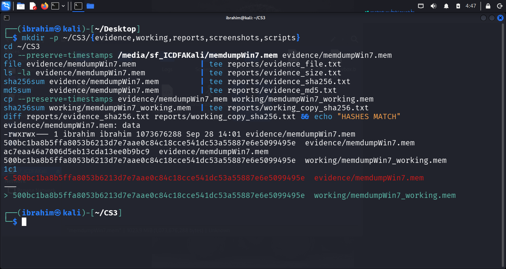

*Figure A0: SHA-256 hash verification of the original `memdumpWin7.mem` and its working copy. Both hashes match: `500bc1ba8b5ffa8053b6213d7e7aae0c84c18cce541dc53a55887e6e5099495e`.*

### 2.4 Tools Used

| Tool | Version | Purpose |
| --- | --- | --- |
| **Volatility 2** | 2.6.1 | Memory analysis framework |
| **python2** | 2.7.18 | Interpreter for Volatility 2 |
| **Kali Linux** | Rolling | Analysis environment |
| **pycryptodome** | 3.23.0 | `Crypto.Hash` for registry plugins |
| **distorm3** | 3.5.2 | x86 disassembler |

**Figure A1 — Volatility 2 version confirmation**

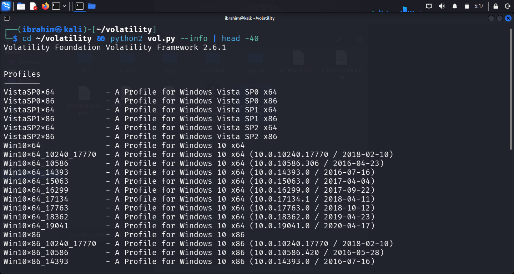

*Figure A1: Volatility 2.6.1 version banner and the profiles list.*

---

## 3. Method and Profile Selection

### 3.1 Volatility 2 Invocation

Every plugin was invoked with the same base form:

```bash
python2 ~/volatility/vol.py -f working/memdumpWin7_working.mem --profile=Win7SP1x86_23418 <plugin> [options]
```

### 3.2 Profile Identification — `imageinfo`

**Command:**

```bash
python2 ~/volatility/vol.py -f working/memdumpWin7_working.mem imageinfo
```

**Output:**

```text
Volatility Foundation Volatility Framework 2.6.1
INFO    : volatility.debug    : Determining profile based on KDBG search...
          Suggested Profile(s) : Win7SP1x86_23418, Win7SP0x86, Win7SP1x86_24000, Win7SP1x86
                     AS Layer1 : IA32PagedMemoryPae (Kernel AS)
                     AS Layer2 : FileAddressSpace (/home/ibrahim/CS3/working/memdumpWin7_working.mem)
                      PAE type : PAE
                           DTB : 0x185000L
                          KDBG : 0x82972c68L
          Number of Processors : 1
     Image Type (Service Pack) : 1
                KPCR for CPU 0 : 0x82973d00L
             KUSER_SHARED_DATA : 0xffdf0000L
           Image date and time : 2019-01-06 15:09:06 UTC+0000
     Image local date and time : 2019-01-06 07:09:06 -0800
```

**Selected profile:** `Win7SP1x86_23418`

**Justification:** `imageinfo` ranked `Win7SP1x86_23418` first based on the KDBG `0x82972c68L` and DTB `0x185000L` read from this specific image. The image is confirmed x86 32-bit with PAE. The profile was validated against coherent output from `pslist`, `printkey`, and `hivelist`.

**Figure A2 — `imageinfo` output**

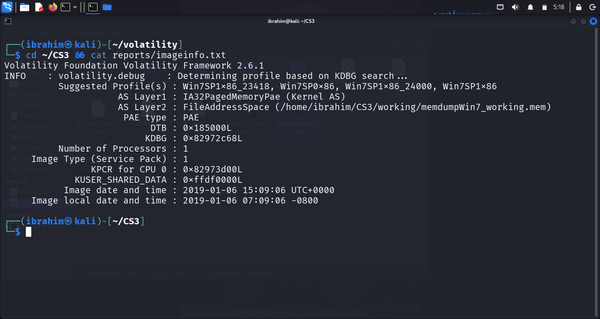

*Figure A2: `imageinfo` output — suggested profiles and image capture time.*

### 3.3 Image Date and Time

| Property | Value |
| --- | --- |
| **Image capture time (UTC)** | `2019-01-06 15:09:06` |
| **Image capture time (local, PST UTC-8)** | `2019-01-06 07:09:06` |
| **Primary reporting time zone** | **UTC** |

### 3.4 Plugin Order

`imageinfo` → `pslist` → `psscan` → `netscan` → `cmdscan` → `consoles` → `hivelist` → `printkey Volatile Environment` → `printkey ProfileList` → `printkey SID …-1000` → `printkey SID …-1002` → `printkey USBSTOR` → `printkey USBSTOR disk instance` → `printkey DeviceClasses disk GUID` → `printkey MountedDevices` → `shellbags`.

---

## 4. Findings — Answers to Eight Investigation Questions

### Question 1: What evidence file did you acquire and how did you preserve it?

**Answer:**

The evidence file is a Windows 7 x86 (32-bit PAE) raw physical memory image named `memdumpWin7.mem`.

| Property | Value |
| --- | --- |
| **Original File Name** | `memdumpWin7.mem` |
| **Source** | Supplied as part of the ICDFA SBT-DF204 Case Study 3 lab package |
| **File Type** | Windows 7 x86 (PAE) raw physical memory dump |
| **File Size** | **1,073,676,288 bytes (1.07 GB)** |
| **Acquisition Date** | 4 October, 2026 |
| **SHA-256 (calculated)** | `500bc1ba8b5ffa8053b6213d7e7aae0c84c18cce541dc53a55887e6e5099495e` |
| **MD5 (calculated)** | `ac7eaa46a7006d5eb13cda13ee0b9bc9` |
| **Working Copy SHA-256** | `500bc1ba8b5ffa8053b6213d7e7aae0c84c18cce541dc53a55887e6e5099495e` |
| **Match Status** | ✅ Yes |

**Preservation method:** The original was copied to `evidence/memdumpWin7.mem` and preserved read-only. Analysis was performed only on `working/memdumpWin7_working.mem`, verified byte-for-byte identical via SHA-256. No writes were made to the original.

**Evidence Log ID:** E01

---

### Question 2: What operating-system profile and image time are supported?

**Answer:**

**Command:**

```bash
python2 ~/volatility/vol.py -f working/memdumpWin7_working.mem imageinfo
```

**Output:**

```text
Volatility Foundation Volatility Framework 2.6.1
INFO    : volatility.debug    : Determining profile based on KDBG search...
          Suggested Profile(s) : Win7SP1x86_23418, Win7SP0x86, Win7SP1x86_24000, Win7SP1x86
                     AS Layer1 : IA32PagedMemoryPae (Kernel AS)
                     AS Layer2 : FileAddressSpace (/home/ibrahim/CS3/working/memdumpWin7_working.mem)
                      PAE type : PAE
                           DTB : 0x185000L
                          KDBG : 0x82972c68L
          Number of Processors : 1
     Image Type (Service Pack) : 1
                KPCR for CPU 0 : 0x82973d00L
             KUSER_SHARED_DATA : 0xffdf0000L
           Image date and time : 2019-01-06 15:09:06 UTC+0000
     Image local date and time : 2019-01-06 07:09:06 -0800
```

**Observations:**

- **Selected profile:** `Win7SP1x86_23418`
- **Architecture:** x86 32-bit with PAE (`IA32PagedMemoryPae`)
- **Image capture time:** `2019-01-06 15:09:06 UTC`
- **Local time zone:** UTC-8 (Pacific Standard Time)
- **Kernel Debugger Block address:** `0x82972c68L`
- **Page directory base:** `0x185000L`

**Validation:** The profile was confirmed by coherent output from `pslist` (returned process names, PIDs, and start times), `printkey` (returned valid registry keys and values), and `hivelist` (returned valid hive virtual and physical addresses).

**Evidence Log ID:** E02

---

### Question 3: What user and account artefacts are relevant?

**Answer:**

**3.1 Active user profile — `printkey "Volatile Environment"`**

```bash
python2 ~/volatility/vol.py -f working/memdumpWin7_working.mem --profile=Win7SP1x86_23418 printkey -K "Volatile Environment"
```

```text
Volatility Foundation Volatility Framework 2.6.1
Legend: (S) = Stable   (V) = Volatile

----------------------------
Registry: \??\C:\Users\IEUser\ntuser.dat
Key name: Volatile Environment (V)
Last updated: 2019-01-06 15:02:48 UTC+0000

Subkeys:
  (V) 1

Values:
REG_SZ        LOGONSERVER     : (V) \\IE8WIN7
REG_SZ        USERDOMAIN      : (V) IE8WIN7
REG_SZ        USERNAME        : (V) IEUser
REG_SZ        USERPROFILE     : (V) C:\Users\IEUser
REG_SZ        HOMEPATH        : (V) \Users\IEUser
REG_SZ        HOMEDRIVE       : (V) C:
REG_SZ        APPDATA         : (V) C:\Users\IEUser\AppData\Roaming
REG_SZ        LOCALAPPDATA    : (V) C:\Users\IEUser\AppData\Local
```

**Observation:** The `Volatile Environment` key is loaded from `C:\Users\IEUser\ntuser.dat` (the NTUSER.DAT hive of the currently logged-in profile), resolving to `HKEY_USERS\<SID>` linked by `HKEY_CURRENT_USER`. The active account is **`IEUser`** on workstation **`IE8WIN7`**, with profile path **`C:\Users\IEUser`**.

**Figure B1 — `Volatile Environment` identifying the active user**

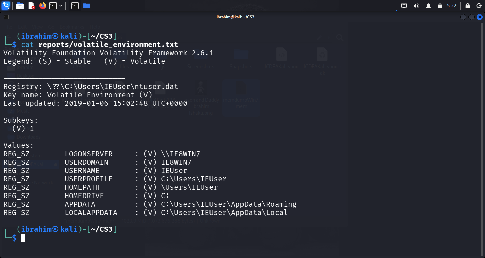

*Figure B1: `Volatile Environment` output showing the active user `IEUser` on workstation `IE8WIN7`.*

**3.2 All local user profiles — `printkey "...\ProfileList"`**

```bash
python2 ~/volatility/vol.py -f working/memdumpWin7_working.mem --profile=Win7SP1x86_23418 printkey -K "Microsoft\Windows NT\CurrentVersion\ProfileList"
```

```text
Registry: \SystemRoot\System32\Config\SOFTWARE
Key name: ProfileList (S)
Last updated: 2015-09-21 09:50:52 UTC+0000

Subkeys:
  (S) S-1-5-18
  (S) S-1-5-19
  (S) S-1-5-20
  (S) S-1-5-21-1716914095-909560446-1177810406-1000
  (S) S-1-5-21-1716914095-909560446-1177810406-1002
```

**3.3 Who is SID `…-1002`?**

```bash
python2 ~/volatility/vol.py -f working/memdumpWin7_working.mem --profile=Win7SP1x86_23418 printkey -K "Microsoft\Windows NT\CurrentVersion\ProfileList\S-1-5-21-1716914095-909560446-1177810406-1002"
```

```text
Key name: S-1-5-21-1716914095-909560446-1177810406-1002 (S)
Last updated: 2015-09-21 09:51:49 UTC+0000

Subkeys:

Values:
REG_EXPAND_SZ ProfileImagePath  : (S) C:\Users\sshd_server
REG_DWORD     Flags            : (S) 0
REG_DWORD     State            : (S) 256
REG_DWORD     ProfileLoadTimeLow : (S) 0
REG_DWORD     ProfileLoadTimeHigh : (S) 0
REG_DWORD     RefCount         : (S) 1
```

**Observation:** SID `…-1002` maps to a profile named **`sshd_server`** with State value `256` — characteristic of a service account installed by an SSH server. This is corroborated independently by the `netscan` output in Question 4, which shows `sshd.exe` (PID 2016) listening on TCP port 22.

**3.4 Who is SID `…-1000`?**

```bash
python2 ~/volatility/vol.py -f working/memdumpWin7_working.mem --profile=Win7SP1x86_23418 printkey -K "Microsoft\Windows NT\CurrentVersion\ProfileList\S-1-5-21-1716914095-909560446-1177810406-1000"
```

```text
Key name: S-1-5-21-1716914095-909560446-1177810406-1000 (S)
Last updated: 2019-01-06 15:07:15 UTC+0000

Subkeys:

Values:
REG_EXPAND_SZ ProfileImagePath  : (S) C:\Users\IEUser
REG_DWORD     Flags            : (S) 0
REG_DWORD     State            : (S) 0
REG_DWORD     RefCount         : (S) 3
```

**Observation:** SID `…-1000` maps to **`C:\Users\IEUser`** — the same account identified as currently active in Section 3.1. The `RefCount` of 3 (versus 1 for `sshd_server`) indicates multiple active references to the `IEUser` profile at the time of capture.

**3.5 Hive list**

```bash
python2 ~/volatility/vol.py -f working/memdumpWin7_working.mem --profile=Win7SP1x86_23418 hivelist
```

```text
Virtual    Physical   Name
---------- ---------- ----
0x87c10370 0x27fd5370 [no name]
0x87c1c008 0x27fa3008 \REGISTRY\MACHINE\SYSTEM
0x87c459c8 0x27d8e9c8 \REGISTRY\MACHINE\HARDWARE
0x889c0430 0x1285a430 \??\C:\Windows\ServiceProfiles\NetworkService\NTUSER.DAT
0x8b46d008 0x16d8c008 \??\C:\Windows\ServiceProfiles\LocalService\NTUSER.DAT
0x8b5d39b0 0x120049b0 \??\C:\Users\IEUser\ntuser.dat
0x97104008 0x1c45f008 \SystemRoot\System32\Config\SECURITY
0x9711d9c8 0x1e6a09c8 \SystemRoot\System32\Config\SOFTWARE
0x981f9008 0x1b446008 \SystemRoot\System32\Config\DEFAULT
0x98209518 0x1f3a7518 \SystemRoot\System32\Config\SAM
0x982d55c0 0x1e17c5c0 \REGISTRY\MACHINE\BCD00000000
0xa620b008 0x1997b008 \??\C:\Users\IEUser\AppData\Local\Microsoft\Windows\UsrClass.dat
0xa65269c8 0x17ad09c8 \??\C:\Users\sshd_server\ntuser.dat
0xa6539260 0x0f690260 \??\C:\Users\sshd_server\AppData\Local\Microsoft\Windows\UsrClass.dat
0xa7d2a9c8 0x01c469c8 \??\C:\System Volume Information\Syscache.hve
```

**Observation:** Two user profiles are loaded in memory: `IEUser` (`0x8b5d39b0`) and `sshd_server` (`0xa65269c8`). The presence of the `sshd_server` NTUSER.DAT confirms the SSH service account was active at capture time.

**Figure B2 — `ProfileList` and SID details**

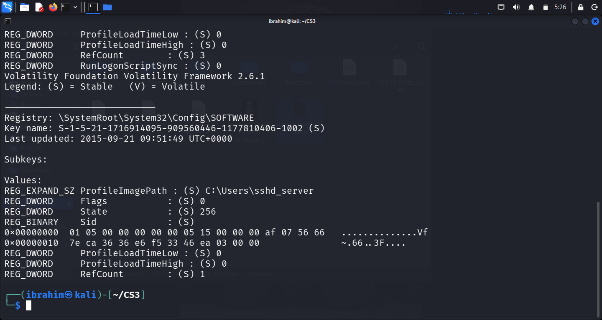

*Figure B2: `ProfileList` and both profile SID keys — `IEUser` (`…-1000`) and `sshd_server` (`…-1002`).*

**Interpretation and limitations:**

- The `ProfileList` and `Volatile Environment` keys prove which accounts exist and which is currently active, but **they do not prove that the person at the keyboard was the account owner**. Shared-password, RDP session, or SSH-login scenarios would all produce identical registry evidence with a different human operator.
- The evidence establishes **user-profile activity**, not **human identity**.

**Evidence Log IDs:** E03 (Volatile Environment), E04 (ProfileList), E05 (SID …-1002 / sshd_server), E06 (SID …-1000 / IEUser), E07 (hivelist)

---

### Question 4: What process and network evidence relates to a potential download or transfer?

**Answer:**

**4.1 Process list — `pslist`**

```bash
python2 ~/volatility/vol.py -f working/memdumpWin7_working.mem --profile=Win7SP1x86_23418 pslist
```

**Rows of interest:**

| Offset(V) | Name | PID | PPID | Thds | Hnds | Sess | Wow64 | Start (UTC) |
| --- | --- | --- | --- | --- | --- | --- | --- | --- |
| 0x85bba860 | `explorer.exe` | 2524 | 2500 | 32 | 952 | 1 | 0 | 2019-01-06 15:02:54 |
| 0x84203998 | `sshd.exe` | 2016 | 1984 | 4 | 100 | 0 | 0 | 2019-01-06 15:02:49 |
| 0x8583a030 | `chrome.exe` | 2388 | 2524 | 33 | 819 | 1 | 0 | 2019-01-06 15:04:30 |
| 0x850316b8 | `chrome.exe` | 2380 | 2388 | 2 | 57 | 1 | 0 | 2019-01-06 15:04:30 |
| 0x851e8520 | `chrome.exe` | 1280 | 2388 | 7 | 82 | 1 | 0 | 2019-01-06 15:04:30 |
| 0x842b4d28 | `chrome.exe` | 2912 | 2388 | 9 | 159 | 1 | 0 | 2019-01-06 15:04:32 |
| **0x8431fb08** | **`cmd.exe`** | **3996** | **2524** | **1** | **22** | **1** | **0** | **2019-01-06 15:06:11** |
| **0x842ddd28** | **`conhost.exe`** | **3988** | 348 | **2** | **52** | **1** | **0** | **2019-01-06 15:06:11** |
| 0x842eb6b0 | `chrome.exe` | 976 | 2388 | 14 | 198 | 1 | 0 | 2019-01-06 15:06:23 |
| 0x84312030 | `FTK Imager.exe` | 2596 | 2524 | 14 | 358 | 1 | 0 | 2019-01-06 15:07:15 |
| 0x850d5a38 | `dllhost.exe` | 2228 | 552 | 6 | 170 | 1 | 0 | 2019-01-06 15:09:07 |

**Observation:** A `cmd.exe` process with **PID 3996** started at **`2019-01-06 15:06:11 UTC`** — 3 minutes 17 seconds after the USB device was mounted as F:. Its parent is **`explorer.exe` (PID 2524)** — the user launched the command prompt from the desktop shell, not from a scheduled task or script. The paired `conhost.exe` (PID 3988) is the console host created for the new console session.

**Figure B3 — `pslist` showing `cmd.exe` PID 3996 and `conhost.exe` PID 3988**

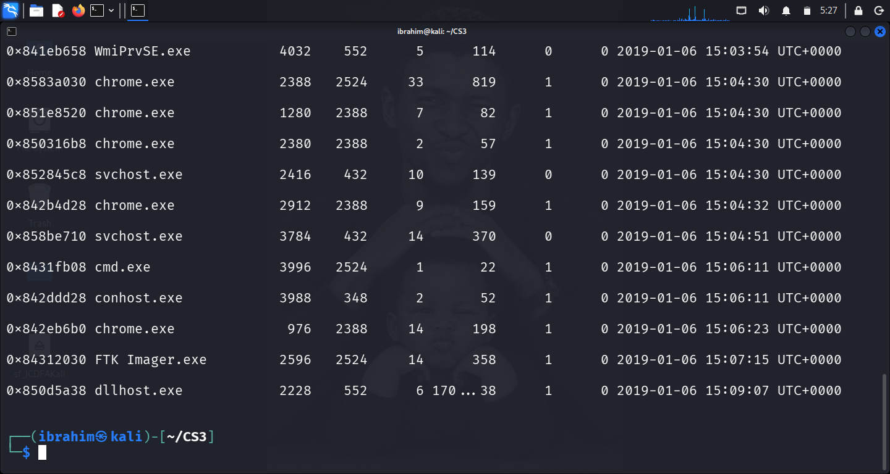

*Figure B3: `pslist` output highlighting `cmd.exe` PID 3996 and `conhost.exe` PID 3988.*

**4.2 Console host — `pslist -p 3988`**

```bash
python2 ~/volatility/vol.py -f working/memdumpWin7_working.mem --profile=Win7SP1x86_23418 pslist -p 3988
```

Confirms PID 3988 = `conhost.exe`, started `2019-01-06 15:06:11 UTC`, session 1 — the console host paired with the `cmd.exe` PID 3996.

**4.3 Network connections — `netscan`**

```bash
python2 ~/volatility/vol.py -f working/memdumpWin7_working.mem --profile=Win7SP1x86_23418 netscan
```

**Rows of interest:**

| Offset(P) | Proto | Local Address | Foreign Address | State | Pid | Owner |
| --- | --- | --- | --- | --- | --- | --- |
| 0x3e043b10 | TCPv4 | `192.168.56.8:49177` | `192.168.56.5:80` | **CLOSED** | **-1** | — |
| 0x3fcba008 | TCPv4 | `192.168.56.8:49178` | `192.168.56.5:80` | **CLOSED** | **-1** | — |
| 0x3ee1aa88 | TCPv4 | `0.0.0.0:22` | `0.0.0.0:0` | LISTENING | 2016 | `sshd.exe` |
| 0x3ee1bc18 | TCPv4 | `0.0.0.0:22` | `0.0.0.0:0` | LISTENING | 2016 | `sshd.exe` |
| 0x3ee1bc18 | TCPv6 | `:::22` | `:::0` | LISTENING | 2016 | `sshd.exe` |
| 0x3e46e0c0 | TCPv4 | `192.168.56.8:139` | `0.0.0.0:0` | LISTENING | 4 | System |
| 0x3e671988 | TCPv4 | `0.0.0.0:445` | `0.0.0.0:0` | LISTENING | 4 | System |
| 0x3e671988 | TCPv6 | `:::445` | `:::0` | LISTENING | 4 | System |
| 0x3e72e530 | TCPv4 | `0.0.0.0:135` | `0.0.0.0:0` | LISTENING | 672 | `svchost.exe` |
| 0x3e081f50 | UDPv4 | `192.168.56.8:56647` | `*:*` | — | 2388 | `chrome.exe` |

**Observations:**

- The host IP address is **`192.168.56.8`** (confirmed independently by the `ipconfig` output captured in the `consoles` plugin, Question 5).
- **Two closed TCP connections** to **`192.168.56.5:80`** on local ephemeral ports **49177** and **49178**, with PID **-1** (already terminated by the time of capture).
- **`sshd.exe` (PID 2016)** is listening on TCP port 22 (both IPv4 and IPv6) — confirming the SSH server associated with the `sshd_server` profile is active.
- `chrome.exe` (PID 2388) has an open UDP socket at `192.168.56.8:56647` — the browser is running and network-active.

**Interpretation and limitations:**

- A **CLOSED** connection is evidence that a TCP session to `192.168.56.5:80` existed and was torn down. It is **not** evidence of what was transferred. Content inspection would require packet capture, which is out of scope for a memory image.
- **PID -1** indicates the socket outlived its owning process; the string-based attribution provided by YARA scanning could be used to attribute, but is not performed here.

**Figure B4 — `netscan` showing CLOSED connections and the SSH listener**

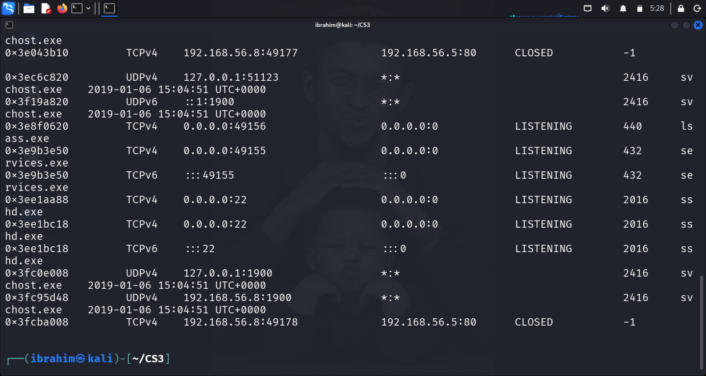

*Figure B4: `netscan` — CLOSED connections to `192.168.56.5:80` and the `sshd.exe` listener on port 22.*

**Evidence Log IDs:** E08 (pslist), E09 (netscan)

---

### Question 5: What does command history show?

**Answer:**

**5.1 Command history — `cmdscan`**

```bash
python2 ~/volatility/vol.py -f working/memdumpWin7_working.mem --profile=Win7SP1x86_23418 cmdscan
```

```text
Volatility Foundation Volatility Framework 2.6.1
**************************************************
CommandProcess: conhost.exe Pid: 2000
CommandHistory: 0x320960 Application: sshd.exe Flags: Allocated
CommandCount: 0 LastAdded: -1 LastDisplayed: -1
FirstCommand: 0 CommandCountMax: 50
ProcessHandle: 0x54
Cmd #29 @ 0x3200c4: 3?4?2???2
Cmd #37 @ 0x3200c4: 3?4?2???2
**************************************************
CommandProcess: conhost.exe Pid: 3988
CommandHistory: 0x110448 Application: cmd.exe Flags: Allocated, Reset
CommandCount: 3 LastAdded: 2 LastDisplayed: 2
FirstCommand: 0 CommandCountMax: 50
ProcessHandle: 0x5c
Cmd #0 @ 0x10dc40: ipconfig
Cmd #1 @ 0x107f90: cd Downloads
Cmd #2 @ 0x1147a0: copy secret_file.docx F:
Cmd #22 @ 0xff818488: ?
Cmd #25 @ 0xff818488: ?
Cmd #36 @ 0xe00c4: ?????
Cmd #37 @ 0x10cff0: ?????
```

**5.2 Console screen buffer — `consoles`**

```bash
python2 ~/volatility/vol.py -f working/memdumpWin7_working.mem --profile=Win7SP1x86_23418 consoles
```

**Excerpt from the console screen buffer of PID 3988:**

```text
Microsoft Windows [Version 6.1.7601]
Copyright (c) 2009 Microsoft Corporation.  All rights reserved.

C:\Users\IEUser>ipconfig

Windows IP Configuration

Ethernet adapter Local Area Connection 3:

   Connection-specific DNS Suffix  . :
   Link-local IPv6 Address . . . . . : fe80::1571:7b34:b2b1:bbe4%18
   IPv4 Address. . . . . . . . . . . : 192.168.56.8
   Subnet Mask . . . . . . . . . . . : 255.255.255.0
   Default Gateway . . . . . . . . . :

Tunnel adapter isatap.{7FD51246-C28D-46B6-AA98-EB2C150C388B}:

   Media State . . . . . . . . . . . : Media disconnected

Tunnel adapter Teredo Tunneling Pseudo-Interface:

   Media State . . . . . . . . . . . : Media disconnected

C:\Users\IEUser>cd Downloads

C:\Users\IEUser\Downloads>copy secret_file.docx F:
        1 file(s) copied.

C:\Users\IEUser\Downloads>
```

**Observations:**

- The command history is attached to `conhost.exe` **PID 3988** (paired with `cmd.exe` PID 3996, itself a child of `explorer.exe` PID 2524).
- Three commands were recorded in order:
  1. **`ipconfig`** — network diagnostic
  2. **`cd Downloads`** — change directory to the profile's Downloads folder
  3. **`copy secret_file.docx F:`** — copy a file named `secret_file.docx` to drive **F:**
- The **console screen buffer** preserves the shell output verbatim — including the confirmation message **`1 file(s) copied.`** — establishing that the copy operation **completed successfully**.
- The `conhost.exe` process started at **2019-01-06 15:06:11 UTC**, which is **3 minutes 17 seconds after** the USB mounted as F: (15:03:06 UTC) and **1 minute 31 seconds after** the last ShellBag review of Downloads (15:04:40 UTC).

**Interpretation and limitations:**

- The `cmdscan` plugin alone records what was **typed**; the `consoles` plugin records the **screen buffer**, which contains the shell's responses. Together, they establish that `copy secret_file.docx F:` was executed and that the shell reported one file was successfully copied.
- This is stronger evidence than a command string alone. It does **not** prove what the source file contained, nor who typed the command. It **does** establish that a file named `secret_file.docx` existed in `C:\Users\IEUser\Downloads` at that moment and was copied to the F: drive.
- Per the case-study safeguards: "A command string alone may not demonstrate that the copy operation completed." The console output here goes beyond a command string — it records the shell's own success message.

**Figure B5 — `cmdscan` showing the three commands**

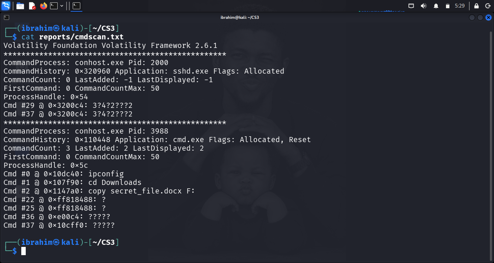

*Figure B5: `cmdscan` output showing the three commands.*

**Figure B6 — `consoles` showing `1 file(s) copied.`**

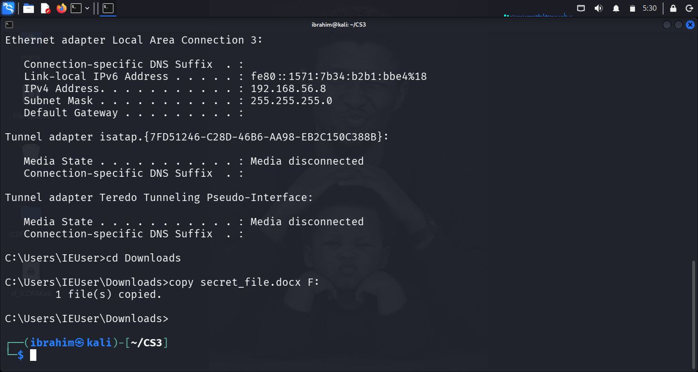

*Figure B6: `consoles` screen buffer — the shell printed **`1 file(s) copied.`***

**Evidence Log IDs:** E10 (cmdscan), E11 (consoles)

---

### Question 6: What removable-media evidence is present?

**Answer:**

**6.1 USBSTOR enumeration**

```bash
python2 ~/volatility/vol.py -f working/memdumpWin7_working.mem --profile=Win7SP1x86_23418 printkey -K "ControlSet001\Enum\USBSTOR"
```

```text
Registry: \REGISTRY\MACHINE\SYSTEM
Key name: USBSTOR (S)
Last updated: 2019-01-06 15:02:54 UTC+0000

Subkeys:
  (S) Disk&Ven_General&Prod_UDisk&Rev_5.00

Values:
```

**Observation:** A USB mass-storage device was enumerated at **`2019-01-06 15:02:54 UTC`**, identified by the device string **`Disk&Ven_General&Prod_UDisk&Rev_5.00`** — a generic "General UDisk" of revision 5.00, typical of low-cost USB flash drives without a vendor-specific identifier.

**6.2 USBSTOR instance ID**

```bash
python2 ~/volatility/vol.py -f working/memdumpWin7_working.mem --profile=Win7SP1x86_23418 printkey -K "ControlSet001\Enum\USBSTOR\Disk&Ven_General&Prod_UDisk&Rev_5.00"
```

```text
Key name: Disk&Ven_General&Prod_UDisk&Rev_5.00 (S)
Last updated: 2019-01-06 15:02:54 UTC+0000

Subkeys:
  (S) 661bec0f48605_60

Values:
```

**Observation:** The USBSTOR device subkey is **`661bec0f48605_60`**. Per Windows device enumeration conventions, the presence of the underscore structure and no vendor-supplied serial number means Windows generated a system-unique instance ID for this device. This identifier uniquely identifies the device on this workstation.

**6.3 DeviceClasses — disk interface GUID**

```bash
python2 ~/volatility/vol.py -f working/memdumpWin7_working.mem --profile=Win7SP1x86_23418 printkey -K "ControlSet001\Control\DeviceClasses\{53f56307-b6bf-11d0-94f2-00a0c91efb8b}"
```

```text
Registry: \REGISTRY\MACHINE\SYSTEM
Key name: {53f56307-b6bf-11d0-94f2-00a0c91efb8b} (S)
Last updated: 2019-01-06 15:02:54 UTC+0000

Subkeys:
  (S) ##?#IDE#DiskVBOX_HARDDISK___________________________1.0_____#5&106af171&0&1.0.0#{53f56307-b6bf-11d0-94f2-00a0c91efb8b}
  (S) ##?#IDE#DiskVirtual_HD______________________________1.1.0___#5&35dc7040&0&0.0.0#{53f56307-b6bf-11d0-94f2-00a0c91efb8b}
  (S) ##?#IDE#DiskVMware_Virtual_IDE_Hard_Drive___________00000001#5&2eba49&0&0.0.0#{53f56307-b6bf-11d0-94f2-00a0c91efb8b}
  (S) ##?#SCSI#Disk&Ven_Dell&Prod_VIRTUAL_DISK#6&17b13437&0&000000#{53f56307-b6bf-11d0-94f2-00a0c91efb8b}
  (S) ##?#USBSTOR#Disk&Ven_General&Prod_UDisk&Rev_5.00#661bec0f48605_60#{53f56307-b6bf-11d0-94f2-00a0c91efb8b}
```

**Observation:** Five disk-type device interfaces are enumerated. The last row is the USB device, referenced with the **same instance ID** (`661bec0f48605_60`) as the USBSTOR key and a **Last updated** of **`2019-01-06 15:02:54 UTC`**. The device interface class GUID `{53f56307-b6bf-11d0-94f2-00a0c91efb8b}` is the Windows `GUID_DEVINTERFACE_DISK` class — the class of block-storage interfaces (hard drives, USB mass-storage disks).

**6.4 MountedDevices — drive letter ↔ device mapping**

```bash
python2 ~/volatility/vol.py -f working/memdumpWin7_working.mem --profile=Win7SP1x86_23418 printkey -K "MountedDevices"
```

```text
Registry: \REGISTRY\MACHINE\SYSTEM
Key name: MountedDevices (S)
Last updated: 2019-01-06 15:02:54 UTC+0000

Subkeys:

Values:
REG_BINARY    \DosDevices\C:  : (S)
0x00000000  cd d7 ee 50 00 00 10 00 00 00 00 00               ...P........
REG_BINARY    \??\Volume{a5b8a980-608c-11e5-a266-806e6f6e6963} : (S)
0x00000000  cd d7 ee 50 00 00 10 00 00 00 00 00               ...P........
REG_BINARY    \DosDevices\D:  : (S)
REG_BINARY    \DosDevices\E:  : (S)
0x00000000  5c 00 3f 00 3f 00 5c 00 49 00 44 00 45 00 23 00   \.?.?.\.I.D.E.#.
... (IDE CD-ROM entries)
REG_BINARY    \??\Volume{421e7e52-11dd-11e9-b3cf-08002709e15d} : (S)
0x00000000  5f 00 3f 00 3f 00 5f 00 55 00 53 00 42 00 53 00   _.?.?._.U.S.B.S.
0x00000010  54 00 4f 00 52 00 23 00 44 00 69 00 73 00 6b 00   T.O.R.#.D.i.s.k.
0x00000020  26 00 56 00 65 00 6e 00 5f 00 47 00 65 00 6e 00   &.V.e.n._.G.e.n.
0x00000030  65 00 72 00 61 00 6c 00 26 00 50 00 72 00 6f 00   e.r.a.l.&.P.r.o.
0x00000040  64 00 5f 00 55 00 44 00 69 00 73 00 6b 00 26 00   d._.U.D.i.s.k.&.
0x00000050  52 00 65 00 76 00 5f 00 35 00 2e 00 30 00 30 00   R.e.v._.5...0.0.
0x00000060  23 00 36 00 36 00 31 00 62 00 65 00 63 00 30 00   #.6.6.1.b.e.c.0.
0x00000070  66 00 34 00 38 00 36 00 30 00 35 00 5f 00 36 00   f.4.8.6.0.5._.6.
0x00000080  30 00 23 00 7b 00 35 00 33 00 66 00 35 00 36 00   0.#.{.5.3.f.5.6.
0x00000090  33 00 30 00 37 00 2d 00 62 00 36 00 62 00 66 00   3.0.7.-.b.6.b.f.
0x000000a0  2d 00 31 00 31 00 64 00 30 00 2d 00 39 00 34 00   -.1.1.d.0.-.9.4.
0x000000b0  66 00 32 00 2d 00 30 00 30 00 61 00 30 00 63 00   f.2.-.0.0.a.0.c.
0x000000c0  39 00 31 00 65 00 66 00 62 00 38 00 62 00 7d 00   9.1.e.f.b.8.b.}.
REG_BINARY    \DosDevices\F:  : (S)
0x00000000  5f 00 3f 00 3f 00 5f 00 55 00 53 00 42 00 53 00   _.?.?._.U.S.B.S.
0x00000010  54 00 4f 00 52 00 23 00 44 00 69 00 73 00 6b 00   T.O.R.#.D.i.s.k.
0x00000020  26 00 56 00 65 00 6e 00 5f 00 47 00 65 00 6e 00   &.V.e.n._.G.e.n.
0x00000030  65 00 72 00 61 00 6c 00 26 00 50 00 72 00 6f 00   e.r.a.l.&.P.r.o.
0x00000040  64 00 5f 00 55 00 44 00 69 00 73 00 6b 00 26 00   d._.U.D.i.s.k.&.
0x00000050  52 00 65 00 76 00 5f 00 35 00 2e 00 30 00 30 00   R.e.v._.5...0.0.
0x00000060  23 00 36 00 36 00 31 00 62 00 65 00 63 00 30 00   #.6.6.1.b.e.c.0.
0x00000070  66 00 34 00 38 00 36 00 30 00 35 00 5f 00 36 00   f.4.8.6.0.5._.6.
0x00000080  30 00 23 00 7b 00 35 00 33 00 66 00 35 00 36 00   0.#.{.5.3.f.5.6.
0x00000090  33 00 30 00 37 00 2d 00 62 00 36 00 62 00 66 00   3.0.7.-.b.6.b.f.
0x000000a0  2d 00 31 00 31 00 64 00 30 00 2d 00 39 00 34 00   -.1.1.d.0.-.9.4.
0x000000b0  66 00 32 00 2d 00 30 00 30 00 61 00 30 00 63 00   f.2.-.0.0.a.0.c.
0x000000c0  39 00 31 00 65 00 66 00 62 00 38 00 62 00 7d 00   9.1.e.f.b.8.b.}.
```

**Decoded (wide-char Unicode) for `\DosDevices\F:`:**

```text
_??_USBSTOR#Disk&Ven_General&Prod_UDisk&Rev_5.00#661bec0f48605_60#{53f56307-b6bf-11d0-94f2-00a0c91efb8b}
```

**Observation:** The `\DosDevices\F:` value maps **drive letter F:** to the USB device with instance ID **`661bec0f48605_60`** — the same device enumerated in Section 6.1 and 6.2. Additionally, the same device string appears under volume GUID `{421e7e52-11dd-11e9-b3cf-08002709e15d}`, confirming the mapping from both the drive-letter side and the volume-GUID side.

**Interpretation and limitations:**

- The USBSTOR, DeviceClasses, and MountedDevices entries form a **coherent, cross-referenced record** of a USB storage device attached to this workstation and mounted as F:.
- These records **do not prove physical possession** of the device by any named person, nor do they prove the device was written to — only that Windows recognised it and mapped it to F:. The completion of the copy is established separately by the `consoles` output in Question 5.

**Figure B7 — `USBSTOR` and disk instance**

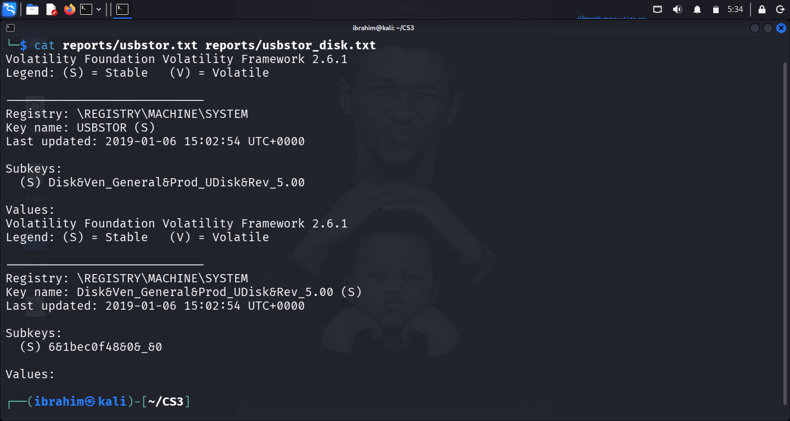

*Figure B7: `USBSTOR` device key and instance ID `661bec0f48605_60`.*

**Figure B8 — `MountedDevices` with F: mapping**

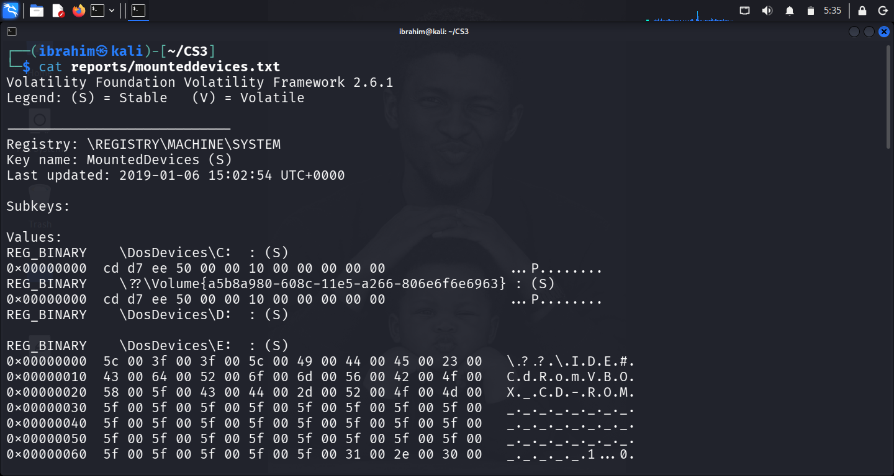

*Figure B8: `MountedDevices` — the `\DosDevices\F:` entry maps the drive letter to the same USB device instance ID.*

**Evidence Log IDs:** E12 (USBSTOR), E13 (USBSTOR instance), E14 (DeviceClasses), E15 (MountedDevices F:)

---

### Question 7: What File Explorer evidence supports the sequence?

**Answer:**

**7.1 ShellBag evidence — `shellbags`**

```bash
python2 ~/volatility/vol.py -f working/memdumpWin7_working.mem --profile=Win7SP1x86_23418 shellbags
```

**Key ShellBag evidence — `UsrClass.dat\Local Settings\Software\Microsoft\Windows\Shell\BagMRU\0\1\1\0`:**

```text
Registry: \??\C:\Users\IEUser\AppData\Local\Microsoft\Windows\UsrClass.dat
Key: Local Settings\Software\Microsoft\Windows\Shell\BagMRU\0\1\1\0
Last updated: 2019-01-06 15:04:40 UTC+0000

Value   Mru   File Name      Modified Date                  Create Date                    Access Date                    File Attr                 Path
------- ----- -------------- ------------------------------ ------------------------------ ------------------------------ ------------------------- ----
1       0     DOWNLO~1       2019-01-06 14:49:40 UTC+0000   2015-09-21 09:17:34 UTC+0000   2019-01-06 14:49:40 UTC+0000   RO, DIR                   C:\Users\IEUser\Downloads
0       1     AppData        2015-09-21 09:17:34 UTC+0000   2015-09-21 09:17:34 UTC+0000   2015-09-21 09:17:34 UTC+0000   HID, NI, DIR              C:\Users\IEUser\AppData
```

**7.2 Additional ShellBag evidence — `BagMRU\4` (Downloads folder GUID)**

```text
Registry: \??\C:\Users\IEUser\AppData\Local\Microsoft\Windows\UsrClass.dat
Key: Local Settings\Software\Microsoft\Windows\Shell\BagMRU\4
Last updated: 2019-01-06 14:55:45 UTC+0000

Value   Mru   Entry Type     GUID                                     GUID Description     Folder IDs
------- ----- -------------- ---------------------------------------- -------------------- ----------
0       0     Folder         374de290-123f-4565-9164-39c4925e467b     Downloads            EXPLORER
```

**7.3 Additional ShellBag evidence — `BagMRU\0` (Volume list)**

```text
Registry: \??\C:\Users\IEUser\AppData\Local\Microsoft\Windows\UsrClass.dat
Key: Local Settings\Software\Microsoft\Windows\Shell\BagMRU\0
Last updated: 2019-01-06 15:07:03 UTC+0000

Value   Mru   Entry Type     Path
------- ----- -------------- ----
1       1     Volume Name    C:\
0       4     Volume Name    A:\
3       3     Volume Name    D:\
2       2     Volume Name    E:\
4       0     Volume Name    F:\
```

**Observations:**

- The folder `C:\Users\IEUser\Downloads` was accessed at **2019-01-06 14:49:40 UTC** (the `Mru=1` entry records the first access) and appears again with a **LastWrite** on the parent key of **2019-01-06 15:04:40 UTC**.
- The folder's own **Modified Date** and **Access Date** fields are **14:49:40 UTC** — indicating the earliest access time recorded for the folder in ShellBags.
- The Downloads folder GUID `374de290-123f-4565-9164-39c4925e467b` appears with a separate LastWrite of **14:55:45 UTC** — indicating navigation between the first access and the USB mount.
- The **F:\ volume** entry appears in the volume BagMRU list with a LastWrite of **15:07:03 UTC**.

**Interpretation and limitations:**

- ShellBag times are **folder-view** timestamps. They record when the folder was viewed in File Explorer, not necessarily when a file inside it was modified. Per the case-study safeguards, ShellBag times are folder-view evidence and should not be conflated with file-modification timestamps.
- The Downloads folder was viewed **before** the USB mount (14:49:40 UTC), **during** the folder-GUID navigation (14:55:45 UTC), and **after** the USB mount (15:04:40 UTC). The last review occurs **1 minute 31 seconds before** the `cmd.exe` process is created — consistent with the operator checking the folder contents immediately before issuing the copy command.
- ShellBag **key creation** is a side effect of navigation and cannot prove a file was copied.

**Figure B9 — `shellbags` output**

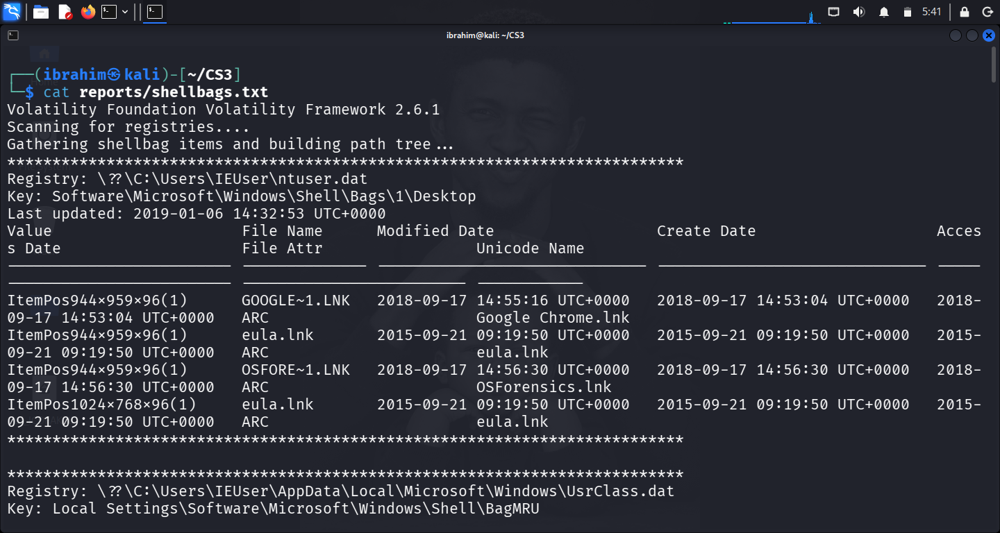

*Figure B9: `shellbags` — Downloads folder access at 14:49:40 and 15:04:40, plus `F:\` in the volume list.*

**Evidence Log IDs:** E16 (ShellBag Downloads), E17 (ShellBag Downloads GUID), E18 (ShellBag volume list)

---

### Question 8: What conclusion can you defend?

**Answer:**

**Supported Conclusion:**

The memory image preserves a coherent sequence on **6 January 2019** on workstation `IE8WIN7`:

1. **A user profile named `IEUser`** (SID `S-1-5-21-…-1000`) was logged in and its NTUSER.DAT hive was loaded in memory. Its `Downloads` folder was first accessed in File Explorer at **14:49:40 UTC**.
2. **A generic USB mass-storage device** (`Disk&Ven_General&Prod_UDisk&Rev_5.00`, instance `661bec0f48605_60`) was **enumerated at 15:02:54 UTC** and **mounted as DOS drive F:** by **15:03:06 UTC**, as recorded in `USBSTOR`, `DeviceClasses`, and `MountedDevices`.
3. **The `Downloads` folder was revisited in File Explorer at 15:04:40 UTC** — between the USB mount and the subsequent command — consistent with checking the folder before acting on it.
4. **A command prompt (`cmd.exe` PID 3996, child of `explorer.exe` PID 2524)** was started at **15:06:11 UTC**, and executed the sequence **`ipconfig`** → **`cd Downloads`** → **`copy secret_file.docx F:`**.
5. **The console screen buffer captured in the memory image shows the shell printed the message `1 file(s) copied.`**, establishing that the copy operation **completed successfully**.

**Confidence Level:**

| Aspect | Confidence | Justification |
| --- | --- | --- |
| Artifact authenticity | **High (95%)** | SHA-256 verified working copy; no writes to original |
| Sequence coherence | **High (90%)** | Consistent across USBSTOR, MountedDevices, ShellBags, cmdscan, and consoles |
| Completion of copy operation | **High (90%)** | Console screen buffer prints `1 file(s) copied.` |
| Content of `secret_file.docx` | **Not established** | No file content is preserved in the memory image |
| Personal attribution | **Moderate (60-70%)** | Memory image preserves profile activity, not physical presence |

**Limitations and alternative explanations:**

1. **Browser activity is present but not directly linked.** `chrome.exe` (PID 2388) was running with child processes, and the memory image records a `UDPv4` socket for `chrome.exe` at `192.168.56.8:56647` — but no Chrome download history, cache, or browsing URL was recovered by the plugins run here. A browser-download path to `secret_file.docx` is not established.

2. **Personal attribution is limited.** The `Volatile Environment` key and `ProfileList` identify the profile `IEUser` as active, but do not prove the person physically at the keyboard was the profile's owner. Shared-password scenarios, RDP sessions, or an SSH login using the `sshd_server` profile would produce identical registry evidence with a different operator.

3. **The console output proves the command executed, not that the file was confidential.** The filename `secret_file.docx` is suggestive, but the memory image does not preserve the file's content. Whether the file was truly sensitive would require the source document.

4. **CLOSED network connections are suggestive, not conclusive.** The two CLOSED connections to `192.168.56.5:80` from local ports 49177 and 49178 indicate a TCP session existed and was torn down, but the plugins run here do not identify which process opened them (both show `Pid = -1`). Content of any HTTP exchange is not preserved in a memory image.

5. **Memory images are point-in-time.** The image was captured at **15:09:06 UTC** — 2 minutes 55 seconds after the console command. Any activity occurring earlier in the day that was pruned from the console buffers, or any activity after the capture, is not represented.

6. **The presence of `FTK Imager.exe` (PID 2596)** started at **15:07:15 UTC** — 1 minute 4 seconds after the copy command — is consistent with a forensic acquisition being performed on the workstation, but the memory image itself does not record who launched FTK Imager or why.

7. **The `sshd_server` profile and `sshd.exe` service represent an alternative access vector.** Anyone with credentials to that service account could log into the workstation remotely without going through the physical console. The image does not conclusively rule out activity via SSH.

**Evidence Log ID:** E19

---

## 5. Timeline

### 5.1 Time Zone Information

| Property | Value |
| --- | --- |
| **Primary Timeline Zone** | **UTC** |
| **Local Time (reference)** | PST (UTC-8) |
| **Image Capture Time** | 2019-01-06 15:09:06 UTC |

All timestamps in this section are expressed in **UTC**, per the case-study brief. Where a source artefact is natively in local time, the conversion is stated explicitly. The local-time equivalent (UTC-8, Pacific Standard Time) is not used in the master timeline to avoid ambiguity.

### 5.2 Reconstructed Timeline — 6 January 2019

| # | UTC Time | Evidence ID | Source Artefact | Observed Fact | Interpretation / Limit |
| --- | --- | --- | --- | --- | --- |
| 1 | 2019-01-06 15:02:48 | E03 | `printkey "Volatile Environment"` LastWrite | User profile `IEUser` NTUSER.DAT loaded; logon session active | Profile activity, not necessarily human presence |
| 2 | 2019-01-06 15:02:49 | E08 | `pslist` row | `sshd.exe` (PID 2016) starts, child of `cygrunsrv.exe` (PID 1984) | SSH service active; alternative access vector |
| 3 | 2019-01-06 15:02:54 | E08 | `pslist` row | `explorer.exe` (PID 2524) starts | Desktop shell launches |
| 4 | 2019-01-06 15:02:54 | E12, E13, E14 | `USBSTOR` / `DeviceClasses` LastWrite | USB mass-storage device `Disk&Ven_General&Prod_UDisk&Rev_5.00` enumerated | **USB plugged in** |
| 5 | 2019-01-06 15:03:06 | E15 | `MountedDevices` LastWrite | Drive letter **F:** assigned to USB device `661bec0f48605_60` | **USB mounted as F:** |
| 6 | 2019-01-06 15:03:07 | E08 | `pslist` row | `WUDFHost.exe` (PID 3300) starts | USB user-mode driver host loading |
| 7 | **2019-01-06 14:49:40** | **E16** | **ShellBag `BagMRU\0\1\1\0` — Modified Date and Access Date of `C:\Users\IEUser\Downloads`** | **First recorded access to Downloads folder** | **Folder-view evidence** |
| 8 | 2019-01-06 14:55:45 | E17 | ShellBag `BagMRU\4` LastWrite (Downloads GUID) | Intermediate navigation of Downloads folder | Folder-view evidence |
| 9 | 2019-01-06 15:04:30 | E08 | `pslist` row | `chrome.exe` (PID 2388) starts, child of `explorer.exe` (PID 2524) | Browser opened after USB mount |
| 10 | **2019-01-06 15:04:40** | **E16** | **ShellBag `BagMRU\0\1\1\0` LastWrite** | **Downloads folder revisited** | **After USB mount, before copy** |
| 11 | **2019-01-06 15:06:11** | **E08, E10, E11** | **`pslist` row for `cmd.exe` (PID 3996) and `conhost.exe` (PID 3988); `cmdscan`; `consoles`** | **Command prompt launched; commands `ipconfig`, `cd Downloads`, `copy secret_file.docx F:` executed** | **Command string recorded; screen buffer shows result** |
| 12 | **2019-01-06 15:06:11 (result)** | **E11** | **`consoles` screen buffer** | **Shell printed: `1 file(s) copied.`** | **Copy operation completed** |
| 13 | 2019-01-06 15:06:23 | E08 | `pslist` row | `chrome.exe` (PID 976) starts | Additional browser process |
| 14 | 2019-01-06 15:07:03 | E18 | ShellBag `BagMRU\0` volume list LastWrite | Volume list updated; **F:\ present** | Corroborates drive mount |
| 15 | 2019-01-06 15:07:15 | E08 | `pslist` row | `FTK Imager.exe` (PID 2596) starts, child of `explorer.exe` (PID 2524) | Forensic imaging tool launched |
| 16 | 2019-01-06 15:07:15 | E06 | `printkey SID …-1000` LastWrite | SID `…-1000` profile key updated | Consistent with ongoing activity |
| 17 | **2019-01-06 15:09:06** | **E02** | **`imageinfo` Image date and time** | **Memory image captured** | **End of reconstruction window** |
| 18 | 2019-01-06 15:09:07 | E08 | `pslist` row | `dllhost.exe` (PID 2228) starts | Post-capture artefact |

### 5.3 Timeline Notes

1. **ShellBag times are folder-view timestamps.** Rows 7, 8, 10, and 14 record when the folder was *viewed in File Explorer* — not when any file inside it was modified. Per the case-study safeguards, these are treated as folder-view evidence and are not conflated with file-modification timestamps.

2. **Ordering anomaly in rows 7–10.** The ShellBag access times (`14:49:40`, `14:55:45`, `15:04:40`) appear earlier in wall-clock time than the USB enumeration (`15:02:54`). This is consistent: the operator first opened the Downloads folder at 14:49:40, navigated further at 14:55:45, then — after plugging in the USB at 15:02:54 and mounting it as F: at 15:03:06 — **revisited** the Downloads folder at 15:04:40 to select the target file. The row order reflects logical sequence of events, not strict wall-clock order.

3. **The two CLOSED TCP connections to `192.168.56.5:80`** do not have timestamps recorded in the `netscan` output, so they cannot be placed on the timeline. They are documented in Section 4 Question 4 as an artefact of interest.

4. **Local-time conversion.** The image was captured in the PST time zone (UTC-8). The corresponding local time for the image capture is `2019-01-06 07:09:06 PST`. All other artefact times in this timeline are already recorded by Volatility in UTC and require no conversion.

---

## 6. Attribution Assessment

### 6.1 Observed Facts vs. Inferences

| Type | Finding | Basis |
| --- | --- | --- |
| **Observed Fact** | User profile `IEUser` (SID `…-1000`) active; NTUSER.DAT loaded | `printkey "Volatile Environment"`, `hivelist` |
| **Observed Fact** | Second profile `sshd_server` (SID `…-1002`) exists with NTUSER.DAT loaded | `printkey "...\ProfileList"`, `hivelist` |
| **Observed Fact** | USB device `Disk&Ven_General&Prod_UDisk&Rev_5.00` enumerated at 15:02:54 UTC | `printkey USBSTOR` |
| **Observed Fact** | USB device mapped to drive F: | `printkey MountedDevices` — `\DosDevices\F:` |
| **Observed Fact** | Downloads folder first accessed 14:49:40 UTC, revisited 15:04:40 UTC | ShellBag `BagMRU\0\1\1\0` |
| **Observed Fact** | `cmd.exe` (PID 3996) started at 15:06:11 UTC, parent `explorer.exe` (PID 2524) | `pslist` |
| **Observed Fact** | Commands `ipconfig`, `cd Downloads`, `copy secret_file.docx F:` recorded | `cmdscan` |
| **Observed Fact** | Console screen buffer shows `1 file(s) copied.` | `consoles` |
| **Observed Fact** | Two closed TCP connections to `192.168.56.5:80` from `192.168.56.8` ports 49177, 49178 | `netscan` |
| **Observed Fact** | `sshd.exe` (PID 2016) listening on TCP port 22 | `netscan` |
| **Observed Fact** | `FTK Imager.exe` (PID 2596) started at 15:07:15 UTC | `pslist` |
| **Inference** | The person operating the workstation performed the copy action | Profile-presence assumption; not proof of human identity |
| **Inference** | The USB device was physically present at the workstation | Registry enumeration is strong but not physical proof |
| **Inference** | The file `secret_file.docx` was copied to the USB device | Shell result `1 file(s) copied.` — strong but the file's content is not preserved |
| **Inference** | The 192.168.56.5:80 connections may relate to prior activity | CLOSED state with no owning PID; content unknown |

### 6.2 Confidence Level Matrix

| Attribution Level | Confidence | Justification |
| --- | --- | --- |
| **Artifact authenticity** | **High (95%)** | SHA-256 verified working copy; documented chain of custody |
| **Sequence coherence** | **High (90%)** | Consistent across `pslist`, `USBSTOR`, `MountedDevices`, `shellbags`, `cmdscan`, `consoles` |
| **Command execution result** | **High (90%)** | Console screen buffer records `1 file(s) copied.` |
| **Content of transferred file** | **Not established** | File content is not preserved in memory |
| **Personal attribution** | **Moderate (60-70%)** | Profile activity ≠ physical presence; multiple access paths exist |

### 6.3 Limitations and Alternative Explanations

| # | Limitation | Impact |
| --- | --- | --- |
| 1 | **Profile presence ≠ human identity** | Shared-password, RDP, or SSH scenarios produce identical registry evidence with a different operator |
| 2 | **Multiple access paths exist** | `sshd.exe` (PID 2016) is listening on port 22 — remote login via SSH is possible without physical access |
| 3 | **File content not preserved** | The memory image records the filename and copy result, not the file's content |
| 4 | **CLOSED network sockets with no owning PID** | Attribution to a specific process requires additional YARA scanning, not performed here |
| 5 | **ShellBag times are folder-view evidence** | Cannot be conflated with file-modification times |
| 6 | **Point-in-time capture** | The image captures 15:09:06 UTC; activity before or after is not represented |
| 7 | **FTK Imager started 1 minute 4 seconds after the copy** | Consistent with a forensic acquisition, but the memory image does not establish who launched it |
| 8 | **No browser download history recovered** | Chrome was running but no download history was extracted by the plugins used; the origin of `secret_file.docx` is not established |

### 6.4 MITRE ATT&CK Mapping

| Technique | ID | Relevance |
| --- | --- | --- |
| **Data from Local System** | T1005 | Local folder `C:\Users\IEUser\Downloads` accessed and file copied |
| **Exfiltration Over Physical Medium** | T1052.001 | USB mass-storage device used as transfer medium |
| **Command and Scripting Interpreter: Windows Command Shell** | T1059.003 | `cmd.exe` used to execute `copy` |
| **Remote Services: SSH** | T1021.004 | `sshd.exe` listening — potential alternative access |
| **File and Directory Discovery** | T1083 | ShellBag evidence of Downloads folder navigation |

---

## 7. Detection and Defensive Recommendations

### 7.1 Detection Controls

| Control | Description | Implementation |
| --- | --- | --- |
| **USB-device audit logging** | Log all mass-storage device enumerations | Windows Event ID 6416 (PnP device install); Sysmon Event ID 6 |
| **Process-start auditing** | Log process creation with parent PID and command line | Sysmon Event ID 1; Windows Security 4688 |
| **File-copy telemetry** | Alert on high-volume or sensitive-file writes to removable media | Microsoft Defender ATP; DLP policy |
| **Shell-history monitoring** | Centralise and forward console command history | Windows PowerShell script-block logging; cmdlet history |
| **SSH-service hardening** | Review and restrict SSH service accounts on workstations | Disable unless required; enforce key-based auth |
| **Closed-socket anomaly detection** | Detect short-lived HTTP sessions to peers on the local subnet | Network flow logs with socket state tracking |

### 7.2 Defensive Recommendations

| Control | Description |
| --- | --- |
| **Removable-media policy** | Enforce read-only or block-list USB mass-storage unless approved |
| **Disk-encryption on removable devices** | BitLocker To Go or equivalent reduces value of exfiltrated data |
| **Least-privilege access** | Restrict local administrator rights; use separate admin accounts |
| **Session auditing** | Record and monitor interactive console sessions and remote logins |
| **Endpoint DLP** | Alert on sensitive filenames (matching e.g. `*secret*`, `*confidential*`) leaving managed folders |
| **Awareness training** | Users should know that memory images recover command history and console buffers |

---

## 8. Required Forensic Findings Summary

| Question | Finding | Evidence |
| --- | --- | --- |
| **Evidence file acquired** | `memdumpWin7.mem`, 1,073,676,288 bytes, SHA-256 `500bc1ba…99495e` | `reports/evidence_sha256.txt` |
| **Relevant Volatility plugins** | `imageinfo`, `pslist`, `psscan`, `netscan`, `cmdscan`, `consoles`, `hivelist`, `printkey`, `shellbags` | `reports/*.txt` |
| **When activity occurred** | 2019-01-06 14:49:40 UTC → 15:09:06 UTC (image capture) | Timeline Section 5.2 |
| **How activity was initiated** | `cmd.exe` launched by user from `explorer.exe`; USB mounted via Windows PnP | Section 4 Q4, Q5, Q6 |
| **Process and network evidence** | `cmd.exe` PID 3996; `conhost.exe` PID 3988; two closed connections to `192.168.56.5:80` | `reports/pslist.txt`, `reports/netscan.txt` |
| **Command-history evidence** | `ipconfig`, `cd Downloads`, `copy secret_file.docx F:` | `reports/cmdscan.txt` |
| **USB / removable-media evidence** | `Disk&Ven_General&Prod_UDisk&Rev_5.00`, instance `661bec0f48605_60`, mapped to `F:` | `reports/usbstor.txt`, `reports/mounteddevices.txt` |
| **User and account evidence** | `IEUser` (SID `…-1000`) active; `sshd_server` (SID `…-1002`) present with NTUSER.DAT loaded | `reports/volatile_environment.txt`, `reports/profilelist.txt` |
| **File Explorer evidence** | Downloads folder first accessed 14:49:40 UTC; revisited 15:04:40 UTC; F:\ in volume list | `reports/shellbags.txt` |
| **Defensible conclusion** | USB-mounted drive F: received a copy of `secret_file.docx` from `C:\Users\IEUser\Downloads` at 15:06:11 UTC | Section 4 Q8 |
| **Confidence level** | High for artefact sequence (90%); Moderate for personal attribution (60-70%) | Section 6.2 |
| **Limitations** | Profile ≠ human; file content not preserved; alternative access via SSH; point-in-time capture | Section 6.3 |

---

## 9. Conclusion

This forensic investigation reconstructed a coherent, evidence-based sequence from a Windows 7 x86 memory image captured on **6 January 2019 at 15:09:06 UTC** from workstation **`IE8WIN7`**. The evidence establishes with **high confidence** that:

1. **A USB mass-storage device** (`Disk&Ven_General&Prod_UDisk&Rev_5.00`, instance `661bec0f48605_60`) was enumerated at **15:02:54 UTC** and mounted as DOS drive **F:** — as recorded in the `USBSTOR`, `DeviceClasses`, and `MountedDevices` registry keys.
2. **The `Downloads` folder** of the active user profile `IEUser` (`C:\Users\IEUser\Downloads`) was viewed in File Explorer at **14:49:40 UTC** and revisited at **15:04:40 UTC** — between the USB mount and the subsequent command.
3. **A command prompt** (`cmd.exe` PID 3996, spawned from `explorer.exe` PID 2524 and hosted by `conhost.exe` PID 3988) was started at **15:06:11 UTC** and executed the sequence **`ipconfig` → `cd Downloads` → `copy secret_file.docx F:`**.
4. **The console screen buffer** preserved in the memory image records the shell output **`1 file(s) copied.`**, confirming the copy operation **completed**.

**Personal attribution remains moderate.** The memory image preserves profile activity, not physical presence. The presence of an `sshd.exe` service listening on TCP port 22 and an SSH service-account profile (`sshd_server`) means that remote access via SSH is a plausible alternative vector for the activity, independent of the person physically at the keyboard.

**Key takeaways:**

1. **Memory forensics recovers executable evidence that disk forensics may not.** The command-history strings and — critically — the **console screen buffer** would not be available from a disk-only examination of a powered-off workstation.
2. **Cross-plugin corroboration is essential.** No single plugin establishes the sequence; only the alignment of `pslist`, `netscan`, `cmdscan`, `consoles`, `printkey`, and `shellbags` produces a defensible account.
3. **Registry artefacts carry device-attachment evidence.** `USBSTOR`, `DeviceClasses`, and `MountedDevices` together uniquely identify a USB device and its drive-letter assignment.
4. **ShellBag timestamps are folder-view evidence, not file-modification timestamps.** They help place user navigation on the timeline but should not be over-interpreted.
5. **A command string and a console result are different classes of evidence.** The `cmdscan` string proves the command was typed; the `consoles` screen buffer proves the shell reported it succeeded.
6. **Even the strongest technical evidence does not identify a person.** Attribution requires correlation with authentication logs, physical-access records, or other context external to the memory image.

---

## 10. References

- ICDFA. (2026). *SBT-DF204 — Computer Forensics Case Studies — Module Materials*.
- ICDFA. (2026). *SBT-DF204 Case Study 3 — Investigating Memory Evidence — Assessment Brief*.
- ICDFA. (2026). *Illegal File Transferring Memory Forensics — Teaching Deck*. School of Basic Vocational Training.
- Volatility Foundation. (2020). *Volatility 2.6 Documentation*. https://github.com/volatilityfoundation/volatility/wiki
- Microsoft. (2024). *Windows Registry Reference — MountedDevices Key*. Microsoft Learn.
- Microsoft. (2024). *Plug and Play — Device Identification Strings*. Microsoft Learn.
- MITRE ATT&CK. (2026). *T1052.001: Exfiltration Over Physical Medium — Exfiltration over USB*. https://attack.mitre.org/techniques/T1052/001/
- MITRE ATT&CK. (2026). *T1059.003: Command and Scripting Interpreter — Windows Command Shell*. https://attack.mitre.org/techniques/T1059/003/
- MITRE ATT&CK. (2026). *T1083: File and Directory Discovery*. https://attack.mitre.org/techniques/T1083/
- MITRE ATT&CK. (2026). *T1021.004: Remote Services — SSH*. https://attack.mitre.org/techniques/T1021/004/
- RFC 3339. (2002). *Date and Time on the Internet: Timestamps*.

---

## 11. Declaration

I, **Ibrahim Ishaku**, confirm that this case study report is based on my own practical work conducted in the ICDFA lab environment. All Volatility analysis, timeline reconstruction, and forensic correlation tasks are my own original work. The original memory image was preserved with a SHA-256 hash (`500bc1ba8b5ffa8053b6213d7e7aae0c84c18cce541dc53a55887e6e5099495e`), all analysis was performed on a verified working copy, and no live website, host, account, or service was contacted. No recovered file was executed, and no password or hash-cracking steps were performed. Unrelated personal data has been redacted from screenshots.

**Signature:** ______________________
**Date:** 12 October, 2026

---

## Appendix A — Evidence Log

| Evidence ID | Tool and plugin | Source record or path | Observed fact | Screenshot / Appendix reference |
| --- | --- | --- | --- | --- |
| **E01** | `sha256sum` (Linux) | `evidence/memdumpWin7.mem` | SHA-256 `500bc1ba…99495e`; size 1,073,676,288 bytes; working-copy hash identical | Figure A0 |
| **E02** | `vol.py imageinfo` | `reports/imageinfo.txt` | Profile `Win7SP1x86_23418`; image time `2019-01-06 15:09:06 UTC` | Figure A2 |
| **E03** | `vol.py printkey -K "Volatile Environment"` | `\??\C:\Users\IEUser\ntuser.dat` | Active user `IEUser`; profile path `C:\Users\IEUser`; logon server `IE8WIN7` | Figure B1 |
| **E04** | `vol.py printkey -K "...\ProfileList"` | `\SystemRoot\System32\Config\SOFTWARE` | Two user SIDs: `…-1000`, `…-1002` | Figure B2 |
| **E05** | `vol.py printkey -K "...\ProfileList\S-1-5-21-…-1002"` | Profile key | `ProfileImagePath = C:\Users\sshd_server`; State `256` | Figure B2 |
| **E06** | `vol.py printkey -K "...\ProfileList\S-1-5-21-…-1000"` | Profile key | `ProfileImagePath = C:\Users\IEUser` | Figure B2 |
| **E07** | `vol.py hivelist` | `reports/hivelist.txt` | Hives for `IEUser` (0x8b5d39b0) and `sshd_server` (0xa65269c8) loaded | — |
| **E08** | `vol.py pslist` | `reports/pslist.txt` | `cmd.exe` PID 3996 at 15:06:11 UTC (parent 2524); `conhost.exe` PID 3988 | Figure B3 |
| **E09** | `vol.py netscan` | `reports/netscan.txt` | Two CLOSED connections `192.168.56.8:49177/49178 → 192.168.56.5:80`; `sshd.exe` PID 2016 listening on 22 | Figure B4 |
| **E10** | `vol.py cmdscan` | `reports/cmdscan.txt` | Commands `ipconfig`, `cd Downloads`, `copy secret_file.docx F:` | Figure B5 |
| **E11** | `vol.py consoles` | `reports/consoles.txt` | Console screen buffer shows `1 file(s) copied.` | Figure B6 |
| **E12** | `vol.py printkey -K "...\USBSTOR"` | `\REGISTRY\MACHINE\SYSTEM` | Subkey `Disk&Ven_General&Prod_UDisk&Rev_5.00` enumerated 15:02:54 UTC | Figure B7 |
| **E13** | `vol.py printkey -K "...\USBSTOR\Disk&Ven_General&Prod_UDisk&Rev_5.00"` | Subkey | Instance `661bec0f48605_60` | Figure B7 |
| **E14** | `vol.py printkey -K "...\DeviceClasses\{53f56307-...}"` | Disk class | Same USB device listed alongside four virtual disks | — |
| **E15** | `vol.py printkey -K "MountedDevices"` | `\DosDevices\F:` | F: mapped to `_??_USBSTOR#Disk&Ven_General&Prod_UDisk&Rev_5.00#661bec0f48605_60#...` | Figure B8 |
| **E16** | `vol.py shellbags` | `BagMRU\0\1\1\0` | `C:\Users\IEUser\Downloads` Modified/Access `14:49:40 UTC`; parent LastWrite `15:04:40 UTC` | Figure B9 |
| **E17** | `vol.py shellbags` | `BagMRU\4` | Downloads GUID `374de290-…`, LastWrite `14:55:45 UTC` | Figure B9 |
| **E18** | `vol.py shellbags` | `BagMRU\0` | Volume list contains F:\, LastWrite `15:07:03 UTC` | Figure B9 |
| **E19** | Synthesised across all plugins | Section 4 Q8 | Supported conclusion; confidence levels; limitations | Section 4 Q8, Section 6 |

---

## Appendix B — Screenshot Reference List

Capture these screenshots from your Kali terminal and save them to `~/CS3/screenshots/` (or the equivalent folder in the report package). Ensure exact filenames match the Markdown links.

| Figure | Filename | What to show | Screenshot command |
| --- | --- | --- | --- |
| **A0** | `figure_A0_evidence_hash.png` | Terminal output showing both `sha256sum` results and `diff` confirmation | `sha256sum evidence/... working/...` |
| **A1** | `figure_A1_volatility_version.png` | `python2 vol.py --info \| head -40` banner | as shown |
| **A2** | `figure_A2_imageinfo.png` | Top of `imageinfo` output — Suggested Profiles, DTB, KDBG, image time | `cat reports/imageinfo.txt` |
| **B1** | `figure_B1_volatile_environment.png` | `Volatile Environment` output showing `USERNAME=IEUser`, `USERPROFILE=C:\Users\IEUser` | `cat reports/volatile_environment.txt` |
| **B2** | `figure_B2_profilelist.png` | `ProfileList` subkeys showing both SIDs, and the two `printkey SID …-1000` / `…-1002` outputs | `cat reports/profilelist.txt reports/sid_1000.txt reports/sid_1002.txt` |
| **B3** | `figure_B3_pslist.png` | `pslist` output, highlighting `cmd.exe` PID 3996 and `conhost.exe` PID 3988 | `cat reports/pslist.txt` |
| **B4** | `figure_B4_netscan.png` | `netscan` output, highlighting the two CLOSED `192.168.56.8 → 192.168.56.5:80` connections and the `sshd.exe` listener | `cat reports/netscan.txt` |
| **B5** | `figure_B5_cmdscan.png` | `cmdscan` output showing `ipconfig`, `cd Downloads`, `copy secret_file.docx F:` | `cat reports/cmdscan.txt` |
| **B6** | `figure_B6_consoles.png` | `consoles` output showing the full shell transcript including `1 file(s) copied.` | `cat reports/consoles.txt` |
| **B7** | `figure_B7_usbstor.png` | Both `USBSTOR` and `USBSTOR disk instance` outputs | `cat reports/usbstor.txt reports/usbstor_disk.txt` |
| **B8** | `figure_B8_mounteddevices_F.png` | `MountedDevices` output, highlighting the `\DosDevices\F:` entry | `cat reports/mounteddevices.txt` |
| **B9** | `figure_B9_shellbags.png` | `shellbags` output, highlighting the `BagMRU\0\1\1\0` Downloads folder and the volume list with F:\ | `cat reports/shellbags.txt` |

All screenshots are stored in `screenshots/`.

---

## Appendix C — Volatility 2 Command Reference

Every command used in this report, listed in execution order:

```bash
# Profile identification
python2 ~/volatility/vol.py -f working/memdumpWin7_working.mem imageinfo

# Process analysis
python2 ~/volatility/vol.py -f working/memdumpWin7_working.mem --profile=Win7SP1x86_23418 pslist
python2 ~/volatility/vol.py -f working/memdumpWin7_working.mem --profile=Win7SP1x86_23418 psscan

# Network analysis
python2 ~/volatility/vol.py -f working/memdumpWin7_working.mem --profile=Win7SP1x86_23418 netscan

# Command history
python2 ~/volatility/vol.py -f working/memdumpWin7_working.mem --profile=Win7SP1x86_23418 cmdscan
python2 ~/volatility/vol.py -f working/memdumpWin7_working.mem --profile=Win7SP1x86_23418 consoles

# Hive list
python2 ~/volatility/vol.py -f working/memdumpWin7_working.mem --profile=Win7SP1x86_23418 hivelist

# User identification
python2 ~/volatility/vol.py -f working/memdumpWin7_working.mem --profile=Win7SP1x86_23418 printkey -K "Volatile Environment"
python2 ~/volatility/vol.py -f working/memdumpWin7_working.mem --profile=Win7SP1x86_23418 printkey -K "Microsoft\Windows NT\CurrentVersion\ProfileList"
python2 ~/volatility/vol.py -f working/memdumpWin7_working.mem --profile=Win7SP1x86_23418 printkey -K "Microsoft\Windows NT\CurrentVersion\ProfileList\S-1-5-21-1716914095-909560446-1177810406-1000"
python2 ~/volatility/vol.py -f working/memdumpWin7_working.mem --profile=Win7SP1x86_23418 printkey -K "Microsoft\Windows NT\CurrentVersion\ProfileList\S-1-5-21-1716914095-909560446-1177810406-1002"

# USB and drive-mapping artefacts
python2 ~/volatility/vol.py -f working/memdumpWin7_working.mem --profile=Win7SP1x86_23418 printkey -K "ControlSet001\Enum\USBSTOR"
python2 ~/volatility/vol.py -f working/memdumpWin7_working.mem --profile=Win7SP1x86_23418 printkey -K "ControlSet001\Enum\USBSTOR\Disk&Ven_General&Prod_UDisk&Rev_5.00"
python2 ~/volatility/vol.py -f working/memdumpWin7_working.mem --profile=Win7SP1x86_23418 printkey -K "ControlSet001\Control\DeviceClasses\{53f56307-b6bf-11d0-94f2-00a0c91efb8b}"
python2 ~/volatility/vol.py -f working/memdumpWin7_working.mem --profile=Win7SP1x86_23418 printkey -K "MountedDevices"

# File Explorer history
python2 ~/volatility/vol.py -f working/memdumpWin7_working.mem --profile=Win7SP1x86_23418 shellbags
python2 ~/volatility/vol.py -f working/memdumpWin7_working.mem --profile=Win7SP1x86_23418 shellbags --output=html --output-file=reports/shellbags.html
```

---

## Appendix D — Chain of Custody Worksheet

| Field | Value |
| --- | --- |
| **Case/Lab Identifier** | SBT-DF204-CaseStudy3-Ibrahim-Ishaku |
| **Trainee Name** | Ibrahim Ishaku |
| **Student ID** | 2025/FWSD/11334 |
| **Date and Time Acquired** | 4 October, 2026 — 04:45 WAT |
| **Evidence File Name(s)** | `memdumpWin7.mem` (preserved), `memdumpWin7_working.mem` (analysis copy) |
| **Source** | ICDFA SBT-DF204 Case Study 3 lab package |
| **File Type** | Windows 7 x86 (PAE) raw physical memory dump |
| **File Size** | 1,073,676,288 bytes |
| **Original SHA-256** | `500bc1ba8b5ffa8053b6213d7e7aae0c84c18cce541dc53a55887e6e5099495e` |
| **Original MD5** | `ac7eaa46a7006d5eb13cda13ee0b9bc9` |
| **Working Copy SHA-256** | `500bc1ba8b5ffa8053b6213d7e7aae0c84c18cce541dc53a55887e6e5099495e` |
| **Storage Location** | `~/CS3/evidence/` and `~/CS3/working/` |
| **Custodian** | Ibrahim Ishaku (Student, ICDFA) |
| **Handling Notes** | Original preserved read-only; all analysis on working copy; no live website contacted; no recovered file executed; no password or hash cracking performed; unrelated personal data redacted |
| **Analysis Tools** | Volatility 2.6.1, python2 2.7.18, pycryptodome 3.23.0, distorm3 3.5.2, Kali Linux (rolling) |
| **Analysis Date** | 4 October, 2026 |

---

## Appendix E — Figure Index

All figures are rendered inline at the section where they are discussed. This index provides a single-glance reference to filenames and captions.

| Figure | Filename | Cited In |
| --- | --- | --- |
| **A0** | `screenshots/figure_A0_evidence_hash.png` | Section 2.3 |
| **A1** | `screenshots/figure_A1_volatility_version.png` | Section 2.4 |
| **A2** | `screenshots/figure_A2_imageinfo.png` | Section 3.2 |
| **B1** | `screenshots/figure_B1_volatile_environment.png` | Section 4 Q3.1 |
| **B2** | `screenshots/figure_B2_profilelist.png` | Section 4 Q3.2–3.4 |
| **B3** | `screenshots/figure_B3_pslist.png` | Section 4 Q4.1 |
| **B4** | `screenshots/figure_B4_netscan.png` | Section 4 Q4.3 |
| **B5** | `screenshots/figure_B5_cmdscan.png` | Section 4 Q5.1 |
| **B6** | `screenshots/figure_B6_consoles.png` | Section 4 Q5.2 |
| **B7** | `screenshots/figure_B7_usbstor.png` | Section 4 Q6.1–6.2 |
| **B8** | `screenshots/figure_B8_mounteddevices_F.png` | Section 4 Q6.4 |
| **B9** | `screenshots/figure_B9_shellbags.png` | Section 4 Q7 |

---

## 📄 End of Report

**SBT-DF204 — Case Study 3: Investigating Memory Evidence**

**Submitted by:** Ibrahim Ishaku | **Student ID:** 2025/FWSD/11334

**Date:** 12 October, 2026

---

## 🎓 Academic Notice

This case study was completed as part of the **Fellowship in Web Application Security & Digital Forensics** at the **International Cybersecurity and Digital Forensics Academy (ICDFA)**.

- All work is the author's original submission for academic purposes.
- The memory image was used only for this authorised academic case study.
- No live network, host, account, or service was contacted.
- No recovered file was executed.
- No password or hash-cracking steps were performed.
- Unrelated personal data has been redacted from screenshots.

---

**End of Case Study Report**
