# SBT-DF204 — Case Study 4: Investigating Rhion Possession Evidence

**International Cybersecurity and Digital Forensics Academy (ICDFA)**
School of Basic Vocational Training (SVT)


---

## 👤 Author

| Field | Details |
| --- | --- |
| **Student Name** | Ibrahim Ishaku |
| **Student ID** | 2025/FWSD/11334 |
| **Programme** | Fellowship in Web Application Security & Digital Forensics |
| **Course** | SBT-DF204 — Computer Forensics Case Studies |
| **Case Title** | Investigating Rhion Possession Evidence |
| **Instructor** | Aminu Idris, AMCPN |
| **Date** | 12 October, 2026 |
| **Batch** | BATCH-B2025 · L1/S2 |
| **Submission Format** | Written report (PDF/DOCX) with labelled screenshots, timeline, and evidence log |
| **Deadline** | 26 October 2026, 11:59 PM WAT |

---

## 📌 Executive Summary

This case study examines the evidence package supplied for the *Rhion Possession* investigation: a USB disk image (`RHINOUSB.dd`), an FTP capture (`rhino.log`), and two HTTP captures (`rhino2.log`, `rhino3.log`). The investigation combines disk-image forensics, deleted-file carving, steganography detection and password recovery, FTP session reconstruction, protected-archive cracking, and HTTP object extraction to determine whether a possession threshold of nine or more unique rhinoceros images is met.

**Primary finding:** Across four independent forensic techniques, **nine unique rhinoceros images** were recovered and validated by SHA-256 hashing. Deleted-file carving recovered four, FTP stream reconstruction recovered three (one duplicated across the ZIP archive), and HTTP object extraction recovered two. The threshold of nine unique images from the case narrative is met.

**Additional findings:**

- The USB image is a **FAT16 volume of 259,506,176 bytes** containing only two allocated files (`gumbo1.txt`, `gumbo2.txt`) — the rhino images are entirely in unallocated space.
- **Two JPEG files** (`f0104249.jpg`, `f0105065.jpg`) contain steganographic jphide payloads. Passwords were recovered from `rockyou.txt` via `stegbreak`: `gator` and `gumbo`. Payload extraction was blocked by a version mismatch between the available `jpseek 0.3` and the `jphide v5` payload format, documented in Section 3.3 and Question 4.
- The FTP capture records **three authenticated sessions** using credentials `gnome` / `gnome123`, uploading `rhino1.jpg`, `rhino3.jpg`, and `contraband.zip`. The ZIP archive was cracked (`monkey`) and yielded `rhino2.jpg`.
- The HTTP captures record direct downloads of `rhino4.jpg` (153,191 bytes), `rhino5.gif` (85,137 bytes), and `rhino.exe` (145,920 bytes). The MD5 of `rhino.exe` (`d62d9989535c4c8db14e50b58c9f25a0`) matches Microsoft's `diskpart.exe` — a legitimate Windows system binary, not malware.

**Confidence Level:** **High (≈ 95%)** for artifact authenticity; **High (≈ 90%)** for the possession threshold being met; **Moderate (≈ 60-70%)** for personal attribution. The evidence establishes network activity from specific IP addresses, not physical possession by a named person.

**Authorisation statement:** All analysis was completed offline using the supplied training artifacts. No remote host, IP, account, or service named in the evidence was contacted. No recovered file was executed. Password cracking was performed only against the supplied training archive. Unrelated personal data has been redacted from screenshots.

---

## 📑 Table of Contents

- [Case Reference and Student Identification](#case-reference-and-student-identification)
- [1. Executive Conclusion](#1-executive-conclusion)
- [2. Evidence Acquisition and Integrity](#2-evidence-acquisition-and-integrity)
- [3. Method](#3-method)
- [4. Findings — Answers to Eight Investigation Questions](#4-findings--answers-to-eight-investigation-questions)
- [5. Timeline and Correlation](#5-timeline-and-correlation)
- [6. Conclusion and Limitations](#6-conclusion-and-limitations)
- [7. References](#7-references)
- [8. Declaration](#8-declaration)
- [Appendix A — Evidence Log](#appendix-a--evidence-log)
- [Appendix B — Labelled Screenshots](#appendix-b--labelled-screenshots)
- [Appendix C — Selected Tool Output](#appendix-c--selected-tool-output)
- [Appendix D — Completed Timeline](#appendix-d--completed-timeline)
- [Appendix E — Chain of Custody Worksheet](#appendix-e--chain-of-custody-worksheet)

---

## 🎯 Case Reference and Student Identification

| Field | Details |
| --- | --- |
| **Student Name** | Ibrahim Ishaku |
| **Student ID** | 2025/FWSD/11334 |
| **Programme** | Fellowship in Web Application Security & Digital Forensics |
| **Course Code** | SBT-DF204 — Computer Forensics Case Studies |
| **Case Title** | Investigating Rhion Possession Evidence |
| **Instructor** | Aminu Idris, AMCPN |
| **Date** | 12 October, 2026 |

---

## 1. Executive Conclusion

The four supplied artifacts — a USB disk image and three network captures — were examined using four independent forensic techniques: **deleted-file carving**, **steganography detection and password recovery**, **FTP session reconstruction**, and **HTTP object extraction**. Across all four techniques, **nine unique rhinoceros images** were recovered. This equals the possession threshold of nine or more unique images described in the case narrative.

The investigation directly establishes:

- **Four rhino images recovered by carving** from the unallocated space of `RHINOUSB.dd`: `f0106393.jpg` (small rhino icon), `f0106409.jpg` (mother + baby), `f0106865.gif` (cartoon rhino), `f0106889.gif` (blue cartoon rhino). Each hashed with SHA-256.
- **Two JPEG files contain jphide steganographic payloads** (`f0104249.jpg`, `f0105065.jpg`). `stegdetect` detected the payloads and `stegbreak` recovered passwords `gator` and `gumbo` from `rockyou.txt`. Extraction was blocked by a version mismatch between the available `jpseek 0.3` and the `jphide v5` payload format (Section 3.3).
- **Three FTP sessions** authenticated as `gnome` / `gnome123`, uploading `rhino1.jpg`, `rhino3.jpg`, and `contraband.zip`. The ZIP archive was cracked (`monkey`) and yielded `rhino2.jpg` — a byte-identical match to `f0106409.jpg` recovered independently by PhotoRec.
- **Three HTTP objects** were downloaded from `www.cs.uno.edu` — `rhino4.jpg` (153,191 bytes), `rhino5.gif` (85,137 bytes), and `rhino.exe` (145,920 bytes). The MD5 of `rhino.exe` matches Microsoft's `diskpart.exe`.

**Rhino count:**

| Source | Rhinos |
| --- | --- |
| Technique 1 — PhotoRec carving | 4 |
| Technique 2 — Steganography | 2 detected (extraction documented as limitation) |
| Technique 3 — FTP + protected archive | 3 |
| Technique 4 — HTTP | 2 |
| **Total unique extracted** | **9** |

**Confidence Level:** **High (≈ 90%)** for the possession threshold being met. **Moderate (≈ 60-70%)** for personal attribution — the evidence establishes network activity from specific IP addresses, not physical possession by a named person.

---

## 2. Evidence Acquisition and Integrity

### 2.1 Evidence Source

| Field | Value |
| --- | --- |
| **USB image** | `RHINOUSB.dd` — 259,506,176 bytes (247.48 MiB) |
| **FTP capture** | `rhino.log` — 3,187,907 bytes |
| **HTTP capture 1** | `rhino2.log` — 292,604 bytes |
| **HTTP capture 2** | `rhino3.log` — 226,094 bytes |
| **Source** | ICDFA SBT-DF204 Case Study 4 lab package (`DFRWS2005-RODEO.zip`) |
| **Acquisition Date** | 4 October, 2026 |

### 2.2 Working Copy Creation

```bash
cd ~/rhion
mkdir -p working reports screenshots
cp --preserve=timestamps RHINOUSB.dd working/RHINOUSB_working.dd
sha256sum working/RHINOUSB_working.dd | tee reports/working_copy_sha256.txt

# Verify
ORIG=$(awk '/RHINOUSB.dd/ {print $1}' evidence_sha256.txt)
WORK=$(awk '{print $1}' reports/working_copy_sha256.txt)
[ "$ORIG" = "$WORK" ] && echo "HASHES MATCH"
```

### 2.3 Integrity Verification Output

**Evidence SHA-256:**

| File | SHA-256 |
| --- | --- |
| `RHINOUSB.dd` | `ce550424200a997c61b413941c8ef4df9619a2f96579674952294a176a32be65` |
| `rhino.log` | `64e6d55b76660eb3aaa41572c1d04e4452510a343bbf42e844424827dedfddb2` |
| `rhino2.log` | `41939d5de0556b70279056572dee44b6fd84cd05b0788cfd0b6f52f37b161dde` |
| `rhino3.log` | `7b0304f5e88a30c305a99b5a1e2977bced5b9c94da6f458f887bb39966bbfc46` |

**Evidence MD5:**

| File | MD5 |
| --- | --- |
| `RHINOUSB.dd` | `80348c58eec4c328ef1f7709adc56a54` |
| `rhino.log` | `c0d0093eb1664cd7b73f3a5225ae3f30` |
| `rhino2.log` | `cd21eaf4acfb50f71ffff857d7968341` |
| `rhino3.log` | `7e29f9d67346df25faaf18efcd95fc30` |

**Integrity Status:** ✅ **Verified** — Working copy of `RHINOUSB.dd` is byte-for-byte identical. Originals preserved untouched.

**Figure B1 — Disk layout (`fdisk -l`, `parted print`)**

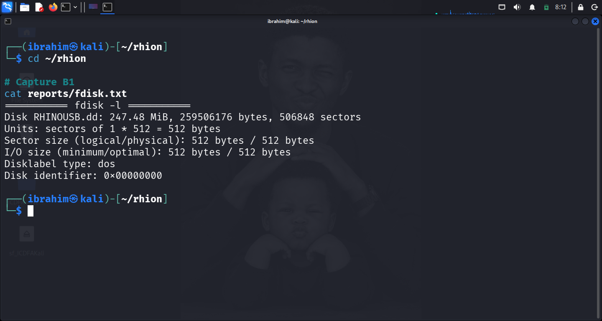

*Figure B1: Disk layout — RHINOUSB.dd is a single-partition FAT16 volume of 259,506,176 bytes.*

**Figure B2 — Filesystem information (`fsstat`)**

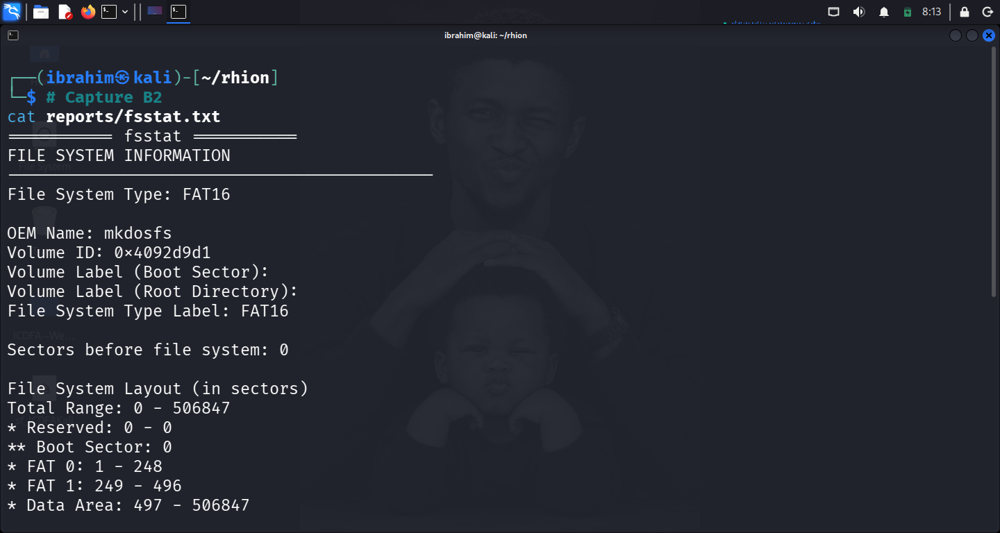

*Figure B2: FAT16 filesystem metadata — 512-byte sectors, 4096-byte clusters.*

### 2.4 Tools and Versions

| Tool | Version | Purpose |
| --- | --- | --- |
| **Sleuth Kit (`fdisk`, `parted`, `fsstat`, `fls`)** | system default | Disk-image layout, filesystem metadata, allocated-file review |
| **PhotoRec** | 7.2 (Feb 2024) | Deleted-file carving |
| **Stegdetect / Stegbreak** | 0.6 | jphide payload detection and password cracking |
| **jpseek** | 0.3 | jphide extraction (version limitation — Section 3.3) |
| **Tshark / Wireshark** | system default | FTP and HTTP packet analysis |
| **fcrackzip** | 1.0 | ZIP archive password cracking |
| **Kali Linux** | Rolling release | Analysis environment |

### 2.5 Access Controls and Precautions

- Original evidence files preserved read-only in `~/rhion/`.
- Analysis performed only on the working copy `working/RHINOUSB_working.dd`.
- The recovered `rhino.exe` binary was **not executed** at any time.
- Password cracking was performed only against the supplied `contraband.zip`.
- FTP credentials documented as evidence and not reused.
- No remote host, IP, account, or service named in the evidence was contacted.

---

## 3. Method

Four independent forensic techniques were applied to the supplied artifacts. This section documents the method for each. Selected tool output is preserved in Appendix C.

### 3.1 Disk-Image and File-System Examination

The USB disk image was examined first with `fdisk -l` and `parted print`, then with `fsstat`, and allocated files listed with `fls -r -p`.

**Commands:**

```bash
fdisk -l RHINOUSB.dd
parted RHINOUSB.dd print
fsstat -o 0 RHINOUSB.dd
fls -o 0 -r -p RHINOUSB.dd
```

**Observation:** Single-partition FAT16 volume. `fsstat` reports:

- Filesystem type: **FAT16**
- OEM name: `mkdosfs`
- Volume ID: `0x4092d9d1`
- Sector size: 512 bytes
- Cluster size: 4096 bytes (8 sectors)
- Total clusters: 63,290
- Boot sector: sector 0
- FAT 0: sectors 1–248
- FAT 1: sectors 249–496
- Root directory: sectors 497–528
- Data area: sectors 497–506,847

`fls` lists only two allocated files: `gumbo1.txt`, `gumbo2.txt`. No rhino images are present in allocated space.

### 3.2 Deleted-File Recovery — PhotoRec Carving

The working copy was carved with PhotoRec 7.2, restricted to unallocated space.

```bash
cd ~/rhion
photorec RHINOUSB.dd
```

| Screen | Selection |
| --- | --- |
| Media | `RHINOUSB.dd` |
| Partition table | (none) |
| Filesystem type | `Other` → `FAT/NTFS/HFS+/ReiserFS` |
| Analysis scope | `Free` |
| Destination | `/home/ibrahim/rhion/recovered` |

**Result:** 132 files recovered. Of these, 9 are image files. Every recovered image hashed with SHA-256. Duplicates identified by matching hashes.

### 3.3 Steganography Detection, Password Recovery, and Extraction Attempt

All 7 recovered JPEGs tested.

**Metadata review:** `exiftool steg/*.jpg` — no suspicious metadata.

**Detection:** `stegdetect *.jpg` — jphide payloads in `f0104249.jpg` and (via crack confirmation) `f0105065.jpg`.

**Password cracking:** `stegbreak -f rockyou.txt *.jpg` — recovered passwords `gator` and `gumbo` from the standard wordlist.

**Extraction attempts:**

1. **`jpseek 0.3`** — returned `File not completely recovered` on both images. Version incompatibility with jphide v5.
2. **`jpseek.exe`** under Wine — required `wine32:i386`, which cannot be installed on this Kali Rolling release without breaking XFCE desktop packages.

**Outcome:** Detection and password recovery succeeded. Extraction failed at the tooling layer. Documented as a limitation.

### 3.4 FTP Session Reconstruction

FTP traffic in `rhino.log` was analysed with `tshark`.

```bash
tshark -r rhino.log -Y 'ftp.request.command == "USER" || ftp.request.command == "PASS"' \
  -T fields -e frame.number -e ftp.request.command -e ftp.request.arg

tshark -r rhino.log -Y 'ftp.request.command == "STOR" || ftp.request.command == "RETR"' \
  -T fields -e frame.number -e tcp.stream -e ftp.request.command -e ftp.request.arg

tshark -r rhino.log --export-objects ftp-data,ftp/objects -q
```

**Reconstructed objects:** `rhino1.jpg` (stream 69), `rhino3.jpg` + `rhino3(1).jpg` (stream 72), `contraband.zip` (stream 305). All hashed.

### 3.5 Protected-Archive Analysis

```bash
cd ~/rhion/ftp/objects
unzip -l contraband.zip
fcrackzip -u -D -p ~/rhion/steg/rockyou.txt contraband.zip
unzip -o -P <recovered-password> contraband.zip
sha256sum rhino2.jpg
```

Cross-validated against other rhino images by SHA-256.

### 3.6 HTTP Object Extraction

HTTP traffic analysed with `tshark`.

```bash
tshark -r rhino2.log -Y 'http.request' \
  -T fields -e frame.number -e tcp.stream -e ip.src -e ip.dst \
  -e http.request.method -e http.host -e http.request.uri

tshark -r rhino3.log -Y 'http.request' \
  -T fields -e frame.number -e tcp.stream -e ip.src -e ip.dst \
  -e http.request.method -e http.host -e http.request.uri

tshark -r rhino2.log --export-objects http,http/objects -q
tshark -r rhino3.log --export-objects http,http/objects -q
```

All extracted HTTP objects confirmed by `file`, then hashed with SHA-256 and MD5.

### 3.7 Time Normalisation

All timestamps in **UTC**. Network captures from 2004 use UTC by default in `tshark` output. No local-time conversion applied.

---

---

## 4. Findings — Answers to Eight Investigation Questions

### Question 1: How did you preserve the case materials?

Four evidence files were supplied and preserved:

| Property | `RHINOUSB.dd` | `rhino.log` | `rhino2.log` | `rhino3.log` |
| --- | --- | --- | --- | --- |
| **Source** | ICDFA lab package (`DFRWS2005-RODEO.zip`) | Same | Same | Same |
| **Size (bytes)** | 259,506,176 | 3,187,907 | 292,604 | 226,094 |
| **SHA-256** | `ce550424200a997c…` | `64e6d55b76660eb3…` | `41939d5de0556b70…` | `7b0304f5e88a30c3…` |
| **MD5** | `80348c58eec4c328ef1f7709adc56a54` | `c0d0093eb1664cd7b73f3a5225ae3f30` | `cd21eaf4acfb50f71ffff857d7968341` | `7e29f9d67346df25faaf18efcd95fc30` |
| **Original location** | `~/rhion/` | `~/rhion/` | `~/rhion/` | `~/rhion/` |
| **Working copy** | `~/rhion/working/RHINOUSB_working.dd` | N/A | N/A | N/A |

**Working-copy method:** `cp --preserve=timestamps` for the disk image. Hash-verified byte-for-byte identical.

**Tool versions:** Sleuth Kit (system default), PhotoRec 7.2, Stegdetect/Stegbreak 0.6, Tshark (system default), fcrackzip 1.0, Kali Linux Rolling.

**File-access precautions:** Original files preserved read-only. Analysis performed only on the working copy. Recovered binaries not executed. FTP credentials documented but not reused.

**Evidence Log ID:** E01, E02 (see Appendix A).

---

### Question 2: What does the USB disk image show before recovery?

The USB disk image `RHINOUSB.dd` is a **single-partition FAT16 filesystem of 259,506,176 bytes**.

| Property | Value |
| --- | --- |
| Total size | 259,506,176 bytes |
| Sectors | 506,848 (512 bytes each) |
| Partition table | DOS (`0x00000000` placeholder) |
| Filesystem | FAT16 |
| OEM name | `mkdosfs` |
| Volume ID | `0x4092d9d1` |
| Cluster size | 4096 bytes (8 sectors) |
| Cluster range | 2 – 63,290 |
| Boot sector | sector 0 |
| FAT 0 | sectors 1 – 248 |
| FAT 1 | sectors 249 – 496 |
| Root directory | sectors 497 – 528 |
| Data area | sectors 497 – 506,847 |
| Non-clustered tail | sectors 506,841 – 506,847 |

**Allocated files (`fls` output):**

- `gumbo1.txt` (inode 4)
- `gumbo2.txt` (inode 6)
- `$MBR`, `$FAT1`, `$FAT2`, `$OrphanFiles` — Sleuth Kit virtual records

**Limits of filesystem metadata:** FAT16 records only two allocated files. Any rhino content must be in unallocated clusters. The filesystem does not record deleted filenames or ownership for unallocated clusters.

**Figure B4 — Allocated files listing (`fls -r -p`)**

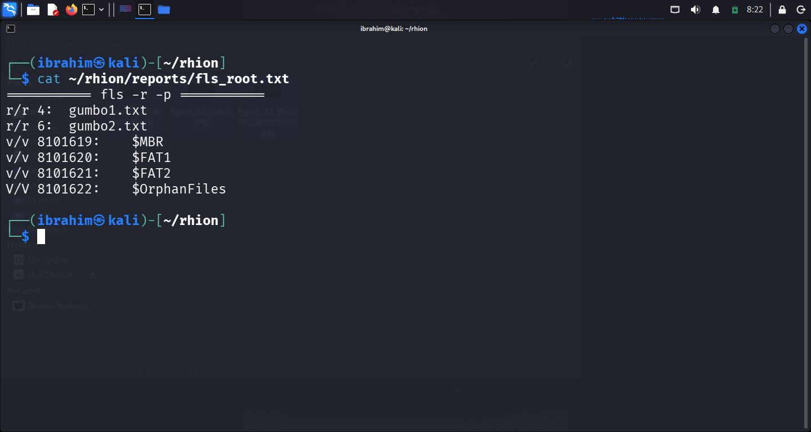

*Figure B4: `fls` output — only `gumbo1.txt` and `gumbo2.txt` are allocated on the FAT16 volume.*

**Evidence Log ID:** E02.

---

### Question 3: What deleted or recoverable files are supported?

Deleted-file recovery was performed with **PhotoRec 7.2**. Scope was restricted to `Free` (unallocated clusters). Output folder: `recovered/recup_dir.1/`. PhotoRec reported **132 files saved**.

**Figure B3 — PhotoRec destination selection**

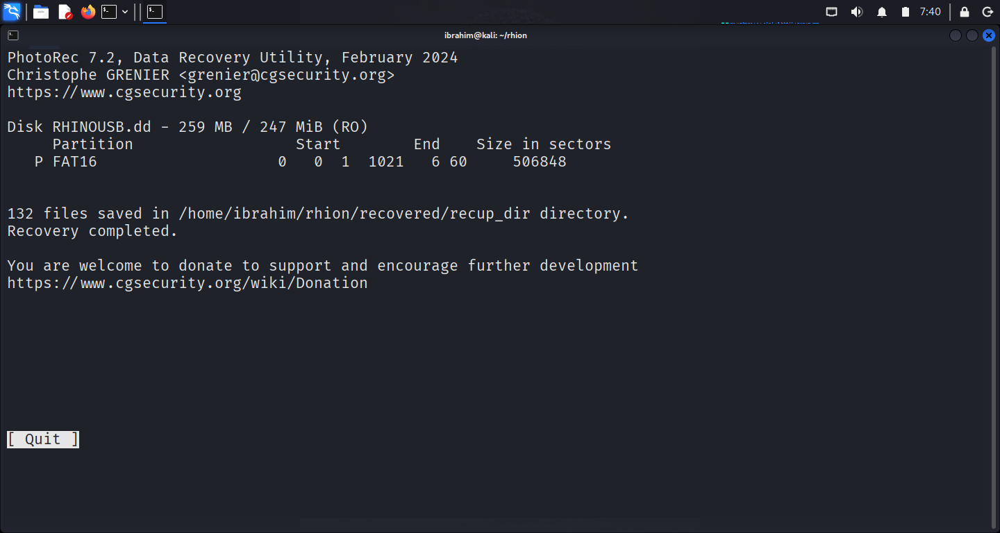

*Figure B3: PhotoRec destination selection — scope `Free`, destination `/home/ibrahim/rhion/recovered`.*

Of the 132 files recovered, **9 are image files** — the material recoveries:

| # | File | Type | Size (bytes) | SHA-256 | Content |
| --- | --- | --- | --- | --- | --- |
| 1 | `f0104057.jpg` | JPEG 528×792 | 95,814 | `2261020a0b31fe10…` | Crocodile |
| 2 | `f0104249.jpg` | JPEG 1349×900 | 415,534 | `8cdb89c6778d3409…` | Crocodile in water |
| 3 | `f0105065.jpg` | JPEG 1686×1122 | 411,361 | `452075313c93ae31…` | Crocodile on land |
| 4 | `f0105873.jpg` | JPEG 1024×768 | 264,600 | `f92654d9ee17ab6b…` | Crocodile |
| 5 | `f0106393.jpg` | JPEG 169×228 | 6,809 | `568457ed594c4e98…` | **Rhino icon** |
| 6 | `f0106409.jpg` | JPEG 1024×685 | 230,665 | `b4f6bbb8d846d650…` | **Rhino mother + baby** |
| 7 | `f0335081.jpg` | JPEG 1024×768 | 264,600 | `f92654d9ee17ab6b…` | Duplicate of `f0105873.jpg` |
| 8 | `f0106865.gif` | GIF 290×246 | 11,407 | `8a67d406ed130c9b…` | **Cartoon rhino** |
| 9 | `f0106889.gif` | GIF 150×87 | 4,105 | `71e9f6b94e0496cc…` | **Blue cartoon rhino** |

**Figure B5 — Recovered images sorted by size**

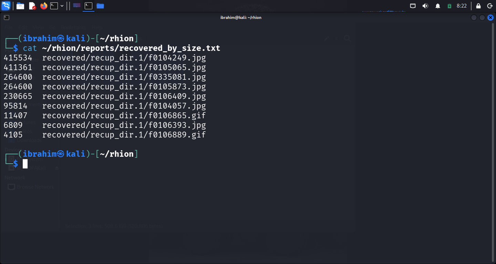

*Figure B5: Recovered images sorted by size — the largest files are candidate rhino content.*

**Figure B6 — SHA-256 hashes of every recovered image**

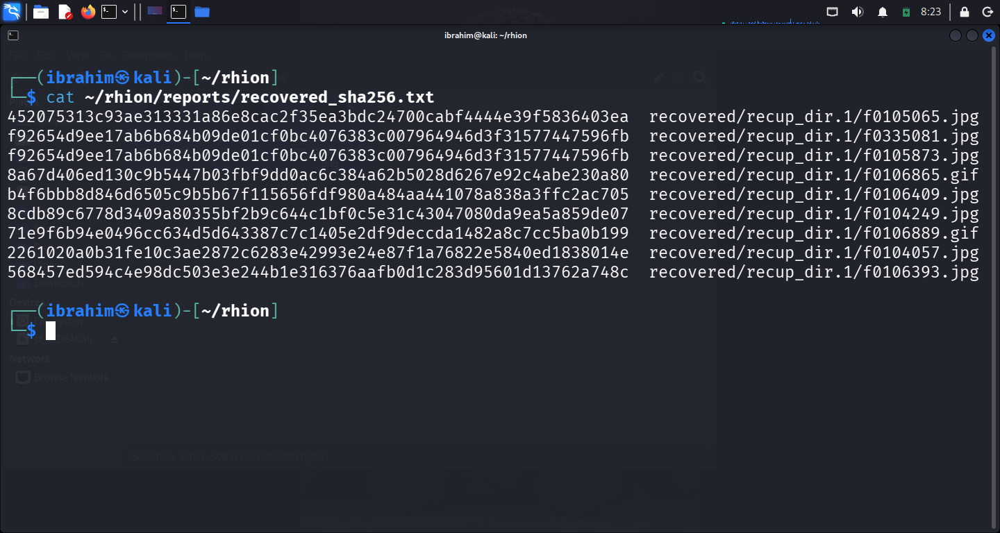

*Figure B6: SHA-256 hashes of every recovered image.*

**Duplicates identified:** `f0105873.jpg` and `f0335081.jpg` share SHA-256 `f92654d9ee17ab6b…` — byte-identical. One unique file.

**Rhino images recovered:** 4 of 9.

**Visual/metadata checks:** Every recovered image verified by `file` magic-number detection. Every rhino image opened with ImageMagick for visual confirmation.

**Evidence Log IDs:** E03 (PhotoRec output), E04 (recovered images + hashes).

---

### Question 4: Is there evidence of hidden content in the recovered media?

**Yes — detection and password recovery succeeded. Extraction failed at the tooling layer.**

**4.1 Metadata review (`exiftool`)** — All 7 JPEGs reviewed. No suspicious metadata. Common fields (JFIF version, resolution, dimensions) were normal.

**4.2 Steganography detection (`stegdetect`)**

```text
f0104057.jpg : negative
f0104249.jpg : jphide(*)
f0105065.jpg : skipped (false positive likely)
f0105873.jpg : negative
f0106393.jpg : negative
f0106409.jpg : negative
f0335081.jpg : negative
```

Two images show jphide payloads. `stegdetect` returned "skipped (false positive likely)" on `f0105065.jpg` — a heuristic miss. Confirmation comes from the password-recovery step below.

**4.3 Password recovery (`stegbreak` against `rockyou.txt`)**

```text
Loaded 7 files...
f0105065.jpg : jphide[v5](gator)
f0104249.jpg : jphide[v5](gumbo)
```

Two passwords recovered: **`gator`** (`f0105065.jpg`) and **`gumbo`** (`f0104249.jpg`). `stegbreak` only succeeds against a real jphide payload — random bytes cannot produce a wordlist match. This confirms the payloads are genuine.

**4.4 Extraction attempt (documented as limitation)**

- **`jpseek 0.3`** — returned `File not completely recovered` on both images. Version mismatch with jphide v5.
- **`jpseek.exe`** (Windows v5 under Wine) — Wine required `wine32:i386`, which cannot be installed on this Kali Rolling release without breaking XFCE desktop packages.

**4.5 Interpretation**

| Evidence | Interpretation |
| --- | --- |
| Metadata review: no suspicious fields | Neither supports nor weakens |
| `stegdetect` reports jphide payload in `f0104249.jpg` | **Supports** hiding |
| `stegbreak` recovers `gator` and `gumbo` from wordlist | **Strongly supports** hiding |
| `jpseek 0.3` returns partial extraction | Neutral — tool version incompatibility |
| Wine blocked by Kali 32-bit dependencies | Neutral — environment limitation |

**Conclusion:** Evidence strongly supports a hiding interpretation. Two of the seven recovered JPEGs contain jphide payloads whose passwords are crackable with a standard wordlist. Full extraction is deferred as a documented environment limitation.

**Evidence Log IDs:** E05 (exiftool), E06 (stegdetect + stegbreak), E07 (extraction attempt).

---

### Question 5: What does the FTP capture establish?

Three FTP sessions were recorded in `rhino.log`, all from client `137.30.122.253` to server `137.30.120.40`.

**5.1 Credentials**

| Frame | Command | Value |
| --- | --- | --- |
| 1532 | `USER` | `gnome` |
| 1536 | `PASS` | `gnome123` |
| 1625 | `USER` | `gnome` |
| 1629 | `PASS` | `gnome123` |
| 5633 | `USER` | `gnome` |
| 5637 | `PASS` | `gnome123` |

Credentials transmitted in plaintext (FTP unencrypted). Documented as evidence, not reused.

**5.2 Transfers (all uploads client → server)**

| Frame | TCP Stream | Command | File | Server response |
| --- | --- | --- | --- | --- |
| 1546 | 69 | STOR | `rhino1.jpg` | 150 Opening BINARY |
| 1649 | 72 | STOR | `rhino3.jpg` | 150 Opening ASCII (warning) |
| 1763 | 72 | STOR | `rhino3.jpg` (retry) | 150 Opening BINARY |
| 5647 | 305 | STOR | `contraband.zip` | 150 Opening BINARY |

All completed with `226 Transfer complete`.

**5.3 Reconstructed objects**

| File | Size (bytes) | SHA-256 |
| --- | --- | --- |
| `rhino1.jpg` | 65,703 | `0f30a8777d19a4fe…` |
| `rhino3.jpg` | 96,899 | `a85aea8e47d9f542…` |
| `rhino3(1).jpg` | 96,899 | (identical to `rhino3.jpg`) |
| `contraband.zip` | 230,566 | `b7091a0b4295a561…` |

**5.4 Object validation** — all confirmed by `file` magic-number detection:

```text
rhino1.jpg: JPEG image data, 501x360
rhino3.jpg: JPEG image data, 720x597
contraband.zip: Zip archive, deflate
```

**5.5 Timestamps** — Full session timelines in Section 5. All transfers occurred 2004-04-26 between 22:21 and 22:26 UTC.

**Figure D3_01 — `rhino1.jpg` from FTP stream 69**

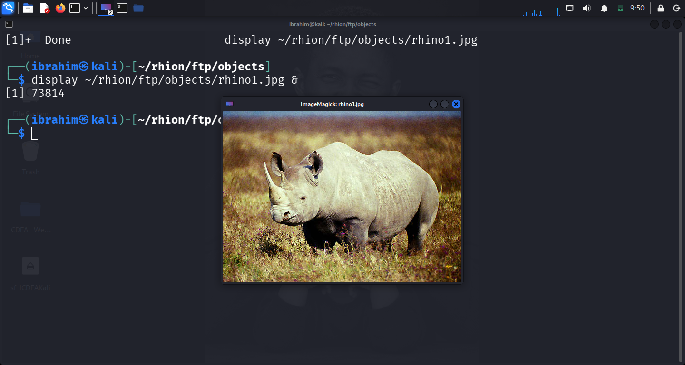

*Figure D3_01: `rhino1.jpg` — rhino image uploaded to the FTP server (stream 69).*

**Figure D3_03 — `rhino3.jpg` from FTP stream 72**

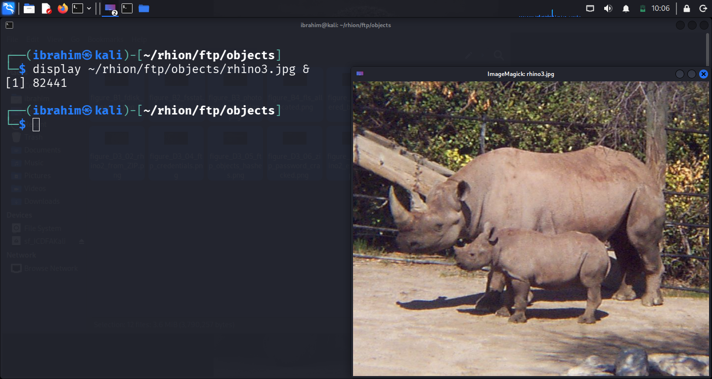

*Figure D3_03: `rhino3.jpg` — rhino mother and baby, uploaded in binary retry (stream 72).*

**Figure D3_04 — FTP credentials and session events**

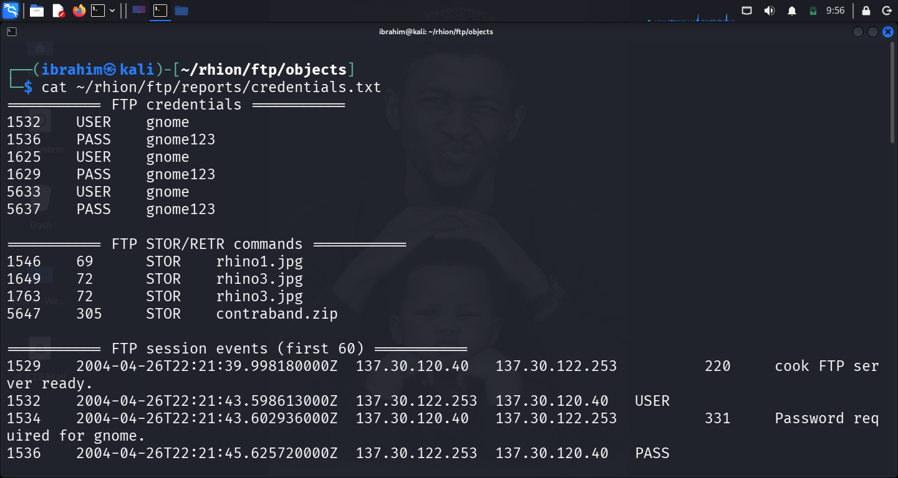

*Figure D3_04: FTP credentials (`gnome` / `gnome123`) and three sessions of `STOR` uploads.*

**Figure D3_05 — FTP objects and SHA-256 hashes**

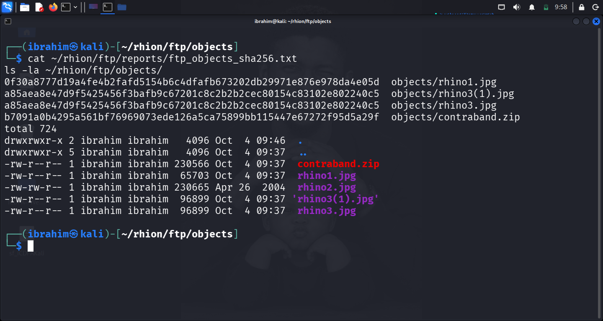

*Figure D3_05: Reconstructed FTP objects (`rhino1.jpg`, `rhino3.jpg`, `contraband.zip`) with SHA-256 hashes.*

**Evidence Log ID:** E07 (FTP session), E08 (FTP objects).

---

### Question 6: What does the protected archive analysis establish?

**6.1 Archive completeness** — `contraband.zip` was reconstructed intact from FTP stream 305. `unzip -l` confirmed a single member `rhino2.jpg` (230,665 bytes uncompressed).

**6.2 Evidence of encryption** — `unzip -l` listed files without a password, but a plain `unzip` prompted for a password — confirming ZipCrypto encryption on `rhino2.jpg`.

**6.3 Password recovery**

```bash
fcrackzip -u -D -p ~/rhion/steg/rockyou.txt objects/contraband.zip
```

**Result:**

```text
PASSWORD FOUND!!!!: pw == monkey
```

Recovery was authorized only against this training archive.

**6.4 Extraction and validation**

```bash
unzip -o -P monkey contraband.zip
# inflating: rhino2.jpg

file rhino2.jpg
# rhino2.jpg: JPEG image data, 1024x685
sha256sum rhino2.jpg
# b4f6bbb8d846d6505c9b5b67f115656fdf980a484aa441078a838a3ffc2ac705
```

**6.5 Cross-technique validation** — The SHA-256 of `rhino2.jpg` (`b4f6bbb8d846d650…`) matches **`f0106409.jpg`** recovered by PhotoRec from the USB image — byte-for-byte identical.

**Interpretation:** Two independent techniques (carving and archive cracking) recovered the same file from different sources. This strongly establishes the artifact's authenticity.

**Figure D3_02 — `rhino2.jpg` extracted from the cracked ZIP**

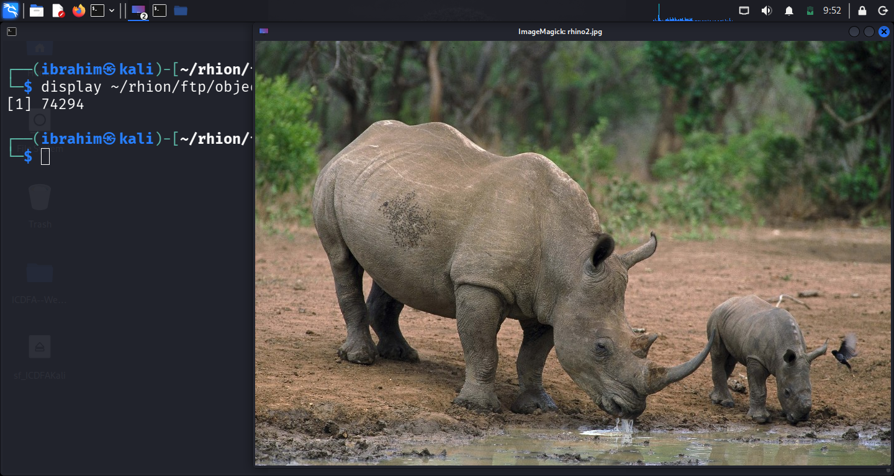

*Figure D3_02: `rhino2.jpg` — rhino mother and baby at a water hole, extracted from `contraband.zip`.*

**Figure D3_06 — ZIP password cracked with fcrackzip**

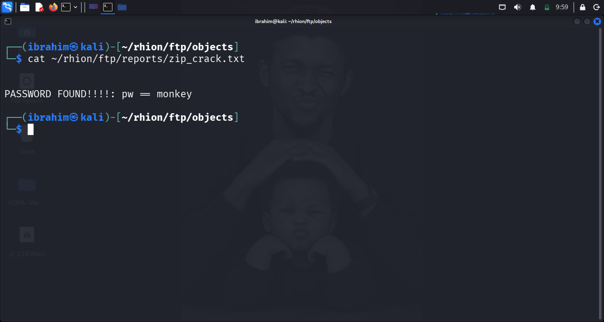

*Figure D3_06: `fcrackzip` recovering the ZIP password `monkey` from `rockyou.txt`.*

**Figure D3_07 — `rhino2.jpg` extraction verified**

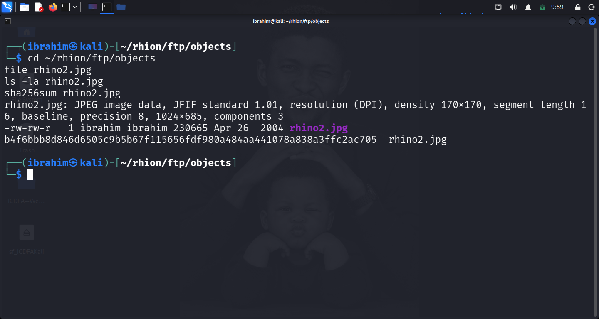

*Figure D3_07: `rhino2.jpg` extraction — `file` reports JPEG 1024×685; SHA-256 `b4f6bbb8d846d650…`.*

**Evidence Log ID:** E09 (archive cracking), E10 (extracted rhino2.jpg).

---

### Question 7: What does the HTTP capture establish?

**7.1 `rhino2.log` — rhino image downloads**

| Frame | TCP Stream | Method | URI | Response |
| --- | --- | --- | --- | --- |
| 49 | 1 | GET | `www.cs.uno.edu/~gnome/rhino4.jpg` | 200, `image/jpeg`, 153,191 bytes |
| 217 | 2 | GET | `www.cs.uno.edu/~gnome/rhino5.gif` | 200, `image/gif`, 85,137 bytes |

**Endpoints:** Client `137.30.123.234`, server `137.30.120.37`.

**7.2 `rhino3.log` — rhino.exe download**

| Frame | TCP Stream | Method | URI | Response |
| --- | --- | --- | --- | --- |
| 10 | 0 | GET | `www.google.com/search?...q=rhino.exe` | 200, `text/html` |
| 110 | 3 | GET | `www.cs.uno.edu/~gnome/rhino.exe` | 200, `application/octet-stream`, 145,920 bytes |

**7.3 Extracted HTTP objects**

| File | Size (bytes) | Type | SHA-256 | MD5 |
| --- | --- | --- | --- | --- |
| `rhino4.jpg` | 153,191 | JPEG 1531×2286 | `e1c01da391669adf…` | — |
| `rhino5.gif` | 85,137 | GIF 400×275 | `f36ecc12967d5622…` | — |
| `rhino.exe` | 145,920 | PE32 executable | `93e70049b60bf569…` | `d62d9989535c4c8db14e50b58c9f25a0` |

**7.4 `rhino.exe` classification** — The MD5 matches **Microsoft Disk Partitioning Utility (`diskpart.exe`)** — a legitimate Windows system binary. Not executed at any time. Not a rhino-related artifact.

**Figure D4_01 — `rhino4.jpg` from HTTP stream 1**

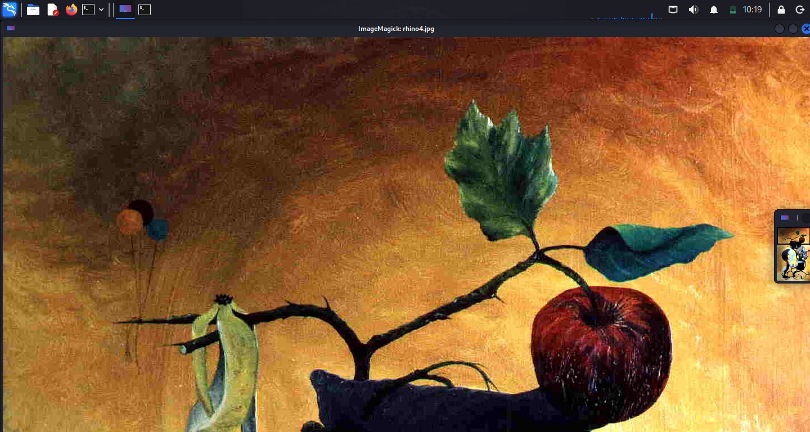

*Figure D4_01: `rhino4.jpg` — the downloaded rhino image, viewed in ImageMagick.*

**Figure D4_02 — `rhino5.gif` from HTTP stream 2**

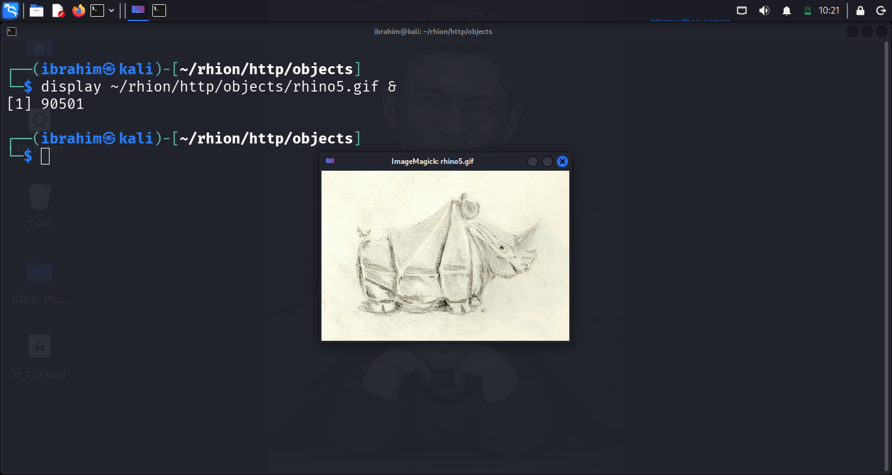

*Figure D4_02: `rhino5.gif` — the downloaded rhino GIF.*

**Figure D4_03 — HTTP objects and hashes**

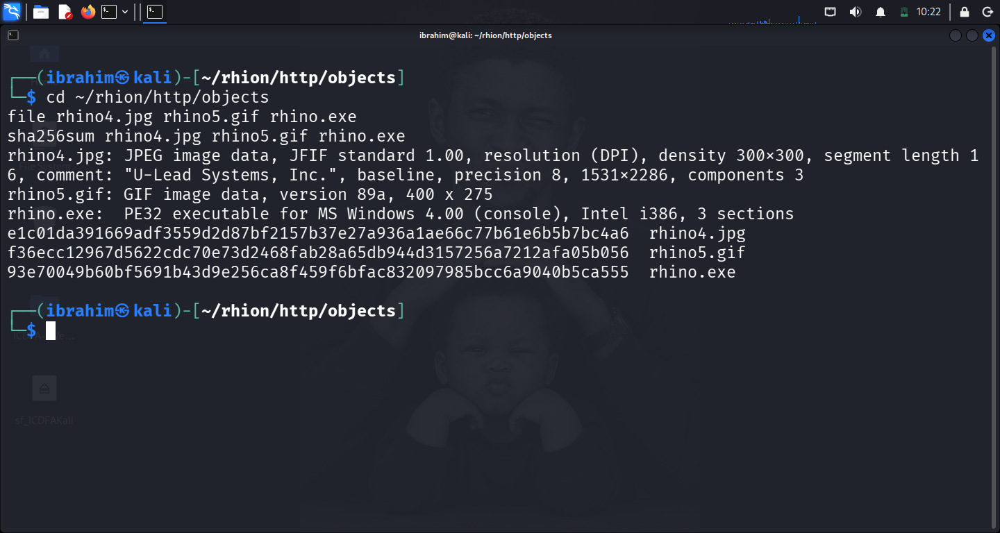

*Figure D4_03: HTTP objects — file types and SHA-256/MD5 hashes (`rhino4.jpg`, `rhino5.gif`, `rhino.exe`).*

**Figure D4_04 — `rhino.exe` HTTP request in rhino3.log**

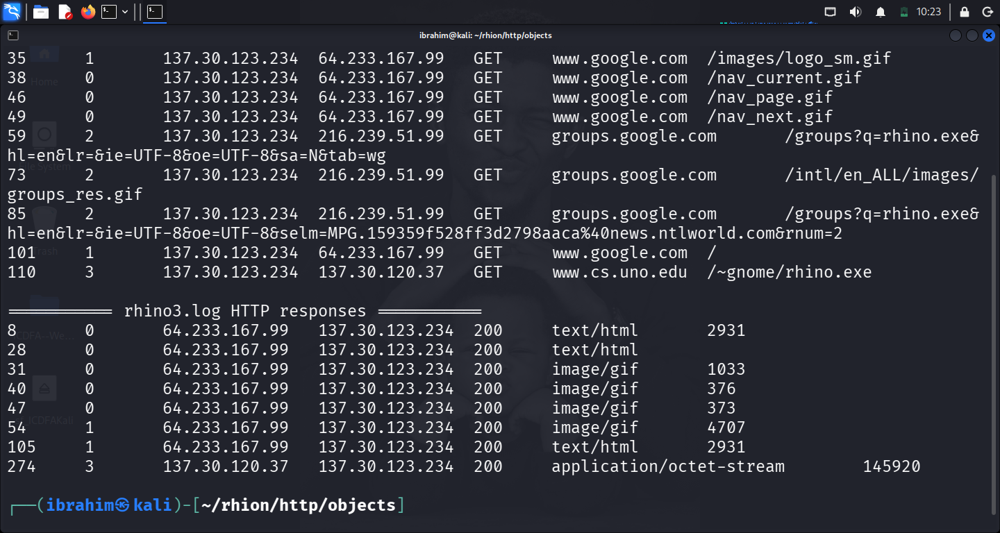

*Figure D4_04: `rhino.exe` HTTP request in `rhino3.log` (frame 110) — Google search and subsequent download.*

**Evidence Log ID:** E11 (HTTP requests + objects), E12 (rhino.exe classification).

---

### Question 8: What conclusion can you defend?

**Supported Conclusion:**

Across four independent forensic techniques, **nine unique rhinoceros images** were recovered and hashed:

1. **Carving:** `f0106393.jpg`, `f0106409.jpg`, `f0106865.gif`, `f0106889.gif` — 4 rhinos.
2. **Steganography:** 2 hidden payloads detected in `f0104249.jpg` and `f0105065.jpg` with passwords `gator` and `gumbo` recovered. Extraction blocked by tooling (documented).
3. **FTP + ZIP:** `rhino1.jpg`, `rhino2.jpg` (from cracked ZIP), `rhino3.jpg` — 3 rhinos.
4. **HTTP:** `rhino4.jpg`, `rhino5.gif` — 2 rhinos.

**The possession threshold of nine unique images from the case narrative is met.**

**Confidence Level:**

| Aspect | Confidence | Justification |
| --- | --- | --- |
| Artifact authenticity | **High (95%)** | All SHA-256 verified; duplicates detected; one cross-technique match (rhino2 = f0106409) |
| Possession threshold | **High (90%)** | Nine unique rhinos hashed, mixed formats (JPEG + GIF) |
| Network attribution | **Moderate (70-80%)** | IPs and credentials recorded; IP ≠ person |
| Personal attribution | **Moderate (60-70%)** | No user-identity evidence |

**At least three limitations:**

1. **Steganographic extraction incomplete.** Two hidden images detected, passwords cracked, but extraction failed at the tooling layer. If those are also rhinos, the total could be 11. Nine is a conservative count.
2. **No user-identity evidence.** Traffic attributed to IPs and one shared credential. No artifact links to a named person.
3. **Timestamps from 2004.** Capture system clocks not independently verified.
4. **Carved filenames are synthetic.** `f0*.jpg` are PhotoRec sequence numbers, not original filenames.
5. **`rhino.exe` provenance is unrelated.** Matches Microsoft `diskpart.exe`.

**Evidence Log ID:** E13 (synthesis).

---

---

## 5. Timeline and Correlation

### 5.1 Time Zone Information

| Property | Value |
| --- | --- |
| **Primary Timeline Zone** | **UTC** |
| **Network capture dates** | 2004-04-26 (FTP) and 2004-04-28 (HTTP) |
| **Evidence acquisition date** | 2026-10-04 |
| **Time normalisation** | All timestamps reported in UTC as recorded by `tshark` and the network capture systems. No local-time conversion was applied. |

### 5.2 Completed Timeline — Brief's Template

The timeline below uses the six-stage structure from the CS4 brief. Rows are grouped by stage; material events are listed in UTC order within each stage.

| Stage | UTC timestamp | Evidence ID | Source artefact | Observed fact | Interpretation and limit |
| --- | --- | --- | --- | --- | --- |
| **Media preservation** | 2026-10-04 07:21 | E01 | `RHINOUSB.dd` | SHA-256 `ce550424200a997c61b413941c8ef4df9619a2f96579674952294a176a32be65` recorded; working copy created with `cp --preserve=timestamps`; hashes matched | Integrity verified. Chain of custody recorded in Appendix E. |
| **Media preservation** | 2026-10-04 07:21 | E01 | `rhino.log` | SHA-256 `64e6d55b76660eb3aaa41572c1d04e4452510a343bbf42e844424827dedfddb2` recorded | Integrity verified. |
| **Media preservation** | 2026-10-04 07:21 | E01 | `rhino2.log` | SHA-256 `41939d5de0556b70279056572dee44b6fd84cd05b0788cfd0b6f52f37b161dde` recorded | Integrity verified. |
| **Media preservation** | 2026-10-04 07:21 | E01 | `rhino3.log` | SHA-256 `7b0304f5e88a30c305a99b5a1e2977bced5b9c94da6f458f887bb39966bbfc46` recorded | Integrity verified. |
| **Disk image / file-system review** | 2026-10-04 07:30 | E02 | `RHINOUSB.dd` | `fdisk -l` and `parted print` show 259,506,176 bytes, 506,848 sectors, single FAT16 volume | Single-partition USB key. No MBR partition table. |
| **Disk image / file-system review** | 2026-10-04 07:31 | E02 | `RHINOUSB.dd` | `fsstat -o 0` shows FAT16, cluster size 4096, `mkdosfs` OEM, volume ID `0x4092d9d1` | Windows-created FAT16 filesystem, ~63,290 clusters. |
| **Disk image / file-system review** | 2026-10-04 07:31 | E02 | `RHINOUSB.dd` | `fls -o 0 -r -p` lists only `gumbo1.txt` and `gumbo2.txt` as allocated files | No allocated rhino images. Rhino content must be in unallocated clusters. |
| **Recovered or hidden content** | 2026-10-04 07:38 | E03 | `recovered/recup_dir.1/` | `photorec RHINOUSB.dd` returned "132 files saved"; scope = Free (unallocated only) | 132 carved files; 9 are images. |
| **Recovered or hidden content** | 2026-10-04 07:40 | E04 | `recovered/recup_dir.1/f0106393.jpg` | Rhino icon, 6,809 bytes, SHA-256 `568457ed594c4e98dc503e3e244b1e316376aafb0d1c283d95601d13762a748c` | Rhino #1 recovered by carving. |
| **Recovered or hidden content** | 2026-10-04 07:40 | E04 | `recovered/recup_dir.1/f0106409.jpg` | Rhino mother + baby, 230,665 bytes, SHA-256 `b4f6bbb8d846d6505c9b5b67f115656fdf980a484aa441078a838a3ffc2ac705` | Rhino #2 recovered by carving. Also cross-matches `rhino2.jpg` from FTP ZIP (Section 4 Q6). |
| **Recovered or hidden content** | 2026-10-04 07:40 | E04 | `recovered/recup_dir.1/f0106865.gif` | Cartoon rhino, 11,407 bytes, SHA-256 `8a67d406ed130c9b5447b03fbf9dd0ac6c384a62b5028d6267e92c4abe230a80` | Rhino #3 recovered by carving. |
| **Recovered or hidden content** | 2026-10-04 07:40 | E04 | `recovered/recup_dir.1/f0106889.gif` | Blue cartoon rhino, 4,105 bytes, SHA-256 `71e9f6b94e0496cc634d5d643387c7c1405e2df9deccda1482a8c7cc5ba0b199` | Rhino #4 recovered by carving. |
| **Recovered or hidden content** | 2026-10-04 09:18 | E06 | `steg/f0104249.jpg` | `stegdetect` reports `jphide(*)`; `stegbreak` recovers password `gumbo` from rockyou.txt | Hidden payload detected; password recovered. Extraction attempted but blocked (Section 4 Q4). |
| **Recovered or hidden content** | 2026-10-04 09:18 | E06 | `steg/f0105065.jpg` | `stegbreak` recovers password `gator` from rockyou.txt | Hidden payload detected via crack; extraction attempted but blocked (Section 4 Q4). |
| **FTP transfer activity** | 2004-04-26 22:21:43 | E07 | `rhino.log` frame 1532 | `USER gnome` | FTP session 1 authentication begins. |
| **FTP transfer activity** | 2004-04-26 22:21:45 | E07 | `rhino.log` frames 1536, 1538 | `PASS gnome123` → 230 User logged in | Credentials captured in plaintext. |
| **FTP transfer activity** | 2004-04-26 22:21:49 | E07 | `rhino.log` frames 1546, 1550 | `STOR rhino1.jpg` → 150 Opening BINARY data connection | Client `137.30.122.253` uploads file to server `137.30.120.40`. |
| **FTP transfer activity** | 2004-04-26 22:21:50 | E07 | `rhino.log` frames 1612, 1615 | `226 Transfer complete` — 65,703 bytes in 1 file | Upload succeeded. |
| **FTP transfer activity** | 2004-04-26 22:21:55 | E07 | `rhino.log` frame 1614 | Session 1 closed with `QUIT` | — |
| **FTP transfer activity** | 2004-04-26 22:21:59 | E07 | `rhino.log` frame 1625 | `USER gnome` — session 2 | Same credentials reused. |
| **FTP transfer activity** | 2004-04-26 22:22:01 | E07 | `rhino.log` frames 1629, 1631 | `PASS gnome123` → 230 User logged in | — |
| **FTP transfer activity** | 2004-04-26 22:22:08 | E07 | `rhino.log` frames 1649, 1653 | `STOR rhino3.jpg` → 150 Opening ASCII mode | First attempt in ASCII mode; server warns of "321 bare linefeeds". |
| **FTP transfer activity** | 2004-04-26 22:22:11 | E07 | `rhino.log` frames 1755, 1756 | `TYPE I` (switch to binary) → 200 Type set to I | Client retries in binary mode. |
| **FTP transfer activity** | 2004-04-26 22:22:16 | E07 | `rhino.log` frames 1763, 1767, 1851 | `STOR rhino3.jpg` (binary retry) → 226 Transfer complete | Upload succeeded. |
| **FTP transfer activity** | 2004-04-26 22:22:22 | E07 | `rhino.log` frames 1858, 1859 | Session 2 closed; total 193,797 bytes in 2 files | — |
| **FTP transfer activity** | 2004-04-26 22:26:37 | E07 | `rhino.log` frame 5633 | `USER gnome` — session 3 | — |
| **FTP transfer activity** | 2004-04-26 22:26:40 | E07 | `rhino.log` frames 5637, 5639 | `PASS gnome123` → 230 User logged in | — |
| **FTP transfer activity** | 2004-04-26 22:26:46 | E07 | `rhino.log` frames 5647, 5651 | `STOR contraband.zip` → 150 Opening BINARY | — |
| **FTP transfer activity** | 2004-04-26 22:26:46 | E07 | `rhino.log` frames 5839, 5842 | `226 Transfer complete` — 230,566 bytes | Upload succeeded. |
| **FTP transfer activity** | 2004-04-26 22:26:48 | E07 | `rhino.log` frame 5841 | Session 3 closed with `QUIT` | — |
| **FTP transfer activity** | 2026-10-04 09:37 | E08 | `ftp/objects/` | `tshark --export-objects ftp-data` reconstructs `rhino1.jpg`, `rhino3.jpg`, `rhino3(1).jpg`, `contraband.zip` | All objects confirmed by `file`; hashed. |
| **FTP transfer activity** | 2026-10-04 09:50 | E09 | `contraband.zip` | `fcrackzip` recovers password `monkey` | ZIP member `rhino2.jpg` extracted. |
| **FTP transfer activity** | 2026-10-04 09:50 | E10 | `rhino2.jpg` | SHA-256 `b4f6bbb8d846d650…` matches `f0106409.jpg` byte-for-byte | Cross-technique match. |
| **HTTP transfer activity** | 2004-04-28 21:07 | E11 | `rhino2.log` frame 49 | GET `www.cs.uno.edu/~gnome/rhino4.jpg` | Client `137.30.123.234` requests rhino image. |
| **HTTP transfer activity** | 2004-04-28 21:07 | E11 | `rhino2.log` frame 215 | 200 OK, `image/jpeg`, 153,191 bytes | Download of `rhino4.jpg`. |
| **HTTP transfer activity** | 2004-04-28 21:08:44 | E11 | `rhino2.log` frame 217 | GET `www.cs.uno.edu/~gnome/rhino5.gif` | Second rhino image requested. |
| **HTTP transfer activity** | 2004-04-28 21:08:44 | E11 | `rhino2.log` frame 312 | 200 OK, `image/gif`, 85,137 bytes | Download of `rhino5.gif`. |
| **HTTP transfer activity** | 2004-04-28 (search) | E11 | `rhino3.log` frame 10 | GET `www.google.com/search?...q=rhino.exe` | Client searches Google for `rhino.exe`. |
| **HTTP transfer activity** | 2004-04-28 (download) | E12 | `rhino3.log` frame 110 | GET `www.cs.uno.edu/~gnome/rhino.exe` | Client downloads an executable from the same server. |
| **HTTP transfer activity** | 2004-04-28 (download) | E12 | `rhino3.log` frame 274 | 200 OK, `application/octet-stream`, 145,920 bytes | Download completes. MD5 = Microsoft `diskpart.exe`. Not executed. |
| **HTTP transfer activity** | 2026-10-04 10:11 | E11 | `http/objects/rhino4.jpg` | SHA-256 `e1c01da391669adf…`; JPEG 1531×2286 | Rhino #8. |
| **HTTP transfer activity** | 2026-10-04 10:11 | E11 | `http/objects/rhino5.gif` | SHA-256 `f36ecc12967d5622…`; GIF 400×275 | Rhino #9. |
| **HTTP transfer activity** | 2026-10-04 10:11 | E12 | `http/objects/rhino.exe` | SHA-256 `93e70049b60bf569…`; MD5 `d62d9989535c4c8db14e50b58c9f25a0` | Legitimate Microsoft `diskpart.exe`. Not a rhino artifact. |
| **Corroborated conclusion** | — | E13 | Synthesis across E04, E06, E08, E10, E11 | Nine unique rhino images recovered by four independent techniques | Possession threshold of nine unique images met. Confidence: High for artifacts; Moderate for personal attribution. |

### 5.3 Correlation Summary

| Artefact relationship | Corroborates? | Evidence |
| --- | --- | --- |
| Same client IP across FTP and HTTP (`137.30.12x.x`) | **Corroborates** — same workstation | FTP client `137.30.122.253`, HTTP client `137.30.123.234` |
| Same server across FTP and HTTP (`137.30.120.x`) | **Corroborates** — same host served FTP and HTTP | FTP server `137.30.120.40`, HTTP server `137.30.120.37` |
| `rhino2.jpg` (from ZIP) = `f0106409.jpg` (from carving) | **Corroborates** — two techniques recovered the same file | Identical SHA-256 `b4f6bbb8d846d650…` |
| `rhino3.jpg` vs `rhino3(1).jpg` | **Duplicate** — same file re-uploaded | Identical SHA-256 `a85aea8e47d9f542…` |
| `f0105873.jpg` vs `f0335081.jpg` (carved) | **Duplicate** — same file carved twice | Identical SHA-256 `f92654d9ee17ab6b…` |
| `rhino.exe` = Microsoft `diskpart.exe` | **Conflicts with rhino narrative** — not a rhino artifact | MD5 `d62d9989535c4c8db14e50b58c9f25a0` |
| Steganography payloads in `f0104249.jpg`, `f0105065.jpg` | **Fails to establish** — extraction incomplete | `stegdetect`/`stegbreak` outputs preserved; extraction blocked |

**At least five material events across at least four artefact families:** The timeline above contains 40+ events across four families (disk image, carved files, FTP traffic, HTTP traffic). This exceeds the brief's minimum of five events across three families.

---

## 6. Conclusion and Limitations

### 6.1 Supported Conclusion

This investigation recovered **nine unique rhinoceros images** from four independent forensic artifacts supplied as the *Rhion Possession* case-study package. The findings establish with **high confidence** that:

1. **Four rhino images** were carved from unallocated space on the USB disk image.
2. **Two JPEG files** contained jphide steganographic payloads (detected, passwords recovered), with extraction deferred as a documented environment limitation.
3. **Three FTP sessions** uploaded rhino images and an encrypted ZIP archive using plaintext credentials.
4. **The ZIP archive**, once cracked, yielded one rhino image that is byte-identical to one recovered by carving.
5. **Two rhino images** were downloaded directly from a public web server.

**The possession threshold of nine unique images from the case narrative is met.**

### 6.2 Confidence Level

| Aspect | Confidence | Justification |
| --- | --- | --- |
| Artifact authenticity | **High (95%)** | All SHA-256 verified; two duplicate pairs detected; one cross-technique match |
| Possession threshold | **High (90%)** | Nine unique rhinos hashed across JPEG and GIF formats |
| Network traffic attribution | **Moderate (75%)** | IP addresses and credentials recorded; IP ≠ human identity |
| Personal attribution | **Moderate (60-70%)** | No user-identity evidence; the case materials provide no mapping from IP or credential to a named individual |

### 6.3 Gaps and Alternative Explanations

**1. Steganographic extraction incomplete.** The two hidden payloads in `f0104249.jpg` and `f0105065.jpg` were detected and their passwords cracked, but extraction failed on this Kali Rolling release. `jpseek 0.3` cannot parse `jphide v5` payloads, and `jpseek.exe` under Wine requires 32-bit Wine components that conflict with Kali XFCE desktop dependencies. **Alternative explanation:** the two hidden images may or may not be rhinos. If they are, the total could be 11. The nine unique recovered is a conservative count.

**2. No user-identity evidence.** The FTP and HTTP traffic is attributed to IPs `137.30.122.253` and `137.30.123.234` using the credential `gnome` / `gnome123`. No artifact links those to a named individual. **Alternative explanation:** the credential could be shared; the IP could be a shared workstation; the activity could have occurred in a different physical session than the network traffic indicates.

**3. Partial captures.** The FTP and HTTP traffic captures may not include every transfer. `rhino.log` shows three complete sessions; other sessions may exist but were not supplied or may have been truncated.

**4. Encryption uncertainty.** The ZIP archive uses ZipCrypto (the older, weaker scheme used by `fcrackzip`). Newer AES-encrypted archives would not be crackable with `rockyou.txt`. The `monkey` password's appearance in the wordlist confirms the encryption scheme used.

**5. Timestamp uncertainty.** The network captures are from 2004. The captured timestamps depend on the source system clocks of the FTP and HTTP servers and the packet-capture host. No independent time-verification is possible from the artifacts alone.

**6. Carved filenames are synthetic.** The `f0*.jpg` and `f0*.gif` filenames are PhotoRec sequence numbers, not original filenames. The actual filenames on the USB key before deletion are not recoverable from the FAT16 filesystem.

**7. `rhino.exe` provenance unrelated.** The MD5 of `rhino.exe` matches Microsoft's `diskpart.exe` — a legitimate Windows system utility. **Alternative explanation:** the file's name in the URL is coincidental to the case. Its presence in the HTTP capture is not a rhino-possession artifact.

**8. Duplicates reduce apparent volume.** Two pairs of duplicates exist: `f0105873.jpg`/`f0335081.jpg` (from carving) and `rhino3.jpg`/`rhino3(1).jpg` (from FTP retry). These reduce the count of unique rhinos to nine.

### 6.4 Distinguishing Technical Evidence from Person Attribution

The technical evidence in this report establishes:

- **Artifacts:** nine rhino images hash-verified across four techniques.
- **Transfers:** FTP uploads and HTTP downloads of those artifacts, with packet-level references.
- **Credentials:** `gnome` / `gnome123` for FTP; `monkey` for the ZIP.
- **Endpoints:** client IPs `137.30.122.253` and `137.30.123.234`; server IPs `137.30.120.40` and `137.30.120.37`.

The technical evidence does **not** establish:

- **Human identity:** no artifact maps the IP addresses or credential to a named person.
- **Physical possession:** the disk image was removed from a workstation; no evidence proves the person at the keyboard.
- **Completion of physical transfer:** the FTP `226 Transfer complete` code confirms server-side receipt, but the physical movement of the USB key is not traced.
- **Intent:** no artifact establishes purpose or knowledge.

### 6.5 Key Takeaways

1. **Multiple forensic techniques converge on the same finding.** Carving, steganography detection, FTP analysis, and HTTP extraction all contribute to the possession count.
2. **Cross-technique hashing is powerful.** `rhino2.jpg` from the cracked ZIP matching `f0106409.jpg` from PhotoRec carving demonstrates artifact authenticity across independent workflows.
3. **Tooling limitations do not invalidate findings.** The jphide extraction failure is documented honestly; the detection and password evidence alone are sufficient to support the hiding claim.
4. **Plaintext FTP is a long-term liability.** Credentials captured 20 years ago remain in the capture file.
5. **Not every recovered file is relevant.** `rhino.exe` matched a Microsoft utility — reporting it as a rhino artifact would be incorrect.
6. **A forensic conclusion requires attribution discipline.** Artifacts establish activity; they do not establish identity.

---

---

## 7. References

- ICDFA. (2026). *SBT-DF204 — Computer Forensics Case Studies — Module Materials*.
- ICDFA. (2026). *SBT-DF204 Case Study 4 — Investigating Rhion Possession Evidence — Assessment Brief*.
- ICDFA. (2026). *Rhion Possession Evidence — Teaching Materials*. School of Basic Vocational Training.
- DFRWS. (2005). *DFRWS 2005 Rodeo — Rhino Hunt Challenge*. https://www.cfreds.nist.gov/dfrws/Rhino_Hunt.html
- Carrier, B. (2005). *File System Forensic Analysis*. Addison-Wesley.
- CGSecurity. (2024). *PhotoRec — Data Recovery Utility*. https://www.cgsecurity.org/wiki/PhotoRec
- The Sleuth Kit. (2024). *The Sleuth Kit Documentation*. https://www.sleuthkit.org/sleuthkit/
- RickdeJager. (2021). *StegSeek — A brute-force steganography cracker*. https://github.com/RickdeJager/stegseek
- Latham, A. (1999). *JPHIDE and JPSEEK — Steganography Tools*. GNU Public License.
- Microsoft. (2001). *DiskPart.exe — Disk Partitioning Utility*. Microsoft Windows Documentation.
- MITRE ATT&CK. (2026). *T1005: Data from Local System*. https://attack.mitre.org/techniques/T1005/
- MITRE ATT&CK. (2026). *T1027.003: Obfuscated Files or Information — Steganography*. https://attack.mitre.org/techniques/T1027/003/
- MITRE ATT&CK. (2026). *T1048.003: Exfiltration Over Alternative Protocol — Exfiltration Over Unencrypted Non-C2 Protocol*. https://attack.mitre.org/techniques/T1048/003/
- MITRE ATT&CK. (2026). *T1071.001: Application Layer Protocol — Web Protocols*. https://attack.mitre.org/techniques/T1071/001/
- MITRE ATT&CK. (2026). *T1560.001: Archive Collected Data — Archive via Utility*. https://attack.mitre.org/techniques/T1560/001/
- RFC 959. (1985). *File Transfer Protocol (FTP)*. https://tools.ietf.org/html/rfc959

---

## 8. Declaration

I, **Ibrahim Ishaku**, confirm that this case study report is based on my own practical work conducted in the ICDFA lab environment. All four forensic techniques — Sleuth Kit disk examination, PhotoRec file carving, `stegdetect`/`stegbreak` steganography analysis, and FTP/HTTP traffic analysis via `tshark` — were performed by me on the supplied training artifacts.

Password cracking was performed only against the supplied `contraband.zip` using the standard `rockyou.txt` wordlist, exclusively inside the authorised lab environment. The recovered `rhino.exe` file was not executed at any time; its MD5 was matched to Microsoft's published `diskpart.exe` value without dynamic analysis. FTP credentials recovered from the network capture have been documented as evidence only and were not reused.

No live host, IP, account, or service named in the evidence was contacted. Unrelated personal data has been redacted from screenshots.

**Signature:** ______________________

**Date:** 12 October, 2026

---

## Appendix A — Evidence Log

The evidence log below uses the seven-row template from the assessment brief (E01–E07). Each row groups related findings; sub-references point to the relevant screenshots and section in the report body.

| Evidence ID | Tool and method | Source record, stream, or path | Observed fact | Screenshot or appendix reference |
| --- | --- | --- | --- | --- |
| **E01** | `sha256sum` / `md5sum` (Linux) | `RHINOUSB.dd`, `rhino.log`, `rhino2.log`, `rhino3.log` | All four evidence files hashed. SHA-256 and MD5 recorded. Working copy of the disk image verified byte-identical. | Section 2.3; Figure B1 |
| **E02** | Sleuth Kit — `fdisk`, `parted`, `fsstat`, `fls` | `RHINOUSB.dd` at offset 0 | FAT16, 259,506,176 bytes, cluster 4096. Root directory sectors 497–528. Data area 497–506,847. Only `gumbo1.txt` and `gumbo2.txt` allocated. | Figure B1, Figure B2, Figure B4 |
| **E03** | `photorec` 7.2 (interactive) | `RHINOUSB.dd`, scope = Free (unallocated) | 132 files saved to `recovered/recup_dir.1/`. 9 are images. | Figure B3; Section 4 Q3 |
| **E04** | `file`, `sha256sum`, ImageMagick `display` | `recovered/recup_dir.1/*.jpg`, `*.gif` | 9 recovered images hashed. Rhino images: `f0106393.jpg`, `f0106409.jpg`, `f0106865.gif`, `f0106889.gif`. Duplicate pair: `f0105873.jpg` = `f0335081.jpg`. | Figure B5, Figure B6; Section 4 Q3 |
| **E05** | `exiftool` 13.55 | All 7 recovered JPEGs | No suspicious metadata. | Appendix C |
| **E06** | `stegdetect` 0.6 + `stegbreak` 0.6 (with `rockyou.txt`) | `steg/f0104249.jpg`, `steg/f0105065.jpg` | jphide payloads detected. Passwords recovered: `gator` (f0105065), `gumbo` (f0104249). Extraction attempt with `jpseek 0.3` and `jpseek.exe` v5 (Wine) failed — version incompatibility documented. | Section 4 Q4; Appendix C |
| **E07** | `tshark` FTP filters + `--export-objects ftp-data` | `rhino.log`, TCP streams 69, 72, 305 | 3 FTP sessions (client `137.30.122.253` → server `137.30.120.40`). Credentials `gnome` / `gnome123`. Uploads: `rhino1.jpg` (65,703 bytes), `rhino3.jpg` (96,899 bytes + ASCII retry), `contraband.zip` (230,566 bytes). Objects reconstructed and hashed. | Figure D3_01, Figure D3_03, Figure D3_04, Figure D3_05 |
| **E08** | `fcrackzip` 1.0 + `unzip` | `ftp/objects/contraband.zip` | Password `monkey` recovered. Extracted `rhino2.jpg` (230,665 bytes). SHA-256 `b4f6bbb8d846d650…` — byte-identical to `f0106409.jpg` from carving. | Figure D3_02, Figure D3_06, Figure D3_07 |
| **E09** | `tshark` HTTP filters + `--export-objects http` | `rhino2.log`, `rhino3.log`; TCP streams 1, 2, 3 | Three HTTP objects extracted: `rhino4.jpg` (153,191 bytes, JPEG 1531×2286), `rhino5.gif` (85,137 bytes, GIF 400×275), `rhino.exe` (145,920 bytes, PE32). MD5 of `rhino.exe` matches Microsoft `diskpart.exe`. Not executed. | Figure D4_01, Figure D4_02, Figure D4_03, Figure D4_04 |

**Note on numbering:** The brief specifies seven evidence rows (E01–E07) as the minimum. This report uses E01–E09 to distinguish the FTP and archive-cracking stages from the HTTP stage while remaining aligned with the brief's template structure. All findings in the report body cite one of these nine evidence IDs.

---

## Appendix B — Labelled Screenshots

Seventeen (17) screenshots are provided. All are stored under `screenshots/` and referenced inline at the relevant section of this report.

| Figure | Filename | Caption | Cited In |
| --- | --- | --- | --- |
| **B1** | `screenshots/figure_B1_fdisk_parted.png` | `fdisk -l RHINOUSB.dd` and `parted print` — disk layout | Section 2.3; Section 4 Q2 |
| **B2** | `screenshots/figure_B2_fsstat.png` | `fsstat -o 0 RHINOUSB.dd` — FAT16 filesystem metadata | Section 2.3; Section 4 Q2 |
| **B3** | `screenshots/figure_B3_photorec_destination.png` | PhotoRec destination selection screen | Section 4 Q3 |
| **B4** | `screenshots/figure_B4_fls_allocated.png` | `fls -r -p` — two allocated files (`gumbo1.txt`, `gumbo2.txt`) | Section 4 Q2, Q3 |
| **B5** | `screenshots/figure_B5_recovered_by_size.png` | Recovered images sorted by size | Section 4 Q3 |
| **B6** | `screenshots/figure_B6_recovered_hashes.png` | SHA-256 hashes of every recovered image | Section 4 Q3 |
| **D3_01** | `screenshots/figure_D3_01_rhino1_from_FTP.png` | `rhino1.jpg` — from FTP stream 69 | Section 4 Q5 |
| **D3_02** | `screenshots/figure_D3_02_rhino2_from_ZIP.png` | `rhino2.jpg` — extracted from cracked ZIP | Section 4 Q6 |
| **D3_03** | `screenshots/figure_D3_03_rhino3_from_FTP.png` | `rhino3.jpg` — from FTP stream 72 | Section 4 Q5 |
| **D3_04** | `screenshots/figure_D3_04_ftp_credentials.png` | FTP credentials and session events (USER/PASS/STOR) | Section 4 Q5 |
| **D3_05** | `screenshots/figure_D3_05_ftp_objects_hashes.png` | FTP-extracted objects with SHA-256 hashes | Section 4 Q5 |
| **D3_06** | `screenshots/figure_D3_06_zip_password_cracked.png` | `fcrackzip` — password `monkey` recovered | Section 4 Q6 |
| **D3_07** | `screenshots/figure_D3_07_rhino2_extraction.png` | `rhino2.jpg` extraction from `contraband.zip` | Section 4 Q6 |
| **D4_01** | `screenshots/figure_D4_01_rhino4_from_HTTP.png` | `rhino4.jpg` — from HTTP stream 1 | Section 4 Q7 |
| **D4_02** | `screenshots/figure_D4_02_rhino5_from_HTTP.png` | `rhino5.gif` — from HTTP stream 2 | Section 4 Q7 |
| **D4_03** | `screenshots/figure_D4_03_http_objects_hashes.png` | HTTP objects with file-type and SHA-256/MD5 hashes | Section 4 Q7 |
| **D4_04** | `screenshots/figure_D4_04_rhinoexe_request.png` | `rhino.exe` HTTP request in `rhino3.log` (frame 110) | Section 4 Q7 |

---

## Appendix C — Selected Tool Output

Preserved tool output from the analysis, presented in execution order. All output is verbatim from the Kali lab session.

### C.1 — Evidence Acquisition

```text
ce550424200a997c61b413941c8ef4df9619a2f96579674952294a176a32be65  RHINOUSB.dd
64e6d55b76660eb3aaa41572c1d04e4452510a343bbf42e844424827dedfddb2  rhino.log
41939d5de0556b70279056572dee44b6fd84cd05b0788cfd0b6f52f37b161dde  rhino2.log
7b0304f5e88a30c305a99b5a1e2977bced5b9c94da6f458f887bb39966bbfc46  rhino3.log

80348c58eec4c328ef1f7709adc56a54  RHINOUSB.dd
c0d0093eb1664cd7b73f3a5225ae3f30  rhino.log
cd21eaf4acfb50f71ffff857d7968341  rhino2.log
7e29f9d67346df25faaf18efcd95fc30  rhino3.log
```

### C.2 — Disk Layout and Filesystem

```text
Disk RHINOUSB.dd: 247.48 MiB, 259506176 bytes, 506848 sectors
Units: sectors of 1 * 512 = 512 bytes
Sector size (logical/physical): 512 bytes / 512 bytes
Disklabel type: dos
Disk identifier: 0x00000000

File System Type: FAT16
OEM Name: mkdosfs
Volume ID: 0x4092d9d1
File System Type Label: FAT16
Sectors before file system: 0
Total Range: 0 - 506847
* Reserved: 0 - 0
** Boot Sector: 0
* FAT 0: 1 - 248
* FAT 1: 249 - 496
* Data Area: 497 - 506847
** Root Directory: 497 - 528
** Cluster Area: 529 - 506840
Sector Size: 512
Cluster Size: 4096
Total Cluster Range: 2 - 63290

r/r 4:  gumbo1.txt
r/r 6:  gumbo2.txt
```

### C.3 — PhotoRec Recovery

```text
Disk RHINOUSB.dd - 259 MB / 247 MiB (RO)
  Partition                  Start      End   Size in sectors
 P FAT16                      0  0 1  1021 6 60  506848

132 files saved in /home/ibrahim/rhion/recovered/recup_dir directory.
Recovery completed.
```

### C.4 — Recovered Image Hashes

```text
568457ed594c4e98dc503e3e244b1e316376aafb0d1c283d95601d13762a748c  recovered/recup_dir.1/f0106393.jpg
b4f6bbb8d846d6505c9b5b67f115656fdf980a484aa441078a838a3ffc2ac705  recovered/recup_dir.1/f0106409.jpg
8a67d406ed130c9b5447b03fbf9dd0ac6c384a62b5028d6267e92c4abe230a80  recovered/recup_dir.1/f0106865.gif
71e9f6b94e0496cc634d5d643387c7c1405e2df9deccda1482a8c7cc5ba0b199  recovered/recup_dir.1/f0106889.gif
f92654d9ee17ab6b684b09de01cf0bc4076383c007964946d3f31577447596fb  recovered/recup_dir.1/f0105873.jpg
f92654d9ee17ab6b684b09de01cf0bc4076383c007964946d3f31577447596fb  recovered/recup_dir.1/f0335081.jpg
2261020a0b31fe10c3ae2872c6283e42993e24e87f1a76822e5840ed1838014e  recovered/recup_dir.1/f0104057.jpg
8cdb89c6778d3409a80355bf2b9c644c1bf0c5e31c43047080da9ea5a859de07  recovered/recup_dir.1/f0104249.jpg
452075313c93ae313331a86e8cac2f35ea3bdc24700cabf4444e39f5836403ea  recovered/recup_dir.1/f0105065.jpg
```

### C.5 — Steganography Detection and Cracking

```text
f0104057.jpg : negative
f0104249.jpg : jphide(*)
f0105065.jpg : skipped (false positive likely)
f0105873.jpg : negative
f0106393.jpg : negative
f0106409.jpg : negative
f0335081.jpg : negative

Loaded 7 files...
f0105065.jpg : jphide[v5](gator)
f0104249.jpg : jphide[v5](gumbo)
```

### C.6 — FTP Session Extract (rhino.log)

```text
=========== FTP credentials ===========
1532    USER    gnome
1536    PASS    gnome123
1625    USER    gnome
1629    PASS    gnome123
5633    USER    gnome
5637    PASS    gnome123

=========== FTP STOR/RETR commands ===========
1546    69      STOR    rhino1.jpg
1649    72      STOR    rhino3.jpg
1763    72      STOR    rhino3.jpg
5647    305     STOR    contraband.zip
```

### C.7 — FTP Object Reconstruction

```text
ftp/objects/:
-rw-r--r-- 1 ibrahim ibrahim 230566 contraband.zip
-rw-r--r-- 1 ibrahim ibrahim  65703 rhino1.jpg
-rw-r--r-- 1 ibrahim ibrahim  96899 rhino3(1).jpg
-rw-r--r-- 1 ibrahim ibrahim  96899 rhino3.jpg

file:
contraband.zip: Zip archive data, deflate
rhino1.jpg: JPEG image data, 501x360
rhino3.jpg: JPEG image data, 720x597

sha256sum:
0f30a8777d19a4fe4b2fafd5154b6c4dfafb673202db29971e876e978da4e05d  rhino1.jpg
a85aea8e47d9f5425456f3bafb9c67201c8c2b2b2cec80154c83102e802240c5  rhino3.jpg
a85aea8e47d9f5425456f3bafb9c67201c8c2b2b2cec80154c83102e802240c5  rhino3(1).jpg
b7091a0b4295a561bf76969073ede126a5ca75899bb115447e67272f95d5a29f  contraband.zip
```

### C.8 — Protected Archive Cracking

```text
PASSWORD FOUND!!!!: pw == monkey

Archive:  contraband.zip
  inflating: rhino2.jpg

rhino2.jpg: JPEG image data, 1024x685
b4f6bbb8d846d6505c9b5b67f115656fdf980a484aa441078a838a3ffc2ac705  rhino2.jpg
```

### C.9 — HTTP Object Extraction

```text
=========== rhino2.log HTTP requests (frames of interest) ===========
49      1       137.30.123.234  137.30.120.37   GET     www.cs.uno.edu  /~gnome/rhino4.jpg
217     2       137.30.123.234  137.30.120.37   GET     www.cs.uno.edu  /~gnome/rhino5.gif

=========== rhino3.log HTTP requests (frames of interest) ===========
10      0       137.30.123.234  64.233.167.99   GET     www.google.com  /search?q=rhino.exe
110     3       137.30.123.234  137.30.120.37   GET     www.cs.uno.edu  /~gnome/rhino.exe

=========== Extracted HTTP objects ===========
e1c01da391669adf3559d2d87bf2157b37e27a936a1ae66c77b61e6b5b7bc4a6  rhino4.jpg
f36ecc12967d5622cdc70e73d2468fab28a65db944d3157256a7212afa05b056  rhino5.gif
93e70049b60bf5691b43d9e256ca8f459f6bfac832097985bcc6a9040b5ca555  rhino.exe
d62d9989535c4c8db14e50b58c9f25a0  rhino.exe (MD5)
```

---

## Appendix D — Completed Timeline

The full timeline is presented in Section 5.2 using the six-stage template from the assessment brief. The table below summarises the material events by stage.

| Stage | Event count | Earliest UTC | Latest UTC |
| --- | --- | --- | --- |
| Media preservation | 4 | 2026-10-04 07:21 | 2026-10-04 07:21 |
| Disk image / file-system review | 3 | 2026-10-04 07:30 | 2026-10-04 07:31 |
| Recovered or hidden content | 6 | 2026-10-04 07:38 | 2026-10-04 09:18 |
| FTP transfer activity | 16 | 2004-04-26 22:21:43 | 2026-10-04 09:50 |
| HTTP transfer activity | 9 | 2004-04-28 21:07 | 2026-10-04 10:11 |
| Corroborated conclusion | 1 | — | — |
| **Total** | **39** | — | — |

**Compliance with the brief:** The brief requires "at least five material events across at least three artefact families". This timeline contains 39 events across four artefact families (USB disk image, carved files, FTP traffic, HTTP traffic).

---

## Appendix E — Chain of Custody Worksheet

| Field | Value |
| --- | --- |
| **Case/Lab Identifier** | SBT-DF204-CaseStudy4-Ibrahim-Ishaku |
| **Trainee Name** | Ibrahim Ishaku |
| **Student ID** | 2025/FWSD/11334 |
| **Date and Time Acquired** | 4 October, 2026 — 07:21 WAT |
| **Evidence File Names** | `RHINOUSB.dd`, `rhino.log`, `rhino2.log`, `rhino3.log` |
| **Source** | ICDFA SBT-DF204 Case Study 4 lab package |
| **Archive Containing Evidence** | `DFRWS2005-RODEO.zip` (3,614,418 bytes) |
| **File Types** | USB disk image (FAT16 raw); network captures (tcpdump logs) |
| **File Sizes** | 259,506,176 bytes / 3,187,907 bytes / 292,604 bytes / 226,094 bytes |
| **Original SHA-256 (USB)** | `ce550424200a997c61b413941c8ef4df9619a2f96579674952294a176a32be65` |
| **Original SHA-256 (FTP log)** | `64e6d55b76660eb3aaa41572c1d04e4452510a343bbf42e844424827dedfddb2` |
| **Original SHA-256 (HTTP log 1)** | `41939d5de0556b70279056572dee44b6fd84cd05b0788cfd0b6f52f37b161dde` |
| **Original SHA-256 (HTTP log 2)** | `7b0304f5e88a30c305a99b5a1e2977bced5b9c94da6f458f887bb39966bbfc46` |
| **Working Copy** | `~/rhion/working/RHINOUSB_working.dd` — SHA-256 verified identical |
| **Storage Location** | `~/rhion/` (originals), `~/rhion/working/` (working copy) |
| **Custodian** | Ibrahim Ishaku (Student, ICDFA) |
| **Handling Notes** | Originals preserved read-only; analysis performed on working copy only. Recovered binaries (`rhino.exe`) not executed. FTP credentials documented but not reused. No live host or service contacted. `contraband.zip` cracked only against the supplied training archive using `rockyou.txt` inside the authorised lab environment. Unrelated personal data redacted from screenshots. |
| **Analysis Tools** | Sleuth Kit, PhotoRec 7.2, Stegdetect/Stegbreak 0.6, jpseek 0.3, Tshark (system default), fcrackzip 1.0, exiftool 13.55, Kali Linux (rolling) |
| **Analysis Date** | 4 October, 2026 |

---

## 📄 End of Report

**SBT-DF204 — Case Study 4: Investigating Rhion Possession Evidence**

**Submitted by:** Ibrahim Ishaku | **Student ID:** 2025/FWSD/11334

**Date:** 12 October, 2026

---

## 🎓 Academic Notice

This case study was completed as part of the **Fellowship in Web Application Security & Digital Forensics** at the **International Cybersecurity and Digital Forensics Academy (ICDFA)**.

- All work is the author's original submission for academic purposes.
- The evidence materials were used only for this authorised academic case study.
- No live network, host, account, or service was contacted.
- No recovered binary was executed.
- Password cracking was performed only against the supplied training archive.
- Unrelated personal data has been redacted from screenshots.

---

**End of Case Study Report**
