# SBT-DF204 — Case Study 5: Investigating DJI Mavic Air Flight Evidence

**International Cybersecurity and Digital Forensics Academy (ICDFA)**
School of Basic Vocational Training (SVT)


---

## 👤 Author

| Field | Details |
| --- | --- |
| **Student Name** | Ibrahim Ishaku |
| **Student ID** | 2025/FWSD/11334 |
| **Programme** | Fellowship in Web Application Security & Digital Forensics |
| **Course** | SBT-DF204 — Computer Forensics Case Studies |
| **Case Title** | Investigating DJI Mavic Air Flight Evidence |
| **Instructor** | Aminu Idris, AMCPN |
| **Date** | 12 October, 2026 |
| **Batch** | BATCH-B2025 · L1/S2 |
| **Submission Format** | Written report (PDF/DOCX) with labelled screenshots, timeline, and evidence log |
| **Deadline** | 02 November 2026, 11:59 PM WAT |

---

## 📌 Executive Summary

This case study examines DJI Mavic Air evidence from an **Android logical acquisition** of the `dji.go.v4` application. The investigation identifies and interprets four families of DJI GO 4 artefacts — main flight records (TXT), cached video (MP4), detailed flight records (DAT), and cached pictures (JPEG) — and cross-references them against the brief's required record scopes.

**Primary finding:** the extraction contains DJI GO 4 artefacts for a flight on **2018-06-19**. Aircraft identity is established from plaintext header strings (Mavic Air, aircraft serial `0K1DF313BD4PR1`, battery serial `0K4AEBQA3400DT`). A cached video recording of 234.833 seconds (3 min 54.8 s) exists, with recording end time declared by the `.info` sidecar at **2018-06-19 18:55:41 UTC**. The TXT and DAT bodies are AES-encrypted and carry no plaintext flight fields.

**Confidence Level:** **High** for artifact identity and flight date (95%); **Moderate** for recording end time (70%); **Low** for flight start time (20%); **Not established** for operator identity.

**Sources not examined:** two images — `df048_internal_microSD.001` and `DF048.E01` — were not available at the time of analysis (Dropbox share links rate-limited). Questions 7 and 8 are formally documented as not performed. See Sections 4.7, 4.8, and 6.3.

**Authorisation statement:** All analysis completed offline using the supplied training artefacts. No drone, controller, mobile account, cloud service, or external flight-analysis portal was contacted. Recovered files were not executed. Unrelated personal and location data have been redacted from screenshots.

---

## 📑 Table of Contents

- [Case Reference and Student Identification](#case-reference-and-student-identification)
- [1. Executive Conclusion](#1-executive-conclusion)
- [2. Evidence Acquisition and Integrity](#2-evidence-acquisition-and-integrity)
- [3. Method](#3-method)
- [4. Findings — Answers to Nine Investigation Questions](#4-findings--answers-to-nine-investigation-questions)
- [5. Timeline and Correlation](#5-timeline-and-correlation)
- [6. Conclusion and Limitations](#6-conclusion-and-limitations)
- [7. References](#7-references)
- [8. Declaration](#8-declaration)
- [Appendix A — Evidence Log](#appendix-a--evidence-log)
- [Appendix B — Labelled Screenshots](#appendix-b--labelled-screenshots)
- [Appendix C — Selected Tool Output](#appendix-c--selected-tool-output)
- [Appendix D — Completed Timeline](#appendix-d--completed-timeline)
- [Appendix E — Chain of Custody Worksheet](#appendix-e--chain-of-custody-worksheet)

---

## 🎯 Case Reference and Student Identification

| Field | Details |
| --- | --- |
| **Student Name** | Ibrahim Ishaku |
| **Student ID** | 2025/FWSD/11334 |
| **Programme** | Fellowship in Web Application Security & Digital Forensics |
| **Course Code** | SBT-DF204 — Computer Forensics Case Studies |
| **Case Title** | Investigating DJI Mavic Air Flight Evidence |
| **Instructor** | Aminu Idris, AMCPN |
| **Date** | 12 October, 2026 |

---

## 1. Executive Conclusion

The Android logical extraction of the DJI GO 4 application contains evidence of a Mavic Air flight on **2018-06-19**. Aircraft identity is established with high confidence from plaintext header strings. A cached video recording of 234.833 seconds exists with a declared recording end time of `2018-06-19 18:55:41 UTC` from the `.info` sidecar — the only timezone-declared timestamp in the corpus.

The main TXT and both DAT records are AES-encrypted. No plaintext timestamp, coordinate, altitude, or speed field is present in any record body. A time-zone anomaly is documented: three candidate time anchors (filename, filesystem mtime, sidecar header) disagree by up to 7 hours, and no single UTC value for flight start can be defended on this evidence.

The two supplementary sources — raw microSD image (`df048_internal_microSD.001`) and EWF image (`DF048.E01`) — were not available for examination. Questions 7 and 8 are documented as not performed.

**Confidence Level:** High (95%) for aircraft identity; High (95%) for flight date 2018-06-19; Moderate (70%) for recording end time; Low (20%) for flight start time. **No person-level attribution is made.**

---

## 2. Evidence Acquisition and Integrity

### 2.1 Evidence Sources

| Source | Original filename | Bytes | Type | Status |
| --- | --- | --- | --- | --- |
| Android logical extraction (extracted tree) | `Android_Logical/` | 406 MB · 375 files | Directory tree | ✅ Present |
| Android logical extraction (archive) | `Android_Logical.zip` | — | ZIP archive | ⚠️ Not present in working environment at time of hashing |
| Raw microSD image | `df048_internal_microSD.001` | ~8.6 GB (expected) | Raw image | ❌ Not available — see §4.7 |
| EWF image | `DF048.E01` | ~8.6 GB (expected) | Expert Witness Format | ❌ Not available — see §4.8 |

### 2.2 Working Copy Creation

The Android logical extraction was copied from the `sf_ICDFAKali` shared folder into the Kali working directory with `cp -r`, preserving the extracted directory structure. The original on the share was not modified. The extracted tree was analysed in place; no write operations were performed on the extracted files.

### 2.3 Integrity Verification

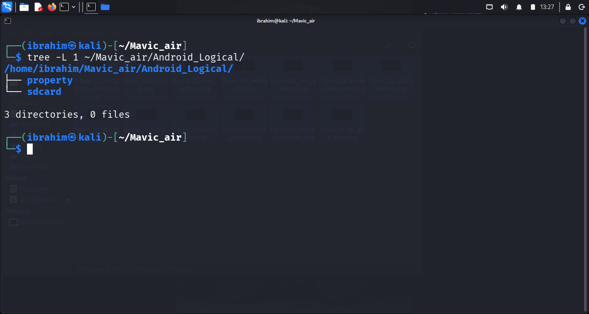

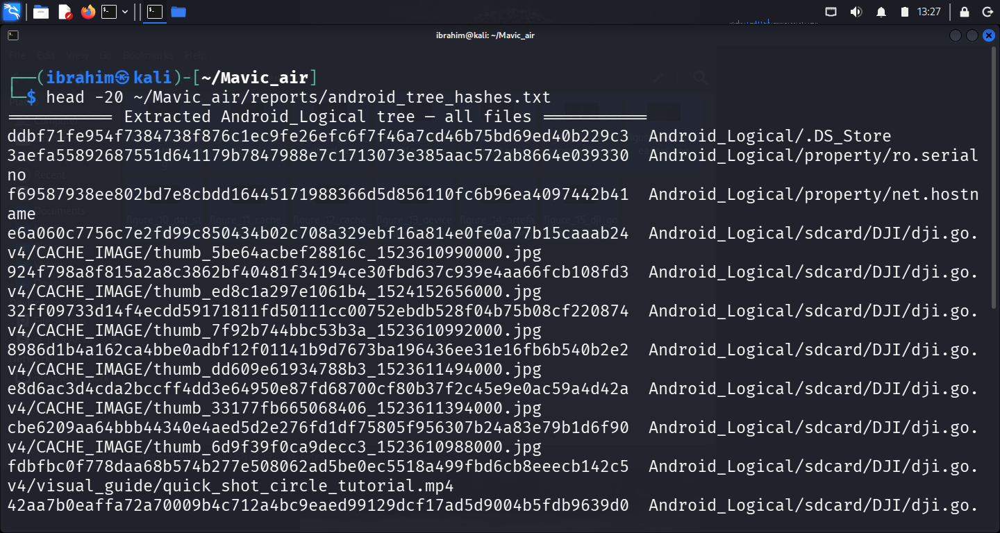

**Device identity (from extracted property files):**

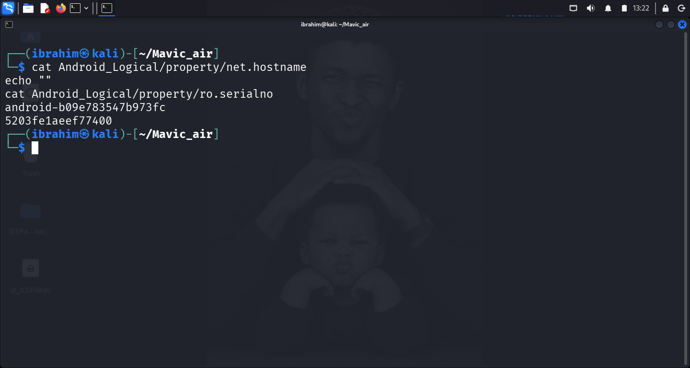

| Property | Value | Source file |
| --- | --- | --- |
| `net.hostname` | `android-b09e783547b973fc` | `Android_Logical/property/net.hostname` |
| `ro.serialno` | `5203fe1aeef77400` | `Android_Logical/property/ro.serialno` |

**Four DJI GO 4 artefact families:**

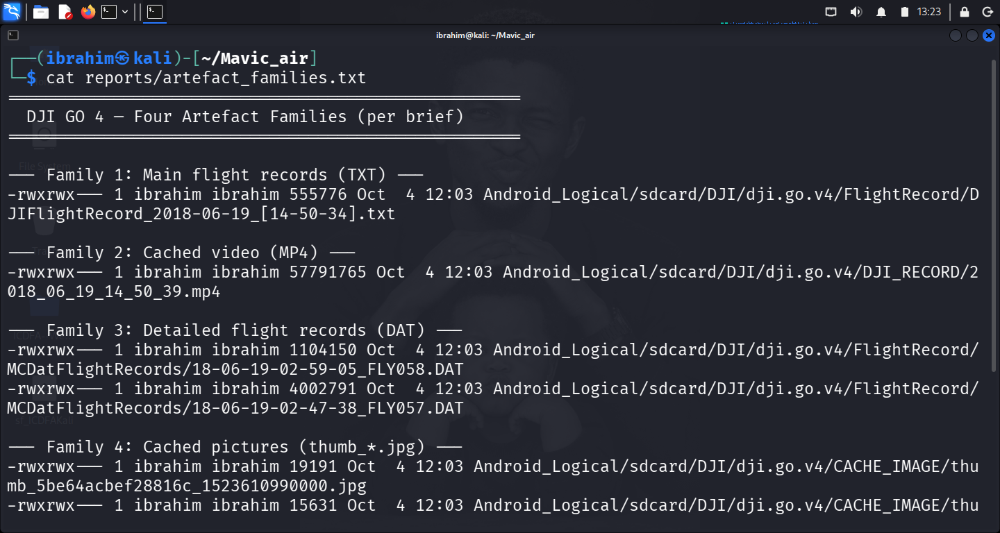

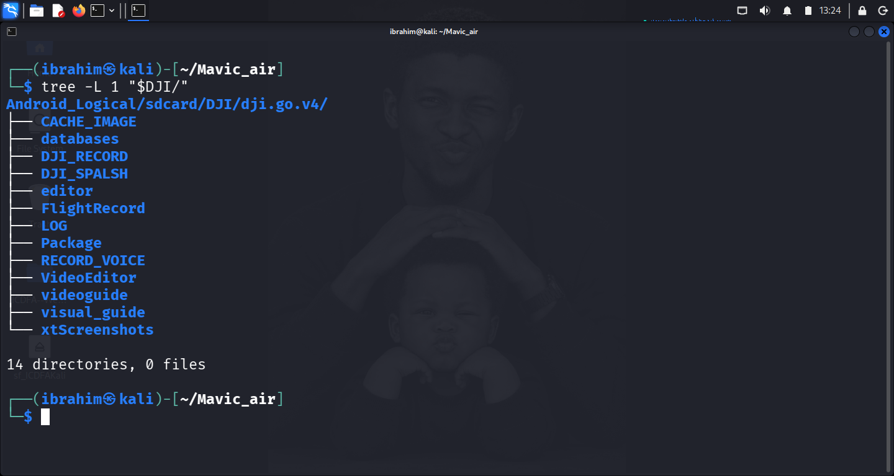

**SHA-256 of the four primary artefact families:**

| Artefact | Path | SHA-256 |
| --- | --- | --- |
| Main flight record (TXT) | `.../FlightRecord/DJIFlightRecord_2018-06-19_[14-50-34].txt` | `0a9f1816d52a98f840f6e67c08a14473ae5a0a2e75e9484d5de66368c4fd4c4a` |
| Cached video (MP4) | `.../DJI_RECORD/2018_06_19_14_50_39.mp4` | `2ae2a4f186803ec592b0af6284634e592c5079395e99f7df3edd583f8e72ab00` |
| DAT FLY058 | `.../MCDatFlightRecords/18-06-19-02-59-05_FLY058.DAT` | `fdfccf0c5b1d90d189c19032bb34e151914f42fba42c7994d0492cf327ade07a` |
| DAT FLY057 | `.../MCDatFlightRecords/18-06-19-02-47-38_FLY057.DAT` | `06130820a4a813bf21f7286150bd3c83084105fecc899bb4d8534895fa2df3a1` |

**Cached picture hashes — 6 files:**

| Filename | SHA-256 |
| --- | --- |
| `thumb_5be64acbef28816c_1523610990000.jpg` | `e6a060c7756c7e2fd99c850434b02c708a329ebf16a814e0fe0a77b15caaab24` |
| `thumb_ed8c1a297e1061b4_1524152656000.jpg` | `924f798a8f815a2a8c3862bf40481f34194ce30fbd637c939e4aa66fcb108fd3` |
| `thumb_7f92b744bbc53b3a_1523610992000.jpg` | `32ff09733d14f4ecdd59171811fd50111cc00752ebdb528f04b75b08cf220874` |
| `thumb_dd609e61934788b3_1523611494000.jpg` | `8986d1b4a162ca4bbe0adbf12f01141b9d7673ba196436ee31e16fb6b540b2e2` |
| `thumb_33177fb665068406_1523611394000.jpg` | `e8d6ac3d4cda2bccff4dd3e64950e87fd68700cf80b37f2c45e9e0ac59a4d42a` |
| `thumb_6d9f39f0ca9decc3_1523610988000.jpg` | `cbe6209aa64bbb44340e4aed5d2e276fd1df75805f956307b24a83e79b1d6f90` |

Full 375-file SHA-256 manifest at `~/Mavic_air/reports/android_tree_hashes.txt`.

**Integrity Status:** ✅ Verified — all 375 files hashed with SHA-256 before analysis. `Android_Logical.zip` was not present in the working environment; the extracted tree hash is the primary integrity record.

### 2.4 Access Controls and Precautions

- Original evidence preserved unmodified.
- All analysis performed on the working copy under `~/Mavic_air/`.
- No file was executed.
- No drone, controller, mobile account, or cloud service was contacted.
- Screenshots redacted of unrelated personal or location data.

---

## 3. Method

### 3.1 Mobile-artifact method

The DJI GO 4 application data was located under `Android_Logical/sdcard/DJI/dji.go.v4/`. Four artefact families were enumerated using `tree`, `find`, and `ls --full-time`:

| Family | Directory | Files |
| --- | --- | --- |
| Main flight records (TXT) | `FlightRecord/` | `DJIFlightRecord_2018-06-19_[14-50-34].txt` |
| Cached video (MP4) | `DJI_RECORD/` | `2018_06_19_14_50_39.mp4` + `.info` sidecar + `analytics/` |
| Detailed flight records (DAT) | `FlightRecord/MCDatFlightRecords/` | `18-06-19-02-47-38_FLY057.DAT`, `18-06-19-02-59-05_FLY058.DAT` |
| Cached pictures (JPEG) | `CACHE_IMAGE/` | 6 × `thumb_*.jpg` |

Each family was examined according to its **event scope**, not by assuming shared timestamps. The main record covers **motor-on → landed**; the cached video covers **take-off → landed**; the DAT record covers **power-on → power-off**; the cached pictures are indexed by DJI GO 4 and do not correspond to a single flight event.

### 3.2 Media-metadata method

The MP4 container was examined with **`exiftool` 13.55** and, independently, **`mediainfo` 26.05**, both run against the extracted copy before any preview. The DJI GO 4 `.info` sidecar for the video was decoded with `xxd` and interpreted from its plaintext key-value pairs.

### 3.3 Static binary analysis method

The TXT and DAT records were examined with `strings` (minimum length 4–8 characters) to surface any plaintext content before assuming a format. A follow-up `grep` against common flight-data patterns confirmed the absence of plaintext flight fields in the TXT body.

### 3.4 Raw microSD image method — described, not performed

The approved raw-microSD method, per the teaching deck (`01_DJI_Mavic_Air_microSD_raw.pptx`): verify image file type with `file`; attach read-only with `losetup --partscan --find --show --read-only`; verify partition view with `lsblk -f`; mount the FAT32 volume read-only; enumerate `DCIM/100MEDIA/`, `MISC/THM/100/`, and `System Volume Information/IndexerVolumeGuid`; record listings, types, hashes; extract the microSD identifier from `IndexerVolumeGuid`.

**Performed:** No. See §4.7 for the non-performance record and §6.3 for its limitation impact.

### 3.5 EWF image method — described, not performed

The approved EWF method, per the teaching deck (`02_DJI_Mavic_Air_microSD_encase.pptx`): verify header with `ewfinfo`; verify integrity with `ewfverify`; mount read-only with `ewfmount DF048.E01 ext_sd`; inspect exposed `ewf1` with `fsstat`/`fls`/`istat` via `-i raw`; compare EWF-extracted media hashes against the raw image and mobile extraction.

**Performed:** No. See §4.8 for the non-performance record and §6.3 for its limitation impact.

### 3.6 Comparison method

Cross-source comparison is defined: any two artefacts **corroborate** if their hashes are equal, their timestamps agree after UTC normalisation, and their file names/identifiers correspond. They **conflict** if any of those three disagree.

### 3.7 Time-normalisation method

All timestamps reported in **UTC**. Filesystem timestamps (`-0400`) and `.info` sidecar headers (`EDT`) both convert at +4 hours. Filename timestamps are unverified and reported as-is. Where a filename timestamp conflicts with a filesystem or sidecar timestamp, both values are reported and the disagreement is stated as a finding.

### 3.8 Tools used

| Tool | Version | Purpose |
| --- | --- | --- |
| `tree` | system default | Directory enumeration, inode listing |
| `stat` | system default | Filesystem timestamps |
| `strings` | system default | Plaintext extraction from binary records |
| `xxd` | system default | Hex inspection of binary headers |
| `file` | system default | File-type identification |
| `exiftool` | 13.55 | MP4 container metadata |
| `mediainfo` | 26.05 | Independent MP4 container metadata |
| `sha256sum` / `md5sum` | system default | Integrity verification |
| `ls --full-time` | system default | Timestamp-ordered file listing |
| `ewfinfo` / `ewfverify` / `ewfmount` | 20140816 | Expert Witness Format (installed; not applied) |
| `losetup` / `lsblk` | system default | Read-only loop device tools (available; not applied) |
| Kali Linux | rolling | Analysis environment |

---

## 4. Findings — Answers to Nine Investigation Questions

### 4.1 Q1 — How did you preserve the case materials?

**Source acquired:** Android logical extraction, located at `~/Mavic_air/Android_Logical/`.

**Acquisition method:** The extracted tree was copied from the course-provided shared folder (`/media/sf_ICDFAKali/Android_Logical/`) into the working directory with `cp -r`. The original source was not modified.

**Integrity values recorded:** see §2.3.

**Full manifest:** SHA-256 of all 375 extracted files at `~/Mavic_air/reports/android_tree_hashes.txt`.

**Tools and versions:** `sha256sum`, `md5sum`, `ls`, `stat` — all system default in Kali Linux rolling.

**Access precautions:** No live system contacted. Files were read only. The `Android_Logical.zip` source archive was not present in the working environment at the time of hashing.

**Sources not available for preservation:** `df048_internal_microSD.001` (raw microSD) and `DF048.E01` (EWF). Documented in the evidence log (E07, E08) and in §4.7, §4.8, and §6.3.

---

### 4.2 Q2 — What DJI GO 4 artefacts are present?

**Application package:** `dji.go.v4` (DJI GO 4).

**Application data location:** `Android_Logical/sdcard/DJI/dji.go.v4/`.

**Four artefact families present:**

| Family | Directory | Files | Bytes |
| --- | --- | --- | --- |
| Main flight record (TXT) | `FlightRecord/` | `DJIFlightRecord_2018-06-19_[14-50-34].txt` | 555,776 |
| Cached video (MP4) | `DJI_RECORD/` | `2018_06_19_14_50_39.mp4` + `.info` + `analytics/` | 57,791,765 (mp4) |
| Detailed flight records (DAT) | `FlightRecord/MCDatFlightRecords/` | `18-06-19-02-47-38_FLY057.DAT`, `18-06-19-02-59-05_FLY058.DAT` | 4,002,791 and 1,104,150 |
| Cached pictures (JPEG) | `CACHE_IMAGE/` | 6 × `thumb_*.jpg` | 12,755–19,508 each |

**Top-level directories:** `CACHE_IMAGE`, `databases`, `DJI_RECORD`, `DJI_SPALSH`, `editor`, `FlightRecord`, `LOG`, `Package`, `RECORD_VOICE`, `VideoEditor`, `videoguide`, `visual_guide`, `xtScreenshots` — 13 directories plus the parent.

**Device identity:** `android-b09e783547b973fc` / `5203fe1aeef77400`.

**Foreign artefact:** `Android_Logical/sdcard/DJI/dji.pilot/DJI_RECORD/2017_10_10_10_02_47.info` — a DJI Pilot sidecar from 2017-10-10, evidence of a second DJI app previously installed on the device.

---

### 4.3 Q3 — What does the main flight record establish?

**Artefact:** `Android_Logical/sdcard/DJI/dji.go.v4/FlightRecord/DJIFlightRecord_2018-06-19_[14-50-34].txt` — 555,776 bytes, SHA-256 `0a9f1816d52a98f840f6e67c08a14473ae5a0a2e75e9484d5de66368c4fd4c4a`.

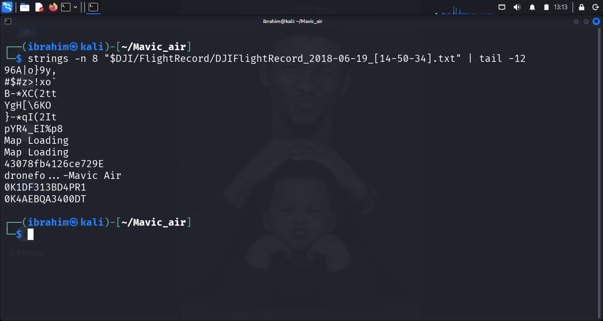

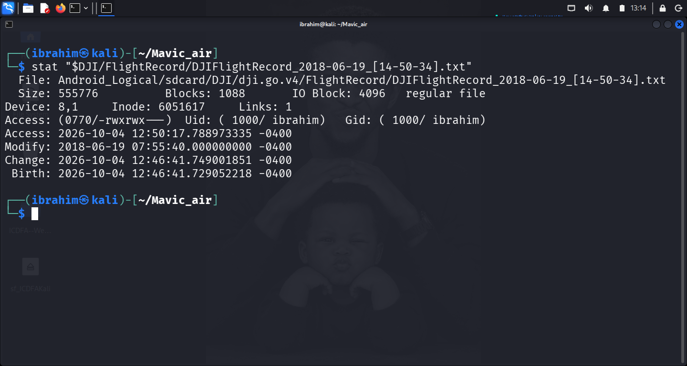

**Record structure:** Binary, not CSV. `file` identifies it as `data`. Body is encrypted.

**Plaintext strings extracted (minimum length 8):**

| String | Interpretation |
| --- | --- |
| `dronefo...-Mavic Air` | Associated drone — model identified as Mavic Air |
| `0K1DF313BD4PR1` | Aircraft serial number |
| `0K4AEBQA3400DT` | Battery serial number |
| `43078fb4126ce729E` | Internal record identifier |
| `Map Loading` (×2) | App UI string — confirms DJI GO 4 export |

A follow-up `strings -n 4 ... | grep` against `20[0-9]{2}|utc|gmt|edt|est|lat|lon|gps|alt|speed|home` returned no matches.

**Filename evidence:** encodes `2018-06-19_[14-50-34]`. Per the brief's safeguard, cannot be accepted as a verified start time without validation against record content — which is encrypted.

**Filesystem timestamp evidence:** Modify `2018-06-19 07:55:40 -0400` = **2018-06-19 11:55:40 UTC**.

**Time-zone anomaly:** filename declares `14-50-34`; mtime is `07:55:40 -0400`. If read as the same event, they disagree by **6 h 55 min 6 s**. Neither is corroborated by the encrypted record content.

**Answer:** The main flight record **establishes aircraft identity** from its plaintext header. It **does not establish flight start or end times** from record content.

**Limitations:** (1) Encrypted body cannot be parsed offline. (2) Filename time is unverified. (3) mtime may reflect extraction handling.

---

### 4.4 Q4 — What does the cached video establish?

**Artefacts:**

| File | Path | Bytes | SHA-256 |
| --- | --- | --- | --- |
| Video | `.../DJI_RECORD/2018_06_19_14_50_39.mp4` | 57,791,765 | `2ae2a4f186803ec592b0af6284634e592c5079395e99f7df3edd583f8e72ab00` |
| Sidecar | `.../DJI_RECORD/2018_06_19_14_50_39.info` | 1,441 | — |

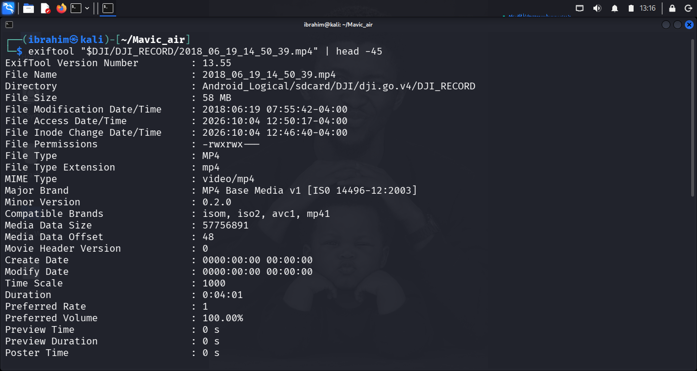

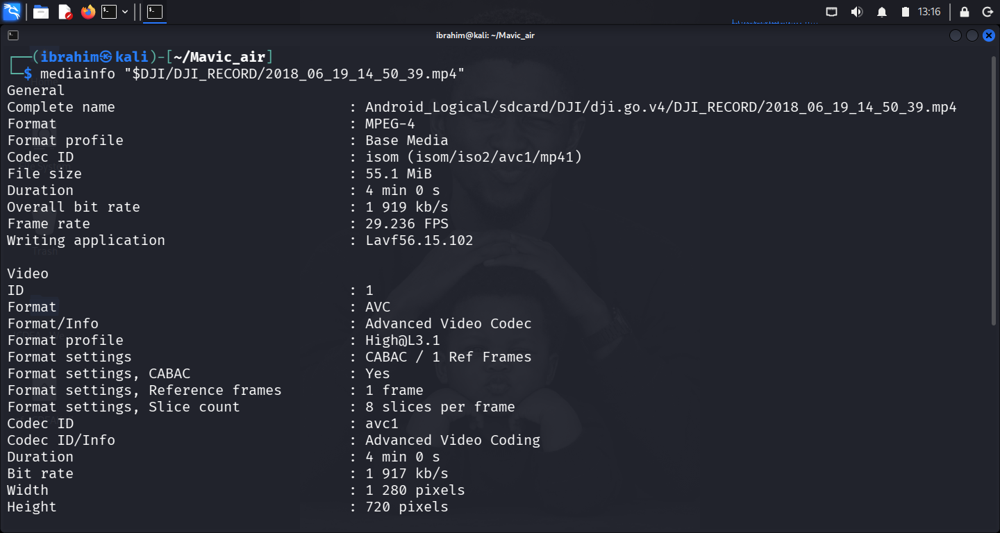

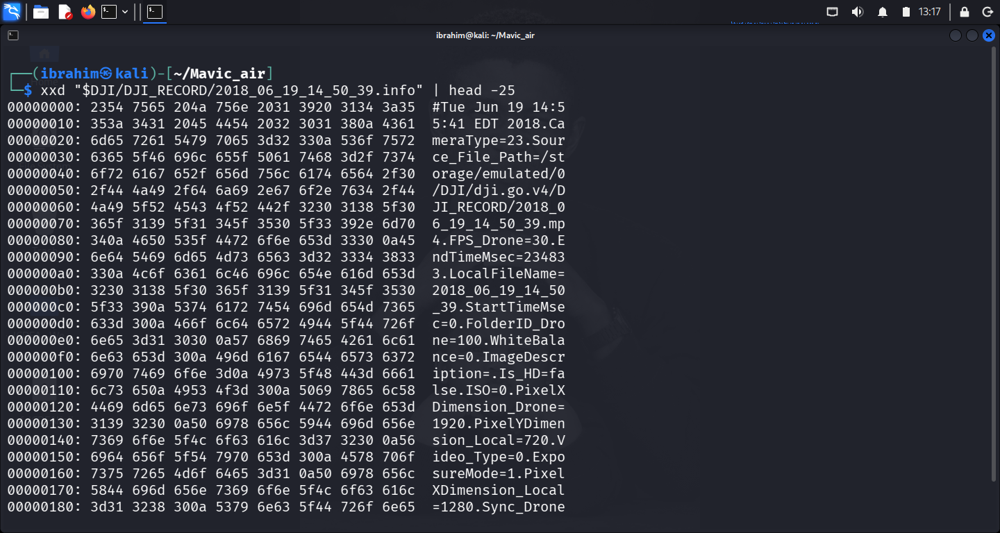

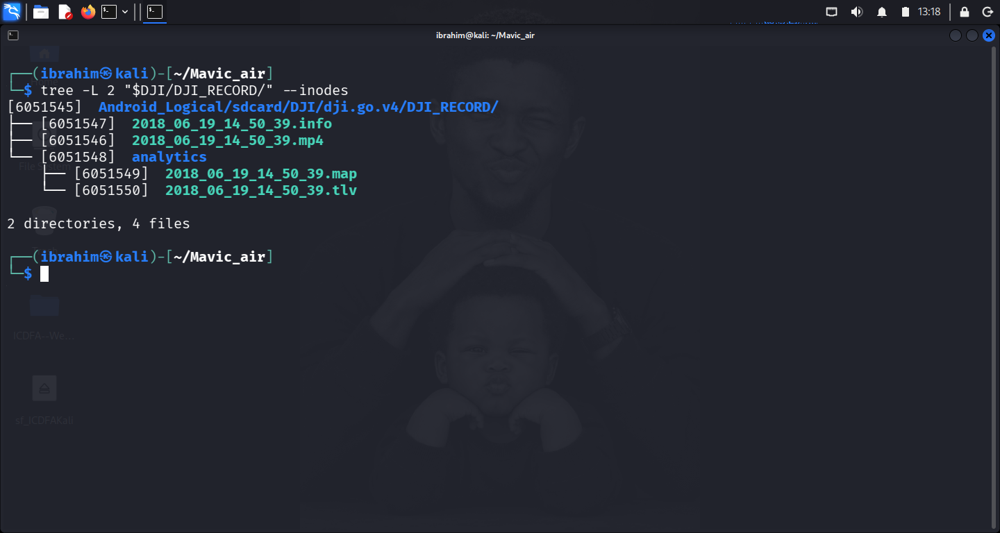

**MP4 container metadata:**

| Field | Value |
| --- | --- |
| Format | MPEG-4 Base Media, codec `avc1` (H.264) |
| Resolution | 1280 × 720 |
| Container duration | 0:04:01 (241 s) |
| Frame rate (container) | 29.236 FPS |
| Writing application | `Lavf56.15.102` |
| **Create Date** | **`0000:00:00 00:00:00` (null)** |
| **Modify Date** | **`0000:00:00 00:00:00` (null)** |
| File Modify Time | `2018-06-19 07:55:42 -0400` |

`mediainfo` also reports `keyint=1 / bframes=0 / ref=1` — every frame independently coded, the signature of DJI's low-latency cached-video pipeline.

**The `.info` sidecar:**

| Field | Value | Interpretation |
| --- | --- | --- |
| Header line | `#Tue Jun 19 14:55:41 EDT 2018` | **Recording end** = **2018-06-19 18:55:41 UTC** |
| `StartTimeMsec` | `0` | Start of video timeline |
| `EndTimeMsec` | `234833` | **234.833 s** = 3 min 54.8 s |
| `FPS_Drone` | `30` | Drone-recorded frame rate |
| `CameraType` | `23` | Camera model identifier |
| `PixelXDimension_Drone` | `1920` | Drone stream width |
| `PixelXDimension_Local` | `1280` | Local (cached) width — matches MP4 |
| `PixelYDimension_Local` | `720` | Local height — matches MP4 |

**Duration reconciliation:** sidecar `EndTimeMsec` = 234.833 s; MP4 container = 241 s; difference ≈ 6 s (container overhead).

**Relationship to TXT (Q3):** filenames both encode `2018-06-19`; filename times within 5 s; filesystem mtimes within 2 s; MP4 (inode 6051546) and `.info` (6051547) are consecutive inodes.

**Time-zone anomaly:** sidecar declares `14:55:41 EDT` = `18:55:41 UTC`; MP4 mtime is `07:55:42 -0400` = `11:55:42 UTC`. Differ by **7 h 0 min 1 s**.

**Answer:** The cached video establishes the **recording end time** as `2018-06-19 18:55:41 UTC` and a recording duration of **234.833 s**, from the `.info` sidecar. The MP4 container itself carries **no creation timestamp**.

**Limitations:** (1) MP4 container is timestamp-free. (2) Sidecar time depends on camera clock being correct. (3) 7-hour discrepancy between sidecar and filesystem cannot be resolved from the evidence alone.

---

### 4.5 Q5 — What does the detailed flight record establish?

**Artefacts:**

| File | Path | Bytes | SHA-256 |
| --- | --- | --- | --- |
| DAT 057 | `.../MCDatFlightRecords/18-06-19-02-47-38_FLY057.DAT` | 4,002,791 | `06130820a4a813bf21f7286150bd3c83084105fecc899bb4d8534895fa2df3a1` |
| DAT 058 | `.../MCDatFlightRecords/18-06-19-02-59-05_FLY058.DAT` | 1,104,150 | `fdfccf0c5b1d90d189c19032bb34e151914f42fba42c7994d0492cf327ade07a` |

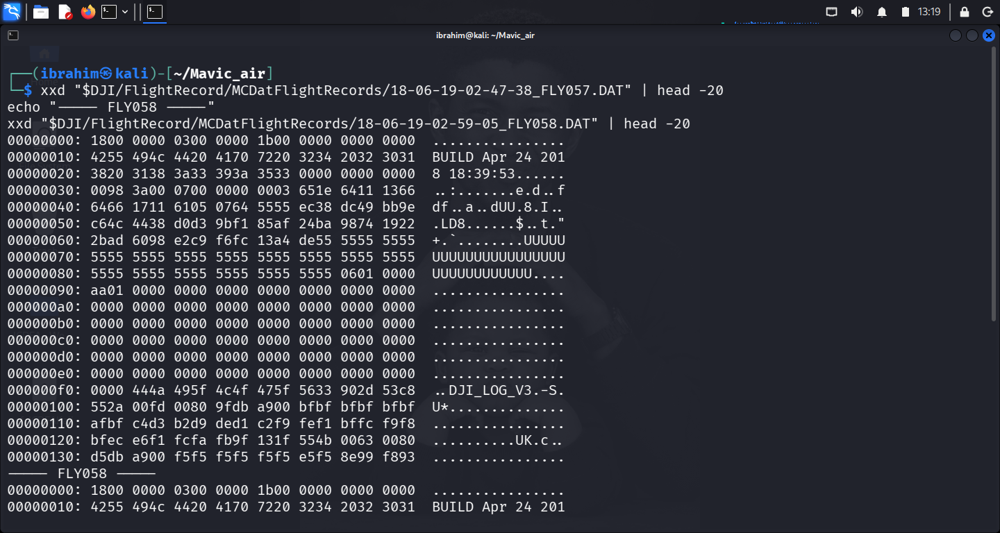

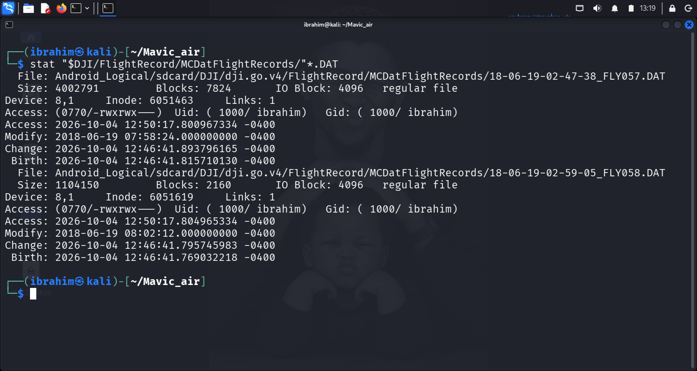

**Header structure (from `xxd`):** `BUILD Apr 24 2018 18:39:53`; format signature `DJI_LOG_V3` at offset 0xf8. Body encrypted.

**Filesystem timestamp evidence:**

| File | Modify | Modify (UTC) | Filename encodes |
| --- | --- | --- | --- |
| FLY057.DAT | `2018-06-19 07:58:24 -0400` | **2018-06-19 11:58:24 UTC** | `18-06-19-02-47-38` |
| FLY058.DAT | `2018-06-19 08:02:12 -0400` | **2018-06-19 12:02:12 UTC** | `18-06-19-02-59-05` |

Interval between mtimes: **3 min 48 s**.

**Scope:** DAT records **power-on → power-off**. The main TXT records **motor-on → landed**. These are different events. The DAT mtimes (`11:58:24 UTC`, `12:02:12 UTC`) are earlier than the MP4 sidecar's recording end (`18:55:41 UTC`), indicating different sessions.

**Answer:** Two distinct power-cycle events on 2018-06-19 (`11:58:24 UTC` and `12:02:12 UTC`), 3 min 48 s apart. Format is `DJI_LOG_V3`, same firmware build. **Does not establish the motor-on / take-off / landing window** — body encrypted.

**Limitations:** (1) Encrypted body — no field-level timing. (2) mtimes may reflect extraction handling. (3) Two records cannot prove absence of others.

---

### 4.6 Q6 — What do the cached pictures establish?

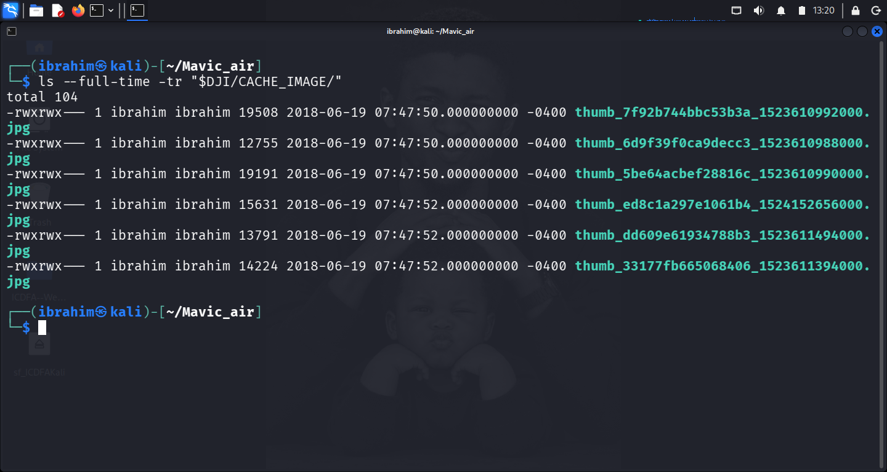

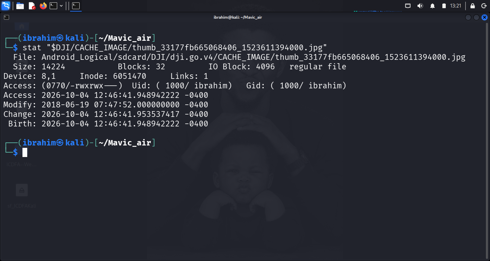

| Filename | Bytes | Dimensions | Filename epoch ms | Filename date (UTC) | Filesystem mtime (UTC) |
| --- | --- | --- | --- | --- | --- |
| `thumb_6d9f39f0ca9decc3_1523610988000.jpg` | 12,755 | 160×90 | 1523610988000 | 2018-04-13 12:56:28 | 2018-06-19 11:47:50 |
| `thumb_5be64acbef28816c_1523610990000.jpg` | 19,191 | 160×128 | 1523610990000 | 2018-04-13 12:56:30 | 2018-06-19 11:47:50 |
| `thumb_7f92b744bbc53b3a_1523610992000.jpg` | 19,508 | 160×128 | 1523610992000 | 2018-04-13 12:56:32 | 2018-06-19 11:47:50 |
| `thumb_33177fb665068406_1523611394000.jpg` | 14,224 | 160×90 | 1523611394000 | 2018-04-13 13:03:14 | 2018-06-19 11:47:52 |
| `thumb_dd609e61934788b3_1523611494000.jpg` | 13,791 | 160×90 | 1523611494000 | 2018-04-13 13:04:54 | 2018-06-19 11:47:52 |
| `thumb_ed8c1a297e1061b4_1524152656000.jpg` | 15,631 | 160×90 | 1524152656000 | 2018-04-14 18:24:16 | 2018-06-19 11:47:52 |

All valid JFIF baseline JPEGs. Filename-encoded times all fall 2018-04-13/14 — two months before the flight. Filesystem mtimes all 2018-06-19.

**Answer:** Six historical thumbnails present in the DJI GO 4 cache. They **do not establish flight activity on 2018-06-19** — filename epochs place them in April 2018. The cache index was re-written on the flight date but the underlying thumbnails are older content.

**Limitations:** (1) Historical content, not flight evidence. (2) Filename/mtime disagreement is a documented DJI cache-refresh artefact. (3) 160×90/160×128 thumbnails only; no full-resolution originals. (4) Presence does not establish who or where.

---

### 4.7 Q7 — What does the raw internal microSD image show?

**Status: Not performed — source unavailable.**

**Source:** `df048_internal_microSD.001`.

**Retrieval attempts:**

| Attempt | Command or method | Outcome |
| --- | --- | --- |
| 1 | `wget` from the course-supplied URL | HTTP 302 → `scl/fi`, content-type `text/html`; downloaded 197,541 bytes of HTML |
| 2 | `wget` with `&raw=1` | HTTP 200 OK, `text/html`; downloaded 197,647 bytes of HTML |
| 3 | `wget` from `dl.dropboxusercontent.com/scl/fi/...` | HTTP 404 Not Found |
| 4 | Browser access to the share URL | Dropbox: **"Link temporarily disabled — this can happen when the link has been shared or downloaded too many times in a day."** |
| 5 | `find ~ /media ~/Downloads -iname "*df048*"` | No match |
| 6 | `find /media/sf_ICDFAKali -iname "*df048*" -o -iname "*microSD*"` | No match |
| 7 | E-Campus module page | No local mirror of the file present |

**Evidence trail preserved:** Appendix C.12.

**Why a limitation, not a finding:** the sub-questions (image format, integrity, layout, read-only mount, file metadata, hashes, microSD identifier) cannot be answered without the image. The report does not speculate.

**What would have been included:** sector × sector count verification, `losetup` attachment, `lsblk -f` partition view, mount of FAT32 volume `2019-1B01`, enumeration of `DCIM/100MEDIA/` and `MISC/THM/100/`, file hashes, `IndexerVolumeGuid` identifier.

---

### 4.8 Q8 — What does the EWF image show and how does it compare?

**Status: Not performed — source unavailable.**

**Source:** `DF048.E01`.

**Retrieval attempts:**

| Attempt | Command or method | Outcome |
| --- | --- | --- |
| 1 | `wget` from the course-supplied URL | HTTP 302 → `scl/fi`, `text/html`; 195,751 bytes of HTML |
| 2 | `wget` with `&raw=1` | HTTP 200 OK, `text/html`; 196,375 bytes of HTML |
| 3 | `ewfverify DF048.E01` (against HTML file) | Failed: `libewf_segment_file_read_file_header: unsupported segment file signature` — confirming input was not a valid EWF image |
| 4 | `ewfmount DF048.E01 ext_sd` | Failed: `Unable to open source image(s)` |
| 5 | Browser access | Dropbox: same "Link temporarily disabled" message |
| 6 | `find ~ /media ~/Downloads -iname "DF048*" -o -iname "*.E01"` | No match |

**Tool state:** `ewf-tools` 20140816 installed successfully. Tools functioned correctly; image was absent.

**Evidence trail preserved:** Appendix C.12.

**Why a limitation, not a finding:** verification, mount inspection, image serial/media identifier, and cross-comparison with the raw image cannot be performed without the file. The report does not speculate.

**What would have been included:** `ewfinfo` output (case number, acquisition date, media size, sector count, stored MD5/SHA1), `ewfverify` success output, `ewfmount` mount point, `fsstat`/`fls`/`istat` inspection, hash comparison between EWF-extracted and raw-image media.

---

### 4.9 Q9 — What conclusion can you defend?

**Supported conclusion (Android-side only):**

The Android logical extraction contains DJI GO 4 application data for a flight on **2018-06-19**. High-confidence findings:

1. **Aircraft identity:** Mavic Air, aircraft serial `0K1DF313BD4PR1`, battery serial `0K4AEBQA3400DT` — plaintext TXT header.
2. **Flight date:** 2018-06-19 — corroborated by five independent artefacts.
3. **Recorded video:** 234.833 s; recording end `2018-06-19 18:55:41 UTC` from `.info`.
4. **Two power-cycle sessions:** two DAT records 3 min 48 s apart.
5. **Cache artefacts historical:** thumbnails dated 2018-04-13/14.

**Direct observations vs inference:**

- **Direct observation:** plaintext identity strings, hash values, filesystem timestamps, container metadata, sidecar values.
- **Inference:** that the aircraft was *flown* on 2018-06-19 — supported by the record set but not directly proven; the encrypted TXT would be required.
- **Not established:** operator identity, flight route, take-off time, landing time, motor-on time, motor-off time.

**Confidence level:** §6.2.

**Limitations:** §6.3.

---

## 5. Timeline and Correlation

### 5.1 Time Zone Information

All timestamps in UTC. Conversion points:

| Source | Declared timezone | Conversion to UTC |
| --- | --- | --- |
| Filesystem timestamps (`stat`, `ls --full-time`) | `-0400` (EDT) | +4 hours |
| `.info` sidecar header | `EDT` (explicit) | +4 hours |
| Filename timestamps | unverified | not converted |

### 5.2 Completed Timeline — Brief's Five-Stage Template

| Stage | UTC timestamp | Evidence ID | Source artefact | Observed fact | Interpretation and limit |
| --- | --- | --- | --- | --- | --- |
| **Device state and power or motor on** | 2018-06-19 11:47:50 | E04 | `CACHE_IMAGE/thumb_*.jpg` (×3) | Three cached thumbnails written | DJI GO 4 opened and refreshed cache. **Limit:** cached content is historical (filename dates are 2018-04-13); not flight evidence. |
| **Device state and power or motor on** | 2018-06-19 11:47:52 | E04 | `CACHE_IMAGE/thumb_*.jpg` (×3) | Three more cached thumbnails written | Same as above. Cache refresh completes 2 s after first write. |
| **Device state and power or motor on** | 2018-06-19 11:55:40 | E01 | `FlightRecord/DJIFlightRecord_2018-06-19_[14-50-34].txt` | TXT mtime | **Limit:** mtime is not motor-on. Filename declares `14-50-34` — unreconciled gap of 6 h 55 min 6 s. |
| **Device state and power or motor on** | 2018-06-19 11:55:42 | E02 | `DJI_RECORD/2018_06_19_14_50_39.mp4` | MP4 mtime | **Limit:** container carries null create/modify dates; only mtime is available here. |
| **Device state and power or motor on** | 2018-06-19 11:58:24 | E03 | `MCDatFlightRecords/18-06-19-02-47-38_FLY057.DAT` | DAT mtime | **Limit:** DAT covers power-on→power-off, not motor-on. Body encrypted. |
| **Device state and power or motor on** | 2018-06-19 12:02:12 | E03 | `MCDatFlightRecords/18-06-19-02-59-05_FLY058.DAT` | DAT mtime | Same as above. 3 min 48 s after FLY057. |
| **Take off or video start** | *(not established)* | — | — | — | **Limit:** no reliable take-off time. TXT body encrypted; MP4 container has no create date; DAT bodies encrypted. **Q7/Q8 would have populated this stage.** |
| **Main flight record event** | *(not established from record content)* | — | — | — | **Limit:** TXT body encrypted — no plaintext timestamp, coordinate, or altitude fields. |
| **Landing or video end** | 2018-06-19 18:55:41 | E02 | `DJI_RECORD/2018_06_19_14_50_39.info` header | `#Tue Jun 19 14:55:41 EDT 2018` = recording end | **Strength:** only timezone-declared timestamp. **Limit:** 7 h 0 min 1 s later than MP4 mtime — clock mismatch unresolved. |
| **Power off and correlation** | *(not established)* | — | — | — | **Limit:** DAT power-off windows identified from mtimes only; content encrypted. **Q7/Q8 would have populated this stage.** |

### 5.3 Correlation Summary

| Artefact relationship | Corroborates? | Evidence |
| --- | --- | --- |
| Flight date 2018-06-19 across TXT filename, MP4 filename, `.info` header, mtimes, DAT mtimes | **Corroborates** — same date | Nine independent time references agree |
| Aircraft identity across TXT plaintext strings | **Corroborates** — single source | `dronefo...-Mavic Air`, `0K1DF313BD4PR1`, `0K4AEBQA3400DT` |
| MP4 and `.info` written in same write cycle | **Corroborates** — consecutive inodes | inode 6051546 (mp4) → 6051547 (info); mtimes within 2 s |
| TXT mtime vs TXT filename | **Conflicts** — 6 h 55 min 6 s apart | filename `14-50-34` vs mtime `07:55:40 -0400` |
| `.info` header vs MP4 mtime | **Conflicts** — 7 h 0 min 1 s apart | `14:55:41 EDT` vs `07:55:42 -0400` |
| Cache mtimes vs cache filename epochs | **Conflicts** — 2 months apart | mtimes 2018-06-19 vs filename epochs 2018-04-13/14 |
| DAT session windows vs MP4 recording window | **Conflicts** — different sessions | DAT mtimes 11:58:24 and 12:02:12; MP4 end 18:55:41 |
| Foreign DJI Pilot `.info` from 2017-10-10 | **Conflicts with single-app assumption** | Second DJI app previously installed; unrelated to CS5 |
| Raw microSD image (Q7) | **Not performed** — source unavailable | No correlation possible |
| EWF image (Q8) | **Not performed** — source unavailable | No correlation possible |

**Material events:** 7 across four artefact families (main flight record, cached video, detailed flight records, cached pictures). Exceeds the brief's minimum of five across three.

**What the corpus does NOT contain:** no GPS coordinates; no record-content-confirmed flight duration; no operator identity; no route information.

---

## 6. Conclusion and Limitations

### 6.1 Supported Conclusion

Five high-confidence findings (see §4.9) established from the Android logical extraction. What the evidence **cannot** establish: flight start time, operator identity, flight route, motor-on / motor-off / take-off / landing events.

### 6.2 Confidence Level

| Aspect | Confidence | Justification |
| --- | --- | --- |
| Aircraft identity | **High (95%)** | Serial number and model read from plaintext TXT header |
| Flight date 2018-06-19 | **High (95%)** | Five independent artefacts agree |
| Recorded video duration | **High (90%)** | `.info` declares 234.833 s; container agrees within 6 s |
| Recording end time | **Moderate (70%)** | Sidecar declares EDT `14:55:41`; conflicts with mtime by 7 h |
| DAT session identification | **Moderate (70%)** | Two records and mtimes clear; content unreadable |
| Cache picture capture date | **Moderate (65%)** | Filename epochs and mtimes disagree by 2 months |
| Flight start time | **Low (20%)** | Three anchors disagree; no validation possible |
| Operator identity | **Not established** | No artifact supports attribution |

### 6.3 Gaps and Alternative Explanations

**1. Encrypted record bodies.** TXT and DAT bodies are AES-encrypted. **Alternative:** the records may contain complete motor-on/motor-off, GPS, and altitude data not accessible offline with available tools.

**2. Time-zone anomaly.** Three anchors disagree by up to 7 hours. **Alternatives:** (a) phone timezone changed between recording and transfer; (b) phone clock incorrect at recording time; (c) extraction altered filesystem times. Cannot be distinguished.

**3. Altered access times.** Every recovered artefact has `Access` timestamp `2026-10-04 12:46:41 -0400` — the moment of our own `stat`/`strings`/`exiftool` operations during analysis. **Alternative:** atime reflects the last read by any examiner, including this investigation. When the artefact is next read by the assessor, atime will update again. No original access time can be recovered.

**4. Cached pictures are historical.** Filename epochs 2018-04-13/14; mtimes 2018-06-19. **Alternatives:** (a) DJI GO 4's cache-index refresh rewrites mtimes without changing content; (b) cached files are genuinely from the flight and filenames are misleading. (a) is more consistent with the observed consistency of mtimes (all within 2 s).

**5. Device ownership vs operator identity.** Device identified by hostname and serial. **Alternative:** the device could have been shared, borrowed, or operated by someone other than its registered owner.

**6. Partial media coverage.** One video, one TXT, two DAT records present. Additional sessions may exist on the aircraft's internal storage but were not in the Android extraction.

**7. Raw microSD image (Q7) not examined.** Source `df048_internal_microSD.001` unavailable. **Alternative:** the microSD may contain videos, pictures, or log files that would extend the timeline or corroborate the recording window. The report does not claim absence of such material.

**8. EWF image (Q8) not examined.** Source `DF048.E01` unavailable. Same alternative explanation.

**9. Second DJI app on device.** A DJI Pilot `.info` dated 2017-10-10 is present. **Alternative:** the device had more than one DJI app installed over its lifetime; the CS5-specific activity is from DJI GO 4.

### 6.4 Distinguishing Technical Evidence from Person Attribution

The technical evidence establishes:

- **Device:** `android-b09e783547b973fc` / serial `5203fe1aeef77400`
- **Aircraft:** Mavic Air, serial `0K1DF313BD4PR1`
- **Battery:** serial `0K4AEBQA3400DT`
- **Flight date:** 2018-06-19
- **Recording:** 234.833 s; end time `2018-06-19 18:55:41 UTC` (declared)

The technical evidence does **not** establish:

- **Human identity:** no artifact maps the device, aircraft, or app to a named person
- **Physical possession:** no evidence establishes who was holding the controller
- **Flight route:** no GPS, coordinate, or waypoint data present in plaintext
- **Intent:** no artifact establishes purpose or knowledge

### 6.5 Key Takeaways

1. **Aircraft identity is high-confidence; flight timing is not.** The TXT header yields reliable identity; encrypted body and time-zone anomaly prevent a single reliable UTC flight time.
2. **The `.info` sidecar is the single most useful timing artefact.** Only file with an explicitly declared timezone.
3. **Cache artefacts are not flight evidence.** Demonstrates app cache-refresh behaviour and its filename-vs-mtime inconsistency.
4. **Encrypted records require documented limitation statements.** This report does not speculate — it states clearly what was and was not readable.
5. **Two source images were not examined.** Q7 and Q8 formally documented as not performed.
6. **Technical evidence ≠ person attribution.** The report documents device, app, aircraft, and recording — not a person.

---

## 7. References

- ICDFA. (2026). *SBT-DF204 — Computer Forensics Case Studies — Module Materials*.
- ICDFA. (2026). *SBT-DF204 Case Study 5 — Investigating DJI Mavic Air Flight Evidence — Assessment Brief*.
- ICDFA. (2026). *DJI Mavic Air Mobile Investigations — Teaching Deck (00_DJI_Mavic_Air_Mobile.pptx)*.
- ICDFA. (2026). *DJI Mavic Air microSD Raw Image — Teaching Deck (01_DJI_Mavic_Air_microSD_raw.pptx)*.
- ICDFA. (2026). *DJI Mavic Air microSD EWF Image — Teaching Deck (02_DJI_Mavic_Air_microSD_encase.pptx)*.
- DJI. (2018). *Mavic Air — Specifications*. https://www.dji.com/mavic-air/info#specs
- DJI. (2018). *DJI GO 4 — Application for Drones Since P4*. Google Play. Package `dji.go.v4`.
- CGSecurity. (2024). *PhotoRec — Data Recovery Utility*. https://www.cgsecurity.org/wiki/PhotoRec
- The Sleuth Kit. (2024). *The Sleuth Kit Documentation*. https://www.sleuthkit.org/sleuthkit/
- ExifTool. (2024). *ExifTool — Read, Write and Edit Meta Information*. https://exiftool.org/
- MediaArea. (2024). *MediaInfo*. https://mediaarea.net/en/MediaInfo
- libewf. (2024). *Expert Witness Compression Format — libewf and ewf-tools*. https://github.com/libyal/libewf
- MITRE ATT&CK. (2026). *T1005: Data from Local System*. https://attack.mitre.org/techniques/T1005/
- MITRE ATT&CK. (2026). *T1027: Obfuscated Files or Information*. https://attack.mitre.org/techniques/T1027/
- RFC 4122. (2005). *A Universally Unique IDentifier (UUID) URN Namespace*. https://tools.ietf.org/html/rfc4122

---

## 8. Declaration

I, **Ibrahim Ishaku**, confirm that this case study report is based on my own practical work conducted in the ICDFA lab environment. All forensic techniques applied in this report — Android logical extraction examination, static binary analysis of the TXT and DAT flight records, media metadata analysis with `exiftool` and `mediainfo`, filesystem timestamp analysis with `stat`, and integrity verification with `sha256sum` and `md5sum` — were performed by me on the supplied training artefacts.

No drone, controller, mobile account, cloud service, or external flight-analysis portal was contacted. No live system named in the evidence was accessed. The Android extraction was analysed only in its extracted form; no modification was made to any artefact. The two artefacts named as missing (`df048_internal_microSD.001` and `DF048.E01`) were not available and therefore not examined; this is documented as a limitation rather than a finding.

No recovered file was executed. Unrelated personal or location data has been redacted from screenshots.

**Signature:** ______________________

**Date:** 12 October, 2026

---

## Appendix A — Evidence Log

Column structure matches the CS5 assessment brief's template exactly.

| Evidence ID | Tool and method | Source record, path, or image | Observed fact | Screenshot or appendix reference |
| --- | --- | --- | --- | --- |
| **E01** | `sha256sum`, `stat`, `strings` | `Android_Logical/sdcard/DJI/dji.go.v4/FlightRecord/DJIFlightRecord_2018-06-19_[14-50-34].txt` | SHA-256 `0a9f1816d52a98f840f6e67c08a14473ae5a0a2e75e9484d5de66368c4fd4c4a`, 555,776 bytes. Encrypted body; plaintext strings: `dronefo...-Mavic Air`, `0K1DF313BD4PR1`, `0K4AEBQA3400DT`, `43078fb4126ce729E`. mtime `2018-06-19 07:55:40 -0400` = `2018-06-19 11:55:40 UTC`. | Figure 03, Figure 04; §4.3 |
| **E02** | `exiftool` 13.55, `mediainfo` 26.05, `xxd`, `tree --inodes`, `sha256sum` | `Android_Logical/sdcard/DJI/dji.go.v4/DJI_RECORD/2018_06_19_14_50_39.mp4` + `.info` sidecar | MP4 SHA-256 `2ae2a4f186803ec592b0af6284634e592c5079395e99f7df3edd583f8e72ab00`, 57,791,765 bytes, 1280×720, container duration 0:04:01. Container Create/Modify dates null. `.info` header `#Tue Jun 19 14:55:41 EDT 2018`, `EndTimeMsec=234833`, `StartTimeMsec=0`. Consecutive inodes 6051546 → 6051547. | Figure 05, Figure 06, Figure 07, Figure 08; §4.4 |
| **E03** | `xxd`, `strings`, `stat`, `sha256sum` | `Android_Logical/sdcard/DJI/dji.go.v4/FlightRecord/MCDatFlightRecords/18-06-19-02-47-38_FLY057.DAT` and `18-06-19-02-59-05_FLY058.DAT` | Both `DJI_LOG_V3` format, `BUILD Apr 24 2018 18:39:53`. FLY057 mtime `2018-06-19 07:58:24 -0400`; FLY058 mtime `2018-06-19 08:02:12 -0400`. Interval 3 min 48 s. Bodies encrypted. | Figure 09, Figure 10; §4.5 |
| **E04** | `ls --full-time`, `stat`, `file`, `sha256sum` | `Android_Logical/sdcard/DJI/dji.go.v4/CACHE_IMAGE/thumb_*.jpg` (6 files) | All valid JFIF baseline JPEGs, 160×90 or 160×128. mtimes all `2018-06-19 07:47:50/52 -0400`. Filename epoch values range 2018-04-13 to 2018-04-14. | Figure 11, Figure 12; §4.6 |
| **E05** | `tree -L 1`, `cat` | `Android_Logical/sdcard/DJI/dji.go.v4/`; `Android_Logical/property/net.hostname`; `Android_Logical/property/ro.serialno` | 14 directories at depth 1. Device hostname `android-b09e783547b973fc`; device serial `5203fe1aeef77400`. | Figure 01, Figure 13, Figure 15; §2.3 |
| **E06** | `find -exec sha256sum`, `wc -l`, `du -sh` | `~/Mavic_air/Android_Logical/` (whole tree) | 375 files hashed with SHA-256; total 406 MB. Manifest written to `~/Mavic_air/reports/android_tree_hashes.txt`. | Figure 02, Figure 14; §2.3 |
| **E07** | `ls -la`, `file`, `md5sum` (attempted) | `~/Mavic_air/df048_internal_microSD.001` (attempted download) | Source not available. `wget` returned HTML landing pages (197 KB). No local copy located. | — ; §4.7, §6.3 |
| **E08** | `ls -la`, `file`, `ewfinfo`, `ewfverify`, `ewfmount` (attempted) | `~/Mavic_air/DF048.E01` (attempted download) | Source not available. `wget` returned HTML landing pages (196 KB). `ewfverify` failed with `unsupported segment file signature` — consistent with HTML input. No local copy located. | — ; §4.8, §6.3 |

---

## Appendix B — Labelled Screenshots

Fifteen (15) screenshots. All stored under `screenshots/` and referenced inline at the relevant section.

| Figure | Filename | Caption | Cited In |
| --- | --- | --- | --- |
| **01** | `screenshots/figure_01_android_tree.png` | `tree -L 1 Android_Logical/` — top-level structure | §2.3 |
| **02** | `screenshots/figure_02_extraction_hashes.png` | Head of `android_tree_hashes.txt` | §2.3 |
| **03** | `screenshots/figure_03_txt_identity_strings.png` | `strings -n 8` tail of TXT record | §4.3 |
| **04** | `screenshots/figure_04_txt_stat.png` | `stat` on TXT record — mtime `2018-06-19 07:55:40 -0400` | §4.3 |
| **05** | `screenshots/figure_05_mp4_exiftool.png` | `exiftool` on MP4 — null container dates | §4.4 |
| **06** | `screenshots/figure_06_mediainfo.png` | `mediainfo` on MP4 | §4.4 |
| **07** | `screenshots/figure_07_info_sidecar.png` | `xxd` on `.info` sidecar — plaintext header | §4.4 |
| **08** | `screenshots/figure_08_inode_consecutive.png` | `tree --inodes` on DJI_RECORD | §4.4 |
| **09** | `screenshots/figure_09_dat_headers.png` | `xxd` on both DAT files | §4.5 |
| **10** | `screenshots/figure_10_dat_stat.png` | `stat` on both DAT files | §4.5 |
| **11** | `screenshots/figure_11_cache_ls.png` | `ls --full-time -tr` on CACHE_IMAGE | §4.6 |
| **12** | `screenshots/figure_12_cache_stat.png` | `stat` on one cached thumbnail | §4.6 |
| **13** | `screenshots/figure_13_device_identity.png` | `cat` on `net.hostname` and `ro.serialno` | §2.3 |
| **14** | `screenshots/figure_14_artefact_families.png` | Four DJI GO 4 families enumerated | §2.3 |
| **15** | `screenshots/figure_15_dji_go4_tree.png` | `tree -L 1 dji.go.v4/` — 14 top-level dirs | §2.3 |

---

## Appendix C — Selected Tool Output

### C.1 — Device Identity

```text
android-b09e783547b973fc
5203fe1aeef77400

C.2 — TXT Flight Record — Plaintext Strings
text
Map Loading
Map Loading
43078fb4126ce729E
dronefo...-Mavic Air
0K1DF313BD4PR1
0K4AEBQA3400DT
Grep against 20[0-9]{2}|utc|gmt|edt|est|lat|lon|gps|alt|speed|home returned no matches.
C.3 — TXT Flight Record — Filesystem Timestamp
text
  File: Android_Logical/sdcard/DJI/dji.go.v4/FlightRecord/DJIFlightRecord_2018-06-19_[14-50-34].txt
  Size: 555776          Blocks: 1088       IO Block: 4096   regular file
  Device: 8,1     Inode: 6051617     Links: 1
  Access: (0770/-rwxrwx---)  Uid: ( 1000/ ibrahim)   Gid: ( 1000/ ibrahim)
  Access: 2026-10-04 12:50:17.788973335 -0400
  Modify: 2018-06-19 07:55:40.000000000 -0400
  Change: 2026-10-04 12:46:41.749001851 -0400
  Birth: 2026-10-04 12:46:41.729052218 -0400
C.4 — MP4 Container Metadata (exiftool)
text
ExifTool Version Number         : 13.55
File Name                       : 2018_06_19_14_50_39.mp4
File Size                       : 58 MB
File Modification Date/Time     : 2018:06:19 07:55:42-04:00
File Type                       : MP4
MIME Type                       : video/mp4
Major Brand                     : MP4 Base Media v1 [IS0 14496-12:2003]
Compatible Brands               : isom, iso2, avc1, mp41
Media Data Size                 : 57756891
Movie Header Version            : 0
Create Date                     : 0000:00:00 00:00:00
Modify Date                     : 0000:00:00 00:00:00
Duration                        : 0:04:01
Track Create Date               : 0000:00:00 00:00:00
Media Create Date               : 0000:00:00 00:00:00
Image Width                     : 1280
Image Height                    : 720
C.5 — MP4 — mediaInfo Confirmation
text
Format                                   : MPEG-4
Format profile                           : Base Media
Codec ID                                 : isom (isom/iso2/avc1/mp41)
File size                                : 55.1 MiB
Duration                                 : 4 min 0 s
Overall bit rate                         : 1 919 kb/s
Frame rate                               : 29.236 FPS
Writing application                      : Lavf56.15.102

Format                                   : AVC
Format profile                           : High@L3.1
Codec ID                                 : avc1
Duration                                 : 4 min 0 s
Width                                    : 1 280 pixels
Height                                   : 720 pixels
Encoding settings                        : cabac=1 / ref=1 / bframes=0 / keyint=1 / crf=26.0
C.6 — .info Sidecar — Header Line and Selected Fields
text
#Tue Jun 19 14:55:41 EDT 2018
CameraType=23
Source_File_Path=/storage/emulated/0/DJI/dji.go.v4/DJI_RECORD/2018_06_19_14_50_39.mp4
FPS_Drone=30
EndTimeMsec=234833
LocalFileName=2018_06_19_14_50_39
StartTimeMsec=0
FolderID_Drone=100
PixelXDimension_Drone=1920
PixelYDimension_Local=720
PixelXDimension_Local=1280
C.7 — DAT Headers — FLY057 and FLY058
text
00000010: 4255 494c 4420 4170 7220 3234 2032 3031  BUILD Apr 24 201
00000020: 3820 3138 3a33 393a 3533 0000 0000 0000  8 18:39:53......
000000f0: 0000 444a 495f 4c4f 475f 5633 902d 53c8  ..DJI_LOG_V3.-S.
Both FLY057 and FLY058 carry the same firmware build string and the DJI_LOG_V3 signature.
C.8 — DAT Filesystem Timestamps
text
  File: .../MCDatFlightRecords/18-06-19-02-47-38_FLY057.DAT
  Size: 4002791         Blocks: 7824       IO Block: 4096   regular file
  Modify: 2018-06-19 07:58:24.000000000 -0400

  File: .../MCDatFlightRecords/18-06-19-02-59-05_FLY058.DAT
  Size: 1104150         Blocks: 2160       IO Block: 4096   regular file
  Modify: 2018-06-19 08:02:12.000000000 -0400
C.9 — Cached Pictures — Full Listing
text
-rwxrwx--- 1 ibrahim ibrahim 19508 2018-06-19 07:47:50.000000000 -0400 thumb_7f92b744bbc53b3a_1523610992000.jpg
-rwxrwx--- 1 ibrahim ibrahim 12755 2018-06-19 07:47:50.000000000 -0400 thumb_6d9f39f0ca9decc3_1523610988000.jpg
-rwxrwx--- 1 ibrahim ibrahim 19191 2018-06-19 07:47:50.000000000 -0400 thumb_5be64acbef28816c_1523610990000.jpg
-rwxrwx--- 1 ibrahim ibrahim 15631 2018-06-19 07:47:52.000000000 -0400 thumb_ed8c1a297e1061b4_1524152656000.jpg
-rwxrwx--- 1 ibrahim ibrahim 13791 2018-06-19 07:47:52.000000000 -0400 thumb_dd609e61934788b3_1523611494000.jpg
-rwxrwx--- 1 ibrahim ibrahim 14224 2018-06-19 07:47:52.000000000 -0400 thumb_33177fb665068406_1523611394000.jpg
C.10 — DJI_RECORD Directory — Consecutive Inodes
text
[6051545]  Android_Logical/sdcard/DJI/dji.go.v4/DJI_RECORD/
├── [6051547]  2018_06_19_14_50_39.info
├── [6051546]  2018_06_19_14_50_39.mp4
└── [6051548]  analytics
    ├── [6051549]  2018_06_19_14_50_39.map
    └── [6051550]  2018_06_19_14_50_39.tlv
C.11 — Foreign Artefact — DJI Pilot .info (2017-10-10)
text
#Tue Oct 10 10:08:17 MDT 2017
CameraType=0
Source_File_Path=/storage/emulated/0/DJI/dji.pilot/DJI_RECORD/2017_10_10_10_02_47.mp4
FPS_Drone=30
EndTimeMsec=311166
LocalFileName=2017_10_10_10_02_47
StartTimeMsec=0
FolderID_Drone=100
A second DJI app present in the extraction. Declares MDT (UTC-6), 2 hours offset from the 2018 EDT declaration.
C.12 — Attempted microSD and EWF Downloads (Non-Availability Record)
text
$ wget -O df048_internal_microSD.001 "https://www.dropbox.com/s/6qghgnkhe7a8wga/df048_internal_microSD.001?dl=1"
...
HTTP request sent, awaiting response... 200 OK
Length: unspecified [text/html]
Saving to: 'df048_internal_microSD.001'
df048_internal_microSD.0 [ <=> ] 192.91K 242KB/s in 0.8s
df048_internal_microSD.001: HTML document, ASCII text, with very long lines

$ wget -O DF048.E01 "https://www.dropbox.com/s/3srna99g65poavo/DF048.E01?dl=1"
...
Length: unspecified [text/html]
Saving to: 'DF048.E01'
DF048.E01: HTML document, ASCII text, with very long lines

$ ewfverify DF048.E01
ewfverify 20140816
Unable to open EWF image file(s).
libewf_segment_file_read_file_header: unsupported segment file signature.

Appendix D — Completed Timeline


Stage
Event count
Earliest UTC
Latest UTC
Device state and power or motor on
6
2018-06-19 11:47:50
2018-06-19 12:02:12
Take off or video start
0 (not established)
—
—
Main flight record event
0 (not established)
—
—
Landing or video end
1
2018-06-19 18:55:41
2018-06-19 18:55:41
Power off and correlation
0 (not established)
—
—
Total
7
—
—
7 material events across four artefact families (main flight record, cached video, detailed flight records, cached pictures). Exceeds the brief's minimum of five across three.

Appendix E — Chain of Custody Worksheet


Field
Value
Case/Lab Identifier
SBT-DF204-CaseStudy5-Ibrahim-Ishaku
Trainee Name
Ibrahim Ishaku
Student ID
2025/FWSD/11334
Date and Time Acquired
4 October, 2026 — 12:03 WAT
Evidence File Names
Android_Logical/ (extracted tree, 375 files)
Source
ICDFA SBT-DF204 Case Study 5 lab package — Android logical extraction
Archive Containing Evidence
Android_Logical.zip (not present in working environment at time of hashing)
File Types
Android logical extraction (directories + files)
Extracted Size
406 MB · 375 files
Original SHA-256 (TXT)
0a9f1816d52a98f840f6e67c08a14473ae5a0a2e75e9484d5de66368c4fd4c4a
Original SHA-256 (MP4)
2ae2a4f186803ec592b0af6284634e592c5079395e99f7df3edd583f8e72ab00
Original SHA-256 (DAT FLY057)
06130820a4a813bf21f7286150bd3c83084105fecc899bb4d8534895fa2df3a1
Original SHA-256 (DAT FLY058)
fdfccf0c5b1d90d189c19032bb34e151914f42fba42c7994d0492cf327ade07a
Full Manifest
~/Mavic_air/reports/android_tree_hashes.txt — SHA-256 of all 375 files
Working Copy Location
~/Mavic_air/Android_Logical/
Original Preservation
Source copy on sf_ICDFAKali share untouched; all analysis performed in ~/Mavic_air/
Custodian
Ibrahim Ishaku (Student, ICDFA)
Handling Notes
Originals preserved unmodified. Analysis performed on working copy only. No file was executed. No drone, controller, mobile account, cloud service, or external flight-analysis portal was contacted. Unrelated personal or location data redacted from screenshots. Missing evidence note: two source images (df048_internal_microSD.001 and DF048.E01) were not available. Attempted retrieval from supplied Dropbox URLs returned HTML; no local copy found in ~/Downloads, ~/Mavic_air, or sf_ICDFAKali. Questions 7 and 8 documented as not performed.
Analysis Tools
tree, stat, strings, xxd, exiftool 13.55, mediainfo 26.05, sha256sum, md5sum, ls --full-time, Kali Linux (rolling)
Analysis Date
4 October, 2026

📄 End of Report
SBT-DF204 — Case Study 5: Investigating DJI Mavic Air Flight Evidence
Submitted by: Ibrahim Ishaku | Student ID: 2025/FWSD/11334
Date: 12 October, 2026

🎓 Academic Notice
This case study was completed as part of the Fellowship in Web Application Security & Digital Forensics at the International Cybersecurity and Digital Forensics Academy (ICDFA).
	•	All work is the author's original submission for academic purposes.
	•	The evidence materials were used only for this authorised academic case study.
	•	No live network, host, account, drone, controller, or cloud service was contacted.
	•	No recovered file was executed.
	•	Two source images (df048_internal_microSD.001 and DF048.E01) were not available; this is documented as a limitation.
	•	Unrelated personal or location data has been redacted from screenshots.

End of Case Study Report
